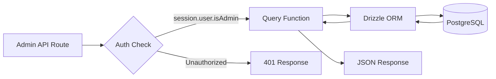
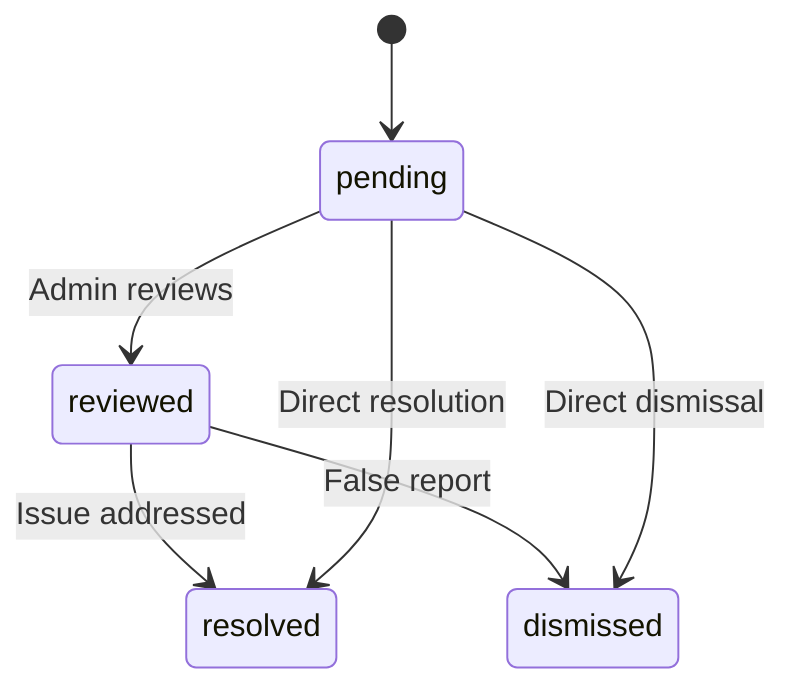

# Query sul database di amministrazione

Le query di amministrazione gestiscono la gestione degli elementi, la gestione degli utenti/clienti, l'accesso basato sui ruoli, le statistiche del dashboard, la moderazione dei report e le impostazioni. Queste funzioni vengono utilizzate principalmente dalle rotte API in `app/api/admin/`.

## Flusso delle query di amministrazione



## Gestione utenti (`user.queries.ts`)

### Funzioni principali

|Funzione|Parametri|Ritorni|Descrizione|
|----------|-----------|---------|-------------|
|`getUserByEmail`|`email: string`|`Utente \|nullo`|Trova utente tramite indirizzo email|
|`getUserById`|`id: string`|`Utente \|nullo`|Trova l'utente tramite la chiave primaria|
|`insertNewUser`|`user: NewUser`|`User[]`|Crea un nuovo record utente|
|`updateUserPassword`|`hash, userId`|`void`|Aggiorna l'hash della password|
|`updateUserVerification`|`email, verified`|`void`|Imposta lo stato di verifica dell'e-mail|
|`softDeleteUser`|`userId: string`|`void`|Eliminazione temporanea (aggiunge `-deleted` all'e-mail)|
|`isUserAdmin`|`userId: string`|`boolean`|Controlla il ruolo di amministratore tramite l'iscrizione|

### Verifica del ruolo di amministratore

La funzione `isUserAdmin` esegue un join multi-tabella per verificare lo stato di amministratore:

```typescript
export async function isUserAdmin(userId: string): Promise<boolean> {
  const result = await db
    .select({ isAdmin: roles.isAdmin })
    .from(userRoles)
    .innerJoin(roles, eq(userRoles.roleId, roles.id))
    .where(and(
      eq(userRoles.userId, userId),
      eq(roles.isAdmin, true),
      eq(roles.status, 'active')
    ))
    .limit(1);

  return result.length > 0;
}
```

### Modello di eliminazione graduale

Gli utenti non vengono mai eliminati fisicamente. L'eliminazione temporanea concatena l'ID utente all'e-mail per liberare l'indirizzo e-mail per la nuova registrazione:

```typescript
export async function softDeleteUser(userId: string) {
  return db
    .update(users)
    .set({
      deletedAt: sql`CURRENT_TIMESTAMP`,
      email: sql`CONCAT(email, '-', id, '-deleted')`
    })
    .where(eq(users.id, userId));
}
```

## Gestione clienti (`client.queries.ts`)

### Profilo CRUD

|Funzione|Descrizione|
|----------|-------------|
|`createClientProfile(data)`|Crea un profilo con un nome utente univoco generato automaticamente|
|`getClientProfileById(id)`|Recupera per ID profilo|
|`getClientProfileByUserId(userId)`|Recupera per riferimento utente|
|`getClientProfileByEmail(email)`|Recupero tramite ricerca nella tabella dei conti|
|`updateClientProfile(id, data)`|Aggiornamento parziale con timestamp|
|`deleteClientProfile(id)`|Eliminazione definitiva del record del profilo|

### Dati del dashboard di amministrazione

La funzione `getAdminDashboardData` è ottimizzata per il dashboard di amministrazione, restituendo sia l'elenco clienti impaginato che statistiche complete in un numero minimo di query:

```typescript
export async function getAdminDashboardData(params: {
  page: number;
  limit: number;
  search?: string;
  status?: string;
  plan?: string;
  accountType?: string;
  provider?: string;
  createdAfter?: Date;
  createdBefore?: Date;
}): Promise<{
  clients: ClientProfileWithAuth[];
  stats: { overview, byProvider, byPlan, byAccountType, activity, growth };
  pagination: { page, totalPages, total, limit };
}>
```

La funzione esclude gli utenti amministratori dagli elenchi dei clienti utilizzando un modello LEFT JOIN + IS NULL:

```typescript
// Exclude admin users from client listing
.leftJoin(userRoles, eq(userRoles.userId, clientProfiles.userId))
.leftJoin(roles, and(eq(userRoles.roleId, roles.id), eq(roles.isAdmin, true)))
.where(isNull(roles.id))  // Only non-admin users
```

### Ricerca avanzata dei clienti

`advancedClientSearch` supporta complessi filtri multicriterio:

|Categoria filtro|Parametri|
|----------------|------------|
|**Ricerca testo**|`search` (tra nome, email, nome utente, azienda, biografia, titolo lavorativo, settore, posizione)|
|**Filtri enumerazione**|`status`, `plan`, `accountType`, `provider`|
|**Intervalli di date**|`createdAfter`, `createdBefore`, `updatedAfter`, `updatedBefore`, `dateRange`|
|**Specifico per il campo**|`emailDomain`, `companySearch`, `locationSearch`, `industrySearch`|
|**Numerico**|`minSubmissions`, `maxSubmissions`|
|**Booleano**|`hasAvatar`, `hasWebsite`, `hasPhone`, `emailVerified`, `twoFactorEnabled`|
|**Ordinamento**|`sortBy` (creatoAt, aggiornatoAt, nome, email, azienda, totale invii), `sortOrder`|

### Statistiche del cliente

`getEnhancedClientStats` restituisce un'analisi completa:

```typescript
{
  overview: { total, active, inactive, suspended, trial },
  byProvider: { credentials, google, github, facebook, twitter, linkedin, other },
  byPlan: { free: number, standard: number, premium: number },
  byAccountType: { individual, business, enterprise },
  activity: { newThisWeek, newThisMonth, activeThisWeek, activeThisMonth },
  growth: { weeklyGrowth, monthlyGrowth },
}
```

## Gestione dei rapporti (`report.queries.ts`)

### Segnala CRUD

|Funzione|Descrizione|
|----------|-------------|
|`createReport(data)`|Creare un report sui contenuti (elemento o commento)|
|`getReportById(id)`|Ottieni un rapporto con i dettagli del giornalista e del revisore|
|`getReports(params)`|Elenco dei report impaginati con filtri|
|`updateReport(id, data)`|Aggiorna stato, risoluzione, aggiungi note di revisione|
|`getReportStats()`|Statistiche per stato, tipo di contenuto, motivo|
|`hasUserReportedContent(reportedBy, contentType, contentId)`|Controllo del rapporto duplicato|

### Flusso dello stato del report



### Filtraggio dei rapporti

I report supportano il filtraggio per stato, tipo di contenuto (elemento/commento) e motivo (spam, molestie, inappropriato, altro):

```typescript
export async function getReports(params: {
  page?: number;
  limit?: number;
  search?: string;
  status?: ReportStatusValues;
  contentType?: ReportContentTypeValues;
  reason?: ReportReasonValues;
}): Promise<{
  reports: ReportWithReporter[];
  total: number;
  page: number;
  totalPages: number;
  limit: number;
}>
```

## Statistiche dashboard (`dashboard.queries.ts`)

### Metriche disponibili

|Funzione|Scopo|Usato dentro|
|----------|---------|---------|
|`getVotesReceivedCount(itemSlugs)`|Voti totali sugli articoli|Riepilogo del dashboard|
|`getCommentsReceivedCount(itemSlugs)`|Commenti totali sugli articoli|Riepilogo del dashboard|
|`getUniqueItemsInteractedCount(clientId)`|Elementi con cui l'utente ha interagito|Pannello attività|
|`getUserTotalActivityCount(clientId)`|Voti totali + commenti per utente|Pannello attività|
|`getWeeklyEngagementData(itemSlugs, weeks)`|Grafico settimanale dei voti/commenti|Grafico del coinvolgimento|
|`getDailyActivityData(clientId, itemSlugs, days)`|Ripartizione delle attività quotidiane|Grafico delle attività|
|`getTopItemsEngagement(itemSlugs, limit)`|Articoli principali per impegno|Pannello degli elementi principali|

### Dati sul coinvolgimento settimanale

Restituisce i dati sul coinvolgimento aggregati per settimana ISO, corrispondenti al formato `to_char(date, 'IYYY-IW')` di PostgreSQL:

```typescript
const weeklyVotes = await db
  .select({
    week: sql<string>`to_char(${votes.createdAt}, 'IYYY-IW')`.as('week'),
    count: count(),
  })
  .from(votes)
  .where(and(inArray(votes.itemId, itemSlugs), gte(votes.createdAt, startDate)))
  .groupBy(sql`to_char(${votes.createdAt}, 'IYYY-IW')`)
  .orderBy(sql`to_char(${votes.createdAt}, 'IYYY-IW')`);
```

## Gestione token di autenticazione (`auth.queries.ts`)

|Funzione|Descrizione|
|----------|-------------|
|`getPasswordResetTokenByEmail(email)`|Trova il token di ripristino tramite e-mail|
|`getPasswordResetTokenByToken(token)`|Trova il token di ripristino in base alla stringa del token|
|`deletePasswordResetToken(token)`|Rimuovi il token utilizzato/scaduto|
|`getVerificationTokenByEmail(email)`|Trova il token di verifica tramite e-mail|
|`getVerificationTokenByToken(token)`|Trova il token di verifica in base alla stringa del token|
|`deleteVerificationToken(token)`|Rimuovi il token utilizzato/scaduto|

Tutte le funzioni token seguono lo stesso semplice schema di selezione per campo con `.limit(1)`.
