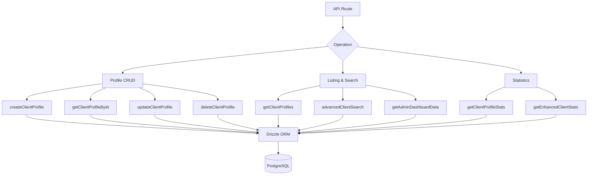

# Query rivolte ai clienti

Le query dei client gestiscono la gestione dei profili, l'elenco con metadati di autenticazione, ricerca avanzata multicriterio e statistiche complete. Tutte le funzioni risiedono in `client.queries.ts` e vengono utilizzate sia dai percorsi API rivolti all'amministratore che a quelli rivolti al client.

## Architettura delle query del cliente



## Profilo CRUD

### Crea profilo

I nuovi profili generano automaticamente nomi utente univoci dall'indirizzo email quando non viene fornito alcun nome utente:

```typescript
export async function createClientProfile(data: {
  userId: string;
  email: string;
  name: string;
  displayName?: string;
  username?: string;
  bio?: string;
  jobTitle?: string;
  company?: string;
  status?: string;
  plan?: string;
  accountType?: string;
}): Promise<ClientProfile>
```

Logica di generazione del nome utente:

1. Se viene fornito `username`, normalizza e garantisce l'unicità
2. Altrimenti, estrai il nome utente dall'e-mail tramite `extractUsernameFromEmail()`
3. Fallback: genera il prefisso `user<timestamp>`
4. Tutti i percorsi passano attraverso `ensureUniqueUsername()` che aggiunge suffissi numerici se necessario

Valori predefiniti applicati durante la creazione:

|Campo|Predefinito|
|-------|---------|
|`displayName`|Uguale a `name`|
|`bio`|`"Welcome! I'm a new user on this platform."`|
|`jobTitle`|`"User"`|
|`company`|`"Unknown"`|
|`status`|`"active"`|
|`plan`|`"free"`|
|`accountType`|`"individual"`|

### Leggi Operazioni

|Funzione|Campo di ricerca|Ritorni|
|----------|-------------|---------|
|`getClientProfileById(id)`|`clientProfiles.id`|"Profilo cliente \|nullo`|
|`getClientProfileByUserId(userId)`|`clientProfiles.userId`|"Profilo cliente \|nullo`|
|`getClientProfileByEmail(email)`|Tramite la tabella `accounts`|"Profilo cliente \|nullo`|

La ricerca basata su posta elettronica viene risolta attraverso la tabella `accounts` per trovare il `userId` associato, quindi interroga `clientProfiles`:

```typescript
export async function getClientProfileByEmail(email: string): Promise<ClientProfile | null> {
  const account = await getClientAccountByEmail(email);
  if (!account) return null;
  const [profile] = await db
    .select()
    .from(clientProfiles)
    .where(eq(clientProfiles.userId, account.userId))
    .limit(1);
  return profile || null;
}
```

### Aggiorna ed elimina

- **`updateClientProfile(id, data)`** -- Aggiornamento parziale con timestamp automatico `updatedAt`
- **`deleteClientProfile(id)`** -- Eliminazione definitiva (restituisce un successo booleano)

## Elenco impaginato

`getClientProfiles` restituisce risultati impaginati con i dati del provider di autenticazione, esclusi gli utenti amministratori:

```typescript
export async function getClientProfiles(params: {
  page?: number;
  limit?: number;
  search?: string;
  status?: string;
  plan?: string;
  accountType?: string;
  provider?: string;
}): Promise<{
  profiles: ClientProfileWithAuth[];
  total: number;
  page: number;
  totalPages: number;
  limit: number;
}>
```

### Modello di esclusione dell'amministratore

Sia la query di conteggio che quella di dati utilizzano un modello LEFT JOIN + IS NULL per escludere gli utenti amministratori:

```typescript
.leftJoin(userRoles, eq(userRoles.userId, clientProfiles.userId))
.leftJoin(roles, and(eq(userRoles.roleId, roles.id), eq(roles.isAdmin, true)))
.where(isNull(roles.id))  // Only non-admin users
```

### Sottoquery del fornitore

Per evitare righe duplicate quando un utente dispone di più account di autenticazione, il provider viene risolto tramite una sottoquery scalare:

```typescript
accountProvider: sql<string>`coalesce(
  (SELECT provider FROM ${accounts}
   WHERE ${accounts.userId} = ${clientProfiles.userId}
   LIMIT 1),
  'unknown'
)`
```

### Filtro di ricerca

La ricerca testuale utilizza `ILIKE` su più campi con prevenzione SQL injection:

```typescript
const escapedSearch = search
  .replace(/\\/g, '\\\\')
  .replace(/[%_]/g, '\\$&');

whereConditions.push(
  sql`(${clientProfiles.username} ILIKE ${`%${escapedSearch}%`} OR
       ${clientProfiles.displayName} ILIKE ${`%${escapedSearch}%`} OR
       ${clientProfiles.company} ILIKE ${`%${escapedSearch}%`} OR
       ${clientProfiles.name} ILIKE ${`%${escapedSearch}%`} OR
       ${clientProfiles.email} ILIKE ${`%${escapedSearch}%`})`
);
```

## Ricerca avanzata dei clienti

`advancedClientSearch` supporta oltre 20 criteri di filtro in più categorie:

|Categoria filtro|Parametri|
|----------------|------------|
|**Ricerca testo**|`search` (tra nome, email, nome utente, azienda, biografia, titolo lavorativo, settore, posizione)|
|**Filtri enumerazione**|`status`, `plan`, `accountType`, `provider`|
|**Intervalli di date**|`createdAfter`, `createdBefore`, `updatedAfter`, `updatedBefore`, `dateRange`|
|**Specifico per il campo**|`emailDomain`, `companySearch`, `locationSearch`, `industrySearch`|
|**Numerico**|`minSubmissions`, `maxSubmissions`|
|**Booleano**|`hasAvatar`, `hasWebsite`, `hasPhone`, `emailVerified`, `twoFactorEnabled`|
|**Ordinamento**|`sortBy`, `sortOrder`|

## Statistiche del cliente

### Statistiche di base

`getClientProfileStats` restituisce conteggi semplici:

```typescript
{
  total: number;
  active: number;
  inactive: number;
  byPlan: Record<string, number>;
  byAccountType: Record<string, number>;
}
```

### Statistiche migliorate

`getEnhancedClientStats` fornisce una suddivisione multidimensionale completa:

```typescript
{
  overview: { total, active, inactive, suspended, trial },
  byProvider: { credentials, google, github, facebook, twitter, linkedin, other },
  byPlan: { free: number, standard: number, premium: number },
  byAccountType: { individual, business, enterprise },
  activity: { newThisWeek, newThisMonth, activeThisWeek, activeThisMonth },
  growth: { weeklyGrowth, monthlyGrowth },
}
```

Le statistiche migliorate utilizzano `countDistinct` con join multi-tabella per produrre conteggi accurati anche quando gli utenti dispongono di più provider di account:

```typescript
const statsResult = await db
  .select({
    status: clientProfiles.status,
    plan: clientProfiles.plan,
    accountType: clientProfiles.accountType,
    provider: accounts.provider,
    count: countDistinct(clientProfiles.id)
  })
  .from(clientProfiles)
  .leftJoin(accounts, eq(clientProfiles.userId, accounts.userId))
  .leftJoin(userRoles, eq(userRoles.userId, clientProfiles.userId))
  .leftJoin(roles, and(eq(userRoles.roleId, roles.id), eq(roles.isAdmin, true)))
  .where(isNull(roles.id))
  .groupBy(
    clientProfiles.status,
    clientProfiles.plan,
    clientProfiles.accountType,
    accounts.provider
  );
```

### Metriche di attività

Le finestre di attività vengono calcolate utilizzando l'aritmetica delle date:

```typescript
const oneWeekAgo = new Date(now.getTime() - 7 * 24 * 60 * 60 * 1000);
const oneMonthAgo = new Date(now.getTime() - 30 * 24 * 60 * 60 * 1000);
```

I tassi di crescita sono percentuali semplificate di nuove registrazioni rispetto al totale:

```typescript
const weeklyGrowth = total > 0 ? Math.round((newThisWeek / total) * 100) : 0;
```

## Tipi

Tutti i tipi di query del client sono definiti in `lib/db/queries/types.ts`:

```typescript
export type ClientProfileWithAuth = ClientProfile & {
  accountProvider: string;
  isActive: boolean;
};

export type ClientStatus = "active" | "inactive" | "suspended" | "trial";
export type ClientPlan = "free" | "standard" | "premium";
export type ClientAccountType = "individual" | "business" | "enterprise";
```
