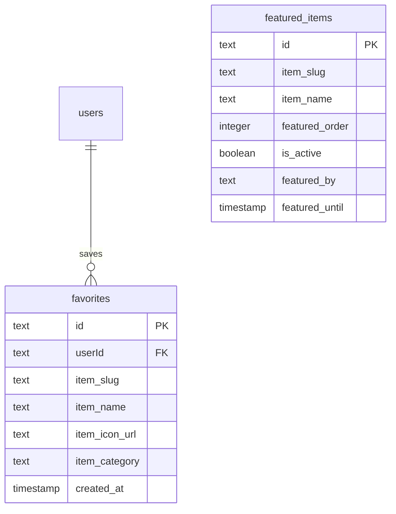

# Approfondimento dello schema Preferiti e raccolte

## Panoramica

Il modello Ever Works implementa un **sistema di preferiti** che funge da meccanismo di raccolta degli utenti. Non esiste una tabella `collections` separata: la selezione degli elementi da parte dell'utente viene gestita tramite la tabella `favorites`, che memorizza gli elementi salvati dall'utente con metadati denormalizzati per una visualizzazione efficiente. Per le raccolte curate dall'amministratore, la tabella `featured_items` fornisce un set gestito di elementi evidenziati.

**File sorgente:** `template/lib/db/schema.ts`
**File delle relazioni:** `template/lib/db/migrations/relations.ts`

---

## Table: `favorites`

User-created bookmark/collection of items. Each user can save items to their personal favorites list.

### Columns

| Column | DB Name | Type | Nullable | Default | Constraints |
|---|---|---|---|---|---|
| `id` | `id` | `text` | No | `crypto.randomUUID()` | Primary Key |
| `userId` | `userId` | `text` | No | - | FK -> `users.id` (CASCADE) |
| `itemSlug` | `item_slug` | `text` | No | - | Item identifier |
| `itemName` | `item_name` | `text` | No | - | Denormalized display name |
| `itemIconUrl` | `item_icon_url` | `text` | Yes | - | Denormalized icon URL |
| `itemCategory` | `item_category` | `text` | Yes | - | Denormalized category |
| `createdAt` | `created_at` | `timestamp` | No | `now()` | - |
| `updatedAt` | `updated_at` | `timestamp` | No | `now()` | - |

### Indexes

| Name | Columns | Type |
|---|---|---|
| `user_item_favorite_unique_idx` | `(userId, itemSlug)` | Unique |
| `favorites_user_id_idx` | `userId` | B-tree |
| `favorites_item_slug_idx` | `itemSlug` | B-tree |
| `favorites_created_at_idx` | `createdAt` | B-tree |

### Key Constraints

- **One favorite per user per item:** The unique composite index `user_item_favorite_unique_idx` on `(userId, itemSlug)` prevents duplicate favorites.
- **Cascade deletion:** When a user is deleted, all their favorites are automatically removed.

### TypeScript Types

```typescript
export type Favorite = typeof favorites.$inferSelect;
export type NewFavorite = typeof favorites.$inferInsert;
export type FavoriteWithUser = Favorite & {
    user: typeof users.$inferSelect;
};
```

---

## Tabella: `featured_items`

Raccolta curata dall'amministratore degli elementi evidenziati. Supporta l'ordinazione, l'attivazione/disattivazione e la scadenza facoltativa basata sul tempo.

### Colonne

|Colonna|Nome del DB|Digitare|Nullabile|Predefinito|Vincoli|
|---|---|---|---|---|---|
|`id`|`id`|`text`|No|`crypto.randomUUID()`|Chiave primaria|
|`itemSlug`|`item_slug`|`text`|No| - |Identificatore dell'articolo|
|`itemName`|`item_name`|`text`|No| - |Denormalizzato|
|`itemIconUrl`|`item_icon_url`|`text`|Sì| - |Denormalizzato|
|`itemCategory`|`item_category`|`text`|Sì| - |Denormalizzato|
|`itemDescription`|`item_description`|`text`|Sì| - |Denormalizzato|
|`featuredOrder`|`featured_order`|`integer`|No| `0` |Ordinamento|
|`featuredUntil`|`featured_until`|`timestamp`|Sì| - |Data di scadenza automatica|
|`isActive`|`is_active`|`boolean`|No|`true`|Commutatore attivo|
|`featuredBy`|`featured_by`|`text`|No| - |ID utente amministratore|
|`featuredAt`|`featured_at`|`timestamp`|No|`now()`| - |
|`createdAt`|`created_at`|`timestamp`|No|`now()`| - |
|`updatedAt`|`updated_at`|`timestamp`|No|`now()`| - |

### Indici

|Nome|Colonne|Digitare|
|---|---|---|
|`featured_items_item_slug_idx`|`itemSlug`|B-albero|
|`featured_items_featured_order_idx`|`featuredOrder`|B-albero|
|`featured_items_is_active_idx`|`isActive`|B-albero|
|`featured_items_featured_at_idx`|`featuredAt`|B-albero|
|`featured_items_featured_until_idx`|`featuredUntil`|B-albero|

### Tipi di TypeScript

```typescript
export type FeaturedItem = typeof featuredItems.$inferSelect;
export type NewFeaturedItem = typeof featuredItems.$inferInsert;
```

---

## Relations

```typescript
// From relations.ts
export const favoritesRelations = relations(favorites, ({ one }) => ({
    user: one(users, {
        fields: [favorites.userId],
        references: [users.id]
    }),
}));
```

---

## Diagramma delle relazioni



---

## Favorites vs. Featured Items

| Aspect | `favorites` | `featured_items` |
|---|---|---|
| **Created by** | End users | Admin users |
| **Per-user** | Yes (user-scoped) | No (global) |
| **Ordering** | By `createdAt` | By `featuredOrder` |
| **Expiration** | None | Optional `featuredUntil` |
| **Active toggle** | No (exists = active) | Yes (`isActive` flag) |
| **Foreign key** | `users.id` | None (stores admin ID as text) |

---

## Esempi di query

### Aggiungi l'articolo ai preferiti

```typescript
import { db } from '@/lib/db/drizzle';
import { favorites } from '@/lib/db/schema';

await db.insert(favorites).values({
    userId,
    itemSlug: 'my-tool-slug',
    itemName: 'My Tool',
    itemIconUrl: '/icons/my-tool.png',
    itemCategory: 'Productivity',
}).onConflictDoNothing(); // Prevent duplicates
```

### Rimuovi l'articolo dai preferiti

```typescript
import { eq, and } from 'drizzle-orm';

await db
    .delete(favorites)
    .where(
        and(
            eq(favorites.userId, userId),
            eq(favorites.itemSlug, 'my-tool-slug')
        )
    );
```

### Controlla se l'articolo è preferito

```typescript
const isFavorited = await db
    .select({ id: favorites.id })
    .from(favorites)
    .where(
        and(
            eq(favorites.userId, userId),
            eq(favorites.itemSlug, 'my-tool-slug')
        )
    )
    .limit(1);
```

### Ottieni l'elenco dei preferiti dell'utente

```typescript
const userFavorites = await db
    .select()
    .from(favorites)
    .where(eq(favorites.userId, userId))
    .orderBy(desc(favorites.createdAt));
```

### Ottieni gli articoli più preferiti

```typescript
import { sql } from 'drizzle-orm';

const popular = await db
    .select({
        itemSlug: favorites.itemSlug,
        itemName: favorites.itemName,
        count: sql<number>`count(*)`,
    })
    .from(favorites)
    .groupBy(favorites.itemSlug, favorites.itemName)
    .orderBy(sql`count(*) desc`)
    .limit(10);
```

### Aggiungi un articolo in evidenza

```typescript
import { featuredItems } from '@/lib/db/schema';

await db.insert(featuredItems).values({
    itemSlug: 'premium-tool',
    itemName: 'Premium Tool',
    itemCategory: 'Productivity',
    featuredOrder: 1,
    isActive: true,
    featuredBy: adminUserId,
    featuredUntil: new Date('2025-12-31'),
});
```

### Ottieni articoli in evidenza attivi (non scaduti)

```typescript
import { or, isNull, gte } from 'drizzle-orm';

const activeFeatured = await db
    .select()
    .from(featuredItems)
    .where(
        and(
            eq(featuredItems.isActive, true),
            or(
                isNull(featuredItems.featuredUntil),
                gte(featuredItems.featuredUntil, new Date())
            )
        )
    )
    .orderBy(asc(featuredItems.featuredOrder));
```

---

## Design Notes

- **Denormalized item data.** Both tables store `itemName`, `itemIconUrl`, and `itemCategory` directly rather than looking up the Git CMS at read time. This makes list queries fast but means data can become stale if items are renamed.
- **No collection grouping.** Unlike a full "collection" system with folders/lists, favorites is a flat list per user. Items can be filtered by `itemCategory` for grouping.
- **Featured items are global.** They appear the same for all users, unlike favorites which are per-user.
