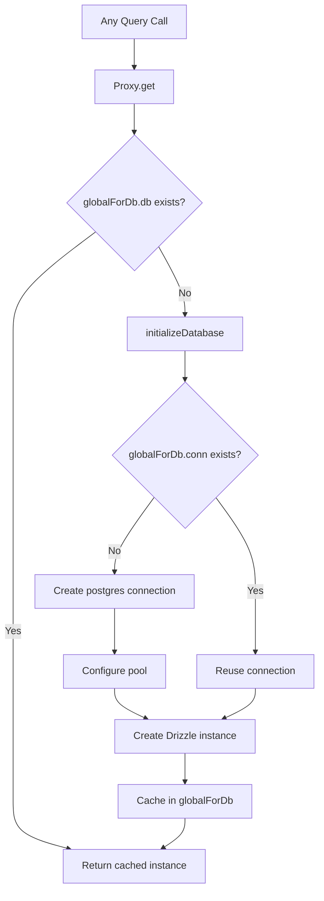

# Connessione e pool di database

Il modello utilizza `postgres.js` (il pacchetto npm `postgres`) come driver PostgreSQL con Drizzle ORM. La gestione della connessione viene gestita tramite un modello di inizializzazione pigro con memorizzazione nella cache singleton globale per sopravvivere alla sostituzione del modulo hot (HMR) di Next.js in fase di sviluppo.

## Architettura di connessione



## Impostazione database (`lib/db/drizzle.ts`)

### Inizializzazione pigra con proxy

L'istanza del database viene esportata come `Proxy` che inizializza la connessione al primo accesso:

```typescript
export const db = new Proxy({} as ReturnType<typeof drizzle>, {
  get(target, prop) {
    const database = initializeDatabase();
    return database[prop as keyof typeof database];
  },
});
```

Ciò garantisce:
- Non viene creata alcuna connessione al momento dell'importazione
- Gli script che importano il modulo ma non interrogano il database non comportano alcun sovraccarico di connessione
- La prima operazione effettiva del database attiva l'inizializzazione

### Funzione di inizializzazione

```typescript
function initializeDatabase(): ReturnType<typeof drizzle> {
  if (!getDatabaseUrl()) {
    throw new Error('DATABASE_URL environment variable is required');
  }

  if (globalForDb.db) {
    return globalForDb.db;
  }

  const poolSize = getPoolSize();
  const conn = postgres(getDatabaseUrl()!, {
    max: poolSize,
    idle_timeout: 20,
    connect_timeout: 30,
    prepare: false,
    onnotice: getNodeEnv() === 'development' ? console.log : undefined,
  });

  globalForDb.conn = conn;
  globalForDb.db = drizzle(conn, { schema });
  return globalForDb.db;
}
```

### Opzioni di connessione

|Opzione|Valore|Scopo|
|--------|-------|---------|
|`max`|Configurabile (vedi dimensionamento della piscina)|Numero massimo di connessioni in piscina|
|`idle_timeout`|`20` secondi|Chiudere le connessioni inattive dopo questo periodo|
|`connect_timeout`|`30` secondi|Tempo massimo per stabilire una connessione|
|`prepare`|`false`|Disabilita istruzioni preparate (richiesto per alcuni ambienti PaaS)|
|`onnotice`|`console.log` (solo sviluppatori)|Registra i messaggi NOTICE PostgreSQL in fase di sviluppo|

## Dimensionamento della piscina

### Configurazione

La dimensione del pool è configurabile tramite la variabile di ambiente `DB_POOL_SIZE`, con impostazioni predefinite compatibili con l'ambiente:

```typescript
const getPoolSize = (): number => {
  const envPoolSize = process.env.DB_POOL_SIZE;
  if (envPoolSize) {
    const parsed = parseInt(envPoolSize, 10);
    return isNaN(parsed) ? 20 : Math.max(1, Math.min(parsed, 50));
  }
  return getNodeEnv() === 'production' ? 20 : 10;
};
```

### Predefiniti

|Ambiente|Dimensione pool predefinita|Gamma|
|-------------|------------------|-------|
|Produzione| 20 | 1 - 50 |
|Sviluppo| 10 | 1 - 50 |

La dimensione del pool è compresa tra 1 e 50 indipendentemente dal valore configurato.

### Linee guida sulle dimensioni della piscina

- **Sviluppo (10):** Sufficiente per un singolo sviluppatore con HMR. Mantiene basso l'utilizzo delle risorse.
- **Produzione (20):** Gestisce richieste API simultanee. Aumento per distribuzioni a traffico elevato.
- **Serverless (1-5):** utilizza pool di piccole dimensioni quando distribuito su piattaforme serverless in cui ogni istanza ottiene il proprio pool.

## Modello Singleton globale

### Sicurezza dell'HMR

La modalità di sviluppo Next.js riesegue i moduli alle modifiche dei file. Senza protezione, ogni ciclo HMR creerebbe un nuovo pool di connessioni, esaurendo rapidamente le connessioni al database.

Il modello collega la connessione a `globalThis` per sopravvivere all'HMR:

```typescript
const globalForDb = globalThis as unknown as {
  conn: postgres.Sql | undefined;
  db: ReturnType<typeof drizzle> | undefined;
};
```

Quando un modulo viene rieseguito:
1. `initializeDatabase()` assegni `globalForDb.db`
2. Se l'istanza esiste, viene restituita immediatamente
3. Se la connessione esiste ma l'istanza Drizzle no, la connessione esistente viene riutilizzata

La registrazione dello sviluppo indica se una connessione è stata riutilizzata:

```
Reusing existing database connection; pool size is unchanged
```

o appena creato:

```
Database connection established successfully with pool size: 10
```

### Accesso diretto all'istanza

Per le librerie che richiedono un'istanza Drizzle concreta (ad esempio, l'adattatore Auth.js), viene fornita una funzione getter:

```typescript
export function getDrizzleInstance(): ReturnType<typeof drizzle> {
  return initializeDatabase();
}
```

## Modulo di configurazione (`lib/db/config.ts`)

Un modulo di configurazione script-safe che **non** importa `server-only`, consentendone l'utilizzo negli script di migrazione e seed:

```typescript
export function getDatabaseUrl(): string | undefined {
  return process.env.DATABASE_URL;
}

export function getNodeEnv(): 'development' | 'production' | 'test' {
  const env = process.env.NODE_ENV;
  if (env === 'production' || env === 'test') return env;
  return 'development';
}

export function isProduction(): boolean {
  return getNodeEnv() === 'production';
}
```

## Runner di migrazione (`lib/db/migrate.ts`)

Il corridore della migrazione è idempotente e può essere richiamato in modo sicuro a ogni avvio dell'applicazione:

```typescript
export async function runMigrations(): Promise<boolean> {
  const { db } = await import('./drizzle');
  await migrate(db, { migrationsFolder: './lib/db/migrations' });
  return true;
}
```

Comportamenti chiave:
- Drizzle tiene traccia delle migrazioni applicate in `drizzle.__drizzle_migrations`
- Le migrazioni già applicate vengono saltate automaticamente
- Restituisce `true` in caso di successo, `false` in caso di fallimento (non genera un'eccezione)
- Registra lo stato della migrazione prima e dopo l'esecuzione

## Variabili d'ambiente

|Variabile|Obbligatorio|Predefinito|Descrizione|
|----------|----------|---------|-------------|
|`DATABASE_URL`|Sì| -- |Stringa di connessione PostgreSQL|
|`DB_POOL_SIZE`|No|`20` (produttore) / `10` (sviluppatore)|Dimensioni del pool di connessioni (1-50)|
|`NODE_ENV`|No|`development`|Ambiente (sviluppo/produzione/test)|

## Configurazione del kit Drizzle

La configurazione del Drizzle Kit per la generazione dello schema e la gestione della migrazione:

```typescript
// drizzle.config.ts
export default {
  schema: "./lib/db/schema.ts",
  out: "./lib/db/migrations",
  dialect: "postgresql",
  dbCredentials: {
    url: process.env.DATABASE_URL,
  },
} satisfies Config;
```

## Risoluzione dei problemi

|Problema|Causa|Soluzione|
|-------|-------|----------|
|`DATABASE_URL is required`|Env var. mancante|Imposta `DATABASE_URL` in `.env.local`|
|Timeout della connessione|Rete lenta o DB sovraccarico|Aumenta `connect_timeout` o controlla l'integrità del DB|
|Esaurimento del pool nello dev|HMR che crea più pool|Assicurarsi che il pattern `globalForDb` sia intatto|
|Esaurimento piscina in prod|Troppe richieste simultanee|Incremento `DB_POOL_SIZE` (max 50)|
|`prepare` errori su PaaS|PaaS pgBouncer in modalità transazione|Mantieni `prepare: false`|
