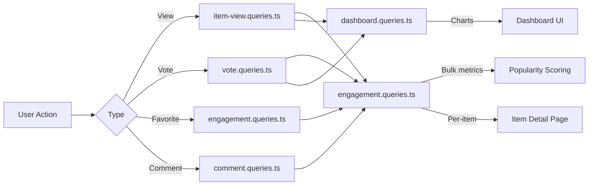

# Domande su coinvolgimento e interazione

Le query di coinvolgimento aggregano le interazioni degli utenti (visualizzazioni, voti, preferiti, commenti) tra gli elementi. Queste query alimentano l'ordinamento della popolarità, i grafici del dashboard e i pannelli di coinvolgimento per articolo. I moduli interessati sono `engagement.queries.ts`, `vote.queries.ts`, `comment.queries.ts`, `item-view.queries.ts` e `dashboard.queries.ts`.

## Flusso di dati sul coinvolgimento



## Metriche di coinvolgimento collettivo (`engagement.queries.ts`)

### `getEngagementMetricsPerItem`

La funzione principale per il punteggio di popolarità. Restituisce tutte le dimensioni di coinvolgimento per più elementi in un unico batch di query parallele:

```typescript
export async function getEngagementMetricsPerItem(
  itemSlugs: string[]
): Promise<Map<string, ItemEngagementMetrics>>
```

Tipo di reso:

```typescript
export interface ItemEngagementMetrics {
  views: number;
  votes: number;       // Net votes (upvotes - downvotes)
  favorites: number;
  comments: number;
  avgRating: number;   // Average rating from comments (0-5)
}
```

### Strategia di query parallele

Quattro query indipendenti vengono eseguite tramite `Promise.all` per la massima velocità effettiva:

```typescript
const [viewsData, votesData, favoritesData, commentsData] = await Promise.all([
  // 1. Views per item
  db.select({ itemId: itemViews.itemId, count: count() })
    .from(itemViews)
    .where(inArray(itemViews.itemId, itemSlugs))
    .groupBy(itemViews.itemId),

  // 2. Net votes per item (upvotes - downvotes)
  db.select({
      itemId: votes.itemId,
      netScore: sql<number>`SUM(CASE
        WHEN vote_type = 'upvote' THEN 1
        WHEN vote_type = 'downvote' THEN -1
        ELSE 0 END)`.as('netScore'),
    })
    .from(votes)
    .where(inArray(votes.itemId, itemSlugs))
    .groupBy(votes.itemId),

  // 3. Favorites per item
  db.select({ itemSlug: favorites.itemSlug, count: count() })
    .from(favorites)
    .where(inArray(favorites.itemSlug, itemSlugs))
    .groupBy(favorites.itemSlug),

  // 4. Comments count + average rating (excluding soft-deleted)
  db.select({
      itemId: comments.itemId,
      count: count(),
      avgRating: sql<number>`COALESCE(AVG(${comments.rating}), 0)`.as('avgRating'),
    })
    .from(comments)
    .where(and(inArray(comments.itemId, itemSlugs), isNull(comments.deletedAt)))
    .groupBy(comments.itemId),
]);
```

### Normalizzazione dei risultati

Ogni risultato della query viene convertito in una ricerca `Map` per O(1), quindi combinato nella mappa metrica finale:

```typescript
const viewsMap = new Map<string, number>(
  viewsData.map(v => [v.itemId, Number(v.count)])
);
// ... same for votesMap, favoritesMap, commentsMap

for (const slug of itemSlugs) {
  metricsMap.set(slug, {
    views: viewsMap.get(slug) ?? 0,
    votes: votesMap.get(slug) ?? 0,
    favorites: favoritesMap.get(slug) ?? 0,
    comments: commentsMap.get(slug)?.count ?? 0,
    avgRating: commentsMap.get(slug)?.avgRating ?? 0,
  });
}
```

### Funzioni metriche autonome

|Funzione|Ritorni|Descrizione|
|----------|---------|-------------|
|`getFavoritesPerItem(itemSlugs)`|`Map<string, number>`|I preferiti contano per articolo|
|`getCommentsPerItem(itemSlugs)`|`Map<string, { count, avgRating }>`|Conteggio dei commenti e valutazioni medie|

Entrambe le funzioni utilizzano lo stesso modello: restituzione anticipata per array vuoti, aggregazione `groupBy`, costruzione `Map`.

## Domande di voto (`vote.queries.ts`)

### Vota CRUDDO

|Funzione|Descrizione|
|----------|-------------|
|`createVote(vote)`|Crea voto con la normalizzazione degli slug|
|`getVoteByUserIdAndItemId(userId, itemSlug)`|Controlla il voto esistente|
|`deleteVote(voteId)`|Eliminazione definitiva di un voto|

Tutte le funzioni di voto normalizzano gli slug degli elementi tramite `getItemIdFromSlug()` prima dell'esecuzione della query.

### Net Score Calculation

Punteggio del singolo elemento utilizzando il condizionale `SUM`:

```typescript
export async function getVoteCountForItem(itemSlug: string): Promise<number> {
  const itemId = getItemIdFromSlug(itemSlug);
  const [result] = await db
    .select({
      netScore: sql<number>`
        SUM(CASE
          WHEN vote_type = 'upvote' THEN 1
          WHEN vote_type = 'downvote' THEN -1
          ELSE 0
        END)`.as('netScore')
    })
    .from(votes)
    .where(eq(votes.itemId, itemId));
  return Number(result?.netScore ?? 0);
}
```

### Bulk Vote Scores

`getVotesPerItem` restituisce un `Map<string, number>` di punteggi netti per più elementi utilizzando `inArray` e `groupBy`.

### Vote-Sorted Items

```typescript
export async function getItemsSortedByVotes(limit = 10, offset = 0) {
  return db
    .select({
      itemId: votes.itemId,
      voteCount: sql<number>`count(${votes.id})`.as('vote_count')
    })
    .from(votes)
    .groupBy(votes.itemId)
    .orderBy(sql`vote_count DESC`)
    .limit(limit)
    .offset(offset);
}
```

## Domande sui commenti (`comment.queries.ts`)

### Comment CRUD

|Funzione|Descrizione|
|----------|-------------|
|`createComment(data)`|Crea con la normalizzazione dello slug|
|`getCommentById(id)`|Raw comment record|
|`getCommentWithUserById(id)`|Commenta con l'iscrizione al profilo utente|
|`updateComment(id, { content?, rating? })`|Aggiorna con `editedAt` timestamp|
|`updateCommentRating(id, rating)`|Rating-only update|
|`deleteComment(id)`|Eliminazione temporanea (`deletedAt = new Date()`)|

### Comments with User Data

`getCommentsByItemId` utilizza un `innerJoin` con `clientProfiles` per arricchire ogni commento con le informazioni sull'autore:

```typescript
export async function getCommentsByItemId(itemSlug: string): Promise<CommentWithUser[]> {
  const itemId = getItemIdFromSlug(itemSlug);
  return db
    .select({
      id: comments.id,
      content: comments.content,
      rating: comments.rating,
      userId: comments.userId,
      itemId: comments.itemId,
      createdAt: comments.createdAt,
      updatedAt: comments.updatedAt,
      editedAt: comments.editedAt,
      deletedAt: comments.deletedAt,
      user: {
        id: clientProfiles.id,
        name: clientProfiles.name,
        email: clientProfiles.email,
        image: clientProfiles.avatar
      }
    })
    .from(comments)
    .innerJoin(clientProfiles, eq(comments.userId, clientProfiles.id))
    .where(and(eq(comments.itemId, itemId), isNull(comments.deletedAt)))
    .orderBy(desc(comments.createdAt));
}
```

## Visualizza monitoraggio (`item-view.queries.ts`)

### Daily Deduplication

Le visualizzazioni vengono deduplicate per visualizzatore per articolo per giorno UTC utilizzando il modello di upsert `onConflictDoNothing`:

```typescript
export async function recordItemView(
  view: Pick<NewItemView, 'itemId' | 'viewerId' | 'viewedDateUtc'>
): Promise<boolean> {
  const result = await db
    .insert(itemViews)
    .values(view)
    .onConflictDoNothing()
    .returning({ id: itemViews.id });
  return result.length > 0; // true = new view, false = duplicate
}
```

### Visualizza le funzioni di aggregazione

|Funzione|Parametri|Ritorni|Descrizione|
|----------|-----------|---------|-------------|
|`getTotalViewsCount(itemSlugs)`|`string[]`|`number`|Visualizzazioni totali tra gli elementi|
|`getRecentViewsCount(itemSlugs, days)`|`string[], number`|`number`|Views in last N days|
|`getDailyViewsData(itemSlugs, days)`|`string[], number`|`Map<string, number>`|Daily view counts|
|`getViewsPerItem(itemSlugs)`|`string[]`|`Map<string, number>`|Per-item view counts|

### UTC Date Helper

Tutti i calcoli delle date utilizzano l'UTC per evitare errori sfalsati relativi al fuso orario:

```typescript
function getUtcDateString(daysAgo: number = 0): string {
  const date = new Date();
  date.setUTCDate(date.getUTCDate() - daysAgo);
  return date.toISOString().split('T')[0]; // "YYYY-MM-DD"
}
```

## Statistiche dashboard (`dashboard.queries.ts`)

### Metriche disponibili

|Funzione|Scopo|
|----------|---------|
|`getVotesReceivedCount(itemSlugs)`|Voti totali sugli articoli dell'utente|
|`getCommentsReceivedCount(itemSlugs)`|Commenti totali sugli articoli dell'utente|
|`getUniqueItemsInteractedCount(clientId)`|Elementi con cui l'utente ha interagito|
|`getUserTotalActivityCount(clientId)`|Voti totali + commenti per utente|
|`getWeeklyEngagementData(itemSlugs, weeks)`|Dati grafici aggregati settimanali|
|`getDailyActivityData(clientId, itemSlugs, days)`|Ripartizione delle attività quotidiane|
|`getTopItemsEngagement(itemSlugs, limit)`|Elementi principali per punteggio di coinvolgimento|

### Aggregazione settimanale del coinvolgimento

Utilizza `to_char` di PostgreSQL con il formato settimanale ISO per un bucket settimanale coerente:

```typescript
const weeklyVotes = await db
  .select({
    week: sql<string>`to_char(${votes.createdAt}, 'IYYY-IW')`.as('week'),
    count: count(),
  })
  .from(votes)
  .where(and(inArray(votes.itemId, itemSlugs), gte(votes.createdAt, startDate)))
  .groupBy(sql`to_char(${votes.createdAt}, 'IYYY-IW')`)
  .orderBy(sql`to_char(${votes.createdAt}, 'IYYY-IW')`);
```

## Considerazioni sulle prestazioni

- Tutte le funzioni di massa accettano array e utilizzano `inArray` per l'elaborazione batch
- Gli input di array vuoti ritornano presto senza colpire il database
- `Promise.all` esegue aggregazioni indipendenti contemporaneamente
- `Map` le strutture dati forniscono la ricerca O(1) durante l'assemblaggio dei risultati
- I commenti eliminati temporaneamente sono esclusi tramite `isNull(comments.deletedAt)` in tutte le aggregazioni
