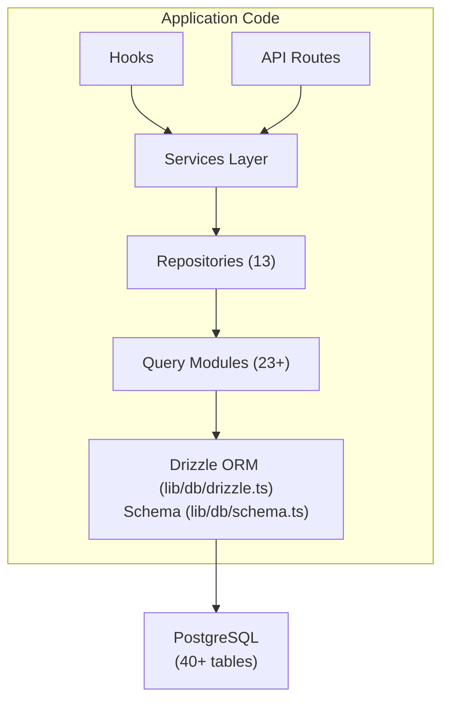

# Panoramica del database

Il modello Ever Works utilizza **Drizzle ORM** con **PostgreSQL** come livello di database. Il database è facoltativo: l'applicazione può essere eseguita senza di esso per distribuzioni di solo contenuto, ma alimenta tutte le funzionalità di utente, abbonamento, coinvolgimento e amministrazione.

## Pila tecnologica

|Componente|Tecnologia|Scopo|
|-----------|-----------|---------|
|ORM|Pioviggina ORM|Generatore di query indipendente dai tipi e gestione dello schema|
|Banca dati|PostgreSQL|Database relazionale primario|
|Autista|`postgres` (postgres.js)|Client PostgreSQL per Node.js|
|Migrazioni|Kit pioviggine|Generazione ed esecuzione della migrazione dello schema|
|Semina|`drizzle-seed` + script personalizzati|Inizializzazione del database con dati predefiniti|

## Architettura della banca dati



## Configurazione

### Configurazione Drizzle (`drizzle.config.ts`)

```typescript
export default {
  schema: "./lib/db/schema.ts",
  out: "./lib/db/migrations",
  dialect: "postgresql",
  dbCredentials: {
    url: process.env.DATABASE_URL,
  },
} satisfies Config;
```

La configurazione punta a:
- **File di schema**: `lib/db/schema.ts` -- l'unica fonte attendibile per tutte le definizioni di tabella
- **Output delle migrazioni**: `lib/db/migrations/` -- dove vengono archiviati i file di migrazione SQL generati
- **Dialetto**: PostgreSQL
- **Connessione**: tramite variabile d'ambiente `DATABASE_URL`

### Gestione della connessione (`lib/db/drizzle.ts`)

La connessione al database viene inizializzata pigramente al primo utilizzo e riutilizza le connessioni tra i ricariche a caldo in fase di sviluppo tramite un modello singleton globale.

Caratteristiche principali:
- **Inizializzazione lazy**: la connessione al database non viene creata finché non viene eseguita la prima query
- **Accesso basato su proxy**: l'oggetto `db` esportato utilizza un JavaScript `Proxy` per inizializzare la connessione in modo trasparente
- **Pool di connessioni**: dimensione del pool configurabile tramite variabile di ambiente `DB_POOL_SIZE` (impostazione predefinita: 20 in produzione, 10 in sviluppo, limitato da 1 a 50)
- **Timeout di inattività**: le connessioni vengono rilasciate dopo 20 secondi di inattività
- **Timeout connessione**: timeout di 30 secondi per stabilire nuove connessioni
- **Modello singleton**: utilizza `globalThis` per rendere persistenti le connessioni tra i ricaricamenti a caldo di Next.js

```typescript
// Usage - just import and use
import { db } from '@/lib/db/drizzle';

const users = await db.select().from(schema.users);
```

### Variabili d'ambiente

|Variabile|Obbligatorio|Predefinito|Descrizione|
|----------|----------|---------|-------------|
|`DATABASE_URL`|No| - |Stringa di connessione PostgreSQL|
|`DB_POOL_SIZE`|No| 10/20 |Dimensioni del pool di connessioni (sviluppo/produzione)|

Quando `DATABASE_URL` non è impostato, le funzionalità del database vengono disattivate automaticamente, consentendo l'esecuzione dell'applicazione in modalità solo contenuto.

## Panoramica dello schema

Lo schema del database è definito in un singolo file (`lib/db/schema.ts`) contenente oltre 40 tabelle organizzate per dominio:

|Dominio|Tabelle|Descrizione|
|--------|--------|-------------|
|Utenti e autenticazione| 8 |Utenti, account, sessioni, token, autenticatori|
|Ruoli e autorizzazioni| 3 |RBAC con ruoli, autorizzazioni e mapping dei permessi dei ruoli|
|Profili dei clienti| 1 |Profili utente estesi per gli account cliente|
|Coinvolgimento dei contenuti| 4 |Commenti, voti, preferiti, visualizzazioni di elementi|
|Abbonamenti| 4 |Piani, cronologia degli abbonamenti, fornitori di servizi di pagamento, conti di pagamento|
|Notifiche| 1 |Sistema di notifiche in-app|
|Amministrazione e moderazione| 4 |Rapporti, cronologia della moderazione, registri di controllo degli elementi, registri delle attività|
|Integrazioni| 2 |Configurazione CRM, mappature di integrazione|
|Aziende| 2 |Aziende e associazioni articolo-azienda|
|Annunci sponsor| 1 |Annunci di articoli sponsorizzati|
|Sondaggi| 2 |Sondaggi e risposte ai sondaggi|
|Notiziario| 1 |Iscrizioni alla newsletter|
|Sistema| 1 |Monitoraggio dello stato dei semi|

## Inizializzazione del database

All'avvio dell'applicazione (tramite `instrumentation.ts`), il modello automaticamente:

1. **Esegue le migrazioni**: la funzione `migrate()` di Drizzle applica tutte le migrazioni in sospeso (idempotenti: le migrazioni già applicate vengono saltate)
2. **Semina dati**: se il database non è stato sottoposto a seeding, lo script seed viene eseguito con la protezione del blocco consultivo per prevenire condizioni di competizione nelle distribuzioni multiprocesso

Questo è gestito da `lib/db/initialize.ts`. Per i dettagli, consultare la [Guida alla migrazione](./migrations-guide) e il [Seeding del database](./seeding).

## Comandi chiave

```bash
# Generate a migration from schema changes
pnpm db:generate

# Run pending migrations
pnpm db:migrate

# Seed the database
pnpm db:seed

# Open Drizzle Studio (database GUI)
pnpm db:studio
```
