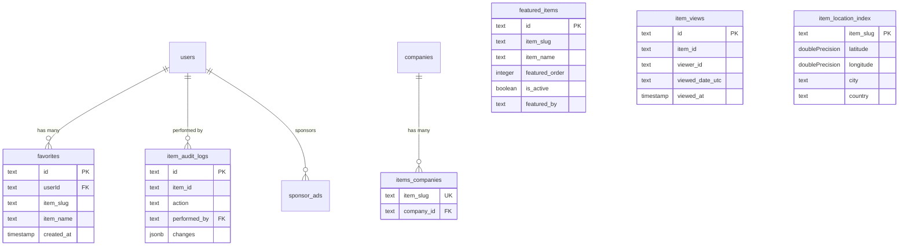

# Approfondimento sullo schema degli elementi

## Panoramica

Nel modello Ever Works, **gli elementi sono archiviati in un CMS basato su Git** (`.content/` directory), non in una tabella di database tradizionale. Tuttavia, più tabelle di database supportano operazioni relative agli elementi come il monitoraggio delle visualizzazioni, il controllo delle modifiche, l'indicizzazione delle posizioni, la gestione dei preferiti, la presentazione degli elementi e il collegamento degli elementi alle aziende.

Questa pagina documenta ogni tabella del database che fa riferimento o supporta elementi.

**File sorgente:** `template/lib/db/schema.ts`

---

## Item-Supporting Tables

| Table | Purpose |
|---|---|
| `favorites` | User-saved favorite items |
| `featured_items` | Admin-curated featured items |
| `item_views` | Per-day unique view tracking |
| `item_audit_logs` | Complete change history for admin panel |
| `item_location_index` | Geospatial index for "Near Me" filtering |
| `items_companies` | Links items to company records |
| `location_index_meta` | Singleton metadata for location index |

---

## Tabella: `favorites`

Memorizza le relazioni tra i segnalibri/preferiti dell'utente e gli elementi, identificati dallo slug.

### Colonne

|Colonna|Nome del DB|Digitare|Nullabile|Predefinito|Vincoli|
|---|---|---|---|---|---|
|`id`|`id`|`text`|No|`crypto.randomUUID()`|Chiave primaria|
|`userId`|`userId`|`text`|No| - |FK -> `users.id` (CASCATA)|
|`itemSlug`|`item_slug`|`text`|No| - | - |
|`itemName`|`item_name`|`text`|No| - | - |
|`itemIconUrl`|`item_icon_url`|`text`|Sì| - | - |
|`itemCategory`|`item_category`|`text`|Sì| - | - |
|`createdAt`|`created_at`|`timestamp`|No|`now()`| - |
|`updatedAt`|`updated_at`|`timestamp`|No|`now()`| - |

### Indici

|Nome|Colonne|Digitare|
|---|---|---|
|`user_item_favorite_unique_idx`|`(userId, itemSlug)`|Unico|
|`favorites_user_id_idx`|`userId`|B-albero|
|`favorites_item_slug_idx`|`itemSlug`|B-albero|
|`favorites_created_at_idx`|`createdAt`|B-albero|

### Tipi di TypeScript

```typescript
export type Favorite = typeof favorites.$inferSelect;
export type NewFavorite = typeof favorites.$inferInsert;
export type FavoriteWithUser = Favorite & {
    user: typeof users.$inferSelect;
};
```

---

## Table: `featured_items`

Admin-curated list of items to highlight on the site. Supports ordering and optional expiration.

### Columns

| Column | DB Name | Type | Nullable | Default | Constraints |
|---|---|---|---|---|---|
| `id` | `id` | `text` | No | `crypto.randomUUID()` | Primary Key |
| `itemSlug` | `item_slug` | `text` | No | - | - |
| `itemName` | `item_name` | `text` | No | - | - |
| `itemIconUrl` | `item_icon_url` | `text` | Yes | - | - |
| `itemCategory` | `item_category` | `text` | Yes | - | - |
| `itemDescription` | `item_description` | `text` | Yes | - | - |
| `featuredOrder` | `featured_order` | `integer` | No | `0` | Display ordering |
| `featuredUntil` | `featured_until` | `timestamp` | Yes | - | Optional expiration |
| `isActive` | `is_active` | `boolean` | No | `true` | - |
| `featuredBy` | `featured_by` | `text` | No | - | Admin user ID |
| `featuredAt` | `featured_at` | `timestamp` | No | `now()` | - |
| `createdAt` | `created_at` | `timestamp` | No | `now()` | - |
| `updatedAt` | `updated_at` | `timestamp` | No | `now()` | - |

### Indexes

| Name | Columns | Type |
|---|---|---|
| `featured_items_item_slug_idx` | `itemSlug` | B-tree |
| `featured_items_featured_order_idx` | `featuredOrder` | B-tree |
| `featured_items_is_active_idx` | `isActive` | B-tree |
| `featured_items_featured_at_idx` | `featuredAt` | B-tree |
| `featured_items_featured_until_idx` | `featuredUntil` | B-tree |

### TypeScript Types

```typescript
export type FeaturedItem = typeof featuredItems.$inferSelect;
export type NewFeaturedItem = typeof featuredItems.$inferInsert;
```

---

## Tabella: `item_views`

Tiene traccia delle visualizzazioni giornaliere uniche per articolo. Utilizza l'identificazione del visualizzatore anonimo basata su cookie e la deduplicazione della data UTC. Non memorizza gli indirizzi IP per motivi di privacy.

### Colonne

|Colonna|Nome del DB|Digitare|Nullabile|Predefinito|Vincoli|
|---|---|---|---|---|---|
|`id`|`id`|`text`|No|`crypto.randomUUID()`|Chiave primaria|
|`itemId`|`item_id`|`text`|No| - |Lumaca dell'oggetto|
|`viewerId`|`viewer_id`|`text`|No| - |ID cookie anonimo|
|`viewedDateUtc`|`viewed_date_utc`|`text`|No| - |Formato AAAA-MM-GG|
|`viewedAt`|`viewed_at`|`timestamp (tz)`|No|`now()`|Orario di visualizzazione preciso|

### Indici

|Nome|Colonne|Digitare|
|---|---|---|
|`item_views_unique_daily_idx`|`(itemId, viewerId, viewedDateUtc)`|Unico|
|`item_views_item_date_idx`|`(itemId, viewedDateUtc)`|B-albero composito|

### Tipi di TypeScript

```typescript
export type ItemView = typeof itemViews.$inferSelect;
export type NewItemView = typeof itemViews.$inferInsert;
```

---

## Table: `item_audit_logs`

Stores the complete change history for items managed through the admin panel. Since items live in Git, `itemId` is the slug (not a foreign key).

### Columns

| Column | DB Name | Type | Nullable | Default | Constraints |
|---|---|---|---|---|---|
| `id` | `id` | `text` | No | `crypto.randomUUID()` | Primary Key |
| `itemId` | `item_id` | `text` | No | - | Item slug |
| `itemName` | `item_name` | `text` | No | - | Denormalized |
| `action` | `action` | `text (enum)` | No | - | See enum values below |
| `previousStatus` | `previous_status` | `text` | Yes | - | For status changes |
| `newStatus` | `new_status` | `text` | Yes | - | For status changes |
| `changes` | `changes` | `jsonb` | Yes | - | `{ field: { old, new } }` |
| `performedBy` | `performed_by` | `text` | Yes | - | FK -> `users.id` (SET NULL) |
| `performedByName` | `performed_by_name` | `text` | Yes | - | Denormalized |
| `notes` | `notes` | `text` | Yes | - | Review notes |
| `metadata` | `metadata` | `jsonb` | Yes | - | IP, user agent, etc. |
| `createdAt` | `created_at` | `timestamp (tz)` | No | `now()` | - |

### Action Enum Values

```typescript
export const ItemAuditAction = {
    CREATED: 'created',
    UPDATED: 'updated',
    STATUS_CHANGED: 'status_changed',
    REVIEWED: 'reviewed',
    DELETED: 'deleted',
    RESTORED: 'restored'
} as const;
```

### Indexes

| Name | Columns | Type |
|---|---|---|
| `item_audit_logs_item_id_idx` | `itemId` | B-tree |
| `item_audit_logs_action_idx` | `action` | B-tree |
| `item_audit_logs_performed_by_idx` | `performedBy` | B-tree |
| `item_audit_logs_created_at_idx` | `createdAt` | B-tree |
| `item_audit_logs_item_id_action_idx` | `(itemId, action)` | Composite B-tree |

### TypeScript Types

```typescript
export type ItemAuditLog = typeof itemAuditLogs.$inferSelect;
export type NewItemAuditLog = typeof itemAuditLogs.$inferInsert;
export type ItemAuditChanges = Record<string, { old: unknown; new: unknown }>;
```

---

## Tabella: `item_location_index`

Indice geospaziale per gli elementi, che consente il filtraggio "Vicino a me" e l'ordinamento basato sulla distanza. Questa è una tabella solo indice: la fonte della verità rimane nel CMS Git.

### Colonne

|Colonna|Nome del DB|Digitare|Nullabile|Predefinito|Vincoli|
|---|---|---|---|---|---|
|`itemSlug`|`item_slug`|`text`|No| - |Chiave primaria|
|`latitude`|`latitude`|`doublePrecision`|No| - | - |
|`longitude`|`longitude`|`doublePrecision`|No| - | - |
|`address`|`address`|`text`|Sì| - | - |
|`city`|`city`|`text`|Sì| - | - |
|`state`|`state`|`text`|Sì| - | - |
|`country`|`country`|`text`|Sì| - | - |
|`cityNormalized`|`city_normalized`|`text`|Sì| - |Minuscolo, rifilato|
|`countryNormalized`|`country_normalized`|`text`|Sì| - |Minuscolo, rifilato|
|`postalCode`|`postal_code`|`text`|Sì| - | - |
|`serviceArea`|`service_area`|`text`|Sì| - | - |
|`isRemote`|`is_remote`|`boolean`|No|`false`| - |
|`indexedAt`|`indexed_at`|`timestamp (tz)`|No|`now()`| - |

### Indici

|Nome|Colonne|Digitare|
|---|---|---|
|`item_location_index_latitude_idx`|`latitude`|B-albero|
|`item_location_index_longitude_idx`|`longitude`|B-albero|
|`item_location_index_city_idx`|`city`|B-albero|
|`item_location_index_country_idx`|`country`|B-albero|
|`item_location_index_city_normalized_idx`|`cityNormalized`|B-albero|
|`item_location_index_country_normalized_idx`|`countryNormalized`|B-albero|
|`item_location_index_is_remote_idx`|`isRemote`|B-albero|
|`item_location_index_indexed_at_idx`|`indexedAt`|B-albero|
|`item_location_index_lat_long_idx`|`(latitude, longitude)`|B-albero composito|

### Tipi di TypeScript

```typescript
export type ItemLocationIndex = typeof itemLocationIndex.$inferSelect;
export type NewItemLocationIndex = typeof itemLocationIndex.$inferInsert;
```

---

## Table: `items_companies`

Links item slugs to company database records.

### Columns

| Column | DB Name | Type | Nullable | Default | Constraints |
|---|---|---|---|---|---|
| `itemSlug` | `item_slug` | `text` | No | - | Unique |
| `companyId` | `company_id` | `text` | No | - | FK -> `companies.id` (CASCADE) |
| `createdAt` | `created_at` | `timestamp (tz)` | No | `now()` | - |
| `updatedAt` | `updated_at` | `timestamp (tz)` | No | `now()` | - |

### Indexes

| Name | Columns | Type |
|---|---|---|
| `items_companies_company_id_idx` | `companyId` | B-tree |

---

## Tabella: `location_index_meta`

L'indice della posizione di tracciamento della tabella singleton ricostruisce i metadati tra le distribuzioni.

### Colonne

|Colonna|Nome del DB|Digitare|Nullabile|Predefinito|Vincoli|
|---|---|---|---|---|---|
|`id`|`id`|`text`|No|`'singleton'`|Chiave primaria|
|`lastRebuildAt`|`last_rebuild_at`|`timestamp (tz)`|Sì| - | - |
|`lastRebuildDurationMs`|`last_rebuild_duration_ms`|`integer`|Sì| - | - |
|`lastRebuildItemCount`|`last_rebuild_item_count`|`integer`|Sì| - | - |
|`updatedAt`|`updated_at`|`timestamp (tz)`|No|`now()`| - |

### Indici

|Nome|Colonne|Digitare|
|---|---|---|
|`location_index_meta_singleton_idx`|`id`|Unico|

---

## Relations Diagram



---

## Esempi di query

### Recupera i preferiti dell'utente

```typescript
import { db } from '@/lib/db/drizzle';
import { favorites } from '@/lib/db/schema';
import { eq } from 'drizzle-orm';

const userFavorites = await db
    .select()
    .from(favorites)
    .where(eq(favorites.userId, userId));
```

### Registra la visualizzazione di un elemento

```typescript
import { itemViews } from '@/lib/db/schema';

await db.insert(itemViews).values({
    itemId: 'my-item-slug',
    viewerId: cookieViewerId,
    viewedDateUtc: '2025-01-15',
}).onConflictDoNothing();
```

### Ottieni articoli in evidenza attivi

```typescript
import { featuredItems } from '@/lib/db/schema';
import { eq, asc, or, isNull, gte } from 'drizzle-orm';

const featured = await db
    .select()
    .from(featuredItems)
    .where(eq(featuredItems.isActive, true))
    .orderBy(asc(featuredItems.featuredOrder));
```

### Trova elementi vicino a una posizione (riquadro di delimitazione)

```typescript
import { itemLocationIndex } from '@/lib/db/schema';
import { and, between } from 'drizzle-orm';

const nearby = await db
    .select()
    .from(itemLocationIndex)
    .where(
        and(
            between(itemLocationIndex.latitude, minLat, maxLat),
            between(itemLocationIndex.longitude, minLng, maxLng)
        )
    );
```

### Ottieni la cronologia di controllo per un elemento

```typescript
import { itemAuditLogs } from '@/lib/db/schema';
import { eq, desc } from 'drizzle-orm';

const history = await db
    .select()
    .from(itemAuditLogs)
    .where(eq(itemAuditLogs.itemId, 'my-item-slug'))
    .orderBy(desc(itemAuditLogs.createdAt));
```

---

## Design Notes

- **Items are NOT in the database.** They live in a Git-based CMS cloned into `.content/`. The database only stores metadata, indexes, and relationships.
- **Item identification is by slug.** All item-supporting tables reference items via `item_slug` or `item_id` (which IS the slug), not via foreign keys.
- **Denormalization is intentional.** Tables like `favorites` and `featured_items` store `item_name` and `item_icon_url` to avoid cross-system lookups at read time.
- **Privacy-first views.** The `item_views` table uses anonymous cookie IDs and does not store IP addresses.
