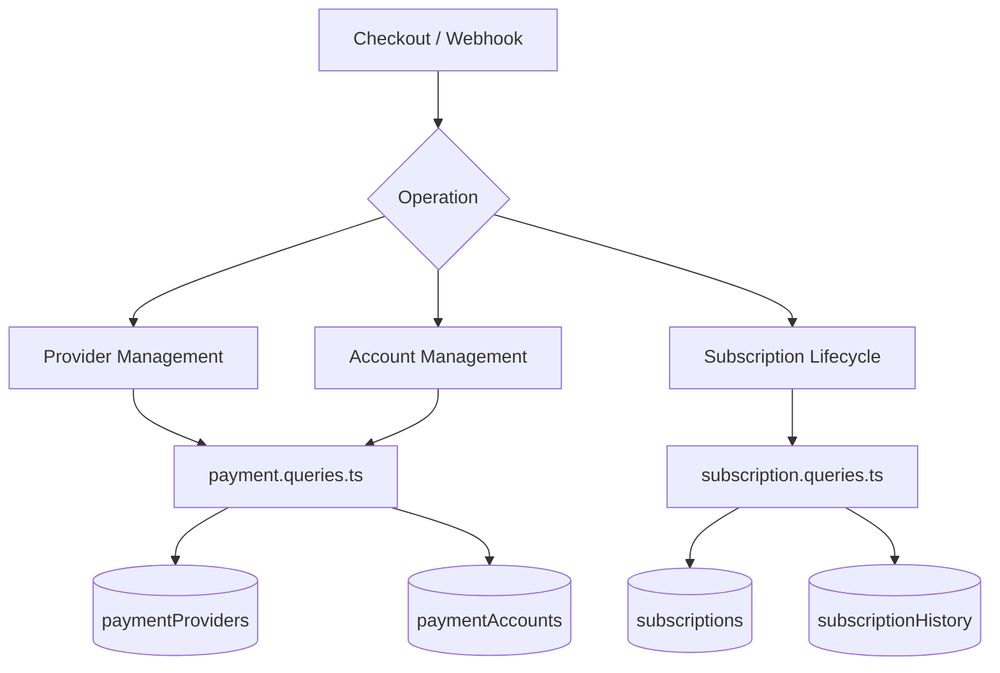
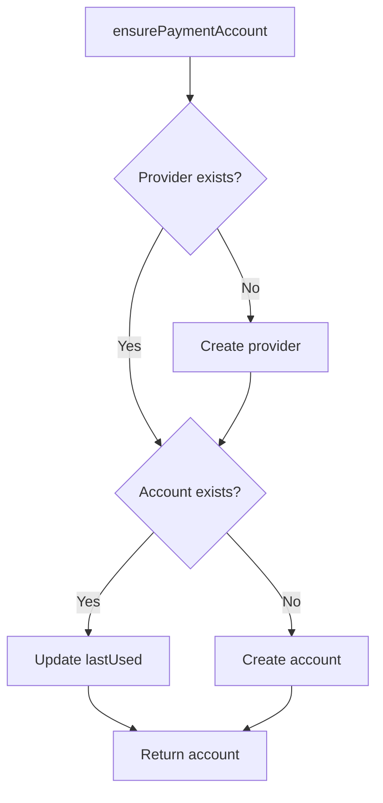
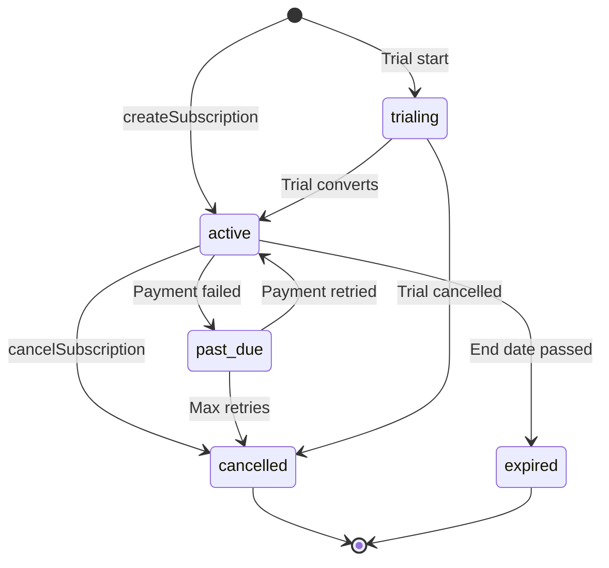

# Domande su pagamenti e abbonamenti

Le query di pagamento gestiscono il registro del fornitore, i conti di pagamento degli utenti e l'intero ciclo di vita dell'abbonamento. I moduli interessati sono `payment.queries.ts` e `subscription.queries.ts`.

## Architettura del sistema di pagamento



## Domande sul fornitore di servizi di pagamento (`payment.queries.ts`)

### Fornitore CRUD

|Funzione|Descrizione|
|----------|-------------|
|`getPaymentProvider(id)`|Ottieni fornitore tramite ID|
|`getPaymentProviderByName(name)`|Ottieni il fornitore per nome (ad esempio, `'stripe'`)|
|`getActivePaymentProviders()`|Elenca tutti i fornitori attivi, ordinati per nome|
|`createPaymentProvider(data)`|Crea un nuovo record del fornitore|
|`updatePaymentProvider(id, data)`|Aggiornamento parziale dei campi del provider|
|`deactivatePaymentProvider(id)`|Imposta `isActive = false`|

Nomi dei provider supportati: `stripe`, `lemonsqueezy`, `polar`, `solidgate`.

### Domande sul conto di pagamento

I conti di pagamento collegano un utente a un ID cliente specifico del fornitore:

|Funzione|Descrizione|
|----------|-------------|
|`getPaymentAccountByUserId(userId, providerId)`|Ottieni un account con il controllo del fornitore attivo|
|`getPaymentAccountByCustomerId(customerId, providerId)`|Ricerca inversa per ID cliente|
|`createPaymentAccount(data)`|Crea un account con timestamp `lastUsed`|
|`updatePaymentAccountLastUsed(accountId)`|Toccare `lastUsed` timestamp|
|`getUserPaymentAccountByProvider(userId, providerName)`|Ricerca per nome del provider (risolve prima il provider)|

### Convalida del fornitore attivo

`getPaymentAccountByUserId` esegue un triplo inner join per garantire che sia il provider che l'utente siano validi:

```typescript
export async function getPaymentAccountByUserId(
  userId: string,
  providerId: string
): Promise<PaymentAccount | null> {
  const result = await db
    .select({ /* payment account fields */ })
    .from(paymentAccounts)
    .innerJoin(paymentProviders, eq(paymentAccounts.providerId, paymentProviders.id))
    .innerJoin(users, eq(paymentAccounts.userId, users.id))
    .where(and(
      eq(paymentAccounts.userId, userId),
      eq(paymentAccounts.providerId, providerId),
      eq(paymentProviders.isActive, true)
    ))
    .limit(1);
  return result[0] || null;
}
```

### Garantire il conto di pagamento

`ensurePaymentAccount` implementa un modello di upsert idempotente per i conti di pagamento:



```typescript
export async function ensurePaymentAccount(
  providerName: string,
  userId: string,
  customerId: string,
  accountId?: string
): Promise<PaymentAccount>
```

### Imposta il conto di pagamento dell'utente

`setupUserPaymentAccount` estende il modello di garanzia con il rilevamento della modifica dell'ID cliente:

```typescript
if (existingAccount.customerId !== customerId) {
  await db
    .update(paymentAccounts)
    .set({
      customerId,
      accountId: accountId || existingAccount.accountId,
      lastUsed: new Date(),
      updatedAt: new Date()
    })
    .where(eq(paymentAccounts.id, existingAccount.id));
}
```

### Alias di convenienza

- `getOrCreatePaymentAccount` -- alias per `ensurePaymentAccount`
- `createOrGetPaymentAccount` -- alias per `setupUserPaymentAccount`

## Domande sull'iscrizione (`subscription.queries.ts`)

### Ricerca abbonamenti

|Funzione|Parametri|Ritorni|
|----------|-----------|---------|
|`getUserActiveSubscription(userId)`|ID utente|Abbonamento attivo o nullo|
|`getUserSubscriptions(userId)`|ID utente|Tutti gli abbonamenti (ordinati per data)|
|`getSubscriptionByProviderSubscriptionId(provider, subId)`|Fornitore + ID secondario|Abbonamento o nullo|
|`getSubscriptionByUserIdAndSubscriptionId(userId, subId)`|Utente + ID secondario|Abbonamento o nullo|
|`getSubscriptionWithUser(subId)`|Identificativo dell'abbonamento|Abbonamento con iscrizione utente|
|`hasActiveSubscription(userId)`|ID utente|Booleano|

### Ciclo di vita dell'abbonamento

#### Crea

```typescript
export async function createSubscription(data: NewSubscription): Promise<Subscription> {
  const result = await db
    .insert(subscriptions)
    .values({ ...data, createdAt: new Date(), updatedAt: new Date() })
    .returning();
  return result[0];
}
```

#### Aggiorna stato

Le modifiche allo stato vengono impostate automaticamente su `cancelledAt` e `cancelReason` durante la transizione a `CANCELLED`:

```typescript
export async function updateSubscriptionStatus(
  subscriptionId: string,
  status: string,
  reason?: string
): Promise<Subscription | null>
```

#### Annulla

Supporta sia l'annullamento immediato che l'annullamento di fine periodo:

```typescript
export async function cancelSubscription(
  subscriptionId: string,
  reason?: string,
  cancelAtPeriodEnd: boolean = false
): Promise<Subscription | null>
```

Quando `cancelAtPeriodEnd = true`, lo stato rimane `ACTIVE` ma vengono impostati `cancelledAt` e `cancelAtPeriodEnd`.

### Flusso dello stato dell'abbonamento



### Risoluzione del piano

`getUserPlan` controlla la scadenza dell'abbonamento e torna al piano gratuito:

```typescript
export async function getUserPlan(userId: string): Promise<string> {
  const subscription = await getUserActiveSubscription(userId);
  if (!subscription) return PaymentPlan.FREE;
  return getEffectivePlan(subscription.planId, subscription.endDate, subscription.status);
}
```

`getUserPlanWithExpiration` restituisce i dettagli completi della scadenza:

```typescript
{
  planId: string;         // Stored plan
  effectivePlan: string;  // Actual plan after expiration check
  isExpired: boolean;
  expiresAt: Date | null;
  status: string | null;
  subscriptionId: string | null;
}
```

### Scadenza e Rinnovo

|Funzione|Descrizione|
|----------|-------------|
|`getSubscriptionsExpiringSoon(days)`|Abbonamenti attivi con scadenza entro N giorni|
|`getExpiredSubscriptions()`|Abbonamenti oltre la data di fine|
|`getSubscriptionsForRenewalReminder(days)`|Abbonamenti che necessitano di avvisi di rinnovo|

### Cronologia degli abbonamenti

Le modifiche vengono registrate nella tabella `subscriptionHistory`:

```typescript
export async function logSubscriptionHistory(data: NewSubscriptionHistory)
export async function getSubscriptionHistory(subscriptionId: string)
```

### Statistiche sugli abbonamenti

`getSubscriptionStats` restituisce conteggi aggregati:

```typescript
{
  total: number;
  active: number;
  cancelled: number;
  expired: number;
  pastDue: number;
  trialing: number;
}
```

## Costanti dello schema

```typescript
// lib/db/schema.ts
export const SubscriptionStatus = {
  ACTIVE: 'active',
  CANCELLED: 'cancelled',
  EXPIRED: 'expired',
  PAST_DUE: 'past_due',
  TRIALING: 'trialing',
} as const;

// lib/constants/payment.ts
export const PaymentPlan = {
  FREE: 'free',
  STANDARD: 'standard',
  PREMIUM: 'premium',
} as const;

export const PaymentProvider = {
  STRIPE: 'stripe',
  LEMONSQUEEZY: 'lemonsqueezy',
  POLAR: 'polar',
  SOLIDGATE: 'solidgate',
} as const;
```
