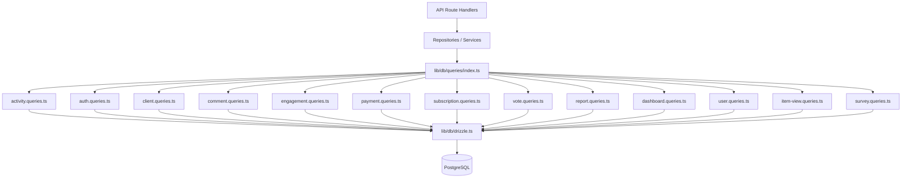

# Sistema di modelli di query

Il modello organizza tutte le query del database in moduli specifici del dominio in `lib/db/queries/`. Ogni modulo segue il Principio di Responsabilità Unica (SRP), raggruppando insieme le operazioni correlate. Un'esportazione di barili in `index.ts` fornisce un unico punto di ingresso per tutte le funzioni di query.

## Panoramica dell'architettura



## Moduli di interrogazione

|Modulo|Archivio|Scopo|
|--------|------|---------|
|Attività|`activity.queries.ts`|Registrazione delle attività e traccia di controllo|
|Aut|`auth.queries.ts`|Token di reimpostazione della password, token di verifica|
|Cliente|`client.queries.ts`|Profilo cliente CRUD, ricerca, statistiche|
|Commento|`comment.queries.ts`|Commenta CRUD con i join degli utenti|
|Compagnia|`company.queries.ts`|Gestione aziendale e collegamento articolo-azienda|
|Cruscotto|`dashboard.queries.ts`|Statistiche della dashboard e grafici del coinvolgimento|
|Coinvolgimento|`engagement.queries.ts`|Metriche di coinvolgimento aggregate (visualizzazioni, voti, preferiti, commenti)|
|Mappatura dell'integrazione|`integration-mapping.queries.ts`|Mappature di integrazione CRM|
|Articolo|`item.queries.ts`|Normalizzazione e convalida dello slug degli elementi|
|Verifica dell'articolo|`item-audit.queries.ts`|Cronologia delle modifiche agli articoli|
|Visualizzazione articolo|`item-view.queries.ts`|Visualizza il monitoraggio con la deduplicazione|
|Indice delle posizioni|`location-index.queries.ts`|Indicizzazione degli elementi geospaziali|
|Moderazione|`moderation.queries.ts`|Azioni di moderazione dei contenuti|
|Notiziario|`newsletter.queries.ts`|Gestione iscritti alla newsletter|
|Pagamento|`payment.queries.ts`|Fornitore di pagamenti e gestione del conto|
|Rapporto|`report.queries.ts`|Rapporti sui contenuti con filtraggio|
|Abbonamento|`subscription.queries.ts`|Gestione del ciclo di vita dell'abbonamento|
|Sondaggio|`survey.queries.ts`|Risposte e analisi del sondaggio|
|Utente|`user.queries.ts`|CRUD dell'utente principale e controlli di amministrazione|
|Vota|`vote.queries.ts`|Voto CRUD e calcolo del punteggio netto|

## Modelli comuni

### 1. Modello di impaginazione

Tutte le query sugli elenchi seguono uno schema di impaginazione coerente utilizzando `limit` e `offset`:

```typescript
export async function getClientProfiles(params: {
  page?: number;
  limit?: number;
  search?: string;
  status?: string;
}): Promise<{
  profiles: ClientProfileWithAuth[];
  total: number;
  page: number;
  totalPages: number;
  limit: number;
}> {
  const { page = 1, limit = 10, search, status } = params;
  const offset = (page - 1) * limit;

  // 1. Build WHERE conditions dynamically
  const whereConditions: SQL[] = [];
  if (search) { /* add ILIKE condition */ }
  if (status) { whereConditions.push(eq(clientProfiles.status, status)); }
  const whereClause = whereConditions.length > 0
    ? and(...whereConditions)
    : undefined;

  // 2. Count query for total
  const countResult = await db
    .select({ count: sql<number>`count(distinct ${clientProfiles.id})` })
    .from(clientProfiles)
    .where(whereClause);
  const total = Number(countResult[0]?.count || 0);

  // 3. Data query with limit/offset
  const profiles = await db
    .select({ /* fields */ })
    .from(clientProfiles)
    .where(whereClause)
    .orderBy(desc(clientProfiles.createdAt))
    .limit(limit)
    .offset(offset);

  return {
    profiles,
    total,
    page,
    totalPages: Math.ceil(total / limit),
    limit,
  };
}
```

### 2. Modello di filtraggio dinamico

I filtri vengono accumulati come una serie di condizioni SQL e composti con `and()`:

```typescript
const whereConditions: SQL[] = [];

if (search) {
  const escapedSearch = search
    .replace(/\\/g, '\\\\')
    .replace(/[%_]/g, '\\$&');
  whereConditions.push(
    sql`(${clientProfiles.name} ILIKE ${`%${escapedSearch}%`} OR
         ${clientProfiles.email} ILIKE ${`%${escapedSearch}%`})`
  );
}

if (status) {
  whereConditions.push(eq(clientProfiles.status, status));
}

if (provider) {
  whereConditions.push(
    sql`exists (
      select 1 from ${accounts}
      where ${accounts.userId} = ${clientProfiles.userId}
        and ${accounts.provider} = ${provider}
    )`
  );
}

const whereClause = whereConditions.length > 0
  ? and(...whereConditions)
  : undefined;
```

### 3. Unisci modello

La base di codice utilizza sia `innerJoin`/`leftJoin` espliciti che sottoquery per gestire i dati correlati:

**Inner join per le relazioni richieste:**

```typescript
const result = await db
  .select({
    id: comments.id,
    content: comments.content,
    user: {
      id: clientProfiles.id,
      name: clientProfiles.name,
      email: clientProfiles.email,
      image: clientProfiles.avatar,
    },
  })
  .from(comments)
  .innerJoin(clientProfiles, eq(comments.userId, clientProfiles.id))
  .where(and(eq(comments.itemId, itemId), isNull(comments.deletedAt)))
  .orderBy(desc(comments.createdAt));
```

**Sottoquery per evitare righe duplicate da più join:**

```typescript
const profiles = await db
  .select({
    id: clientProfiles.id,
    // ... other fields
    accountProvider: sql<string>`coalesce(
      (SELECT provider FROM ${accounts}
       WHERE ${accounts.userId} = ${clientProfiles.userId}
       LIMIT 1),
      'unknown'
    )`,
  })
  .from(clientProfiles);
```

### 4. Modello di aggregazione

Funzioni aggregate come `count`, `SUM` e `AVG` vengono utilizzate con `groupBy`:

```typescript
// Net vote score using conditional SUM
const voteCounts = await db
  .select({
    itemId: votes.itemId,
    netScore: sql<number>`
      SUM(CASE
        WHEN vote_type = 'upvote' THEN 1
        WHEN vote_type = 'downvote' THEN -1
        ELSE 0
      END)
    `.as('netScore'),
  })
  .from(votes)
  .where(inArray(votes.itemId, itemSlugs))
  .groupBy(votes.itemId);
```

### 5. Modello di query parallela

Quando sono necessarie più aggregazioni indipendenti, le query vengono eseguite in parallelo con `Promise.all`:

```typescript
const [viewsData, votesData, favoritesData, commentsData] =
  await Promise.all([
    db.select({ itemId: itemViews.itemId, count: count() })
      .from(itemViews)
      .where(inArray(itemViews.itemId, itemSlugs))
      .groupBy(itemViews.itemId),

    db.select({ itemId: votes.itemId, netScore: sql`...` })
      .from(votes)
      .where(inArray(votes.itemId, itemSlugs))
      .groupBy(votes.itemId),

    db.select({ itemSlug: favorites.itemSlug, count: count() })
      .from(favorites)
      .where(inArray(favorites.itemSlug, itemSlugs))
      .groupBy(favorites.itemSlug),

    db.select({ itemId: comments.itemId, count: count(), avgRating: sql`...` })
      .from(comments)
      .where(and(inArray(comments.itemId, itemSlugs), isNull(comments.deletedAt)))
      .groupBy(comments.itemId),
  ]);
```

### 6. Modello di upsert/risoluzione dei conflitti

Utilizzato per la deduplicazione, in particolare nel monitoraggio delle visualizzazioni:

```typescript
export async function recordItemView(
  view: Pick<NewItemView, 'itemId' | 'viewerId' | 'viewedDateUtc'>
): Promise<boolean> {
  const result = await db
    .insert(itemViews)
    .values(view)
    .onConflictDoNothing()
    .returning({ id: itemViews.id });

  return result.length > 0;
}
```

### 7. Modello di eliminazione graduale

I record vengono contrassegnati come eliminati anziché essere rimossi fisicamente:

```typescript
export async function deleteComment(id: string) {
  const [comment] = await db
    .update(comments)
    .set({ deletedAt: new Date() })
    .where(eq(comments.id, id))
    .returning();
  return comment;
}

// Querying always filters out soft-deleted records
.where(and(eq(comments.itemId, itemId), isNull(comments.deletedAt)))
```

### 8. Modello di normalizzazione dei risultati

I risultati delle query vengono spesso mappati tramite oggetti di ricerca `Map` per un accesso O(1) efficiente:

```typescript
const viewsMap = new Map<string, number>(
  viewsData.map(v => [v.itemId, Number(v.count)])
);
const votesMap = new Map<string, number>(
  votesData.map(v => [v.itemId, Number(v.netScore ?? 0)])
);

// Combine into final metrics
for (const slug of itemSlugs) {
  metricsMap.set(slug, {
    views: viewsMap.get(slug) ?? 0,
    votes: votesMap.get(slug) ?? 0,
  });
}
```

## Utilità condivise

### `lib/db/queries/utils.ts`

Fornisce funzioni di supporto condivise tra i moduli di query:

- **`extractUsernameFromEmail(email)`** -- Estrae e disinfetta un nome utente da un indirizzo email
- **`ensureUniqueUsername(baseUsername)`** -- Genera un nome utente univoco aggiungendo suffissi numerici, se necessario

### `lib/db/queries/types.ts`

Definisce i tipi condivisi utilizzati tra i moduli di query:

- **`ClientProfileWithAuth`** -- Profilo cliente combinato con i dati del fornitore di autenticazione
- **`ClientStatus`** / **`ClientPlan`** / **`ClientAccountType`** -- Tipi enum per il filtraggio
- **`CommentWithUser`** -- Dati dei commenti arricchiti con informazioni sull'utente

## Convenzione sull'importazione

Tutte le query vengono importate tramite l'esportazione del barile:

```typescript
import {
  getClientProfiles,
  createVote,
  getEngagementMetricsPerItem,
  getUserActiveSubscription,
} from '@/lib/db/queries';
```
