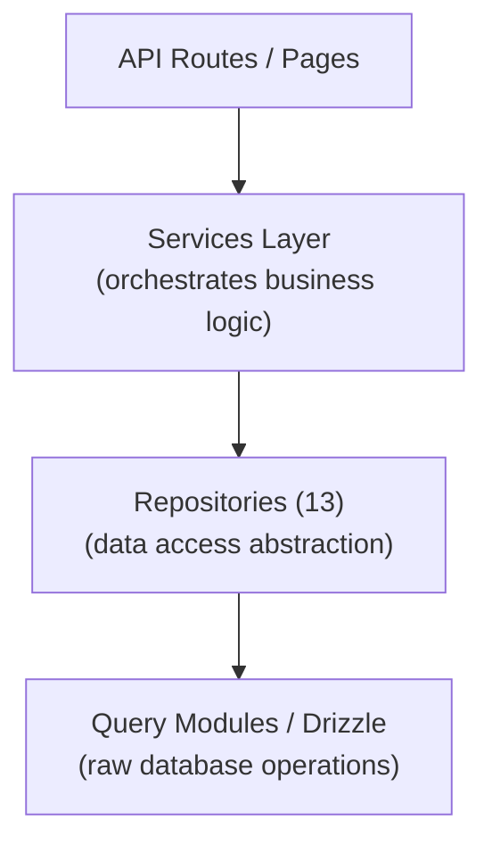

# Modello di deposito

Il modello Ever Works implementa un modello di repository attraverso 13 classi di repository specializzate in `lib/repositories/`. I repository forniscono un'astrazione di livello superiore rispetto alle query grezze del database, incapsulando logica di query complessa, regole aziendali e trasformazione dei dati.

## Architettura



## Elenco degli archivi

|Deposito|Archivio|Dominio|
|------------|------|--------|
|Analisi amministrativa (ottimizzata)|`admin-analytics-optimized.repository.ts`|Analisi amministrativa con ottimizzazione delle prestazioni|
|Statistiche amministrative|`admin-stats.repository.ts`|Statistiche del dashboard di amministrazione|
|Categoria|`category.repository.ts`|Gestione delle categorie|
|Pannello di controllo del cliente|`client-dashboard.repository.ts`|Operazioni del dashboard del cliente|
|Articolo cliente|`client-item.repository.ts`|Invii di articoli del cliente|
|Raccolta|`collection.repository.ts`|Gestione della raccolta|
|Mappatura dell'integrazione|`integration-mapping.repository.ts`|Mappature di integrazione CRM|
|Articolo|`item.repository.ts`|Operazioni sugli articoli|
|Ruolo|`role.repository.ts`|Gestione dei ruoli|
|Annuncio sponsor|`sponsor-ad.repository.ts`|Gestione pubblicità sponsorizzata|
|Etichetta|`tag.repository.ts`|Gestione dei tag|
|Venti configurazioni CRM|`twenty-crm-config.repository.ts`|Configurazione del CRM|
|Utente|`user.repository.ts`|Gestione utenti|

## Repository di contenuti basato su Git (`lib/repository.ts`)

Oltre ai repository del database, il modello include un repository di contenuti basato su Git in `lib/repository.ts`. Questo gestisce le operazioni Git CMS:

- Clona repository di contenuti dall'URL `DATA_REPOSITORY`
- Sincronizza il contenuto con upstream (pull/push con rilevamento dei conflitti)
- Tieni traccia delle modifiche locali e confermale
- Protezione dal timeout per le operazioni Git (timeout di 120 secondi)

Questo è distinto dai repository del database e gestisce la directory `.content/` utilizzata dal livello del contenuto.

## Dettagli dell'archivio

### admin-analytics-optimized.repository.ts

Repository di analisi con prestazioni ottimizzate per il dashboard di amministrazione. Utilizza query in batch e strategie di memorizzazione nella cache per ridurre al minimo il carico del database durante la generazione di viste analitiche.

Funzionalità chiave:
- Statistiche di visualizzazione aggregate
- Tendenze di crescita degli utenti
- Riepiloghi del coinvolgimento dei contenuti
- Analisi dei ricavi

### admin-stats.repository.ts

Fornisce statistiche sulla dashboard per il pannello di amministrazione.

Funzionalità chiave:
- Conteggi totali degli utenti
- Conta l'abbonamento attivo
- Statistiche sui contenuti (elementi, commenti, rapporti)
- Riepiloghi delle attività recenti

### categoria.repository.ts

Gestisce i dati delle categorie con operazioni CRUD e gestione delle relazioni.

Funzionalità chiave:
- Elenco delle categorie con conteggio degli articoli
- Attraversamento dell'albero di categoria (genitore/figlio)
- Ricerca e filtraggio di categorie
- Ordinamento per categoria

### client-dashboard.repository.ts

Il repository più grande (28KB), che gestisce tutti i dati del dashboard lato client.

Funzionalità chiave:
- Gestione invio clienti
- Analisi degli invii (visualizzazioni, voti, commenti per articolo)
- Cronologia delle attività del cliente
- Statistiche di riepilogo del dashboard
- Elenco di articoli impaginati con filtri

### elemento-client.repository.ts

Gestisce gli elementi dal punto di vista del cliente (mittente).

Funzionalità chiave:
- Creazione e aggiornamenti dell'invio di articoli
- Monitoraggio dello stato dell'articolo
- Cronologia degli invii
- Filtraggio degli articoli specifici del cliente

### collection.repository.ts

Gestione della raccolta per gruppi di articoli selezionati.

Funzionalità chiave:
- Raccolta operazioni CRUD
- Associazioni di raccolte di articoli
- Ordinamento e stato della raccolta
- Elenco delle raccolte impaginate

### integrazione-mapping.repository.ts

Persistenza della mappatura dell'integrazione CRM.

Funzionalità chiave:
- Crea e aggiorna le mappature tra ID interni e ID CRM
- Operazioni di upsert in blocco
- Ricerca per ID interno o ID CRM
- Sincronizza il monitoraggio del timestamp
- Gestione dell'hash della versione per il rilevamento delle modifiche

### item.repository.ts

Operazioni sui dati degli elementi principali (per i metadati archiviati nel database, non per il contenuto Git).

Funzionalità chiave:
- Gestione dei metadati degli articoli
- Ricerca di articoli con più filtri
- Aggregazione dei dati sul coinvolgimento degli articoli
- Gestione degli articoli in evidenza

### ruolo.repository.ts

Gestione dei ruoli per il sistema RBAC.

Funzionalità chiave:
- Ruolo Operazioni CRUD
- Associazioni di permessi di ruolo
- Assegnazioni dei ruoli utente
- Convalida del ruolo

### sponsor-ad.repository.ts

Gestione del ciclo di vita degli annunci sponsorizzati.

Funzionalità chiave:
- Creazione e gestione degli annunci degli sponsor
- Transizioni di stato (in sospeso, attivo, scaduto)
- Filtraggio degli annunci per stato, utente o elemento
- Dati di integrazione dei pagamenti
- Gestione della scadenza

### tag.repository.ts

Gestione dei tag con associazioni di articoli.

Funzionalità chiave:
- Contrassegna le operazioni CRUD
- Ricerca tag e completamento automatico
- Statistiche sull'utilizzo dei tag
- Associazioni articolo-tag

### venti-crm-config.repository.ts

Gestione della configurazione di venti singleton CRM.

Funzionalità chiave:
- Ottieni/aggiorna la configurazione del CRM
- Abilita/disabilita l'integrazione CRM
- Gestione della modalità di sincronizzazione
- Gestione delle chiavi API

### utente.repository.ts

Gestione dell'account utente.

Funzionalità chiave:
- Operazioni sul profilo utente
- Ricerca e filtraggio degli utenti
- Gestione dello stato del conto
- Eliminazione utente (eliminazione temporanea)

## Modello di utilizzo

I repository vengono importati e utilizzati direttamente in percorsi API, servizi e componenti server:

```typescript
import { clientDashboardRepository } from '@/lib/repositories/client-dashboard.repository';

// In an API route
export async function GET(request: NextRequest) {
  const session = await auth();
  const dashboard = await clientDashboardRepository.getDashboardStats(session.user.id);
  return NextResponse.json({ success: true, data: dashboard });
}
```

```typescript
import { itemRepository } from '@/lib/repositories/item.repository';

// In a server component
export default async function ItemPage({ params }) {
  const item = await itemRepository.findBySlug(params.slug);
  return <ItemDetail item={item} />;
}
```

## Repository e moduli di query

|Aspetto|Moduli di query (`lib/db/queries/`)|Repository (`lib/repositories/`)|
|--------|-----------------------------------|-------------------------------------|
|Complessità|Domande semplici e mirate|Operazioni complesse su più tabelle|
|Logica aziendale|Nessuno (puro accesso ai dati)|Include la convalida e le regole aziendali|
|Trasformazione dei dati|Risultati grezzi del database|Dati trasformati/arricchiti|
|Caso d'uso|Operazioni dirette sul database|Accesso ai dati a livello di funzionalità|
|Consumatore tipico|Altri moduli di query, percorsi semplici|Servizi, percorsi API, componenti server|

Entrambi i livelli utilizzano Drizzle ORM e importano la connessione al database da `lib/db/drizzle.ts`. La scelta tra loro dipende dalla complessità dell'operazione: le letture semplici utilizzano direttamente i moduli di query, mentre le funzionalità complesse passano attraverso i repository.
