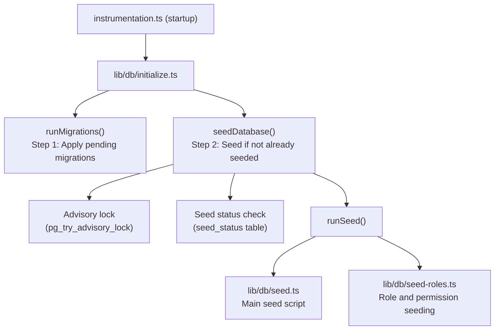

# Semina del database

Il modello Ever Works include un sistema completo di seeding del database che inizializza i dati essenziali (ruoli, autorizzazioni, fornitori di pagamenti) e facoltativamente genera dati dimostrativi per lo sviluppo e il test.

## Architettura del seme



## Script seme

### Script seme principale (`lib/db/seed.ts`)

Lo script seed primario gestisce tutta l'inizializzazione del database. Funziona in due modalità:

**Modalità di produzione**: semina solo i dati essenziali necessari per il funzionamento dell'applicazione:
- Ruoli di amministratore e cliente
- Autorizzazioni di sistema
- Fornitori di pagamenti predefiniti
- Record di sistema richiesti

**Modalità demo**: inoltre, fornisce dati di test completi per lo sviluppo:
- Esempi di utenti con ruoli diversi
- Profili cliente di esempio
- Abbonamenti di esempio
- Commenti demo, voti e preferiti
- Testare le notifiche
- Voci del registro attività

La modalità demo viene attivata quando è impostata la variabile di ambiente `DEMO_MODE`.

Caratteristiche principali:
- **Idempotenza per tabella**: ogni tabella viene controllata prima del seeding; vengono popolate solo le tabelle vuote
- **Controlli dell'esistenza della tabella**: verifica l'esistenza delle tabelle prima di tentare l'inserimento
- **Utilizza `drizzle-seed`**: sfrutta la libreria ufficiale di seeding Drizzle per la generazione di dati strutturati
- **Sicuro per le ripetizioni**: può essere richiamato più volte senza duplicare i dati

```typescript
// Simplified seed flow
export async function runSeed(): Promise<void> {
  await ensureDb();
  const isDemo = isDemoMode();

  if (isDemo) {
    // Seed comprehensive test data
  } else {
    // Seed minimal essential data only
  }

  // Seed roles (always)
  if (await isTableEmpty('roles', roles)) {
    await seedRoles();
  }

  // Seed permissions (always)
  if (await isTableEmpty('permissions', permissions)) {
    await seedPermissions();
  }

  // Seed payment providers (always)
  if (await isTableEmpty('paymentProviders', paymentProviders)) {
    await seedPaymentProviders();
  }

  // Demo-only: seed users, profiles, subscriptions, etc.
  if (isDemo) {
    await seedDemoData();
  }
}
```

### Selezione dei ruoli (`lib/db/seed-roles.ts`)

Uno script dedicato per il seeding del sistema RBAC, che può anche essere eseguito in modo indipendente.

**`seedPermissions()`** crea il set di autorizzazioni iniziale:

|Chiave di autorizzazione|Descrizione|
|---------------|-------------|
|`read:own`|Può leggere i propri dati|
|`write:own`|Può scrivere i propri dati|
|`admin:all`|Accesso amministrativo completo|
|`client:manage`|Può gestire operazioni specifiche del cliente|
|`user:read`|Può leggere i dati dell'utente|
|`user:write`|Può scrivere i dati dell'utente|

Utilizza `onConflictDoUpdate` per aggiornare in modo sicuro le autorizzazioni esistenti senza fallire nelle nuove esecuzioni.

**`linkRolesToPermissions()`** crea associazioni di autorizzazioni di ruolo:

- **Ruolo amministratore**: ottiene TUTTE le autorizzazioni
- **Ruolo client**: ottiene `read:own`, `write:own` e `client:manage`

La funzione verifica che i ruoli richiesti (amministratore, cliente) esistano e siano attivi prima di creare associazioni.

**`seedRolesAndPermissions()`** orchestra entrambe le operazioni all'interno di una transazione di database:

```typescript
export async function seedRolesAndPermissions() {
  await db.transaction(async () => {
    await seedPermissions();
    await linkRolesToPermissions();
  });
}
```

Può essere eseguito in modo autonomo:
```bash
# Run directly (if configured as a script)
npx tsx lib/db/seed-roles.ts
```

## Sistema di inizializzazione (`lib/db/initialize.ts`)

Il sistema di inizializzazione gestisce l'intera sequenza di avvio con protezione della concorrenza.

### Monitoraggio dello stato dei semi

Una tabella `seed_status` tiene traccia dello stato del seeding:

|Stato|Significato|
|--------|---------|
|`seeding`|Operazione di semina in corso|
|`completed`|Seme completato con successo|
|`failed`|Seed non riuscito (errore memorizzato)|

### Protezione della concorrenza

Nelle distribuzioni multiprocesso (ad esempio, più funzioni serverless Vercel avviate contemporaneamente), il sistema impedisce il seeding duplicato utilizzando:

1. **Blocchi consultivi PostgreSQL**: `pg_try_advisory_lock(12345)` fornisce un blocco non bloccante. Solo un processo può acquisirlo.
2. **Tabella stato seed**: altri processi controllano la tabella `seed_status` e attendono il completamento.
3. **Rilevamento obsoleto**: se uno stato `seeding` è più vecchio di 5 minuti, viene considerato obsoleto e ripulito.
4. **Wait Timeout**: i processi in attesa del completamento di un'altra istanza scadranno dopo 60 secondi.

### Flusso di inizializzazione

```
initializeDatabase()
│
├── DATABASE_URL not set? → Silent skip (DB is optional)
│
├── Step 1: Run migrations (always, idempotent)
│   └── Failure? → Error in production, warning in dev/preview
│
├── Step 2: Check if already seeded
│   └── seed_status = 'completed'? → Done
│
├── Step 3: Handle edge cases
│   ├── Previous seed failed? → Delete failed status, retry
│   ├── Stale seeding (>5min)? → Clean up, retry
│   └── Another instance seeding? → Wait for completion
│
├── Step 4: Acquire advisory lock
│   └── Lock not available? → Wait for other instance
│
├── Step 5: Double-check (another instance may have finished)
│
├── Step 6: Run seed
│   ├── Create seed_status record ('seeding')
│   ├── Execute runSeed()
│   └── Update seed_status ('completed' or 'failed')
│
└── Step 7: Release advisory lock (always, in finally block)
```

## Esecuzione dei semi manualmente

### Seme standard

```bash
pnpm db:seed
```

### Script seme individuali

```bash
# Seed roles and permissions only
npx tsx lib/db/seed-roles.ts
```

### Modalità dimostrativa

Per eseguire il seeding con dati demo, imposta la variabile di ambiente `DEMO_MODE`:

```bash
DEMO_MODE=true pnpm db:seed
```

## Variabili d'ambiente

|Variabile|Predefinito|Descrizione|
|----------|---------|-------------|
|`DATABASE_URL`| - |Stringa di connessione PostgreSQL (richiesta per il seeding)|
|`DEMO_MODE`|`false`|Abilita il seeding dei dati demo|

## Riepilogo dei dati del seme

### Sempre seminato (modalità di produzione)

|Tabella|Dati|
|-------|------|
|`roles`|Ruoli di amministratore e cliente|
|`permissions`|Definizioni dei permessi di sistema|
|`rolePermissions`|Associazioni di permessi di ruolo|
|`paymentProviders`|Stripe, LemonSqueezy, Polar, Solidgate|

### Solo modalità demo

|Tabella|Dati|
|-------|------|
|`users`|Esempi di utenti amministratore e client|
|`accounts`|Account di autenticazione per utenti campione|
|`clientProfiles`|Profili cliente con stati diversi|
|`subscriptions`|Abbonamenti di esempio tra piani|
|`comments`|Commenti sugli elementi di esempio|
|`votes`|Voti campione|
|`favorites`|Preferiti di esempio|
|`notifications`|Notifiche di esempio per l'amministratore|
|`activityLogs`|Esempio di cronologia delle attività|

## Migliori pratiche

1. **Non eseguire mai il seed in produzione con DEMO_MODE**: i dati demo devono essere utilizzati solo in fase di sviluppo e staging
2. **Controlla lo stato del seeding prima del nuovo seeding manuale**: interroga la tabella `seed_status` per comprendere lo stato corrente
3. **Utilizza transazioni**: il seeding dei ruoli utilizza le transazioni per garantire la coerenza
4. **Design idempotente**: controlla sempre se i dati esistono prima di inserirli per supportare le ripetizioni sicure
5. **Blocchi consultivi**: il sistema di blocco consultivo previene problemi in ambienti serverless in cui possono essere avviate più istanze contemporaneamente
