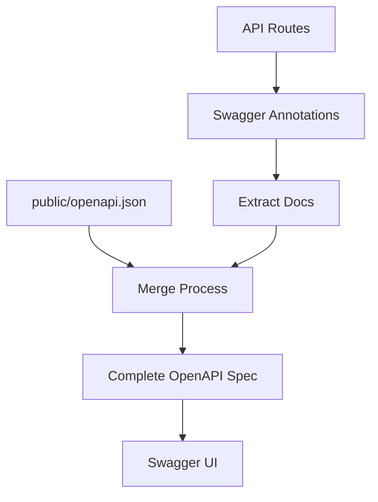

# Sistema di Documentazione API Automatizzato

Ever Works include un sistema di documentazione OpenAPI automatizzato che genera documentazione API completa dal codice sorgente.

## Panoramica

Il sistema offre:
- 📝 **Generazione automatizzata** – Dalle annotazioni del codice alla specifica OpenAPI
- 🔄 **Approccio ibrido** – Preserva la documentazione manuale, aggiunge quella automatizzata
- 🎯 **Type-safe** – Integrazione TypeScript
- 📊 **Swagger UI** – Esploratore API interattivo
- 🔧 **Hot reload** – Auto-rigenerazione durante lo sviluppo

## Architettura



### Approccio Ibrido

- ✅ **Preserva** il file `public/openapi.json` esistente
- ✅ **Aggiunge** annotazioni `@swagger` nel codice delle route
- ✅ **Fonde** entrambe le sorgenti automaticamente
- ✅ **Genera** file OpenAPI completo e coerente

## Installazione

### 1. Installare le dipendenze

```bash
./scripts/install-swagger-deps.sh

npm install -D swagger-jsdoc @types/swagger-jsdoc tsx nodemon
```

### 2. Script disponibili

```bash
npm run generate-docs
npm run docs:watch
npm run dev
```

## Utilizzo

### Aggiungere annotazioni alle route

```typescript
/**
 * @swagger
 * /api/example:
 *   get:
 *     tags: ["Example"]
 *     summary: "Get example data"
 *     responses:
 *       200:
 *         description: "Success"
 */
export async function GET() {
  return NextResponse.json({ success: true, data: ["example"] });
}
```

### Usare le utility di annotazione

```typescript
/**
 * @swagger
 * /api/admin/users:
 *   get:
 *     tags: ["Admin"]
 *     summary: "Get all users"
 *     security:
 *       - bearerAuth: []
 *     responses:
 *       200:
 *         description: "Success"
 */
export async function GET() {
  // Implementazione
}
```

## Struttura dei file

```
scripts/
├── generate-openapi.ts
├── tsconfig.json
└── install-swagger-deps.sh

lib/swagger/
└── annotations.ts

public/
└── openapi.json
```

## Configurazione

### Configurazione base OpenAPI

```typescript
const swaggerDefinition = {
  openapi: '3.0.0',
  info: {
    title: 'Ever Works API',
    version: '1.0.0',
    description: 'Documentazione API per la piattaforma directory Ever Works',
  },
  servers: [
    { url: 'http://localhost:3000', description: 'Server di sviluppo' },
    { url: 'https://yourdomain.com', description: 'Server di produzione' },
  ],
};
```

### Configurazione Swagger UI

Accedi alla documentazione API interattiva su:
- Sviluppo: `http://localhost:3000/api-docs`
- Produzione: `https://yourdomain.com/api-docs`

## Best Practice

### 1. Tagging coerente

Raggruppare gli endpoint correlati con i tag.

### 2. Descrizioni dettagliate

Fornire descrizioni ed esempi chiari.

### 3. Definizioni di schema

Definire schemi riutilizzabili nei componenti.

### 4. Risposte di errore

Documentare tutte le risposte di errore possibili.
