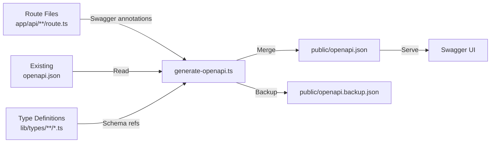

# Generazione OpenAPI

Il template include un sistema automatizzato di generazione della documentazione OpenAPI che scansiona le annotazioni JSDoc `@swagger` nei file delle route API, le unisce con la documentazione esistente e produce una specifica `openapi.json` completa.

## Panoramica



## Esecuzione del generatore

```bash
tsx scripts/generate-openapi.ts
tsx scripts/generate-openapi.ts --silent
```

## Configurazione

```typescript
const swaggerOptions = {
	definition: {
		openapi: '3.0.0',
		info: {
			title: 'Ever Works API',
			version: '1.0.0',
			description: 'Comprehensive API documentation for Directory Web Template',
		},
		components: {
			securitySchemes: {
				sessionAuth: { type: 'http', scheme: 'bearer', bearerFormat: 'JWT' },
				session: { type: 'apiKey', in: 'cookie', name: 'session_token' },
				cronSecret: { type: 'http', scheme: 'bearer', bearerFormat: 'Secret' }
			}
		}
	},
	apis: ['./app/api/**/route.ts', './app/api/**/*.ts', './lib/types/**/*.ts']
};
```

## Schemi di sicurezza

| Schema | Tipo | Utilizzo |
| ------------- | ------------------------ | ------------------------------ |
| `sessionAuth` | Bearer JWT | Endpoint utente autenticato |
| `session` | Cookie (`session_token`) | Autenticazione sessione browser |
| `cronSecret` | Bearer Secret | Endpoint cron job |

## Scrittura delle annotazioni Swagger

```typescript
/**
 * @swagger
 * /api/items:
 *   get:
 *     tags: ["Items"]
 *     summary: "List all items"
 *     responses:
 *       200:
 *         description: "Successful response"
 */
export async function GET(request: Request) {
	// implementazione handler
}
```

## Strategia di unione

Il generatore utilizza un algoritmo di unione intelligente quando combina documentazione esistente e generata.

### Criteri di qualità della documentazione

Una route ha "documentazione dettagliata" se soddisfa almeno 2 dei 3 criteri:

| Criterio | Soglia |
| ------------------- | ------------------------------------------------ |
| Descrizione lunga | Più di 50 caratteri |
| Esempi di risposta | Contiene `example` o `examples` nelle risposte |
| Parametri dettagliati | I parametri hanno sia `description` che `example` |

### Regole di priorità dell'unione

1. **Percorsi**: Le annotazioni generate sovrascrivono quelle esistenti solo se più dettagliate
2. **Componenti/schemi**: Gli schemi esistenti hanno priorità
