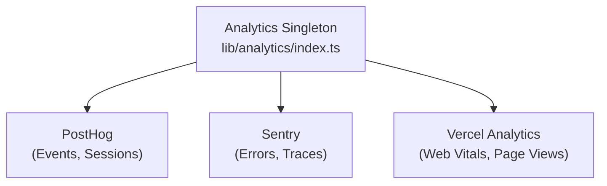

# Sistema di analisi

Il modello Ever Works si integra con **PostHog**, **Sentry** e **Vercel Analytics** per il monitoraggio completo degli eventi, il monitoraggio degli errori, la registrazione delle sessioni e l'analisi delle prestazioni.

## Architettura



## Lezione di Analisi

La classe `Analytics` principale in `lib/analytics/index.ts` è un singleton che gestisce l'inizializzazione e l'invio di eventi tra i provider:

```typescript
class Analytics {
  private static instance: Analytics;
  private initialized: boolean;
  private exceptionTrackingProvider: ExceptionTrackingProvider;

  static getInstance(): Analytics;
  init(): void;
  trackEvent(name: string, properties?: EventProperties): void;
  trackPageView(url: string): void;
  identify(userId: string, properties?: UserProperties): void;
  reset(): void;
}
```

### Risoluzione del provider di monitoraggio delle eccezioni

Il sistema supporta la configurazione flessibile del monitoraggio delle eccezioni:

```typescript
type ExceptionTrackingProvider = 'sentry' | 'posthog' | 'both' | 'none';
```

Il fornitore viene determinato verificando la disponibilità:
1. Leggere il valore di configurazione `EXCEPTION_TRACKING_PROVIDER` 2. Confermare che il provider scelto sia abilitato
3. Tornare all'alternativa disponibile se il primario non è configurato

## Integrazione di PostHog

### Configurazione

```bash
NEXT_PUBLIC_POSTHOG_KEY=phc_xxx
NEXT_PUBLIC_POSTHOG_HOST=https://us.i.posthog.com

# Optional
NEXT_PUBLIC_POSTHOG_DEBUG=false
NEXT_PUBLIC_POSTHOG_SESSION_RECORDING=true
NEXT_PUBLIC_POSTHOG_AUTO_CAPTURE=true
NEXT_PUBLIC_POSTHOG_SAMPLE_RATE=1.0
NEXT_PUBLIC_POSTHOG_SESSION_RECORDING_SAMPLE_RATE=0.1
NEXT_PUBLIC_POSTHOG_EXCEPTION_TRACKING=true
```

### Servizio API PostHog

Situato a `lib/services/posthog-api.service.ts` , il servizio lato server fornisce dati di analisi amministrativa:

```typescript
class PostHogApiService {
  constructor(); // Reads from analyticsConfig

  isConfigured(): boolean;
  async getTotalPageViews(days?: number): Promise<number>;
  async getTopPages(days?: number): Promise<PageData[]>;
  async getEventCounts(eventName: string, days?: number): Promise<number>;
}
```

**Obbligatorio per l'accesso API lato server:**
```bash
POSTHOG_PERSONAL_API_KEY=phx_xxx
POSTHOG_PROJECT_ID=12345
```

### Hook lato client

```typescript
import { useAnalytics } from '@/hooks/use-analytics';

const {
  trackEvent,      // (name: string, properties?: object) => void
  trackPageView,   // (url: string) => void
  identify,        // (userId: string, properties?: object) => void
} = useAnalytics();
```

### Hook di analisi geografica

```typescript
import { useGeoAnalytics } from '@/hooks/use-geo-analytics';

const {
  geoData,         // Geographic analytics data
  isLoading,
} = useGeoAnalytics();
```

## Integrazione sentinella

### Configurazione

```bash
NEXT_PUBLIC_SENTRY_DSN=https://xxx@sentry.io/xxx
SENTRY_AUTH_TOKEN=sntrys_xxx
SENTRY_ORG=your-org
SENTRY_PROJECT=your-project
NEXT_PUBLIC_SENTRY_EXCEPTION_TRACKING=true
```

Sentry fornisce:
- **Tracciamento degli errori** -- Acquisizione automatica delle eccezioni non gestite
- **Monitoraggio delle prestazioni**: tracciamento delle transazioni per percorsi API e caricamenti di pagine
- **Replay della sessione** -- Registrazione della sessione opzionale

## Vercel Analytics

Vercel Analytics è automaticamente disponibile quando distribuito su Vercel:

```bash
# Enabled by default on Vercel deployments
NEXT_PUBLIC_VERCEL_ANALYTICS=true
```

Fornisce:
- **Web Vitals**: monitoraggio dei Core Web Vitals (LCP, FID, CLS).
- **Visualizzazioni di pagina** -- Monitoraggio automatico delle visualizzazioni di pagina
- **Approfondimenti sul pubblico** -- Analisi geografica e dei dispositivi

## Pannello di analisi amministrativa

La dashboard di amministrazione fornisce analisi aggregate tramite l'hook `useAdminStats` :

```typescript
import { useAdminStats } from '@/hooks/use-admin-stats';

const {
  stats,           // Dashboard statistics
  isLoading,
} = useAdminStats();
```

L'hook `useDashboardStats` fornisce parametri più dettagliati:

```typescript
import { useDashboardStats } from '@/hooks/use-dashboard-stats';

const {
  stats,           // { items, users, revenue, pageViews, ... }
  isLoading,
  refetch,
} = useDashboardStats();
```

## Disattivazione dell'analisi

I fornitori di analisi sono disabilitati quando manca la loro configurazione. Nessun codice di monitoraggio viene caricato se le variabili di ambiente corrispondenti non sono impostate. Ciò consente al modello di funzionare senza alcuna analisi in fase di sviluppo.
