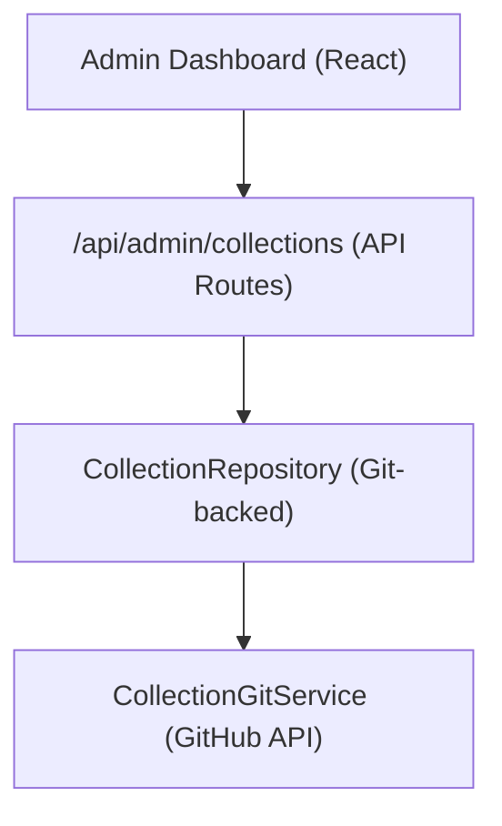

# Sistema di riscossione

Le raccolte consentono agli amministratori di curare gruppi di elementi da visualizzare sul sito. Il sistema archivia i dati di raccolta nel repository CMS basato su Git e fornisce operazioni CRUD tramite il dashboard di amministrazione.

## Architettura



Le raccolte vengono archiviate come file nel repository CMS basato su Git (configurato tramite `DATA_REPOSITORY` ), utilizzando `CollectionGitService` per operazioni di lettura/scrittura tramite l'API GitHub.

## Modello di dati

```typescript
interface Collection {
  id: string;
  name: string;
  slug: string;
  description?: string;
  isActive: boolean;
  items: string[];          // Array of item slugs
  item_count: number;       // Computed from items array
  displayOrder?: number;
  created_at: string;
  updated_at: string;
}
```

## Archivio raccolte

Situato a `lib/repositories/collection.repository.ts` , il repository fornisce:

```typescript
class CollectionRepository {
  async findAll(options?: CollectionListOptions): Promise<Collection[]>;
  async findById(id: string): Promise<Collection | null>;
  async findBySlug(slug: string): Promise<Collection | null>;
  async create(data: CreateCollectionRequest): Promise<Collection>;
  async update(id: string, data: UpdateCollectionRequest): Promise<Collection>;
  async delete(id: string): Promise<void>;
  async assignItems(id: string, itemSlugs: string[]): Promise<void>;
}
```

### Opzioni elenco

```typescript
interface CollectionListOptions {
  search?: string;           // Filter by name
  includeInactive?: boolean; // Include inactive collections
  sortBy?: 'name' | 'item_count' | 'created_at';
  sortOrder?: 'asc' | 'desc';
  page?: number;
  limit?: number;
}
```

## Gancio amministratore

```typescript
import { useAdminCollections } from '@/hooks/use-admin-collections';

const {
  collections,        // Collection[]
  total, page, totalPages, limit,
  isLoading, isSubmitting,
  createCollection,   // (data: CreateCollectionRequest) => Promise<boolean>
  updateCollection,   // (id: string, data: UpdateCollectionRequest) => Promise<boolean>
  deleteCollection,   // (id: string) => Promise<boolean>
  assignItems,        // (id: string, itemSlugs: string[]) => Promise<boolean>
  fetchAssignedItems, // (id: string) => Promise<Item[]>
  refetch, refreshData,
} = useAdminCollections({ page: 1, limit: 10, search: '' });
```

## Endpoint API

| Metodo | Punto finale | Descrizione |
|--------|----------|-------------|
| OTTIENI | `/api/admin/collections` | Elenco raccolte (impaginate) |
| POST | `/api/admin/collections` | Crea una nuova raccolta |
| METTERE | `/api/admin/collections/:id` | Aggiorna una raccolta |
| ELIMINA | `/api/admin/collections/:id` | Elimina una raccolta |
| OTTIENI | `/api/admin/collections/:id/items` | Ottieni oggetti assegnati |
| POST | `/api/admin/collections/:id/items` | Assegna elementi alla raccolta |

## Visualizzazione lato client

L'hook `useCollectionsExists` controlla se esistono raccolte attive, utilizzate per il rendering condizionale:

```typescript
import { useCollectionsExists } from '@/hooks/use-collections-exists';
const { exists, isLoading } = useCollectionsExists();
```

##Configurazione

Le raccolte richiedono le seguenti variabili di ambiente:

```bash
DATA_REPOSITORY=https://github.com/owner/repo   # Git CMS repository
GH_TOKEN=ghp_xxx                                  # GitHub API token
GITHUB_BRANCH=main                                # Branch for collection data
```

`CollectionRepository` analizza l'URL `DATA_REPOSITORY` per estrarre il proprietario e il repository GitHub, quindi utilizza il token per l'autenticazione API.
