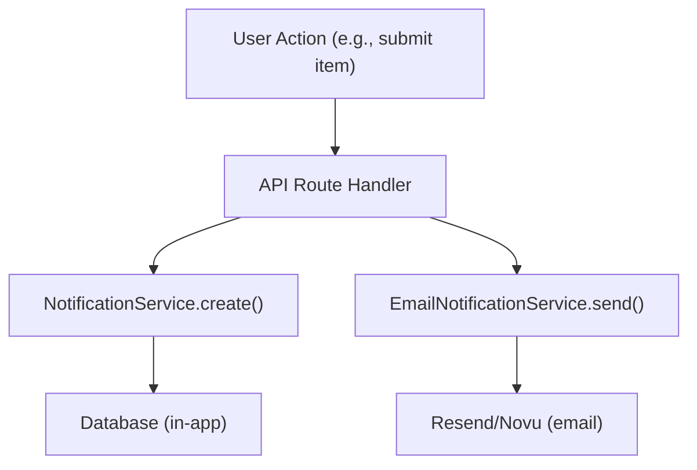

# Sistema di notifica

Il modello Ever Works fornisce sia notifiche in-app (memorizzate nel database) che notifiche e-mail (tramite Resend o Novu). Le notifiche vengono attivate da eventi di sistema come l'invio di articoli, report sui contenuti ed errori di pagamento.

## Notifiche in-app

### Servizio di notifica

Situato a `lib/services/notification.service.ts` , il servizio gestisce le notifiche supportate dal database:

```typescript
class NotificationService {
  // Create a generic notification
  static async create(data: CreateNotificationData);

  // Convenience methods for specific events
  static async createItemSubmissionNotification(adminUserId, itemId, itemName, submittedBy);
  static async createCommentReportedNotification(adminUserId, commentId, content, reportedBy);
  static async createItemReportedNotification(adminUserId, itemId, itemName, reportedBy);
  static async createUserRegisteredNotification(adminUserId, userName, userEmail);
  static async createPaymentFailedNotification(userId, subscriptionId, errorMessage);
  static async createSystemAlertNotification(adminUserId, title, message);
}
```

### Tipi di notifica

```typescript
type NotificationType =
  | "item_submission"      // New item requires admin review
  | "comment_reported"     // Comment flagged by user
  | "item_reported"        // Item flagged by user
  | "user_registered"      // New user account created
  | "payment_failed"       // Subscription payment failed
  | "system_alert";        // Generic system notification
```

### Struttura dei dati di notifica

```typescript
interface CreateNotificationData {
  userId: string;                    // Recipient user ID
  type: NotificationType;
  title: string;
  message: string;
  data?: Record<string, unknown>;    // Arbitrary metadata (actionUrl, etc.)
}
```

### Statistiche di notifica

```typescript
interface NotificationStats {
  total: number;
  unread: number;
  byType: Record<string, number>;
}
```

### Gancio amministratore

```typescript
import { useAdminNotifications } from '@/hooks/use-admin-notifications';

const {
  notifications,     // Notification[]
  stats,             // NotificationStats
  isLoading,
  markAsRead,        // (id: string) => Promise<boolean>
  markAllAsRead,     // () => Promise<boolean>
  deleteNotification,// (id: string) => Promise<boolean>
  refetch,
} = useAdminNotifications();
```

## Notifiche e-mail

### Servizio di notifica e-mail

Situato a `lib/services/email-notification.service.ts` , questo servizio gestisce la consegna delle email transazionali:

```typescript
class EmailNotificationService {
  // Send notification emails for various events
  static async sendItemSubmissionEmail(adminEmail, itemData);
  static async sendPaymentSuccessEmail(userEmail, paymentData);
  static async sendPaymentFailedEmail(userEmail, paymentData);
  static async sendSubscriptionCancelledEmail(userEmail, subscriptionData);
  static async sendTrialEndingEmail(userEmail, trialData);
  static async sendWelcomeEmail(userEmail, userData);
}
```

### Configurazione del provider di posta elettronica

Il modello supporta due provider di posta elettronica:

**Rinvia** (predefinito):
```bash
RESEND_API_KEY=re_xxx
```

**Nov**:
```bash
NOVU_API_KEY=xxx
NOVU_TEMPLATE_ID=xxx        # Optional: custom template ID
NOVU_BACKEND_URL=xxx         # Optional: self-hosted Novu URL
```

La selezione del provider è configurata nella configurazione del sito:
```json
{
  "mail": {
    "provider": "resend",
    "default_from": "noreply@yourdomain.com"
  }
}
```

### Servizio e-mail di pagamento

Il sottosistema di pagamento dispone di un proprio servizio di posta elettronica ( `lib/payment/services/payment-email.service.ts` ) con assistenti per la formattazione dei dati di pagamento:

```typescript
import {
  paymentEmailService,
  extractCustomerInfo,    // Extract customer data from webhook event
  formatAmount,           // Format currency amounts
  formatPaymentMethod,    // Format card details
  formatBillingDate,      // Format billing period dates
  getPlanName,            // Map plan ID to display name
  getBillingPeriod,       // Format billing interval
} from '@/lib/payment/services/payment-email.service';
```

## Preferenze di notifica

Gli utenti possono gestire le proprie preferenze di notifica tramite l'interfaccia delle impostazioni. Le preferenze controllano quali tipi di notifica attivano l'invio di e-mail mentre vengono sempre create le notifiche in-app.

## Flusso degli eventi



## Documentazione correlata

- [Rapporti e moderazione dei contenuti](./reports-moderation.md) - Notifiche attivate dai rapporti
- [Webhooks di pagamento](../payment/webhooks.md) - Notifiche e-mail relative ai pagamenti
