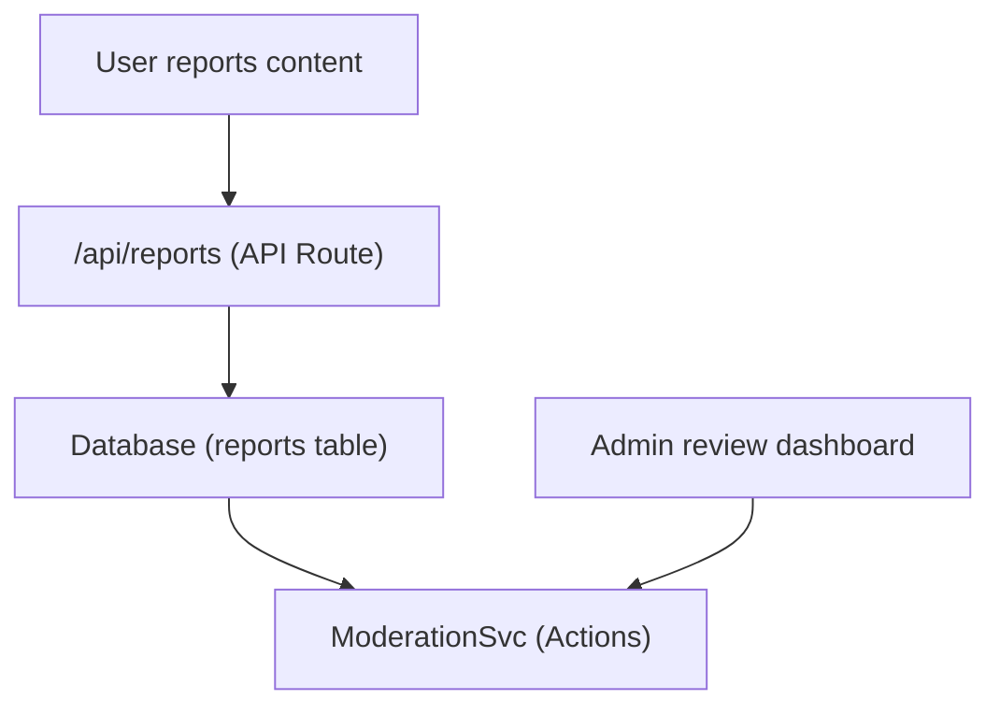

# Rapporti e moderazione dei contenuti

Il modello Ever Works include un sistema di reporting e moderazione dei contenuti che consente agli utenti di contrassegnare contenuti inappropriati e agli amministratori di intraprendere azioni sugli elementi e sui commenti segnalati.

## Architettura



## Tipi di contenuto

Il sistema supporta la segnalazione di due tipi di contenuto:

```typescript
enum ReportContentType {
  ITEM = 'item',
  COMMENT = 'comment',
}
```

##Servizio di moderazione

Situato a `lib/services/moderation.service.ts` , il servizio prevede azioni di moderazione:

### Risoluzione del proprietario dei contenuti

```typescript
async function getContentOwner(
  contentType: ReportContentTypeValues,
  contentId: string
): Promise<ContentOwnerResult>;
// Returns: { success: boolean, userId?: string, error?: string }
```

Risolve l'autore del contenuto segnalato cercando i commenti tramite `getCommentById()` o gli elementi tramite `ItemRepository.findById()` .

### Azioni di moderazione

| Azione | Descrizione | Effetto |
|--------|-----|--------|
| **Rimuovi contenuto** | Elimina l'elemento segnalato o il commento | Contenuto rimosso, cronologia registrata |
| **Avvisare l'utente** | Aumenta il conteggio degli avvisi | Contatore avvisi incrementato |
| **Sospendi utente** | Sospendere temporaneamente l'account | Accesso all'account limitato |
| **Banna utente** | Escludere permanentemente l'account | Account permanentemente limitato |
| **Ignora segnalazione** | Contrassegna la segnalazione come risolta senza azione | Rapporto chiuso |

### Attuazione dell'azione

Ogni azione crea una voce nella cronologia di moderazione e può attivare notifiche via email:

```typescript
// Example: Remove content
async function removeContent(
  contentType: ReportContentTypeValues,
  contentId: string,
  reportId: string,
  adminId: string
): Promise<ModerationResult>;
```

Il servizio delega a:
- `deleteComment()` -- Per la rimozione dei commenti
- `ItemRepository` -- Per la rimozione degli oggetti
- `createModerationHistory()` -- Per la traccia di controllo
- `incrementWarningCount()` -- Per avvisi per l'utente
- `suspendUserQuery()` / `banUserQuery()` -- Per le azioni sull'account
- `EmailNotificationService` -- Per le e-mail di notifica dell'utente

## Gancio amministratore

```typescript
import { useAdminReports } from '@/hooks/use-admin-reports';

const {
  reports,           // Report[]
  total, page, totalPages,
  isLoading, isSubmitting,
  resolveReport,     // (id, action, reason?) => Promise<boolean>
  dismissReport,     // (id, reason?) => Promise<boolean>
  deleteReport,      // (id) => Promise<boolean>
  refetch, refreshData,
} = useAdminReports({ page: 1, limit: 10 });
```

## Flusso di lavoro di moderazione

1. **Contenuto dei report utente**: seleziona un motivo e lo invia tramite l'API del report
2. **Notifica amministratore** -- `NotificationService.createItemReportedNotification()` o `createCommentReportedNotification()` avvisa gli amministratori
3. **Revisioni amministratore**: visualizza i dettagli del rapporto nella dashboard di amministrazione
4. **L'amministratore interviene** – Scegli tra: rimuovere contenuto, avvisare l'utente, sospendere, escludere o ignorare
5. **Cronologia registrata** -- `createModerationHistory()` registra l'azione con ID amministratore, timestamp e motivo
6. **Notifica utente**: notifica via email inviata al proprietario del contenuto in merito all'azione intrapresa

## Enum. azioni di moderazione

```typescript
enum ModerationAction {
  REMOVE_CONTENT = 'remove_content',
  WARN_USER = 'warn_user',
  SUSPEND_USER = 'suspend_user',
  BAN_USER = 'ban_user',
  DISMISS = 'dismiss',
}
```

## Endpoint API

| Metodo | Punto finale | Descrizione |
|--------|----------|-------------|
| POST | `/api/reports` | Invia una nuova segnalazione |
| OTTIENI | `/api/admin/reports` | Elenco rapporti (admin, impaginati) |
| POST | `/api/admin/reports/:id/resolve` | Risolvere un report con l'azione |
| POST | `/api/admin/reports/:id/dismiss` | Ignorare una segnalazione |
| ELIMINA | `/api/admin/reports/:id` | Elimina un rapporto |

## Documentazione correlata

- [Sistema di notifica](./notifications.md) - Come vengono consegnate le notifiche dei rapporti
- [Votazioni e commenti](./voting-comments.md) -- Sistema di commenti che può essere segnalato
