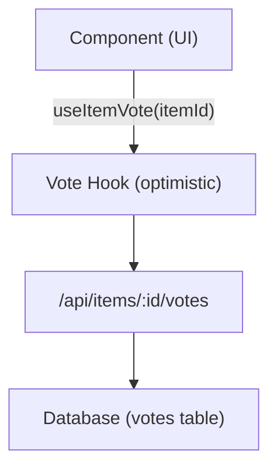

# Sistema di votazione e commenti

Il modello Ever Works include un sistema completo di voto e commenti che consente agli utenti di votare a favore o a sfavore degli elementi, lasciare recensioni con valutazioni a stelle e interagire con i contenuti. Entrambi i sistemi utilizzano aggiornamenti ottimistici per un feedback immediato dell'interfaccia utente.

## Sistema di voto

### Architettura

Il sistema di voto utilizza un modello di voto per elemento in cui ogni utente autenticato può esprimere un voto (a favore o contro) per elemento. Il sistema tiene traccia del conteggio dei voti netti e dei voti dei singoli utenti.



### usa il gancio VotoArticolo

```typescript
import { useItemVote } from '@/hooks/use-item-vote';

const {
  voteCount,       // number -- net vote count
  userVote,        // 'up' | 'down' | null
  isLoading,       // boolean
  handleVote,      // (type: 'up' | 'down') => void
  refreshVotes,    // () => void
} = useItemVote(itemId);
```

### Comportamento di voto

| Stato attuale | Azione | Risultato |
|--------------|--------|--------|
| Nessun voto | Fare clic su | Voto positivo (+1) |
| Nessun voto | Fare clic su Giù | Voto negativo (-1) |
| Votato positivamente | Fare clic su | Rimuovi voto (attiva/disattiva) |
| Votato positivamente | Fare clic su Giù | Passa al voto negativo (-2 netto) |
| Sottovotato | Fare clic su Giù | Rimuovi voto (attiva/disattiva) |
| Sottovotato | Fare clic su | Passa al voto positivo (+2 netto) |

### Aggiornamenti ottimistici

Il hook del voto implementa aggiornamenti ottimistici con rollback:

1. **onMutate** -- Annulla query in uscita, istantanea dello stato corrente, applica aggiornamento ottimistico
2. **onSuccess** -- Sostituisci i dati ottimistici con la risposta del server
3. **onError** -- Torna all'istantanea, mostra il toast degli errori

### Autenticazione

Gli utenti non autenticati che tentano di votare vedono una modalità di accesso tramite `useLoginModal` :

```typescript
if (!user) {
  loginModal.onOpen('Please sign in to vote on this item');
  throw new Error('Authentication required');
}
```

### Gestione della cache

L'hook di utilità `useVoteCache` fornisce operazioni di cache tra componenti:

```typescript
import { useVoteCache } from '@/hooks/use-item-vote';

const {
  invalidateAllVotes,     // () => void
  invalidateItemVotes,    // (itemId: string) => void
  clearVoteCache,         // () => void
  prefetchItemVotes,      // (itemId: string) => Promise<void>
} = useVoteCache();
```

## Sistema di commenti

### Architettura

I commenti supportano operazioni CRUD complete con valutazioni a stelle, moderazione e aggiornamenti in tempo reale.

### usaCommenti Hook

```typescript
import { useComments } from '@/hooks/use-comments';

const {
  comments,              // CommentWithUser[]
  isPending,
  createComment,         // ({ content, itemId, rating }) => Promise
  isCreating,
  updateComment,         // ({ commentId, content?, rating? }) => Promise
  isUpdating,
  deleteComment,         // (commentId) => Promise
  isDeleting,
  rateComment,           // ({ commentId, rating }) => void
  isRatingComment,
  updateCommentRating,   // ({ commentId, rating }) => void
  isUpdatingRating,
  commentRating,         // number
  isLoadingRating,
} = useComments(itemId);
```

### Modello dati commento

Ogni commento include:
- `id` -- Identificatore univoco
- `content` -- Testo del commento
- `rating` -- Valutazione in stelle opzionale (1-5)
- `userId` -- Riferimento all'autore
- `itemId` -- Elemento associato
- `user` -- Dati utente popolati (nome, email, immagine)
- `createdAt` / `updatedAt` -- Timestamp

### Integrazione della valutazione

Commenti e valutazioni sono strettamente integrati:
- La creazione di un commento con una valutazione aggiorna la valutazione complessiva dell'elemento
- La modifica della valutazione di un commento attiva un ricalcolo
- La query `["item-rating", itemId]` viene recuperata dopo qualsiasi mutazione del commento

### Eventi tra componenti

Il sistema di commenti invia eventi DOM personalizzati per il coordinamento tra componenti:

```typescript
const COMMENT_MUTATION_EVENT = "comment:mutated";
window.dispatchEvent(new CustomEvent(COMMENT_MUTATION_EVENT, { detail: comment }));
```

Altri componenti possono ascoltare le modifiche ai commenti senza l'accoppiamento diretto di React Query.

### Moderazione amministrativa

L'hook `useAdminComments` fornisce la gestione dei commenti a livello di amministratore:

```typescript
import { useAdminComments } from '@/hooks/use-admin-comments';

const {
  comments,         // AdminCommentItem[]
  totalComments,
  totalPages,
  isDeleting,       // string | null (ID of comment being deleted)
  deleteComment,    // (id: string) => Promise<boolean>
} = useAdminComments({ page: 1, limit: 10, search: '' });
```

### Endpoint API

| Metodo | Punto finale | Descrizione |
|--------|----------|-------------|
| OTTIENI | `/api/items/:id/comments` | Recupera commenti per un elemento |
| POST | `/api/items/:id/comments` | Crea un nuovo commento |
| METTERE | `/api/items/:id/comments/:commentId` | Aggiorna un commento |
| ELIMINA | `/api/items/:id/comments/:commentId` | Elimina un commento |
| POST | `/api/items/:id/comments/rating` | Vota un commento |
| METTERE | `/api/items/:id/comments/rating` | Aggiorna la valutazione dei commenti |
| OTTIENI | `/api/items/:id/comments/rating` | Ottieni una valutazione complessiva |

## Integrazione dei flag di funzionalità

Sia la votazione che i commenti rispettano i flag di funzionalità:

```typescript
const flags = getFeatureFlags();
// flags.ratings -- Controls star rating display
// flags.comments -- Controls comment section visibility
```

Quando il database non è configurato (manca `DATABASE_URL` ), queste funzionalità vengono automaticamente disabilitate.
