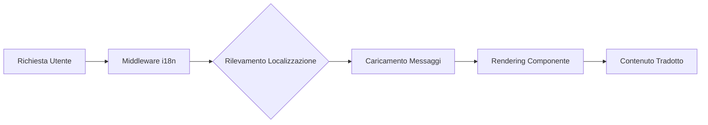

# Panoramica Internazionalizzazione

Ever Works è costruito con l'internazionalizzazione in mente, supportando più lingue tramite `next-intl`.

## 🌍 Lingue Supportate

Il template include il supporto integrato per:

- 🇬🇧 **Inglese** (en) – Lingua predefinita
- 🇫🇷 **Francese** (fr)
- 🇪🇸 **Spagnolo** (es)
- 🇩🇪 **Tedesco** (de)
- 🇨🇳 **Cinese** (zh)
- 🇸🇦 **Arabo** (ar)
- 🇧🇬 **Bulgaro** (bg)
- 🇳🇱 **Olandese** (nl)
- 🇮🇱 **Ebraico** (he)
- 🇮🇹 **Italiano** (it)
- 🇵🇱 **Polacco** (pl)
- 🇵🇹 **Portoghese** (pt)
- 🇷🇺 **Russo** (ru)

## Come Funziona

### Localizzazione Basata su URL

Ever Works utilizza il rilevamento della localizzazione basato su URL:

```
https://yoursite.com/en/about    → Inglese
https://yoursite.com/fr/about    → Francese
https://yoursite.com/es/about    → Spagnolo
```

### Rilevamento Automatico della Lingua

Il sistema rileva automaticamente:
1. La lingua del browser dell'utente
2. Reindirizza alla localizzazione appropriata
3. Ricorda la preferenza linguistica dell'utente
4. Ritorna alla lingua predefinita (Inglese)

## Architettura delle Traduzioni



## File di Traduzione

Le traduzioni sono memorizzate in file JSON:

```
messages/
├── en.json    # Inglese
├── fr.json    # Francese
├── es.json    # Spagnolo
├── de.json    # Tedesco
├── zh.json    # Cinese
└── ar.json    # Arabo
```

## Esempio Rapido

```typescript
import { useTranslations } from 'next-intl';

export function MyComponent() {
  const t = useTranslations('common');

  return (
    <div>
      <h1>{t('welcome')}</h1>
      <p>{t('description')}</p>
    </div>
  );
}
```

## Funzionalità

### ✅ Copertura Completa delle Traduzioni
- Componenti UI
- Etichette form e messaggi di validazione
- Template email
- Messaggi di errore
- Metadati SEO

### ✅ Supporto RTL
- Layout RTL automatico per arabo ed ebraico
- Elementi UI speculari
- Allineamento testo corretto

### ✅ Formattazione Data e Numeri
- Formati data specifici per localizzazione
- Formattazione valuta
- Formattazione numeri

### ✅ Pluralizzazione
- Forme plurali automatiche
- Regole specifiche per lingua

## Prossimi Passi

- [Guida alla Traduzione →](./translation-guide) – Scopri come aggiungere e gestire le traduzioni
- [Per Iniziare](/getting-started) – Configura il tuo progetto
- [Personalizzazione](/guides/customization) – Personalizza il tuo sito

## Hai Bisogno di Aiuto?

Consulta la nostra [pagina di supporto](/advanced-guide/support) per assistenza con l'internazionalizzazione.
