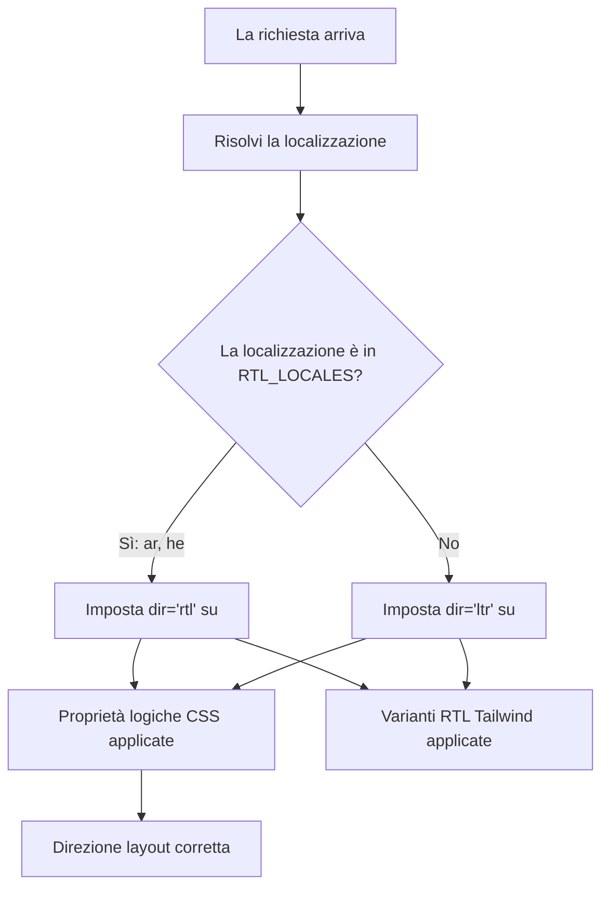

# Supporto RTL (da Destra a Sinistra)

Il template supporta completamente le lingue da destra a sinistra (RTL) come l'arabo e l'ebraico. Questa pagina documenta come funziona il rilevamento RTL, come viene applicata la direzione del layout e come i componenti si adattano ai contesti RTL.

## Panoramica dell'Architettura



## File Sorgente

| File | Scopo |
|------|---------|
| `lib/constants.ts` | Definizione dell'elenco delle localizzazioni RTL |
| `app/layout.tsx` | Layout radice con attributo `dir` |
| `components/language-switcher.tsx` | Mappa delle lingue con metadati `isRTL` |

## Configurazione Localizzazione RTL

```typescript
export const RTL_LOCALES: readonly Locale[] = ['ar', 'he'] as const;
```

## Come Viene Applicata la Direzione

### Rilevamento nel Layout Radice

```typescript
export default async function RootLayout({ children }) {
  const locale = await getLocale();
  const dir = RTL_LOCALES.includes(locale as Locale) ? 'rtl' : 'ltr';

  return (
    <html lang={locale} dir={dir} suppressHydrationWarning>
      <body className={`${getFontClassNames(locale)} antialiased`}>
        {children}
      </body>
    </html>
  );
}
```

## Strategie CSS per RTL

### 1. Proprietà Logiche CSS

| Proprietà fisica | Proprietà logica | Significato LTR | Significato RTL |
|-------------------|-----------------|-------------|-------------|
| `margin-left` | `margin-inline-start` | Margine sinistro | Margine destro |
| `margin-right` | `margin-inline-end` | Margine destro | Margine sinistro |
| `padding-left` | `padding-inline-start` | Padding sinistro | Padding destro |
| `text-align: left` | `text-align: start` | Allineato a sinistra | Allineato a destra |
| `left` | `inset-inline-start` | Posizione sinistra | Posizione destra |

### 2. Supporto RTL Tailwind CSS

```html
<div class="ml-4 rtl:mr-4 rtl:ml-0">
  Contenuto con margine direzionale
</div>

<svg class="rtl:rotate-180">
  <path d="M1 9 4-4-4-4" />
</svg>
```

### 3. Utilità Logiche Tailwind

```html
<div class="ps-4">  <!-- padding-inline-start: 1rem -->
<div class="pe-4">  <!-- padding-inline-end: 1rem -->
<div class="ms-4">  <!-- margin-inline-start: 1rem -->
<div class="me-4">  <!-- margin-inline-end: 1rem -->
```

## Problemi RTL Comuni

| Problema | Causa | Soluzione |
|-------|-------|-----|
| Allineamento testo errato | Uso di `text-left` invece di `text-start` | Usare proprietà logiche |
| Icone non speculari | `rtl:rotate-180` mancante su icone direzionali | Aggiungere variante RTL |
| Margine sul lato sbagliato | Uso di `ml-*` invece di `ms-*` | Usare utilità logiche Tailwind |

## Aggiungere una Nuova Lingua RTL

1. **Aggiungere la localizzazione** a `LOCALES` in `lib/constants.ts`
2. **Aggiungere a `RTL_LOCALES`**
3. **Creare il file dei messaggi** in `messages/ur.json`
4. **Aggiungere la voce nella mappa delle lingue** in `components/language-switcher.tsx`
5. **Aggiungere la SVG della bandiera** in `public/flags/ur.svg`
6. **Testare accuratamente il layout** in modalità RTL

## Best Practice

1. **Preferire le proprietà logiche CSS** rispetto a quelle fisiche
2. **Usare `dir="rtl"` su `<html>`** (già gestito dal layout radice)
3. **Testare con contenuto arabo/ebraico reale**, non solo testo inglese in modalità RTL
4. **Non speculare immagini decorative** o loghi del brand
