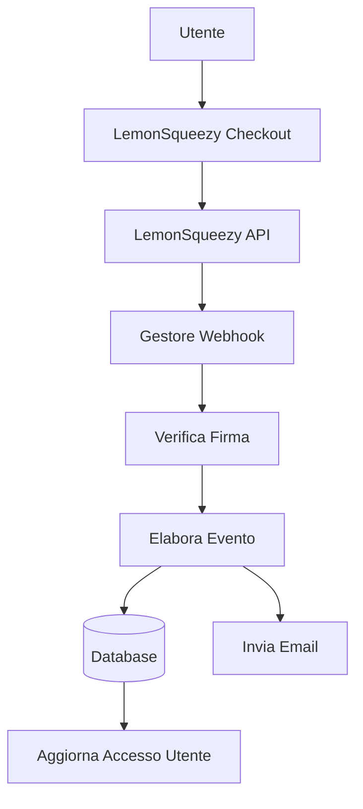

# Configurazione LemonSqueezy

Questa guida spiega come configurare LemonSqueezy come provider di pagamento nell'applicazione Ever Works.

## Panoramica

LemonSqueezy è una piattaforma merchant of record che semplifica:

- 💰 Pagamenti globali con conformità fiscale automatica
- 🌍 Supporto per 135+ paesi
- 📊 Prevenzione delle frodi integrata
- 🔄 Gestione degli abbonamenti
- 💳 Più metodi di pagamento
- 📧 Ricevute email automatiche

:::tip Perché LemonSqueezy?
LemonSqueezy agisce come merchant of record, gestendo automaticamente tutta la conformità fiscale, IVA e imposte sulle vendite. Questo significa che non è necessario registrarsi per le tasse in paesi diversi.
:::

## Variabili d'ambiente richieste

Aggiungere queste variabili al file `.env.local`:

```env
# Configurazione LemonSqueezy
LEMONSQUEEZY_API_KEY=your_api_key_here
LEMONSQUEEZY_WEBHOOK_SECRET=your_webhook_secret_here
LEMONSQUEEZY_STORE_ID=your_store_id_here

# ID prodotto/variante (opzionale)
NEXT_PUBLIC_LEMONSQUEEZY_PRO_VARIANT_ID=variant_id_here
NEXT_PUBLIC_LEMONSQUEEZY_SPONSOR_VARIANT_ID=variant_id_here
```

## Configurazione Dashboard LemonSqueezy

### Passo 1: Creare il negozio

1. Registrarsi su [LemonSqueezy](https://lemonsqueezy.com)
2. Creare un nuovo negozio
3. Completare le impostazioni del negozio (nome, valuta, ecc.)
4. Copiare l'**ID negozio** dall'URL o dalle impostazioni

### Passo 2: Creare i prodotti

1. Andare su **Prodotti** → **Nuovo Prodotto**
2. Creare i livelli di prezzo:

| Prodotto | Prezzo | Tipo | Descrizione |
|----------|--------|------|-------------|
| **Piano Pro** | 10 $/mese | Abbonamento | Funzionalità avanzate |
| **Piano Sponsor** | 20 $ | Una tantum | Supporto premium |

3. Per ogni prodotto, creare **Varianti** con prezzi specifici
4. Copiare l'**ID variante** per ogni opzione di prezzo

### Passo 3: Ottenere la chiave API

1. Andare su **Impostazioni** → **API**
2. Creare una nuova chiave API
3. Copiare la chiave API (inizia con `ls_`)
4. Aggiungerla al file `.env.local` come `LEMONSQUEEZY_API_KEY`

### Passo 4: Configurare i webhook

1. Andare su **Impostazioni** → **Webhook**
2. Fare clic su **Crea webhook**
3. Configurare il webhook:
   - **URL**: `https://tuodominio.com/api/lemonsqueezy/webhook`
   - **Eventi**: Selezionare tutti gli eventi di abbonamento e ordine
   - **Segreto**: Generare una chiave segreta

4. Copiare il **Segreto webhook** e aggiungerlo al file `.env.local`

#### Eventi consigliati

Selezionare questi eventi nella configurazione webhook:

- ✅ `subscription_created` - Nuovo abbonamento
- ✅ `subscription_updated` - Modifiche all'abbonamento
- ✅ `subscription_cancelled` - Cancellazione
- ✅ `subscription_payment_success` - Pagamento riuscito
- ✅ `subscription_payment_failed` - Pagamento fallito
- ✅ `subscription_trial_will_end` - Fine del periodo di prova
- ✅ `order_created` - Acquisto una tantum
- ✅ `order_refunded` - Rimborso elaborato

## Endpoint Webhook

Il webhook è disponibile su: `/api/lemonsqueezy/webhook`

### Mappatura degli eventi supportati

| Evento LemonSqueezy | Evento interno | Descrizione |
|--------------------|----------------|-------------|
| `subscription_created` | `SUBSCRIPTION_CREATED` | Nuovo abbonamento creato |
| `subscription_updated` | `SUBSCRIPTION_UPDATED` | Abbonamento aggiornato |
| `subscription_cancelled` | `SUBSCRIPTION_CANCELLED` | Abbonamento cancellato |
| `subscription_payment_success` | `SUBSCRIPTION_PAYMENT_SUCCEEDED` | Pagamento riuscito |
| `subscription_payment_failed` | `SUBSCRIPTION_PAYMENT_FAILED` | Pagamento fallito |
| `subscription_trial_will_end` | `SUBSCRIPTION_TRIAL_ENDING` | Fine periodo di prova imminente |
| `order_created` | `PAYMENT_SUCCEEDED` | Pagamento una tantum |
| `order_refunded` | `REFUND_SUCCEEDED` | Rimborso elaborato |

## Implementazione

### Architettura del sistema di pagamento



### Funzionalità

#### Sicurezza

- ✅ Verifica firma HMAC (SHA-256)
- ✅ Validazione segreto webhook
- ✅ Gestione degli errori completa
- ✅ Registrazione delle richieste

#### Funzionalità

- ✅ Gestione del ciclo di vita degli abbonamenti
- ✅ Elaborazione automatica dei pagamenti
- ✅ Notifiche email
- ✅ Sincronizzazione database
- ✅ Monitoraggio degli errori

## Esempio di utilizzo

### Creare un checkout

```typescript
import { LemonSqueezyProvider } from '@/lib/payment/providers/lemonsqueezy-provider';

const lsProvider = new LemonSqueezyProvider({
  apiKey: process.env.LEMONSQUEEZY_API_KEY!,
  storeId: process.env.LEMONSQUEEZY_STORE_ID!,
});

// Crea sessione di checkout
const checkout = await lsProvider.createCheckout({
  variantId: 'variant_id_here',
  customerId: 'customer_id',
  redirectUrl: 'https://yoursite.com/success',
});

// Reindirizza l'utente a checkout.url
```

## Test

### Modalità test

1. LemonSqueezy fornisce una modalità test per lo sviluppo
2. Utilizzare chiavi API di test (disponibili nel dashboard)
3. Testare i webhook con lo strumento di test webhook di LemonSqueezy

### Test locali

```bash
# Usare uno strumento come ngrok per esporre il server locale
ngrok http 3000

# Aggiornare l'URL webhook nel dashboard LemonSqueezy
https://your-ngrok-url.ngrok.io/api/lemonsqueezy/webhook
```

## Monitoraggio

Tutti gli eventi webhook vengono registrati:

- ✅ **Successo**: `✅ LemonSqueezy [event] handled successfully`
- ❌ **Errori**: `❌ Failed to handle [event]: [error details]`

Controllare i log dell'applicazione per l'attività webhook.

## Risoluzione dei problemi

### Problemi comuni

**Problema**: Errore "No signature provided"

- **Soluzione**: Assicurarsi che LemonSqueezy invii l'header `x-signature`
- Verificare la configurazione webhook nel dashboard LemonSqueezy

**Problema**: Errore "Invalid signature"

- **Soluzione**: Verificare che `LEMONSQUEEZY_WEBHOOK_SECRET` corrisponda al segreto in LemonSqueezy
- Assicurarsi che l'URL webhook sia correttamente configurato

**Problema**: Webhook non riceve eventi

- **Soluzione**: Verificare che l'URL webhook sia accessibile pubblicamente
- Usare ngrok per i test locali
- Controllare i log webhook di LemonSqueezy

## Best practice di sicurezza

1. **Solo HTTPS**: Usare sempre HTTPS per gli endpoint webhook in produzione
2. **Rotazione segreti**: Ruotare regolarmente i segreti webhook
3. **Monitoraggio**: Monitorare i log webhook per attività sospette
4. **Variabili d'ambiente**: Non fare mai commit dei segreti nel controllo di versione
5. **Rate limiting**: Implementare il rate limiting per i webhook di produzione
