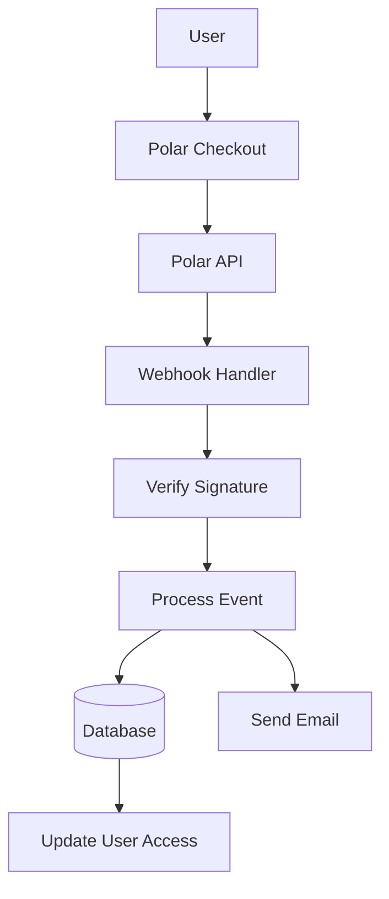

# Configurazione polare

Questa guida spiega come configurare Polar come fornitore di servizi di pagamento nella tua applicazione Ever Works.

## Panoramica

Polar è una moderna piattaforma di pagamento progettata per sviluppatori e creatori che offre:

- 💻 API e documentazione adatte agli sviluppatori
- 🔄 Abbonamento e supporto per il pagamento una tantum
- 🐙 Integrazione GitHub per le sponsorizzazioni
- 💰 Struttura dei prezzi trasparente
- 🔒 Elaborazione sicura dei pagamenti
- 📊 Analisi e reporting integrati

:::tip Perché Polar?
Polar è stato creato appositamente per sviluppatori e progetti open source e offre un'API pulita, documentazione eccellente e integrazione GitHub perfetta per sponsorizzazioni e monetizzazione.
:::

## Variabili d'ambiente richieste

Aggiungi queste variabili al tuo file `.env.local` :

```env
# Polar Configuration
POLAR_API_KEY=your_polar_api_key_here
POLAR_WEBHOOK_SECRET=your_webhook_secret_here
POLAR_APP_URL=https://your-app-url.com

# Product IDs (optional)
NEXT_PUBLIC_POLAR_SUBSCRIPTION_PRODUCT_ID=product_id_here
NEXT_PUBLIC_POLAR_ONETIME_PRODUCT_ID=product_id_here
```

:::attenzione
Non affidare mai le tue chiavi segrete al controllo della versione. Mantieni `.env.local` nel tuo file `.gitignore` .
:::

## Configurazione della dashboard Polar

### Passaggio 1: crea il tuo account

1. Iscriviti a [Polar](https://polar.sh)
2. Completa la configurazione del tuo account
3. Verifica il tuo indirizzo email

### Passaggio 2: crea prodotti

1. Vai a **Prodotti** → **Nuovo prodotto**
2. Crea i tuoi livelli di prezzo:

| Prodotto | Prezzo | Digitare | Descrizione |
|---------|-------|------|-------------|
| **Piano Pro** | $ 10/mese | Abbonamento | Funzionalità avanzate |
| **Piano di sponsorizzazione** | $20 | Una volta | Supporto Premium |

3. Configura le impostazioni del prodotto:
   - Imposta i prezzi e il ciclo di fatturazione
   - Aggiungi le descrizioni dei prodotti
   - Configurare i livelli di accesso
4. Copia l'**ID prodotto** per ciascun prodotto

### Passaggio 3: ottieni la chiave API

1. Vai su **Impostazioni** → **Chiavi API**
2. Crea una nuova chiave API
3. Copia la chiave API
4. Aggiungilo al tuo `.env.local` come `POLAR_API_KEY` :::tip
Polar fornisce chiavi separate per lo sviluppo e la produzione. Utilizzare le chiavi di test durante lo sviluppo.
:::

### Passaggio 4: configura i webhook

1. Vai su **Impostazioni** → **Webhook**
2. Fai clic su **Crea webhook**
3. Configura il webhook:
   - **URL**: `https://yourdomain.com/api/polar/webhook` - **Eventi**: seleziona tutti gli eventi a pagamento e in abbonamento
   - **Segreto**: genera una chiave segreta

4. Copia il **Segreto del Webhook** e aggiungilo al tuo `.env.local` #### Eventi consigliati

Seleziona questi eventi nella configurazione del webhook:

- ✅ `payment.succeeded` - Pagamento andato a buon fine
- ✅ `payment.failed` - Pagamento non riuscito
- ✅ `subscription.created` - Nuovo abbonamento
- ✅ `subscription.updated` - Cambiamenti nell'abbonamento
- ✅ `subscription.cancelled` - Cancellazione
- ✅ `subscription.trial_will_end` - Fine della prova
- ✅ `refund.created` - Rimborso elaborato

## Architettura del sistema di pagamento



### Fornitore Polar

Il fornitore Polar ( `lib/payment/lib/providers/polar-provider.ts` ) implementa:

- ✅Gestione del cliente
- ✅Gestione del prodotto e dei prezzi
- ✅ Ciclo di vita dell'abbonamento
- ✅ Elaborazione dei pagamenti
- ✅Gestione dei webhook
- ✅Supporto per il rimborso

### Percorsi API

Sono disponibili i seguenti percorsi API:

| Itinerario | Metodo | Descrizione |
|-------|--------|-----|
| `/api/polar/webhook` | POST | Gestire i webhook Polar |
| `/api/polar/subscription` | POST | Crea abbonamento |
| `/api/polar/subscription` | METTERE | Aggiorna abbonamento |
| `/api/polar/subscription` | ELIMINA | Annulla abbonamento |
| `/api/polar/checkout` | POST | Crea sessione di pagamento |
| `/api/polar/payment` | OTTIENI | Verifica lo stato del pagamento |

### Componenti dell'interfaccia utente

Il sistema utilizza i componenti di pagamento di Polar:

- `PolarCheckoutButton` - Componente pulsante di pagamento
- `PolarPaymentForm` - Modulo di pagamento con convalida
- Design reattivo per dispositivi mobili e desktop
- Supporto per più metodi di pagamento

## Esempi di utilizzo

### Crea un abbonamento

```typescript
import { PolarProvider } from '@/lib/payment/providers/polar-provider';

const configs = createProviderConfigs({
  apiKey: process.env.POLAR_API_KEY!,
  webhookSecret: process.env.POLAR_WEBHOOK_SECRET!,
  options: {
    appUrl: process.env.POLAR_APP_URL!
  }
});

const polarProvider = new PolarProvider(configs.polar);

const subscription = await polarProvider.createSubscription({
  customerId: 'customer_id',
  productId: 'product_id',
  paymentMethodId: 'payment_method_id',
  trialPeriodDays: 7
});
```

### Crea una sessione di pagamento

```typescript
const checkout = await polarProvider.createCheckout({
  productId: 'product_id_here',
  customerId: 'customer_id',
  successUrl: 'https://yoursite.com/success',
  cancelUrl: 'https://yoursite.com/cancel'
});

// Redirect user to checkout.url
```

### Utilizza il componente di pagamento

```tsx
import { PolarCheckoutButton } from '@/lib/payment';

function PaymentPage() {
  return (
    <PolarCheckoutButton
      productId="product_id_here"
      amount={1000} // 10.00 USD in cents
      currency="usd"
      isSubscription={true}
      onSuccess={(paymentId) => {
        console.log('Payment succeeded:', paymentId);
        // Redirect to success page or update UI
      }}
      onError={(error) => {
        console.error('Payment error:', error);
        // Show error message to user
      }}
    />
  );
}
```

## Testare la tua integrazione

### Modalità di prova

1. **Utilizza le chiavi API di prova** (disponibile nel pannello Polar)
2. **Utilizza metodi di pagamento di prova**:
   - Schede di test fornite nella dashboard Polar
   - Modalità di test per tutti i flussi di pagamento

3. **Testa i webhook localmente** con uno strumento come ngrok:

   "bash."
   ngrok http 3000
   ```

   Aggiorna l'URL del webhook nella dashboard Polar al tuo URL ngrok.

### Test dei webhook

```bash
# Use ngrok to expose your local server
ngrok http 3000

# Update webhook URL in Polar dashboard
https://your-ngrok-url.ngrok.io/api/polar/webhook

# Trigger test events from Polar dashboard
```

## Gestione degli errori

Il sistema gestisce automaticamente gli errori comuni:

| Tipo di errore | Manipolazione |
|------------|----------|
| Pagamento rifiutato | Messaggio di errore intuitivo |
| Problemi di rete | Logica di ripetizione automatica |
| Errori del webhook | Registrato per la revisione manuale |
| Errori di convalida | Evidenziazione del campo modulo |
| Errori di iscrizione | Cancella messaggi di errore |

## Migliori pratiche di sicurezza

1. **Chiavi API**:
   - Non esporre mai le chiavi segrete nel codice lato client
   - Utilizzare variabili di ambiente
   - Ruotare le chiavi regolarmente

2. **Verifica del webhook**:
   - Verifica sempre le firme dei webhook
   - Convalidare i dati degli eventi prima dell'elaborazione
   - Utilizza HTTPS per tutti gli endpoint webhook

3. **Dati di pagamento**:
   - Non memorizzare mai i dettagli di pagamento
   - Utilizza l'elaborazione sicura dei pagamenti di Polar
   - Implementare un'autenticazione corretta

4. **Sessioni utente**:
   - Verificare l'autenticazione dell'utente
   - Convalidare le autorizzazioni dell'utente
   - Registra tutte le attività di pagamento

## Integrazione con GitHub

Polar offre un'integrazione perfetta con GitHub:

- **Sponsorizzazioni GitHub**: collega Polar con gli sponsor GitHub
- **Accesso al repository**: concedi l'accesso in base agli abbonamenti
- **Supporto per l'organizzazione**: gestisci gli abbonamenti dei team
- **Accesso automatizzato**: gestione automatica degli accessi

### Configura l'integrazione GitHub

1. Vai a **Impostazioni** → **Integrazioni** → **GitHub**
2. Collega il tuo account GitHub
3. Configurare le regole di accesso al repository
4. Configurare la gestione automatizzata degli accessi

## Dipendenze

Pacchetti richiesti (già inclusi in Ever Works):

```json
{
  "@polar-sh/sdk": "^1.0.0"
}
```

## Risoluzione dei problemi

### Problemi comuni

**Problema**: il webhook non riceve eventi

- **Soluzione**: verificare che l'URL del webhook sia accessibile pubblicamente
- Usa ngrok per i test locali
- Verificare che il segreto del webhook sia corretto

**Problema**: il pagamento non riesce in modo silenzioso

- **Soluzione**: controlla la console del browser per eventuali errori
- Verificare che le chiavi API siano corrette
- Controlla i registri della dashboard Polar

**Problema**: abbonamento non aggiornato

- **Soluzione**: verificare che gli eventi webhook siano configurati
- Controllare i log del gestore webhook
- Assicurarsi che gli aggiornamenti del database funzionino

**Problema**: l'integrazione di GitHub non funziona

- **Soluzione**: verificare la connessione GitHub nel pannello Polar
- Controlla le impostazioni di accesso al repository
- Assicurarsi che vengano concesse le autorizzazioni adeguate

## Confronto: Polar e altri fornitori

| Caratteristica | Polare | Striscia | LemonSqueezy |
|---------|-------|--------|------|
| **Focus sugli sviluppatori** | ✅ Eccellente | ⚠️ Bravo | ⚠️ Bravo |
| **Integrazione GitHub** | ✅Nativo | ❌No | ❌No |
| **Amichevole Open Source** | ✅ Sì | ⚠️ Limitato | ⚠️ Limitato |
| **Complessità di configurazione** | ✅ Semplice | ⚠️ Moderato | ✅ Semplice |
| **Qualità API** | ✅ Eccellente | ✅ Eccellente | ⚠️ Bravo |
| **Conformità fiscale** | ⚠️ Manuale | ⚠️ Manuale | ✅ Automatico |
| **Ideale per** | Sviluppatori, OSS | Alto volume | Vendite globali |

## Passaggi successivi

- [Configurazione Stripe](./stripe) - Fornitore di pagamenti alternativo
- [Configurazione LemonSqueezy](./lemonsqueezy) - Fornitore di pagamenti alternativo
- [Panoramica pagamenti](/pagamento) - Confronta i fornitori di servizi di pagamento
- [Variabili d'ambiente](/deployment/environment-variables) - Completa la configurazione dell'ambiente
- [Distribuzione](/deployment) - Distribuisci la tua integrazione di pagamento

## Risorse

- [Documentazione Polar](https://docs.polar.sh/)
- [Riferimento API](https://docs.polar.sh/api)
- [Guida ai webhook](https://docs.polar.sh/webhooks)
- [Integrazione GitHub](https://docs.polar.sh/integrations/github)

##Supporto

Hai bisogno di aiuto con l'integrazione Polar? Controlla la nostra [pagina di supporto](/advanced-guide/support) o unisciti alla nostra community.
