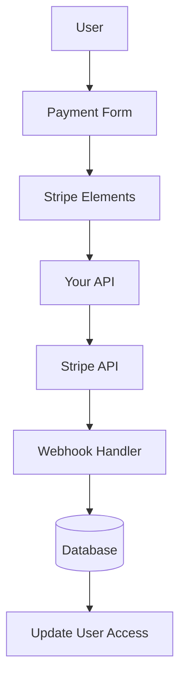

# Configurazione delle strisce

Questa guida spiega come configurare Stripe nella tua applicazione Ever Works con un sistema completo di abbonamento e pagamento.

## Panoramica

Stripe è una piattaforma di pagamento completa che supporta:

- 💳 Pagamenti una tantum
- 🔄 Abbonamenti ricorrenti
- 🌍 Diversi metodi di pagamento (carte, Apple Pay, Google Pay)
- 💰 Valute multiple
- 📊 Analisi e reporting avanzati

## Variabili d'ambiente richieste

Aggiungi queste variabili al tuo file `.env.local` :

```bash
# Stripe Configuration
STRIPE_SECRET_KEY=sk_test_your_stripe_secret_key_here
STRIPE_WEBHOOK_SECRET=whsec_your_stripe_webhook_secret_here
NEXT_PUBLIC_STRIPE_PUBLISHABLE_KEY=pk_test_your_stripe_publishable_key_here

# Stripe Price IDs
NEXT_PUBLIC_STRIPE_SUBSCRIPTION_PRICE_ID=price_subscription_id_here
NEXT_PUBLIC_STRIPE_ONETIME_PRICE_ID=price_onetime_id_here
NEXT_PUBLIC_STRIPE_FREE_PRICE_ID=price_free_id_here

# Product Pricing (for display purposes)
NEXT_PUBLIC_PRODUCT_PRICE_PRO=10.00
NEXT_PUBLIC_PRODUCT_PRICE_SPONSOR=20.00
NEXT_PUBLIC_PRODUCT_PRICE_FREE=0.00
```

:::attenzione
Non affidare mai le tue chiavi segrete al controllo della versione. Mantieni `.env.local` nel tuo file `.gitignore` .
:::

## Configurazione della dashboard di Stripe

### Passaggio 1: crea prodotti

Nella tua [Dashboard di Stripe](https://dashboard.stripe.com/):

1. Vai a **Prodotti** → **Aggiungi prodotto**
2. Crea i seguenti prodotti:

| Prodotto | Prezzo | Digitare | Descrizione |
|---------|-------|------|-------------|
| **Piano gratuito** | $ 0,00 | Una volta | Caratteristiche di base |
| **Piano Pro** | $ 10,00 | Abbonamento mensile | Funzionalità avanzate |
| **Piano di sponsorizzazione** | $ 20,00 | Una volta | Supporto Premium |

3. Copia l'**ID prezzo** per ciascun prodotto (inizia con `price_` )

### Passaggio 2: configura i webhook

I webhook consentono a Stripe di notificare alla tua applicazione gli eventi di pagamento.

1. Vai a **Sviluppatori** → **Webhook** → **Aggiungi endpoint**
2. Imposta l'URL dell'endpoint:
   - Sviluppo: `http://localhost:3000/api/stripe/webhook` - Produzione: `https://your-domain.com/api/stripe/webhook` 3. Seleziona gli eventi da ascoltare:
   - `payment_intent.succeeded` - `payment_intent.payment_failed` - `customer.subscription.created` - `customer.subscription.updated` - `customer.subscription.deleted` - `customer.subscription.trial_will_end` - `invoice.payment_succeeded` - `invoice.payment_failed` 4. Copia il **Segreto di firma** (inizia con `whsec_` )

### Passaggio 3: recupera le chiavi API

Nella dashboard di Stripe:

1. **Chiave segreta**: **Sviluppatori** → **Chiavi API** → **Chiave segreta** (inizia con `sk_` )
2. **Chiave pubblicabile**: **Sviluppatori** → **Chiavi API** → **Chiave pubblicabile** (inizia con `pk_` )
3. **Segreto webhook**: **Sviluppatori** → **Webhook** → Seleziona il tuo webhook → **Segreto di firma**

:::tip
Utilizza i tasti **modalità test** durante lo sviluppo (iniziano con `sk_test_` e `pk_test_` ). Passa ai tasti **modalità live** per la produzione.
:::

## Architettura del sistema di pagamento



### Fornitore di strisce

Il provider Stripe ( `lib/payment/lib/providers/stripe-provider.ts` ) implementa:

- ✅Gestione del cliente
- ✅ Creazione dell'intento di pagamento
- ✅Gestione degli abbonamenti
- ✅Gestione dei webhook
- ✅Supporto per l'impostazione dell'intento
- ✅Rimborsi e cancellazioni

### Percorsi API

Sono disponibili i seguenti percorsi API:

| Itinerario | Metodo | Descrizione |
|-------|--------|-----|
| `/api/stripe/webhook` | POST | Maniglia webhook Stripe |
| `/api/stripe/subscription` | POST | Crea abbonamento |
| `/api/stripe/subscription` | METTERE | Aggiorna abbonamento |
| `/api/stripe/subscription` | ELIMINA | Annulla abbonamento |
| `/api/stripe/payment-intent` | POST | Crea intento di pagamento |
| `/api/stripe/payment-intent` | OTTIENI | Verifica pagamento |
| `/api/stripe/setup-intent` | POST | Imposta il metodo di pagamento |

### Componenti dell'interfaccia utente

Il sistema utilizza Stripe Elements per moduli di pagamento sicuri:

- `StripeElementsWrapper` - Componente principale dell'involucro
- `StripePaymentForm` - Modulo di pagamento con convalida
- Supporto per Apple Pay e Google Pay
- Design reattivo per dispositivi mobili e desktop

## Esempi di utilizzo

### Crea un abbonamento

```typescript
import { StripeProvider } from '@/lib/payment/providers/stripe-provider';

const configs = createProviderConfigs({
  apiKey: process.env.STRIPE_SECRET_KEY!,
  webhookSecret: process.env.STRIPE_WEBHOOK_SECRET!,
  options: {
    publishableKey: process.env.NEXT_PUBLIC_STRIPE_PUBLISHABLE_KEY!,
    apiVersion: '2023-10-16'
  }
});

const stripeProvider = new StripeProvider(configs.stripe);

const subscription = await stripeProvider.createSubscription({
  customerId: 'cus_customer_id',
  priceId: 'price_subscription_id',
  paymentMethodId: 'pm_payment_method_id',
  trialPeriodDays: 7
});
```

### Utilizza il componente di pagamento

```tsx
import { PaymentForm } from '@/lib/payment';

function PaymentPage() {
  return (
    <PaymentForm
      amount={1000} // 10.00 USD in cents
      currency="usd"
      isSubscription={true}
      onSuccess={(paymentId) => {
        console.log('Payment succeeded:', paymentId);
        // Redirect to success page or update UI
      }}
      onError={(error) => {
        console.error('Payment error:', error);
        // Show error message to user
      }}
    />
  );
}
```

## Testare la tua integrazione

### Modalità di prova

1. **Utilizza chiavi API di prova** (inizia con `sk_test_` e `pk_test_` )
2. **Utilizza i numeri delle carte di prova**:
   - Successo: `4242 4242 4242 4242` - Rifiuta: `4000 0000 0000 0002` - 3D sicuro: `4000 0025 0000 3155` 3. **Testa i webhook localmente** con Stripe CLI:

   "bash."
   stripe listen --forward-to localhost:3000/api/stripe/webhook
   ```

### Test dei webhook

```bash
# Install Stripe CLI
brew install stripe/stripe-cli/stripe

# Login to your Stripe account
stripe login

# Forward webhooks to your local server
stripe listen --forward-to localhost:3000/api/stripe/webhook

# Trigger test events
stripe trigger payment_intent.succeeded
```

## Gestione degli errori

Il sistema gestisce automaticamente gli errori comuni:

| Tipo di errore | Manipolazione |
|------------|----------|
| Carta rifiutata | Messaggio di errore intuitivo |
| Fondi insufficienti | Riprova con una carta diversa |
| Problemi di rete | Logica di ripetizione automatica |
| Errori del webhook | Registrato per la revisione manuale |
| Errori di convalida | Evidenziazione del campo modulo |

## Migliori pratiche di sicurezza

1. **Chiavi API**:
   - Non esporre mai le chiavi segrete nel codice lato client
   - Utilizzare variabili di ambiente
   - Ruotare le chiavi regolarmente

2. **Verifica del webhook**:
   - Verifica sempre le firme dei webhook
   - Convalidare i dati degli eventi prima dell'elaborazione

3. **Dati di pagamento**:
   - Non memorizzare mai i numeri delle carte
   - Utilizza la tokenizzazione di Stripe
   - Implementare la conformità PCI

4. **Sessioni utente**:
   - Verificare l'autenticazione dell'utente
   - Convalidare le autorizzazioni dell'utente
   - Registra tutte le attività di pagamento

## Dipendenze

Pacchetti richiesti (già inclusi in Ever Works):

```json
{
  "@stripe/react-stripe-js": "^3.7.0",
  "@stripe/stripe-js": "^7.3.0",
  "stripe": "^18.1.0"
}
```

## Risoluzione dei problemi

### Problemi comuni

**Problema**: il webhook non riceve eventi

- **Soluzione**: verificare che l'URL del webhook sia accessibile pubblicamente
- Utilizza la CLI Stripe per i test locali
- Verificare che il segreto del webhook sia corretto

**Problema**: il pagamento non riesce in modo silenzioso

- **Soluzione**: controlla la console del browser per eventuali errori
- Verificare che le chiavi API siano corrette
- Controlla i registri della dashboard di Stripe

**Problema**: 3D Secure non funziona

- **Soluzione**: assicurati di gestire lo stato `requires_action` - Implementare il flusso di reindirizzamento corretto
- Test con schede di prova 3D Secure

## Passaggi successivi

- [Configurazione LemonSqueezy](./lemonsqueezy) - Fornitore di pagamenti alternativo
- [Variabili d'ambiente](/deployment/environment-variables) - Completa la configurazione dell'ambiente
- [Distribuzione](/deployment) - Distribuisci la tua integrazione di pagamento

## Risorse

- [Documentazione di Stripe](https://stripe.com/docs)
- [Guida all'integrazione di Next.js](https://stripe.com/docs/payments/accept-a-payment?platform=web&ui=elements)
- [Gestione degli abbonamenti](https://stripe.com/docs/billing/subscriptions)
- [Eventi webhook](https://stripe.com/docs/api/events/types)

##Supporto

Hai bisogno di aiuto con l'integrazione di Stripe? Controlla la nostra [pagina di supporto](/advanced-guide/support) o unisciti alla nostra community.
