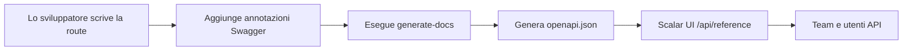

# Formazione sulla Documentazione API

Padroneggia il sistema di documentazione API automatizzato usando annotazioni Swagger e l'interfaccia Scalar UI.

## 🎯 Obiettivi

Al termine di questo modulo, saprai:

- ✅ Comprendere il flusso di lavoro della documentazione API
- ✅ Scrivere annotazioni Swagger corrette
- ✅ Seguire le convenzioni standardizzate dei tag
- ✅ Generare e validare la documentazione
- ✅ Risolvere problemi comuni
- ✅ Mantenere documentazione API di alta qualità

**Tempo stimato**: 2–3 giorni

---

## Perché Questo Sistema?

### Problemi Risolti

- **Documentazione inconsistente**: In precedenza c'erano 8 diversi tag Stripe sparsi tra gli endpoint
- **Sincronizzazione manuale**: Documentazione spesso obsoleta rispetto al codice reale
- **Scarsa esperienza per lo sviluppatore**: Swagger UI di base con funzionalità limitate

### Vantaggi Ottenuti

- **Sincronizzazione automatica**: Documentazione generata direttamente dalle annotazioni nel codice
- **Interfaccia moderna**: Scalar UI con test interattivi e migliore UX
- **Standard coerenti**: Sistema di tag unificato e modelli di documentazione

---

## Architettura del Sistema

### Componenti Principali

1. **Annotazioni Swagger nel codice**
   - Commenti JSDoc con tag `@swagger`
   - Formato specifica OpenAPI 3.0
   - Incorporato direttamente nei file di route

2. **Script generate-docs**
   - Scansiona tutti i file `app/api/**/route.ts`
   - Estrae e valida le annotazioni Swagger
   - Genera `public/openapi.json` unificato

3. **Interfaccia Scalar UI**
   - Interfaccia di documentazione moderna e responsive
   - Capacità di test API interattivo
   - Accessibile su `/api/reference`

### Flusso di Lavoro Completo



---

## Comandi Essenziali

```bash
yarn generate-docs
yarn docs:watch
yarn docs:validate
git status public/openapi.json
```

---

## Sistema di Tag Standardizzato

### Convenzioni dei Tag

#### Operazioni di Amministrazione

```yaml
"Admin - Users"        # Gestione utenti
"Admin - Categories"   # Gestione categorie
"Admin - Items"        # Gestione contenuti
"Admin - Comments"     # Moderazione commenti
```

#### Funzionalità Principali dell'Applicazione

```yaml
"Authentication"       # Accesso, disconnessione, reset password
"Favorites"           # Preferiti utente
"Items & Content"     # Navigazione contenuti pubblici
```

#### Sistemi di Pagamento

```yaml
"Stripe - Core"              # Checkout, Payment Intent
"Stripe - Subscriptions"     # Gestione abbonamenti
"LemonSqueezy - Core"        # Tutte le operazioni LemonSqueezy
```

---

## Best Practice

### Scrivere Descrizioni Efficaci

- Usare verbi d'azione: "Crea", "Aggiorna", "Elimina", "Recupera"
- Essere specifici: "Ottieni profilo utente" non "Ottieni utente"
- Mantenere sotto i 50 caratteri per la leggibilità nell'UI

### Esempi Realistici

```yaml
# ❌ Esempi cattivi
example: "string"

# ✅ Esempi buoni
example: "john.doe@company.com"
example: "user_123abc456def"
```

---

## Checklist dello Sviluppatore

Prima di effettuare il commit delle modifiche API:

- [ ] Annotazione Swagger aggiunta o aggiornata
- [ ] Tag corretto dal sistema standardizzato utilizzato
- [ ] Riepilogo e descrizione significativi presenti
- [ ] Tutti i campi del corpo della richiesta documentati
- [ ] Tutti i codici di risposta documentati
- [ ] `yarn generate-docs` eseguito
- [ ] Documentazione verificata su `/api/reference`
- [ ] `public/openapi.json` incluso nel commit
