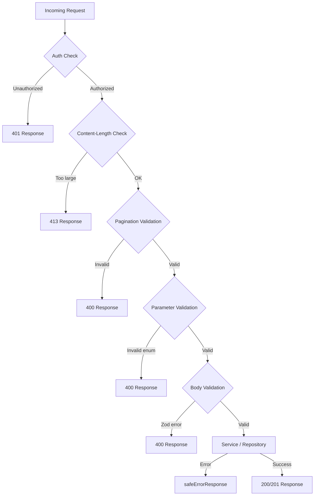

---
id: request-validation
title: "API Request Validation"
sidebar_label: "API Request Validation"
---

# API Aanvraagvalidatie

De template valideert API-aanvragen op meerdere lagen: Zod-schema's voor body/query-validatie, hulpfuncties voor paginering en limieten voor de aanvraaggrootte, en inline type guards voor enum-parameters. Deze pagina documenteert elk validatiemechanisme en hoe ze worden gebruikt in API-routeafhandelaars.

## Validatiearchitectuur



## Zod-validatieschema's

### Locatieschema (`lib/validations/item.ts`)

Alle velden zijn optioneel; de strengheid wordt bepaald door instellingen op formulierniveau:

```typescript
export const locationSchema = z.object({
  address: z.string().optional(),
  city: z.string().optional(),
  state: z.string().optional(),
  country: z.string().optional(),
  postal_code: z.string().optional(),
  latitude: z.number()
    .min(-90, 'Latitude must be between -90 and 90')
    .max(90, 'Latitude must be between -90 and 90')
    .optional(),
  longitude: z.number()
    .min(-180, 'Longitude must be between -180 and 180')
    .max(180, 'Longitude must be between -180 and 180')
    .optional(),
  service_area: z.enum(['local', 'regional', 'national', 'global']).optional(),
  is_remote: z.boolean().optional(),
  geocoded_by: z.enum(['mapbox', 'google']).optional(),
}).optional();
```

### Clientitemschema's (`lib/validations/client-item.ts`)

#### Item aanmaken

```typescript
export const clientCreateItemSchema = z.object({
  name: z.string()
    .min(ITEM_VALIDATION.NAME_MIN_LENGTH)
    .max(ITEM_VALIDATION.NAME_MAX_LENGTH),
  description: z.string()
    .min(ITEM_VALIDATION.DESCRIPTION_MIN_LENGTH)
    .max(ITEM_VALIDATION.DESCRIPTION_MAX_LENGTH),
  source_url: z.string().url('Invalid URL format'),
  category: z.union([
    z.string().min(1, 'Category is required'),
    z.array(z.string().min(1)).min(1),
  ]).optional().nullable(),
  tags: z.array(z.string().min(1)).optional().default([]),
  icon_url: z.string().url().optional().or(z.literal('')),
  location: locationSchema,
});
```

#### Item bijwerken

Gebruikt dezelfde velddefinities waarbij alle velden optioneel zijn:

```typescript
export const clientUpdateItemSchema = z.object({
  name: z.string().min(...).max(...).optional(),
  description: z.string().min(...).max(...).optional(),
  source_url: z.string().url().optional(),
  category: z.union([z.string(), z.array(z.string())]).optional(),
  tags: z.array(z.string()).optional(),
  icon_url: z.string().url().optional().or(z.literal('')),
  location: locationSchema,
});
```

#### Queryparameters voor lijstweergave

Queryparameters gebruiken `.transform()` om stringinvoer naar getypeerde waarden te converteren:

```typescript
export const clientItemsListQuerySchema = z.object({
  page: z.string().optional()
    .transform(val => (val ? parseInt(val, 10) : 1))
    .refine(val => !Number.isNaN(val))
    .refine(val => val >= 1),
  limit: z.string().optional()
    .transform(val => (val ? parseInt(val, 10) : 10))
    .refine(val => !Number.isNaN(val))
    .refine(val => val >= 1 && val <= 100),
  status: z.enum(['all', 'pending', 'approved', 'rejected']).optional().default('all'),
  search: z.string().max(100).optional(),
  sortBy: z.enum(['name', 'updated_at', 'status', 'submitted_at']).optional().default('updated_at'),
  sortOrder: z.enum(['asc', 'desc']).optional().default('desc'),
  deleted: z.string().optional().transform(val => val === 'true'),
});
```

### Wachtwoordschema (`lib/validations/auth.ts`)

```typescript
export const passwordSchema = z.string()
  .min(8, "Password must be at least 8 characters")
  .regex(/[A-Z]/, "Must contain at least one uppercase letter")
  .regex(/[a-z]/, "Must contain at least one lowercase letter")
  .regex(/[0-9]/, "Must contain at least one number")
  .regex(/[^A-Za-z0-9]/, "Must contain at least one special character");
```

### Bedrijfsschema's (`lib/validations/company.ts`)

```typescript
export const createCompanySchema = z.object({
  name: z.string().min(1).max(255),
  website: z.string().url().optional().or(z.literal("")),
  domain: z.string().max(255).optional()
    .transform(val => val?.toLowerCase().trim() || undefined),
  slug: z.string().max(255).optional()
    .transform(val => val?.toLowerCase().trim() || undefined)
    .refine(val => !val || /^[a-z0-9-]+$/.test(val)),
  status: z.enum(["active", "inactive"]).default("active"),
});
```

### Afgeleide typen

Alle schema's exporteren Zod-afgeleide typen naast het schema:

```typescript
export type ClientUpdateItemInput = z.infer<typeof clientUpdateItemSchema>;
export type ClientCreateItemInput = z.infer<typeof clientCreateItemSchema>;
export type CreateCompanyInput = z.infer<typeof createCompanySchema>;
```

## Pagineringsvalidatie (`lib/utils/pagination-validation.ts`)

Een gedeelde hulpfunctie voor het valideren van `page`- en `limit`-queryparameters:

```typescript
export function validatePaginationParams(
  searchParams: URLSearchParams
): PaginationParams | PaginationError {
  const page = pageParam ? parseInt(pageParam, 10) : 1;
  const limit = limitParam ? parseInt(limitParam, 10) : 10;

  if (isNaN(page) || page < 1) {
    return { error: 'Invalid page parameter. Must be a positive integer.', status: 400 };
  }
  if (isNaN(limit) || limit < 1 || limit > 100) {
    return { error: 'Invalid limit parameter. Must be between 1 and 100.', status: 400 };
  }
  return { page, limit };
}
```

Het gebruik in routeafhandelaars volgt een patroon met gediscrimineerde union:

```typescript
const paginationResult = validatePaginationParams(searchParams);
if ('error' in paginationResult) {
  return NextResponse.json(
    { success: false, error: paginationResult.error },
    { status: paginationResult.status }
  );
}
const { page, limit } = paginationResult;
```

## Limieten voor aanvraagbodygrootte (`lib/utils/request-body.ts`)

### `readBodyWithLimit`

Leest de aanvraagbody via `ReadableStream` met incrementele groottecontrole:

```typescript
export async function readBodyWithLimit<T = unknown>(
  request: NextRequest,
  options: ReadBodyOptions
): Promise<ReadBodyResult<T>>
```

Kenmerken:
- Snel pad: controleert eerst de `Content-Length`-header
- Incrementeel: leest streamchunks en controleert de grootte terwijl bytes binnenkomen
- Annulering: roept `reader.cancel()` aan wanneer de limiet wordt overschreden
- JSON-verwerking: optioneel, verwerkt `SyntaxError` op een elegante manier

```typescript
// Gebruik
const { data } = await readBodyWithLimit(request, { maxSize: 1024 });
```

### `validateContentLength`

Vroege afwijzing zonder de body te lezen:

```typescript
export function validateContentLength(request: NextRequest, maxSize: number): boolean
```

Gooit `BodySizeLimitError` als de `Content-Length`-header de limiet overschrijdt.

### `BodySizeLimitError`

Aangepaste foutklasse met eigenschappen `maxSize` en `actualSize`:

```typescript
export class BodySizeLimitError extends Error {
  constructor(
    public readonly maxSize: number,
    public readonly actualSize: number
  ) {
    super(`Request body too large. Maximum size is ${maxSize} bytes, received ${actualSize} bytes.`);
  }
}
```

## Inline parametervalidatie

Voor enum-parameters die niet worden gedekt door Zod-schema's gebruiken routeafhandelaars inline type guards:

```typescript
// Typeveilige statusvalidatie
const validStatuses = ['draft', 'pending', 'approved', 'rejected'] as const;
type ItemStatus = (typeof validStatuses)[number];
const isItemStatus = (s: string): s is ItemStatus =>
  (validStatuses as readonly string[]).includes(s);

if (statusParam && !isItemStatus(statusParam)) {
  return NextResponse.json(
    { success: false, error: `Invalid status. Must be one of: ${validStatuses.join(', ')}` },
    { status: 400 }
  );
}
```

Dit patroon wordt herhaald voor `sortBy`- en `sortOrder`-parameters.

## Opschoning van zoekinvoer

Tekst-zoekparameters worden bijgesneden en genormaliseerd:

```typescript
const searchRaw = searchParams.get('search');
const search = searchRaw?.trim() ? searchRaw.trim() : undefined;
```

CSV-parameters worden geparseerd en genormaliseerd:

```typescript
const parseCsv = (value: string | null): string[] | undefined => {
  if (!value) return undefined;
  const arr = value.split(',').map(v => v.trim()).filter(Boolean);
  return arr.length ? arr : undefined;
};
```

## Pagineringshulpfuncties (`lib/paginate.ts`)

Eenvoudige pagineringshulpfuncties voor paginering op templateniveau:

```typescript
export const PER_PAGE = 12;

export function totalPages(size: number, perPage: number = PER_PAGE) {
  return Math.ceil(size / perPage);
}

export function paginateMeta(rawPage: number | string = 1, perPage: number = PER_PAGE) {
  const page = typeof rawPage === 'string' ? parseInt(rawPage) : rawPage;
  const start = (page - 1) * perPage;
  return { page, start };
}
```

## Samenvatting van de validatielagen

| Laag | Locatie | Mechanisme | Doel |
|------|---------|-----------|------|
| Authenticatie | Routeafhandelaar | `session?.user?.isAdmin` | Op rollen gebaseerde toegang |
| Bodygrootte | `lib/utils/request-body.ts` | Streamlezer | Oversized payloads voorkomen |
| Paginering | `lib/utils/pagination-validation.ts` | URLSearchParams-verwerking | page/limit valideren |
| Enum-params | Inline in routeafhandelaar | Type guard-functies | Status, sortBy enz. valideren |
| Bodyschema | `lib/validations/*.ts` | Zod-schema's | Gestructureerde invoervalidatie |
| Zoekopdracht | Inline in routeafhandelaar | Bijsnijden + CSV-verwerking | Invoer opschonen |
