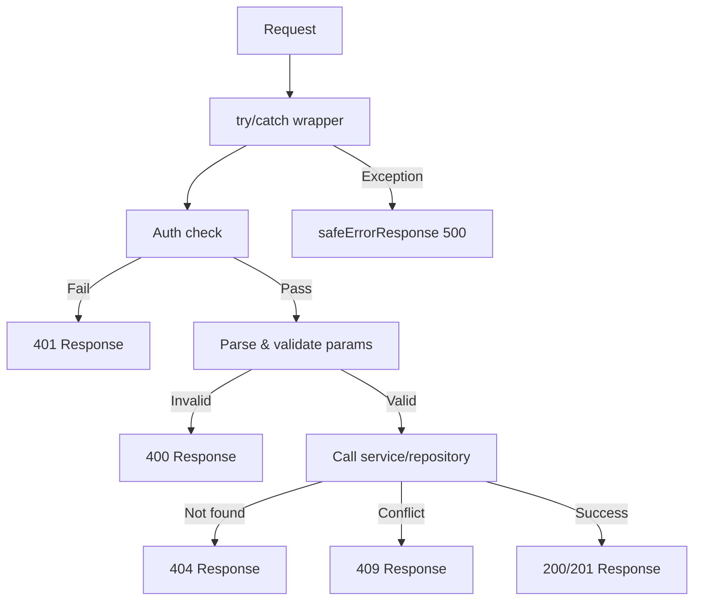

---
id: response-patterns
title: "API Response Patterns"
sidebar_label: "API Response Patterns"
---

# API Reactiepatronen

Alle API-routes volgen consistente reactieconventies: gediscrimineerde union-typen voor succes/fout, omgevingsbewuste foutberichten, standaard HTTP-statuscodes en Swagger/JSDoc-documentatie. Deze pagina behandelt elk patroon.

## Reactietypesysteem

### Gediscrimineerde union (`lib/api/types.ts`)

API-reacties gebruiken een `success`-boolean als discriminant:

```typescript
export type ApiResponse<T = unknown> =
  | { success: true; data: T; total?: number; page?: number; limit?: number; totalPages?: number }
  | { success: false; error: string };
```

Hiermee kunnen aanroepers het type op een veilige manier verfijnen:

```typescript
const response: ApiResponse<User[]> = await fetchUsers();
if (response.success) {
  // TypeScript weet: response.data is User[]
  console.log(response.data);
} else {
  // TypeScript weet: response.error is string
  console.error(response.error);
}
```

### Gepagineerde reactie

Lijsteindpunten gebruiken een speciale gepagineerde wrapper:

```typescript
export type PaginatedResponse<T> =
  | {
      success: true;
      data: T[];
      meta: {
        page: number;
        totalPages: number;
        total: number;
        limit: number;
      };
    }
  | { success: false; error: string };
```

### Fouttypen

```typescript
export interface ApiError {
  message: string;
  status?: number;
  code?: string;
}

export interface ErrorResponse {
  success: false;
  error: string;
}
```

## Standaard reactievormen

### Succesreacties

#### Enkele resource

```typescript
return NextResponse.json({
  success: true,
  item,
  message: "Item created successfully",
}, { status: 201 });
```

#### Lijst met paginering

```typescript
return NextResponse.json({
  success: true,
  items: result.items,
  total: result.total,
  page: result.page,
  limit: result.limit,
  totalPages: result.totalPages,
});
```

#### Actiebevestiging

```typescript
return NextResponse.json({
  success: true,
  message: "Profile updated successfully",
});
```

### Foutreacties

Alle foutreacties bevatten `success: false` en een `error`-string:

```typescript
// Niet geautoriseerd
return NextResponse.json(
  { success: false, error: "Unauthorized. Admin access required." },
  { status: 401 }
);

// Validatiefout
return NextResponse.json(
  { success: false, error: "Invalid page parameter. Must be a positive integer." },
  { status: 400 }
);

// Conflict
return NextResponse.json(
  { success: false, error: `Item with slug '${slug}' already exists` },
  { status: 409 }
);
```

## HTTP-statuscodeconventies

| Status | Gebruik | Voorbeeld |
|--------|---------|---------|
| `200` | Geslaagde GET, PUT, PATCH, DELETE | Items ophalen, profiel bijwerken |
| `201` | Geslaagde POST (resource aangemaakt) | Item aanmaken, reactie aanmaken |
| `400` | Ongeldige parameters of body | Slechte paginering, ontbrekende verplichte velden |
| `401` | Authenticatie vereist of mislukt | Ontbrekende sessie, niet-admin gebruiker |
| `404` | Resource niet gevonden | Item niet gevonden, profiel niet gevonden |
| `409` | Conflict (dubbele resource) | Dubbele item-ID of slug |
| `413` | Aanvraagbody te groot | Body overschrijdt `readBodyWithLimit`-maximum |
| `500` | Interne serverfout | Niet-afgehandelde uitzonderingen |

## Veilige foutreactie (`lib/utils/api-error.ts`)

### `safeErrorResponse`

Voorkomt informatielekken door generieke berichten in productie en gedetailleerde berichten in ontwikkeling te tonen:

```typescript
export function safeErrorResponse(
  error: unknown,
  fallbackMessage: string,
  status: number = 500
): NextResponse {
  const detail = error instanceof Error ? error.message : String(error);

  // Volledige details altijd aan serverzijde loggen
  console.error(`[API Error] ${fallbackMessage}:`, detail);

  const message = process.env.NODE_ENV === "development" ? detail : fallbackMessage;

  return NextResponse.json({ success: false, error: message }, { status });
}
```

Gebruik in routeafhandelaars:

```typescript
export async function GET(request: NextRequest) {
  try {
    // ... afhandelaarlogica
  } catch (error) {
    return safeErrorResponse(error, 'Failed to fetch items');
  }
}
```

### `safeErrorMessage`

Extraheert een veilige berichtstring zonder een `NextResponse` aan te maken:

```typescript
export function safeErrorMessage(error: unknown, fallbackMessage: string): string {
  if (process.env.NODE_ENV === "development") {
    return error instanceof Error ? error.message : String(error);
  }
  return fallbackMessage;
}
```

### Omgevingsgedrag

| Omgeving | Foutuitvoer | Serverlog |
|----------|-------------|-----------|
| Ontwikkeling | `error.message` (volledige detail) | Volledige fout gelogd |
| Productie | `fallbackMessage` (generiek) | Volledige fout gelogd |

## Structuur van routeafhandelaars

Alle API-routeafhandelaars volgen een consistente structuur:



### Canoniek voorbeeld van een GET-afhandelaar

```typescript
export async function GET(request: NextRequest) {
  try {
    // 1. Authenticatiecontrole
    const session = await auth();
    if (!session?.user?.isAdmin) {
      return NextResponse.json(
        { success: false, error: "Unauthorized. Admin access required." },
        { status: 401 }
      );
    }

    // 2. Parameters verwerken en valideren
    const { searchParams } = new URL(request.url);
    const paginationResult = validatePaginationParams(searchParams);
    if ('error' in paginationResult) {
      return NextResponse.json(
        { success: false, error: paginationResult.error },
        { status: paginationResult.status }
      );
    }

    // 3. Service-laag aanroepen
    const result = await repository.findAll(paginationResult);

    // 4. Gestructureerde reactie retourneren
    return NextResponse.json({
      success: true,
      items: result.items,
      total: result.total,
      page: result.page,
      limit: result.limit,
      totalPages: result.totalPages,
    });

  } catch (error) {
    return safeErrorResponse(error, 'Failed to fetch items');
  }
}
```

### Canoniek voorbeeld van een POST-afhandelaar

```typescript
export async function POST(request: NextRequest) {
  try {
    // 1. Authenticatiecontrole
    const session = await auth();
    if (!session?.user?.isAdmin) {
      return NextResponse.json(
        { success: false, error: "Unauthorized." },
        { status: 401 }
      );
    }

    // 2. Body verwerken en valideren
    const body = await request.json();
    if (!body.name || !body.description) {
      return NextResponse.json(
        { success: false, error: "Name and description are required" },
        { status: 400 }
      );
    }

    // 3. Controleren op conflicten
    const existing = await repository.findBySlug(body.slug);
    if (existing) {
      return NextResponse.json(
        { success: false, error: `Resource with slug '${body.slug}' already exists` },
        { status: 409 }
      );
    }

    // 4. Resource aanmaken
    const item = await repository.create(body);

    // 5. Aangemaakte resource retourneren
    return NextResponse.json({
      success: true,
      item,
      message: "Created successfully",
    }, { status: 201 });

  } catch (error) {
    return safeErrorResponse(error, 'Failed to create resource');
  }
}
```

## Swagger / JSDoc-documentatie

API-routes zijn gedocumenteerd met inline Swagger-annotaties voor automatisch gegenereerde API-documentatie:

```typescript
/**
 * @swagger
 * /api/admin/items:
 *   get:
 *     tags: ["Admin - Items"]
 *     summary: "Get paginated items list"
 *     security:
 *       - sessionAuth: []
 *     parameters:
 *       - name: "page"
 *         in: "query"
 *         schema:
 *           type: integer
 *           minimum: 1
 *           default: 1
 *     responses:
 *       200:
 *         description: "Items list retrieved successfully"
 *       400:
 *         description: "Bad request"
 *       401:
 *         description: "Unauthorized"
 *       500:
 *         description: "Internal server error"
 */
```

## Client-side API-typen

De API-clientconfiguratie en ophaalopties:

```typescript
export interface ApiClientConfig extends Partial<AxiosRequestConfig> {
  baseURL?: string;
  timeout?: number;
  headers?: Record<string, string>;
  accessToken?: string;
  frontendUrl?: string;
}

export interface FetchOptions {
  method?: 'GET' | 'POST' | 'PUT' | 'PATCH' | 'DELETE';
  headers?: Record<string, string>;
  body?: unknown;
  params?: Record<string, string | number | boolean | undefined>;
}
```

## Samenvatting van conventies

| Conventie | Beschrijving |
|-----------|-------------|
| Alle reacties bevatten `success` | Gediscrimineerde union voor typeveiligheid |
| Fouten gebruiken `{ success: false, error: string }` | Consistente foutvorm |
| `safeErrorResponse` wrapt catch-blokken | Omgevingsbewuste foutmaskering |
| Paginering gebruikt `total`, `page`, `limit`, `totalPages` | Consistente metadata |
| Authenticatiecontrole is de eerste bewerking | Fail-fast-patroon |
| Validatie keert vroeg terug bij mislukking | Geen geneste conditionelen |
| Swagger-annotaties op alle adminroutes | Automatisch gegenereerde API-docs |
