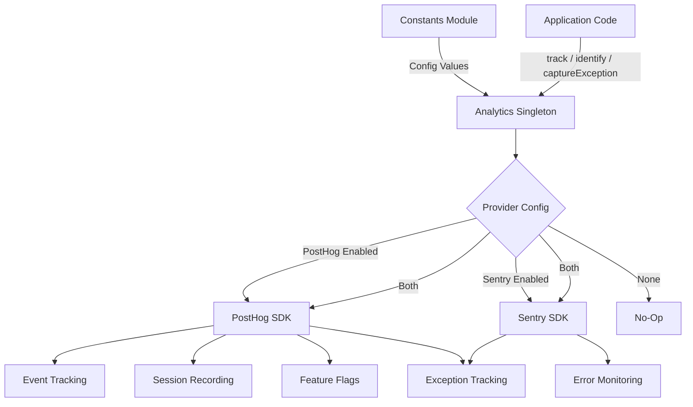
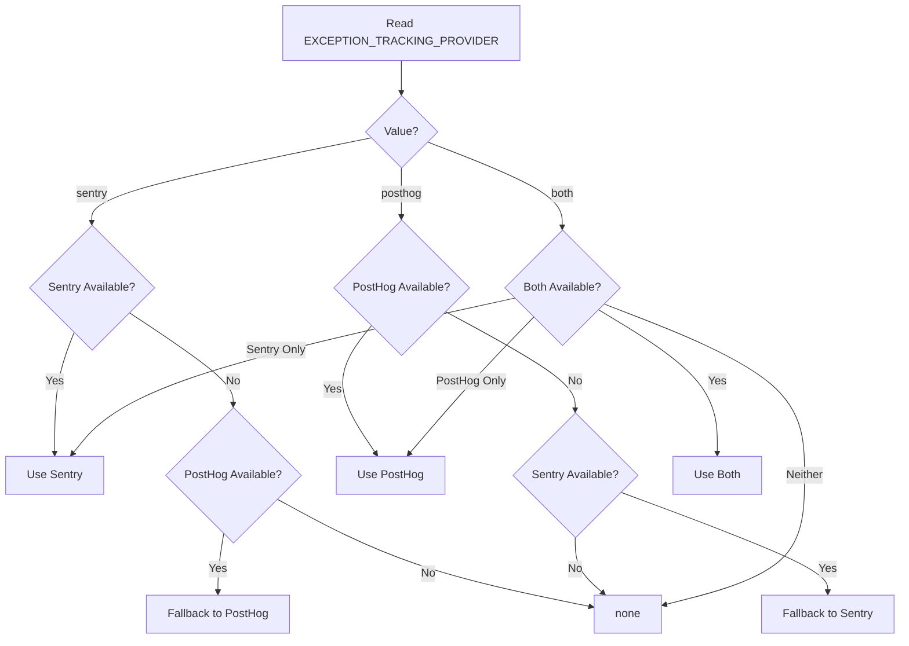

# Analytics-module

De analysemodule (`template/lib/analytics/`) biedt een uniforme singleton-klasse voor het volgen van gebeurtenissen aan de clientzijde, gebruikersidentificatie, evaluatie van functievlaggen en het vastleggen van uitzonderingen. Het integreert **PostHog** voor productanalyse en **Sentry** voor foutmonitoring, met ondersteuning voor het afzonderlijk gebruiken van beide providers, beide tegelijkertijd, of geen van beide.

## Architectuuroverzicht



## Bronbestanden

|Bestand|Beschrijving|
|------|-------------|
|`lib/analytics/index.ts`|`Analytics` singleton-klasse en `analytics` export|

## Kernklasse: `Analytics`

De `Analytics`-klasse is een singleton die PostHog en Sentry omvat. Het is veilig om aan de serverkant aan te roepen; alle methoden keren stilletjes terug als `window` niet gedefinieerd is.

### Typedefinities

```typescript
type EventProperties = Properties;          // PostHog Properties type
type UserProperties = Record<string, any>;
type ExceptionTrackingProvider = 'sentry' | 'posthog' | 'both' | 'none';
```

### Singleton-toegang

```typescript
// Get the singleton instance
const analytics = Analytics.getInstance();

// Or use the pre-created export
import { analytics } from '@/lib/analytics';
```

### `init(): void`

Initialiseert PostHog met gecentraliseerde configuratie en stelt het bijhouden van uitzonderingen in. Moet één keer aan de clientzijde worden aangeroepen (meestal in een hoofdindeling of providercomponent).

```typescript
// In your root layout or PostHog provider
'use client';
import { analytics } from '@/lib/analytics';

useEffect(() => {
  analytics.init();
}, []);
```

**Gedrag:**
- Slaat de initialisatie over als deze al is geïnitialiseerd of als deze op de server wordt uitgevoerd
- Leest de configuratie van constanten (`POSTHOG_KEY`, `POSTHOG_HOST`, `POSTHOG_ENABLED`, etc.)
- Configureert sessie-opname met maskering wanneer `POSTHOG_SESSION_RECORDING_ENABLED` waar is
- Past bemonsteringsfrequentie toe (`POSTHOG_SAMPLE_RATE`) -- bij productie standaard ingesteld op 10%
- Stelt de globale `window.onerror` en `unhandledrejection` handlers in wanneer het bijhouden van PostHog-uitzonderingen is ingeschakeld
- Koppelt PostHog aan Sentry wanneer beide providers actief zijn

### `identify(userId: string, properties?: UserProperties): void`

Koppelt de huidige anonieme gebruiker aan een geïdentificeerd gebruikers-ID. Stelt ook de Sentry-gebruikerscontext in wanneer Sentry is ingeschakeld.

```typescript
analytics.identify(session.user.id, {
  email: session.user.email,
  plan: 'premium',
});
```

### `reset(): void`

Reset de huidige gebruikersidentiteit (bijvoorbeeld bij uitloggen). Wist de gebruikerscontexten van zowel PostHog als Sentry.

```typescript
analytics.reset();
```

### `track(eventName: string, properties?: EventProperties): void`

Legt een aangepast evenement vast in PostHog.

```typescript
analytics.track('item_submitted', {
  itemId: 'abc-123',
  category: 'SaaS Tools',
});
```

### `trackPageView(url: string, properties?: EventProperties): void`

Legt handmatig een paginaweergavegebeurtenis vast. Gebruik dit wanneer `POSTHOG_AUTO_CAPTURE` is uitgeschakeld en u expliciete tracking van paginaweergaven nodig hebt.

```typescript
analytics.trackPageView(window.location.href, {
  referrer: document.referrer,
});
```

### `isFeatureEnabled(flagKey: string, defaultValue?: boolean): boolean`

Evalueert synchroon een PostHog-functievlag.

```typescript
const showNewUI = analytics.isFeatureEnabled('new-dashboard-ui', false);
```

### `reloadFeatureFlags(): Promise<void>`

Forceert het opnieuw ophalen van functievlaggen van de PostHog-server.

```typescript
await analytics.reloadFeatureFlags();
```

### `captureException(error: Error | string, context?: Record<string, any>): void`

Uniforme tracking van uitzonderingen die naar de geconfigureerde provider(s) verzendt.

```typescript
try {
  await riskyOperation();
} catch (error) {
  analytics.captureException(error, {
    component: 'PaymentForm',
    action: 'submit',
  });
}
```

**Providerroutering:**
- `'posthog'` -- Verzendt `$exception`-gebeurtenis naar PostHog met stacktrace
- `'sentry'` -- Bellen `Sentry.captureException` met extra context
- `'both'` -- Verzendt naar beide providers
- `'none'` -- Wordt in stilte weggegooid

### `captureError(error: Error, context?: Record<string, any>): void`

**Verouderd.** Alias voor `captureException`. Registreert een beëindigingswaarschuwing.

### `getExceptionTrackingProvider(): ExceptionTrackingProvider`

Retourneert de momenteel actieve uitzonderingstrackingprovider.

### `setUserProperties(properties: UserProperties): void`

Stelt persistente gebruikerseigenschappen in op het PostHog-persoonprofiel via `posthog.people.set()`.

```typescript
analytics.setUserProperties({
  subscription_tier: 'premium',
  company: 'Acme Corp',
});
```

### `setSuperProperties(properties: Record<string, any>): void`

Registreert supereigenschappen die bij elk volgend evenement worden verzonden via `posthog.register()`.

```typescript
analytics.setSuperProperties({
  app_version: '2.1.0',
  environment: 'production',
});
```

## Configuratieconstanten

Alle analyseconfiguraties worden aangestuurd door constanten van `lib/constants.ts`:

|Constant|Standaard|Beschrijving|
|----------|---------|-------------|
|`POSTHOG_KEY`|env var|API-sleutel van het PostHog-project|
|`POSTHOG_HOST`|env var|PostHog API-host-URL|
|`POSTHOG_ENABLED`|afgeleid|Waar wanneer zowel de sleutel als de host zijn ingesteld|
|`POSTHOG_DEBUG`|env var|Schakel loggen van PostHog-foutopsporing in|
|`POSTHOG_SESSION_RECORDING_ENABLED`|`'true'`|Schakel sessie-opname in|
|`POSTHOG_AUTO_CAPTURE`|`'false'`|Paginaweergaven automatisch vastleggen|
|`POSTHOG_SAMPLE_RATE`|`0.1` (producent) / `1.0` (ontwikkelaar)|Bemonsteringssnelheid van gebeurtenissen|
|`POSTHOG_SESSION_RECORDING_SAMPLE_RATE`|`0.1` (producent) / `1.0` (ontwikkelaar)|Bemonsteringsfrequentie opnemen|
|`EXCEPTION_TRACKING_PROVIDER`|`'both'`|Welke aanbieder verwerkt uitzonderingen|
|`SENTRY_ENABLED`|afgeleid|Waar als DSN is ingesteld en env dit toestaat|

## Resolutie van de provider voor het bijhouden van uitzonderingen

De aanbieder wordt tijdens de bouw bepaald met fallback-logica:



## Gebruik met Next.js

Typische integratie in een Next.js App Router-project:

```tsx
// app/providers.tsx
'use client';
import { useEffect } from 'react';
import { analytics } from '@/lib/analytics';
import { useSession } from 'next-auth/react';
import { usePathname } from 'next/navigation';

export function AnalyticsProvider({ children }: { children: React.ReactNode }) {
  const { data: session } = useSession();
  const pathname = usePathname();

  useEffect(() => {
    analytics.init();
  }, []);

  useEffect(() => {
    if (session?.user?.id) {
      analytics.identify(session.user.id, {
        email: session.user.email,
      });
    }
  }, [session]);

  useEffect(() => {
    analytics.trackPageView(pathname);
  }, [pathname]);

  return <>{children}</>;
}
```
