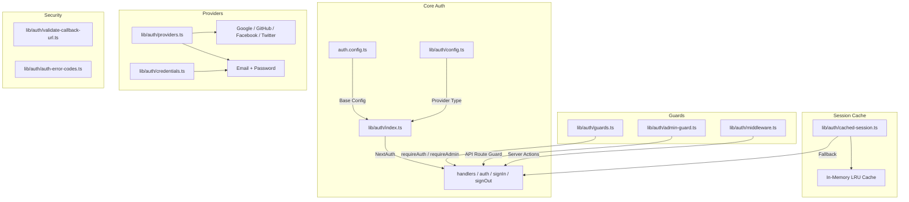
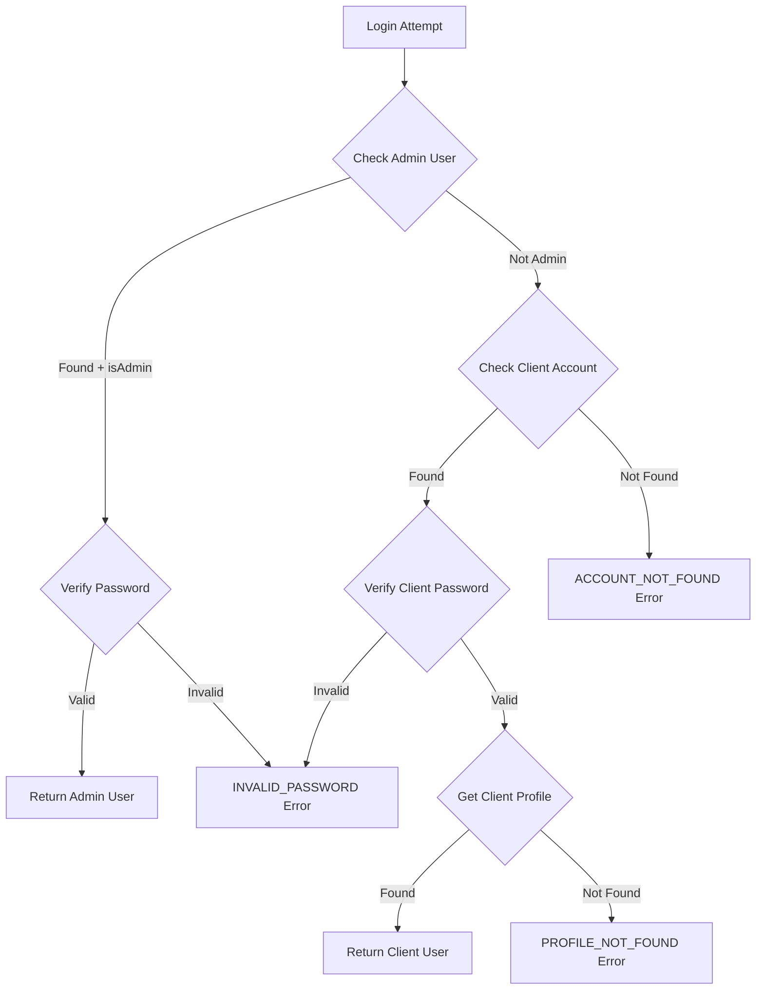

# Auth Hulpprogramma's-module

De module voor authenticatiehulpprogramma's (`template/lib/auth/`) biedt een uitgebreide authenticatielaag gebouwd op NextAuth.js (Auth.js) met ondersteuning voor meerdere providers, sessiecaching, server-side guards, gevalideerde serveracties en Supabase als alternatieve auth-backend.

## Architectuuroverzicht



## Bronbestanden

|Bestand|Beschrijving|
|------|-------------|
|`lib/auth/index.ts`|NextAuth.js-configuratie met Drizzle-adapter|
|`lib/auth/config.ts`|Configuratie van het type verificatieprovider|
|`lib/auth/credentials.ts`|E-mail-/wachtwoordreferentiesprovider|
|`lib/auth/providers.ts`|OAuth-providerfabriek|
|`lib/auth/guards.ts`|Paginabeveiligingen aan de serverzijde|
|`lib/auth/admin-guard.ts`|Beheerder van API-routes|
|`lib/auth/middleware.ts`|Gevalideerde middleware voor serveracties|
|`lib/auth/cached-session.ts`|Sessiecachinglaag|
|`lib/auth/session-cache.ts`|Cache-implementatie|
|`lib/auth/validate-callback-url.ts`|Validatie van omleidings-URL|
|`lib/auth/auth-error-codes.ts`|Foutcode enum|
|`lib/auth/supabase/`|Supabase auth-client/server/middleware|

## NextAuth.js-configuratie (`index.ts`)

De hoofdexport biedt de standaard NextAuth.js-interface:

```typescript
import { auth, signIn, signOut, handlers, unstable_update } from '@/lib/auth';
```

### Sessie Strategie

- **Strategie:** JWT (geen databasesessies)
- **Max. leeftijd:** 30 dagen
- **Updateleeftijd:** 24 uur (sessievernieuwingsinterval)

### JWT-terugbelverzoek

De JWT-callback verrijkt tokens met:
- `userId` -- van gebruikersobject of token `sub`
- `clientProfileId` -- automatisch gemaakt voor OAuth-gebruikers bij de eerste keer inloggen
- `isAdmin` -- bepaald op basis van `isClient`/`isAdmin` markeert of standaard ingesteld op `false`
- `provider` -- de naam van de authenticatieprovider

### Sessie terugbellen

De sessie-callback wijst JWT-velden toe aan het sessieobject:
- `session.user.id`
- `session.user.clientProfileId`
- `session.user.provider`
- `session.user.isAdmin`

### Aangepaste pagina's

```typescript
pages: {
  signIn: '/auth/signin',
  signOut: '/auth/signout',
  error: '/auth/error',
  verifyRequest: '/auth/verify-request',
  newUser: '/auth/register',
}
```

### Evenementen

- **signOut** -- maakt de sessiecache voor de gebruiker ongeldig
- **updateUser** -- maakt de sessiecache ongeldig wanneer gebruikersgegevens veranderen

## Verificatieconfiguratie (`config.ts`)

### `AuthProviderType`

```typescript
type AuthProviderType = 'supabase' | 'next-auth' | 'both';
```

### `AuthConfig`

```typescript
interface AuthConfig {
  provider: AuthProviderType;
  supabase?: {
    url: string;
    anonKey: string;
    redirectUrl?: string;
  };
  nextAuth?: {
    enableCredentials?: boolean;
    enableOAuth?: boolean;
    providers?: any[];
  };
}
```

### `getAuthConfig(): AuthConfig`

Lost configuratie met deze prioriteit op:
1. Globale overschrijving via `configureAuth()`
2. Omgevingsgebaseerde detectie (Supabase URL/sleutelaanwezigheid)
3. Standaard: `next-auth` met inloggegevens en OAuth ingeschakeld

## Referentieprovider (`credentials.ts`)

### Wachtwoordfuncties

```typescript
async function hashPassword(password: string): Promise<string>;
// Uses bcryptjs with 10 salt rounds, loaded via dynamic import

async function comparePasswords(plainText: string, hashed: string | null): Promise<boolean>;
// Returns false if hashed is null
```

### Authenticatiestroom



### `AuthProviders` Enum

```typescript
enum AuthProviders {
  CREDENTIALS = 'credentials',
  GOOGLE = 'google',
  FACEBOOK = 'facebook',
  GITHUB = 'github',
  TWITTER = 'twitter',
  X = 'x',
  MICROSOFT = 'microsoft',
}
```

## OAuth-providers (`providers.ts`)

### `createNextAuthProviders(config?): Provider[]`

Creëert dynamisch NextAuth-providerinstanties op basis van configuratie:

```typescript
import { createNextAuthProviders } from '@/lib/auth/providers';

const providers = createNextAuthProviders({
  google: { enabled: true, clientId: '...', clientSecret: '...' },
  github: { enabled: true, clientId: '...', clientSecret: '...' },
  credentials: { enabled: true },
});
```

Ondersteunde providers: **Google**, **GitHub**, **Facebook**, **Twitter**, **Inloggegevens**.

## Serverbescherming (`guards.ts`)

### `requireAuth(): Promise<Session>`

Vereist authenticatie. Omleiding naar `/auth/signin` indien niet geverifieerd.

```typescript
export default async function ProtectedPage() {
  const session = await requireAuth();
  return <div>Welcome {session.user.email}</div>;
}
```

### `requireAdmin(): Promise<Session>`

Vereist beheerdersrol. Omleiding naar `/admin/auth/signin` indien niet geverifieerd, `/unauthorized` indien niet admin.

```typescript
export default async function AdminPage() {
  const session = await requireAdmin();
  return <div>Admin Dashboard</div>;
}
```

### `getSession(): Promise<Session | null>`

Haalt de huidige sessie op zonder omleiding. Retourneert `null` voor niet-geverifieerde gebruikers.

### `checkIsAdmin(): Promise<boolean>`

Controleert de beheerdersstatus zonder omleiding.

## API-routewacht (`admin-guard.ts`)

### `checkAdminAuth(): Promise<NextResponse | null>`

Retourneert `null` indien geautoriseerd, of een fout `NextResponse` (401/403/500) indien niet:

```typescript
export async function GET() {
  const authError = await checkAdminAuth();
  if (authError) return authError;
  // ... handle authorized request
}
```

### `withAdminAuth(handler): handler`

Functie van hogere orde die API-routehandlers omhult:

```typescript
import { withAdminAuth } from '@/lib/auth/admin-guard';

export const GET = withAdminAuth(async (request) => {
  // Only reached if user is authenticated admin
  return NextResponse.json({ data: await getAdminData() });
});
```

## Gevalideerde serveracties (`middleware.ts`)

### `validatedAction(schema, action)`

Verpakt een serveractie met Zod-validatie:

```typescript
import { validatedAction } from '@/lib/auth/middleware';
import { z } from 'zod';

const schema = z.object({ name: z.string().min(1), email: z.string().email() });

export const updateProfile = validatedAction(schema, async (data, formData) => {
  await db.update(users).set(data);
  return { success: 'Profile updated' };
});
```

### `validatedActionWithUser(schema, action)`

Hetzelfde als hierboven, maar verifieert ook de authenticatie en injecteert de gebruiker:

```typescript
export const submitItem = validatedActionWithUser(schema, async (data, formData, user) => {
  await db.insert(items).values({ ...data, userId: user.id });
  return { success: 'Item submitted' };
});
```

### `ActionState` Type

```typescript
type ActionState = {
  error?: string;
  success?: string;
  redirect?: string;
  [key: string]: any;
};
```

## Sessiecaching (`cached-session.ts`)

Vermindert de authenticatieoverhead door gedecodeerde sessies in het geheugen op te slaan.

### `getCachedSession(request?): Promise<Session | null>`

```typescript
import { getCachedSession } from '@/lib/auth/cached-session';

// In server components
const session = await getCachedSession();

// In API routes (pass request for token extraction)
const session = await getCachedSession(request);
```

### `invalidateSessionCache(token?, userId?): Promise<void>`

Maakt in de cache opgeslagen sessies ongeldig op token of gebruikers-ID.

### `clearSessionCache(): void`

Wist alle sessies in de cache (voor implementaties of essentiële updates).

### Token-extractie

Tokens worden in deze volgorde uit verzoeken gehaald:
1. `next-auth.session-token` of `__Secure-next-auth.session-token` cookie
2. `Authorization: Bearer <token>` koptekst
3. `X-Session-Token` aangepaste koptekst

## Foutcodes (`auth-error-codes.ts`)

```typescript
enum AuthErrorCode {
  ACCOUNT_NOT_FOUND = 'ACCOUNT_NOT_FOUND',
  INVALID_PASSWORD = 'INVALID_PASSWORD',
  PROFILE_NOT_FOUND = 'PROFILE_NOT_FOUND',
  GENERIC_ERROR = 'GENERIC_ERROR',
  RATE_LIMITED = 'RATE_LIMITED',
  USE_OAUTH_PROVIDER = 'USE_OAUTH_PROVIDER',
  SESSION_REFRESH_FAILED = 'SESSION_REFRESH_FAILED',
  PAGE_REFRESH_FAILED = 'PAGE_REFRESH_FAILED',
}
```

## Validatie van terugbel-URL (`validate-callback-url.ts`)

### `isValidCallbackUrl(url: string | null): boolean`

Voorkomt kwetsbaarheden bij open omleidingen:

```typescript
isValidCallbackUrl('/admin/items')       // true
isValidCallbackUrl('/client/dashboard')  // true
isValidCallbackUrl('https://evil.com')   // false
isValidCallbackUrl('//evil.com')         // false
```

### `getSafeRedirectPath(callbackUrl, fallbackPath): string`

Retourneert de callback-URL indien geldig, anders het fallback-pad.

### `createSafeCallbackUrl(pathname, search?): string`

Creëert een callback-URL die beperkt is tot 2048 tekens om parametervervuiling te voorkomen.
