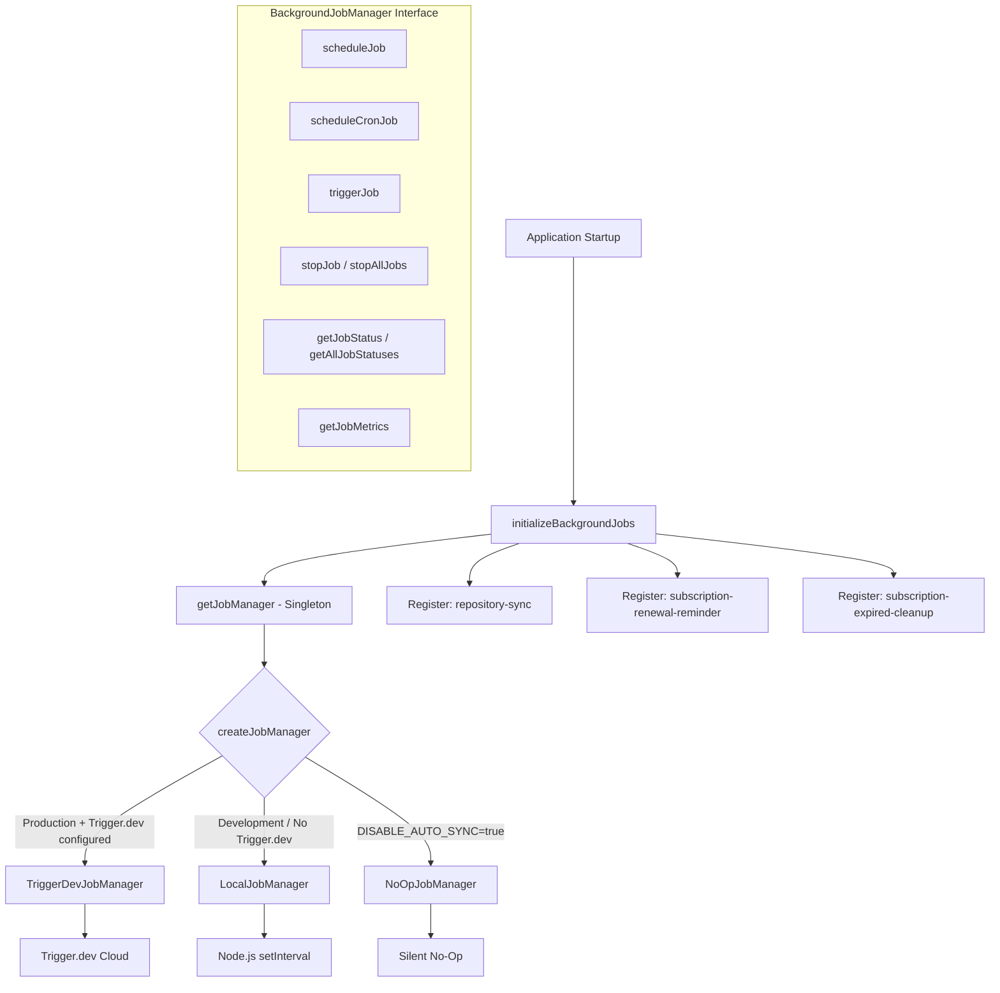
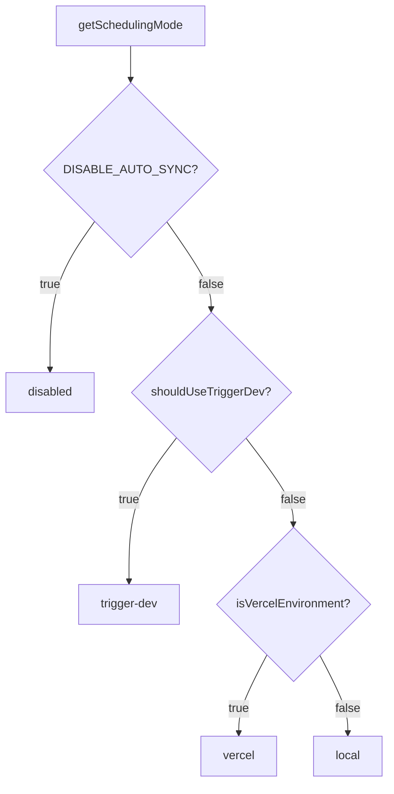

# Module Achtergrondbanen

De achtergrondtakenmodule (`template/lib/background-jobs/`) biedt een abstractielaag voor het plannen en uitvoeren van terugkerende taken. Het ondersteunt drie runtimestrategieën - **Trigger.dev** voor productie, **lokaal `setInterval`** voor ontwikkeling en een **no-op**-modus om taken volledig uit te schakelen - automatisch geselecteerd op basis van de omgevingsconfiguratie.

## Architectuuroverzicht



## Bronbestanden

|Bestand|Beschrijving|
|------|-------------|
|`lib/background-jobs/types.ts`|Interface- en typedefinities|
|`lib/background-jobs/config.ts`|Trigger.dev-configuratie en detectie van planningsmodus|
|`lib/background-jobs/job-factory.ts`|Fabrieksfunctie en singletonmanager|
|`lib/background-jobs/local-job-manager.ts`|`LocalJobManager` implementatie|
|`lib/background-jobs/trigger-dev-job-manager.ts`|`TriggerDevJobManager` implementatie|
|`lib/background-jobs/noop-job-manager.ts`|`NoOpJobManager` implementatie|
|`lib/background-jobs/initialize-jobs.ts`|Taakregistratie bij het opstarten van de app|
|`lib/background-jobs/index.ts`|Export van vaten|

## Typedefinities

### `BackgroundJobManager`-interface

```typescript
interface BackgroundJobManager {
  scheduleJob(id: string, name: string, job: () => void | Promise<void>, interval: number): void;
  scheduleCronJob(id: string, name: string, job: () => void | Promise<void>, cronExpression: string): void;
  triggerJob(id: string): Promise<void>;
  stopJob(id: string): void;
  stopAllJobs(): void;
  getJobStatus(id: string): JobStatus | undefined;
  getAllJobStatuses(): JobStatus[];
  getJobMetrics(): JobMetrics;
}
```

### `JobStatus`

```typescript
type JobStatusType = 'running' | 'completed' | 'failed' | 'scheduled' | 'stopped';

interface JobStatus {
  id: string;
  name: string;
  status: JobStatusType;
  lastRun: Date | null;
  nextRun: Date | null;
  duration: number;     // Last execution duration in ms
  error?: string;       // Error message if status is 'failed'
}
```

### `JobMetrics`

```typescript
interface JobMetrics {
  totalExecutions: number;       // Total invocations (not unique jobs)
  successfulJobs: number;
  failedJobs: number;
  averageJobDuration: number;    // Rolling average in ms
  lastCleanup: Date;
}
```

### `TriggerDevConfig`

```typescript
interface TriggerDevConfig {
  enabled: boolean;
  apiKey?: string;
  apiUrl?: string;
  environment: string;
  isFullyConfigured: boolean;
  isPartiallyConfigured: boolean;
}
```

### `SchedulingMode`

```typescript
type SchedulingMode = 'trigger-dev' | 'vercel' | 'local' | 'disabled';
```

## Configuratiefuncties

### `getTriggerDevConfig(): TriggerDevConfig`

Leest Trigger.dev-instellingen van de ConfigService.

### `shouldUseTriggerDev(): boolean`

Retourneert `true` wanneer Trigger.dev volledig is geconfigureerd en ingeschakeld, en de omgeving productie is.

### `getSchedulingMode(): SchedulingMode`

Bepaalt welk planningssysteem actief moet zijn met deze prioriteit:



## Fabriek en Singleton

### `createJobManager(): BackgroundJobManager`

Creëert de juiste taakmanager op basis van de omgeving:

```typescript
import { createJobManager } from '@/lib/background-jobs';

const manager = createJobManager();
// Returns: TriggerDevJobManager | LocalJobManager | NoOpJobManager
```

### `getJobManager(): BackgroundJobManager`

Retourneert de singleton-instantie en maakt deze bij de eerste aanroep:

```typescript
import { getJobManager } from '@/lib/background-jobs';

const manager = getJobManager();
manager.scheduleJob('my-job', 'My Job', async () => {
  await doWork();
}, 60_000);
```

### `resetJobManager(): void`

Stopt alle banen en vernietigt de singleton (handig voor testen):

```typescript
import { resetJobManager } from '@/lib/background-jobs';
resetJobManager();
```

## LocalJobManager

Gebruikt Node.js `setInterval` voor ontwikkelings- en fallback-omgevingen.

**Belangrijkste gedragingen:**
- Slaat de uitvoering over wanneer een taak al actief is (voorkomt overlap)
- Houdt statistieken bij met voortschrijdende gemiddelde duur
- Converteert cron-expressies naar intervallen via vereenvoudigde mapping
- Vermindert consolelogboekregistratie in de ontwikkelingsmodus

### Cron-naar-interval-toewijzing

|Cron-patroon|Interval|
|-------------|----------|
| `*/30 * * * * *` |30 seconden|
| `*/2 * * * *` |2 minuten|
| `*/5 * * * *` |5 minuten|
| `*/15 * * * *` |15 minuten|
| `0 * * * *` |1 uur|
| `0 9 * * *` |24 uur|
|Standaard|1 minuut|

## TriggerDevJobManager

Registreert planningen met de `@trigger.dev/sdk` v4 plannings-API. Voert **geen** lokale timers uit; de uitvoering wordt afgehandeld door het werkproces Trigger.dev.

**Belangrijkste gedragingen:**
- Lazy-loads `@trigger.dev/sdk` via dynamische import
- Converteert op interval gebaseerde schema's naar cron-expressies
- Houdt lokale statistieken bij wanneer taken worden uitgevoerd in de werknemerscontext
- `stopJob` / `stopAllJobs` alleen lokale status wissen (schema's op afstand worden beheerd door Trigger.dev)

## GeenOpJobManager

Alle operaties zijn stille no-ops. Wordt gebruikt wanneer `DISABLE_AUTO_SYNC=true` in ontwikkeling is.

## Taakregistratie

De functie `initializeBackgroundJobs()` registreert alle applicatietaken bij het opstarten:

```typescript
import { initializeBackgroundJobs } from '@/lib/background-jobs/initialize-jobs';

// Called once during app initialization
await initializeBackgroundJobs();
```

### Geregistreerde vacatures

|Taak-ID|Schema|Beschrijving|
|--------|----------|-------------|
|`repository-sync`|Elke 5 minuten|Synchroniseert op Git gebaseerde CMS-inhoud via `syncManager.performSync()`|
|`subscription-renewal-reminder`|Dagelijks om 9.00 uur|Verzendt verlengingsherinneringen voor abonnementen die binnen zeven dagen verlopen|
|`subscription-expired-cleanup`|Dagelijks om middernacht|Verwerkt abonnementen en laat deze verlopen na de einddatum|

**Belangrijk:** Alle job callbacks gebruiken dynamische imports om te voorkomen dat webpack Node.js-specifieke modules bundelt tijdens de build:

```typescript
manager.scheduleJob('repository-sync', 'Repository Synchronization', async () => {
  // Dynamic import prevents webpack bundling of isomorphic-git chain
  const { syncManager } = await import('@/lib/services/sync-service');
  await syncManager.performSync();
}, 5 * 60 * 1000);
```

## Gebruiksvoorbeelden

### Een aangepaste taak plannen

```typescript
import { getJobManager } from '@/lib/background-jobs';

const manager = getJobManager();

// Interval-based (every 10 minutes)
manager.scheduleJob('cleanup-temp', 'Temp File Cleanup', async () => {
  await cleanupTempFiles();
}, 10 * 60 * 1000);

// Cron-based (every hour)
manager.scheduleCronJob('hourly-report', 'Hourly Report', async () => {
  await generateReport();
}, '0 * * * *');
```

### Bewaken van banen

```typescript
const manager = getJobManager();

// Check specific job
const status = manager.getJobStatus('repository-sync');
console.log(status?.status, status?.lastRun, status?.duration);

// List all jobs
const allStatuses = manager.getAllJobStatuses();

// Get aggregate metrics
const metrics = manager.getJobMetrics();
console.log(`Total: ${metrics.totalExecutions}, Failed: ${metrics.failedJobs}`);
```

### Handmatige trigger

```typescript
const manager = getJobManager();
await manager.triggerJob('repository-sync');
```
