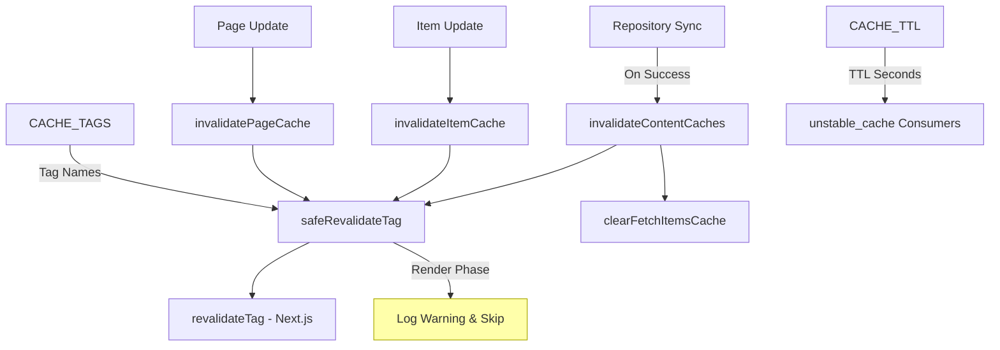
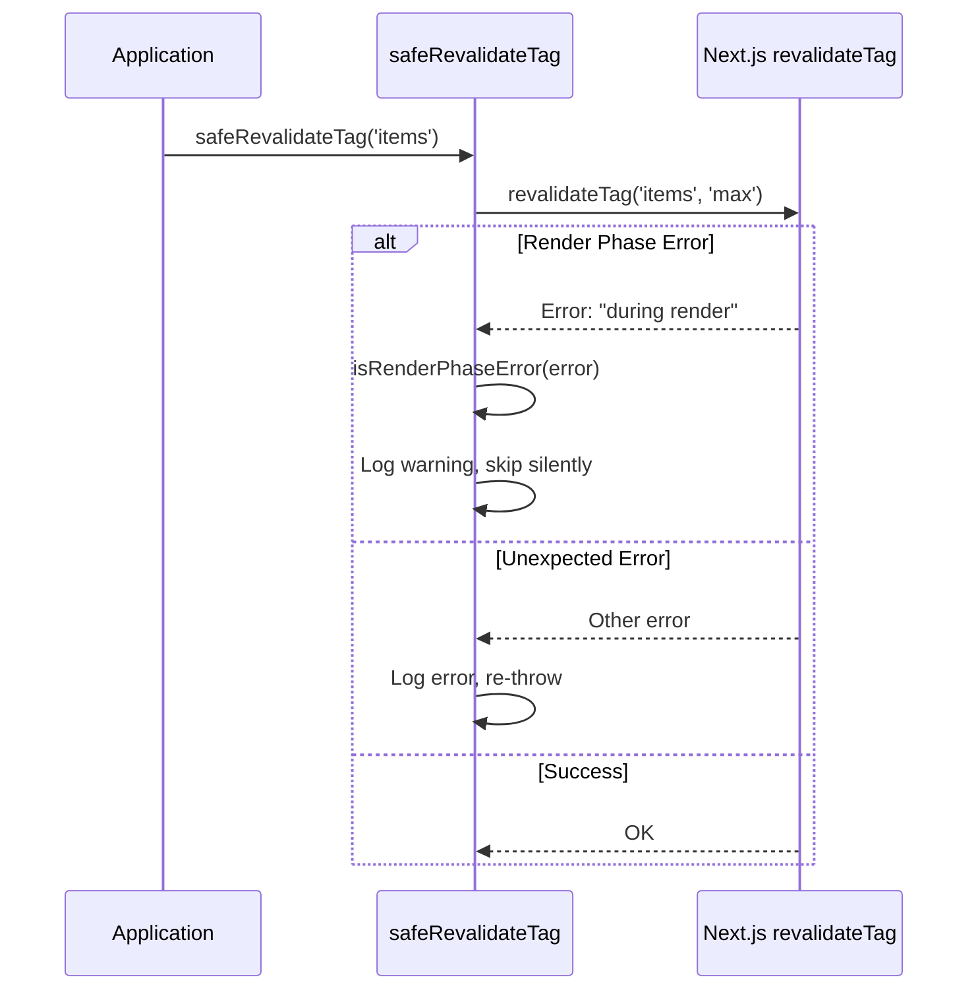
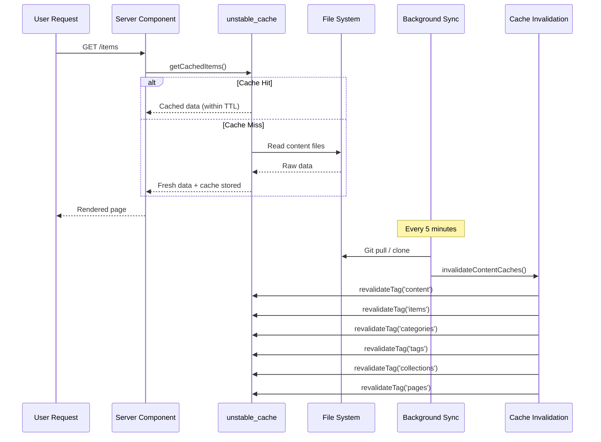

# Cache-invalidatiemodule

De cache-invalidatiemodule (`template/lib/cache-config.ts` en `template/lib/cache-invalidation.ts`) biedt een gecentraliseerd cache-tagsysteem en ongeldigheidsfuncties voor Next.js `unstable_cache` en `revalidateTag`. Het zorgt ervoor dat inhoudscaches op de juiste manier ongeldig worden gemaakt na synchronisatie van de repository, terwijl de restricties in de renderfase van Next.js netjes worden afgehandeld.

## Architectuuroverzicht



## Bronbestanden

|Bestand|Beschrijving|
|------|-------------|
|`lib/cache-config.ts`|Cache TTL-constanten en tagdefinities|
|`lib/cache-invalidation.ts`|Invalidatiefuncties met renderfaseveiligheid|

## Cache TTL-configuratie

Alle TTL-waarden zijn in **seconden**, gebruikt met Next.js `unstable_cache`:

```typescript
const CACHE_TTL = {
  CONTENT: 600,   // 10 minutes -- content listings
  ITEM: 600,      // 10 minutes -- individual items
  CONFIG: 600,    // 10 minutes -- site configuration
  PAGES: 600,     // 10 minutes -- static pages
} as const;
```

### Gebruik met `unstable_cache`

```typescript
import { unstable_cache } from 'next/cache';
import { CACHE_TTL, CACHE_TAGS } from '@/lib/cache-config';

const getCachedItems = unstable_cache(
  async () => fetchAllItems(),
  ['items-list'],
  {
    revalidate: CACHE_TTL.CONTENT,
    tags: [CACHE_TAGS.CONTENT, CACHE_TAGS.ITEMS],
  }
);
```

## Cachetags

Tags worden gebruikt met `revalidateTag()` om caches selectief ongeldig te maken.

### Statische tags

|Tag-constante|Waarde|Beschrijving|
|-------------|-------|-------------|
|`CACHE_TAGS.CONTENT`|`'content'`|Hoofdtag - maakt alle inhoudscaches ongeldig|
|`CACHE_TAGS.ITEMS`|`'items'`|Verzameling van alle artikelen|
|`CACHE_TAGS.CATEGORIES`|`'categories'`|Alle categorieën|
|`CACHE_TAGS.TAGS`|`'tags'`|Alle labels|
|`CACHE_TAGS.COLLECTIONS`|`'collections'`|Alle collecties|
|`CACHE_TAGS.CONFIG`|`'config'`|Siteconfiguratie|
|`CACHE_TAGS.PAGES`|`'pages'`|Alle statische pagina's|

### Dynamische tags (functies)

|Tag-functie|Voorbeelduitvoer|Beschrijving|
|-------------|---------------|-------------|
|`CACHE_TAGS.ITEM(slug)`|`'item:my-tool'`|Specifiek item per naaktslak|
|`CACHE_TAGS.PAGE(slug)`|`'page:about'`|Specifieke pagina per naaktslak|
|`CACHE_TAGS.ITEMS_LOCALE(locale)`|`'items:en'`|Items gefilterd op landinstelling|
|`CACHE_TAGS.CATEGORIES_LOCALE(locale)`|`'categories:fr'`|Categorieën per land|
|`CACHE_TAGS.TAGS_LOCALE(locale)`|`'tags:de'`|Tags per landinstelling|
|`CACHE_TAGS.COLLECTIONS_LOCALE(locale)`|`'collections:es'`|Collecties per land|

### Voorbeeld: landspecifieke caching

```typescript
import { CACHE_TAGS, CACHE_TTL } from '@/lib/cache-config';

const getCachedItemsByLocale = unstable_cache(
  async (locale: string) => fetchItemsByLocale(locale),
  ['items-by-locale'],
  {
    revalidate: CACHE_TTL.CONTENT,
    tags: [CACHE_TAGS.ITEMS, CACHE_TAGS.ITEMS_LOCALE('en')],
  }
);
```

## Invalidatiefuncties

### `invalidateContentCaches(): Promise<void>`

Maakt **alle** inhoudgerelateerde caches ongeldig. Aangeroepen nadat de synchronisatie van de opslagplaats met succes is voltooid.

```typescript
import { invalidateContentCaches } from '@/lib/cache-invalidation';

// After successful repository sync
await performSync();
await invalidateContentCaches();
```

**Maakt deze tags ongeldig:**
- `CONTENT`, `ITEMS`, `CATEGORIES`, `TAGS`, `COLLECTIONS`, `PAGES`
- Wist ook de `fetchItems`-cache in het geheugen via `clearFetchItemsCache()`

### `invalidateItemCache(slug: string): Promise<void>`

Maakt de cache voor één item ongeldig.

```typescript
import { invalidateItemCache } from '@/lib/cache-invalidation';

await invalidateItemCache('my-saas-tool');
// Revalidates tag: 'item:my-saas-tool'
```

### `invalidatePageCache(slug: string): Promise<void>`

Maakt de cache voor één statische pagina ongeldig.

```typescript
import { invalidatePageCache } from '@/lib/cache-invalidation';

await invalidatePageCache('about');
// Revalidates tag: 'page:about'
```

## Renderfase-veiligheid

Next.js staat `revalidateTag()` niet toe tijdens de weergavefase van servercomponenten. De module handelt dit af met een `safeRevalidateTag` wrapper.

### Hoe het werkt



### Patronen voor foutdetectie

De functie `isRenderPhaseError` controleert meerdere patronen om bestand te zijn tegen wijzigingen in de foutmeldingen van Next.js:

- `"during render"` -- Huidig Next.js-bericht
- `"render phase"` -- Alternatieve formulering
- `"revalidate"` + `"render"` -- Beide trefwoorden aanwezig
- `"unsupported"` + `"render"` -- Combinatiecontrole

## Cachestroomdiagram


