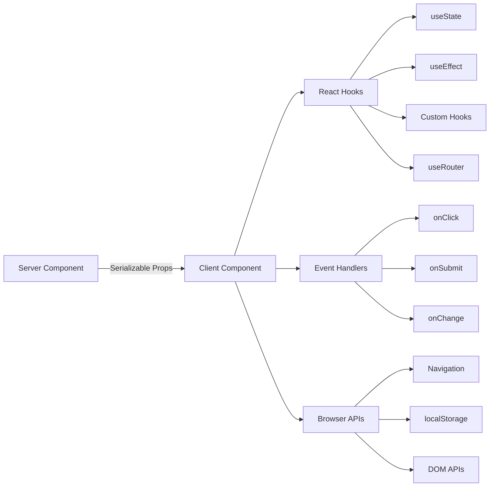

# Patronen van clientcomponenten

## Overzicht

Clientcomponenten in de Ever Works-sjabloon zijn interactieve 'eilanden' die gebruikersgebeurtenissen afhandelen, de lokale status beheren en integreren met browser-API's. Ze worden geïdentificeerd door de `"use client"` richtlijn bovenaan het bestand en worden selectief gebruikt waar interactiviteit vereist is.

## Architectuur



## Bronbestanden

|Bestand|Patroon|
|------|---------|
|`template/app/[locale]/admin/page.tsx`|Minimale client-wrapper delegeert naar component|
|`template/app/not-found.tsx`|Clientnavigatie met `useRouter`|
|`template/app/global-error.tsx`|Foutgrens met resetfunctionaliteit|
|`template/components/filters/filter-url-parser.tsx`|Beheer van URL-status|
|`template/components/header/more-menu.tsx`|Interactieve vervolgkeuzemenu's|

## Kernpatronen

### Patroon 1: Minimale clientwrappers

Veel paginacomponenten gebruiken de dunst mogelijke clientwrapper:

```typescript
"use client";

import { AdminDashboard } from "@/components/admin";

export default function AdminPage() {
    return <AdminDashboard />;
}
```

Dit patroon houdt het paginabestand klein terwijl alle logica naar een afzonderlijke component wordt gedelegeerd. De `"use client"` richtlijn markeert de grens waar de servercomponentboom overgaat naar clientweergave.

### Patroon 2: Foutgrenscomponenten

De globale fouthandler demonstreert het foutgrenspatroon:

```typescript
'use client';

export default function GlobalError({
    error,
    reset,
}: {
    error: Error & { digest?: string };
    reset: () => void;
}) {
    useEffect(() => {
        console.error(error);
    }, [error]);

    return (
        <html lang="en">
            <body>
                <div>
                    <h1>Something went wrong!</h1>
                    {process.env.NODE_ENV !== 'production' && (
                        <div>
                            <p>{error.message}</p>
                            {error.digest && <p>Error ID: {error.digest}</p>}
                        </div>
                    )}
                    <Button onPress={() => reset()}>Refresh</Button>
                    <Link href="/">Go Home</Link>
                </div>
            </body>
        </html>
    );
}
```

Belangrijkste aspecten:
- De `error` prop bevat een optionele `digest` voor het volgen van serverfouten
- De functie `reset()` geeft de kinderen van de foutgrens opnieuw weer
- Stacktraces worden alleen tijdens de ontwikkeling weergegeven
- De component omhult zijn eigen tags `<html>` en `<body>`, omdat globale fouten de hele pagina vervangen

### Patroon 3: Navigatie aan de clientzijde

De pagina Niet gevonden toont navigatiepatronen aan de clientzijde:

```typescript
'use client';

import { useRouter } from 'next/navigation';

export default function NotFound() {
    const router = useRouter();

    return (
        <div>
            <Button onClick={() => router.back()}>Go Back</Button>
            <Button onClick={() => router.push('/')}>Back to Home</Button>
            <button onClick={() => router.push('/help')}>Contact Support</button>
        </div>
    );
}
```

De `useRouter` hook van `next/navigation` biedt programmatische navigatie. Let op: dit is van `next/navigation`, niet `next/router` (Pages Router).

### Patroon 4: i18n-Aware Client-navigatie

De sjabloon biedt locatiebewuste navigatiehaken via `i18n/navigation.ts`:

```typescript
import { createNavigation } from "next-intl/navigation";
import { routing } from "./routing";

export const { Link, redirect, usePathname, useRouter, getPathname } =
    createNavigation(routing);
```

Clientcomponenten waarvoor locatiebewuste navigatie nodig is, importeren uit deze module in plaats van `next/navigation`:

```typescript
'use client';

import { Link, useRouter, usePathname } from '@/i18n/navigation';

function LocaleAwareComponent() {
    const router = useRouter();
    const pathname = usePathname();

    // router.push('/about') automatically includes the current locale prefix
    return <Link href="/about">About</Link>;
}
```

### Patroon 5: Serveracties met formuliervalidatie

Clientcomponenten integreren met serveracties met behulp van het gevalideerde actiepatroon van `lib/auth/middleware.ts`:

```typescript
// Server action (lib/auth/middleware.ts)
export function validatedAction<S extends z.ZodType, T>(
    schema: S,
    action: ValidatedActionFunction<S, T>
) {
    return async (prevState: ActionState, formData: FormData): Promise<T> => {
        const result = schema.safeParse(Object.fromEntries(formData));
        if (!result.success) {
            return { error: result.error.issues[0].message } as T;
        }
        return action(result.data, formData);
    };
}

// Client component
'use client';

import { useActionState } from 'react';
import { myServerAction } from './actions';

function MyForm() {
    const [state, formAction, isPending] = useActionState(myServerAction, {});

    return (
        <form action={formAction}>
            {state.error && <p>{state.error}</p>}
            <input name="email" type="email" />
            <button type="submit" disabled={isPending}>Submit</button>
        </form>
    );
}
```

### Patroon 6: Staatsbeheer met aangepaste haken

De sjabloon organiseert logica aan de clientzijde in aangepaste hooks in de map `hooks/`:

```typescript
'use client';

import { useFavorites } from '@/hooks/useFavorites';
import { useFilters } from '@/hooks/useFilters';

function ItemList() {
    const { favorites, toggleFavorite } = useFavorites();
    const { filters, updateFilter, resetFilters } = useFilters();

    return (
        <div>
            <FilterBar filters={filters} onChange={updateFilter} onReset={resetFilters} />
            <ItemGrid items={items} favorites={favorites} onToggleFavorite={toggleFavorite} />
        </div>
    );
}
```

## Grenzen van cliëntcomponenten

### Wanneer `"use client"` gebruiken

- **Gebeurtenisafhandelaars**: `onClick`, `onSubmit`, `onChange`
- **Reacthaken**: `useState`, `useEffect`, `useRef`, aangepaste haken
- **Browser-API's**: `window`, `localStorage`, `navigator`
- **Clientbibliotheken van derden**: UI-componentbibliotheken die interactiviteit vereisen

### Wanneer bewaren als servercomponent?

- Weergave van statische inhoud
- Gegevens ophalen en transformeren
- Vertaling laden (`getTranslations`)
- Generatie van metadata
- Lay-outverpakkingen

## Best practices in de sjabloon

1. **Duw `"use client"` zo diep mogelijk** -- houd de grens dicht bij het interactieve blad
2. **Geef servergegevens door als rekwisieten** - vermijd opnieuw ophalen op de client
3. **Gebruik `useEffect` alleen voor bijwerkingen** -- niet voor het ophalen van gegevens
4. **Geef de voorkeur aan serveracties boven API-routes** -- voor formulierinzendingen en mutaties
5. **Importeer navigatie vanuit `@/i18n/navigation`** -- zorgt voor locale-bewuste routering
6. **Gate-interface voor alleen ontwikkeling** - gebruik `process.env.NODE_ENV !== 'production'`-controles
