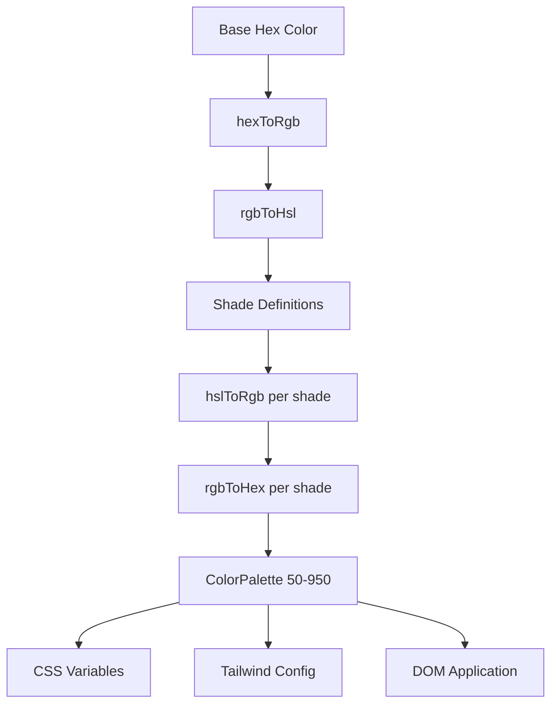

# Kleursysteem

De sjabloon maakt gebruik van een dynamisch kleurgeneratiesysteem dat complete kleurenpaletten creëert op basis van hexadecimale basiskleuren. Dit drijft de thema-engine aan en maakt runtime-kleuraanpassing mogelijk via CSS-variabelen en Tailwind CSS-integratie.

## Architectuuroverzicht



## Bronbestanden

|Bestand|Doel|
|------|---------|
|`lib/color-generator.ts`|Generatie van kernpaletten uit hex-kleuren|
|`lib/theme-color-manager.ts`|Kleurtoepassing op themaniveau en CSS-generatie|
|`lib/theme-utils.ts`|Hulpprogrammaklassen, dekkingshelpers en themavoorinstellingen|

## Pijplijn voor kleurconversie

Het systeem converteert kleuren via meerdere weergaven om nauwkeurig tinten te genereren. Vier conversiefuncties verzorgen de volledige heen- en terugreis.

```typescript
// Hex -> RGB -> HSL (for manipulation) -> RGB -> Hex (output)
export function hexToRgb(hex: string): { r: number; g: number; b: number };
export function rgbToHsl(r: number, g: number, b: number): { h: number; s: number; l: number };
export function hslToRgb(h: number, s: number, l: number): { r: number; g: number; b: number };
export function rgbToHex(r: number, g: number, b: number): string;
```

Aanpassingen van de helderheid en verzadiging vinden plaats in de HSL-kleurruimte, die perceptueel uniforme tintovergangen over het hele palet oplevert.

## Schaduwdefinities

Elk kleurniveau heeft vaste aanpassingen voor de helderheid en verzadiging ten opzichte van de basiskleur (500):

|Schaduw|Lichtheid aanpassen|Verzadiging aanpassen|Gebruik|
|-------|-----------------|-------------------|-------|
| 50 | +45 | -30 |Lichtste achtergronden|
| 100 | +40 | -25 |Beweeg achtergronden|
| 200 | +30 | -20 |Actieve achtergronden|
| 300 | +20 | -10 |Grenzen|
| 400 | +10 | -5 |Tijdelijke tekst|
| **500** | **0** | **0** |**Basiskleur**|
| 600 | -10 | +5 |Beweeg staten|
| 700 | -20 | +10 |Actieve staten|
| 800 | -30 | +15 |Nadruk tekst|
| 900 | -40 | +20 |Koppen|
| 950 | -45 | +25 |Donkerste achtergronden|

## Kleurenpaletinterface

```typescript
export interface ColorPalette {
  50: string;
  100: string;
  200: string;
  300: string;
  400: string;
  500: string;  // Base color
  600: string;
  700: string;
  800: string;
  900: string;
  950: string;
}
```

## Een palet genereren

De functie `generateColorPalette` neemt elke hexadecimale kleur en produceert het volledige palet met 11 tinten:

```typescript
import { generateColorPalette } from '@/lib/color-generator';

const palette = generateColorPalette('#3b82f6');
// Returns: { 50: '#e8f0fe', 100: '#d4e4fd', ..., 950: '#0a1d3d' }
```

Waarden worden vastgezet tussen 0 en 100 voor zowel lichtheid als verzadiging om kleuren die buiten het bereik vallen te voorkomen.

## Generatie van CSS-variabelen

Het systeem genereert aangepaste CSS-eigenschappen voor elke tint:

```typescript
import { generateCssVariables } from '@/lib/color-generator';

const palette = generateColorPalette('#3b82f6');
const css = generateCssVariables('theme-primary', palette);
// Output:
// --theme-primary: #3b82f6;
// --theme-primary-50: #e8f0fe;
// --theme-primary-100: #d4e4fd;
// ... (all 11 shades)
```

## Tailwind CSS-integratie

Genereer Tailwind-configuratieobjecten die verwijzen naar CSS-variabelen:

```typescript
import { generateTailwindConfig } from '@/lib/color-generator';

const config = generateTailwindConfig('theme-primary');
// Returns: {
//   DEFAULT: 'var(--theme-primary)',
//   50: 'var(--theme-primary-50)',
//   100: 'var(--theme-primary-100)',
//   ...
// }
```

## Themakleurmanager

De module `theme-color-manager.ts` past tijdens runtime paletten toe op de DOM.

### Uitgebreide themaconfiguraties

Vier ingebouwde thema's definiëren basiskleuren voor primair, secundair, accent, achtergrond, oppervlak en tekst:

```typescript
export const EXTENDED_THEME_CONFIGS: Record<ThemeKey, ThemeConfig> = {
  everworks: {
    primary: "#3d70ef",
    secondary: "#00c853",
    accent: "#0056b3",
    background: "#ffffff",
    surface: "#f8f9fa",
    text: "#1a1a1a",
    textSecondary: "#6c757d",
  },
  corporate: { /* ... */ },
  material: { /* ... */ },
  funny: { /* ... */ },
};
```

### Paletten toepassen op de DOM

```typescript
import { applyColorPalette, applyThemeWithPalettes } from '@/lib/theme-color-manager';

// Apply a single color palette
applyColorPalette('theme-primary', '#3d70ef');

// Apply an entire theme (primary + secondary + accent + utility colors)
applyThemeWithPalettes('everworks');
```

De functie `applyColorPalette` genereert ook een RGB-variant voor ondersteuning van dekking:

```typescript
// Sets both:
// --theme-primary: #3d70ef
// --theme-primary-rgb: 61, 112, 239
```

### Statische CSS genereren

Voor server-side rendering of build-time CSS-generatie:

```typescript
import { generateThemeCss } from '@/lib/theme-color-manager';

const css = generateThemeCss('everworks');
// Returns full CSS variable string for all theme colors
```

## Thema Utility-klassen

De `theme-utils.ts` module biedt vooraf gebouwde Tailwind-klassecombinaties:

```typescript
import { themeClasses } from '@/lib/theme-utils';

// Button variants
themeClasses.button.primary   // "bg-theme-primary hover:bg-theme-accent text-white"
themeClasses.button.secondary // "bg-theme-secondary hover:bg-theme-secondary/80 text-white"
themeClasses.button.outline   // "border-2 border-theme-primary text-theme-primary ..."
themeClasses.button.ghost     // "text-theme-primary hover:bg-theme-primary/10"

// Text variants
themeClasses.text.primary     // "text-theme-text"
themeClasses.text.secondary   // "text-theme-text-secondary"
themeClasses.text.accent      // "text-theme-primary"
```

### Helperfuncties

```typescript
import { withOpacity, getCssVariable, cn, buildThemeClasses } from '@/lib/theme-utils';

// Generate opacity variant
withOpacity('bg-theme-primary', 50); // "bg-theme-primary/50"

// Get CSS variable reference
getCssVariable('theme-primary'); // "var(--theme-primary)"

// Conditional class building
buildThemeClasses('base-class', 'theme-class', {
  'active-class': isActive,
  'disabled-class': isDisabled,
});
```

## Batch-themakleurgeneratie

Genereer CSS- en Tailwind-configuratie voor meerdere kleuren tegelijk:

```typescript
import { generateThemeColors } from '@/lib/color-generator';

const result = generateThemeColors({
  primary: '#3d70ef',
  secondary: '#00c853',
  accent: '#0056b3',
});

// result.css - Complete CSS variable declarations
// result.tailwind - Tailwind config object for all colors
```

## Aangepaste thema-applicatie

Pas willekeurige kleuren toe zonder de vooraf ingestelde thema's te gebruiken:

```typescript
import { applyCustomTheme } from '@/lib/theme-color-manager';

applyCustomTheme({
  primary: '#e91e63',
  secondary: '#9c27b0',
  accent: '#673ab7',
});
```

## Foutafhandeling

De themakleurmanager bevat terugvalgedrag:

- Als er geen themasleutel wordt gevonden, valt deze terug op het standaardthema `everworks`.
- Als het toepassen van een thema een fout oplevert en het gevraagde thema niet `everworks` is, wordt er automatisch opnieuw geprobeerd met het standaardthema.
- SSR-veiligheid: `useThemeWithPalettes` controleert de beschikbaarheid van `window` voordat DOM-wijzigingen worden toegepast.
