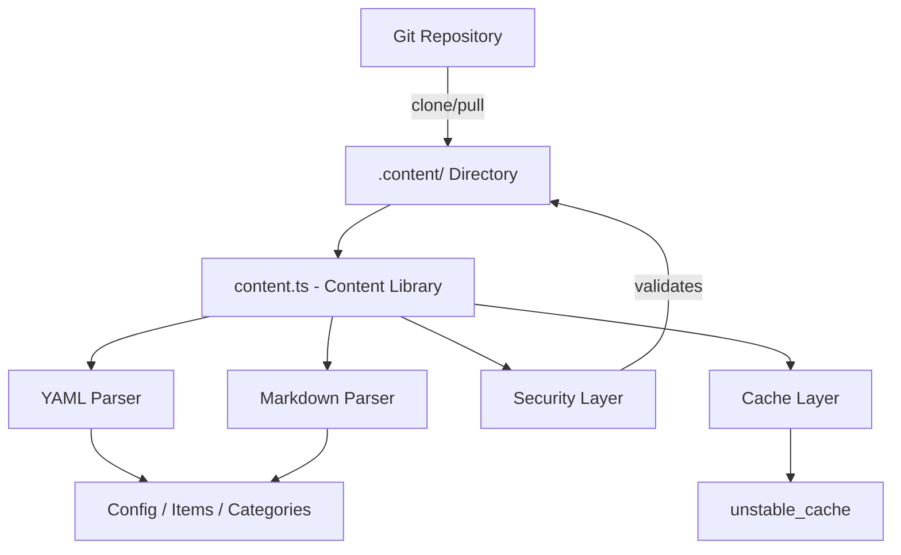
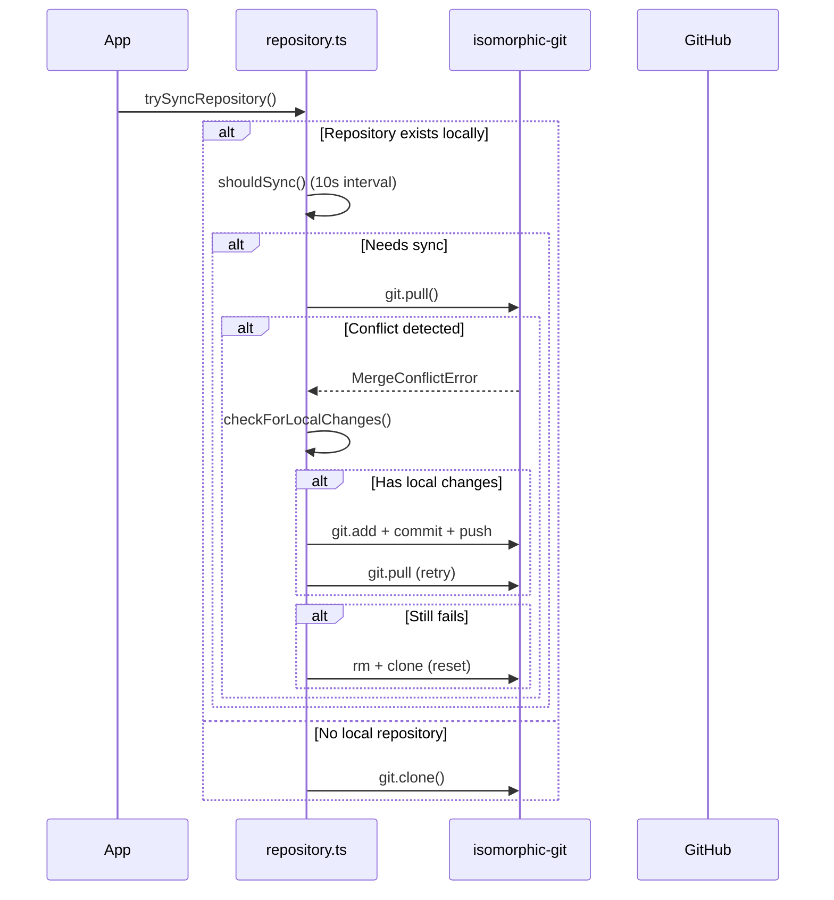

# Inhoudsbibliotheek

De inhoudsbibliotheek (`lib/content.ts`) biedt hulpprogramma's op de server voor het lezen, parseren en cachen van inhoud uit een op Git gebaseerde CMS-repository. Het verwerkt YAML/Markdown-inhoudsbestanden, configuratiebeheer en inhoudssynchronisatie met robuuste beveiligingsmaatregelen.

## Architectuuroverzicht



## Bronbestanden

|Bestand|Doel|
|------|---------|
|`lib/content.ts`|Belangrijkste inhoudsverwerking, lezen en caching|
|`lib/repository.ts`|Git-kloon/pull-synchronisatie met externe repository|
|`lib/lib.ts`|Hulpprogramma's voor paden (`getContentPath`, `fsExists`, `dirExists`)|
|`lib/cache-config.ts`|Cachetags en TTL-configuratie|

## Beveiligingslaag

De inhoudsbibliotheek dwingt meerdere beveiligingsmaatregelen af om pad-traversal- en injectie-aanvallen te voorkomen.

### Validatie van de taalcode

```typescript
function validateLanguageCode(lang: string): boolean {
  const validLangPattern = /^[a-zA-Z0-9_-]+$/;
  return validLangPattern.test(lang) && lang.length <= 10;
}
```

Alleen alfanumerieke tekens, koppeltekens en onderstrepingstekens worden geaccepteerd met een maximale lengte van 10 tekens.

### Opschoning van bestandsnaam

```typescript
function sanitizeFilename(filename: string): string {
  const sanitized = path.basename(filename);
  if (sanitized.includes('..') || sanitized.includes('/') || sanitized.includes('\\')) {
    throw new Error('Invalid filename: contains dangerous characters');
  }
  return sanitized;
}
```

Gebruikt `path.basename` om directorycomponenten te strippen en alle resterende traversal-tekens te weigeren.

### Padvalidatie

```typescript
function validatePath(filepath: string, basePath: string): void {
  const resolvedPath = path.resolve(filepath);
  const resolvedBase = path.resolve(basePath);
  if (!resolvedPath.startsWith(resolvedBase + path.sep) && resolvedPath !== resolvedBase) {
    throw new Error('Invalid file path: outside of allowed directory');
  }
}
```

De functie `safeReadFile` voert een dubbele controle uit: hij valideert het pad en verifieert vervolgens of het opgeloste echte pad (na symlinks) binnen de basismap blijft.

### URL-validatie

```typescript
function isValidUrl(url: string): boolean {
  const trimmed = url.trim();
  if (trimmed.startsWith('/') && !trimmed.startsWith('//')) return true;
  return trimmed.startsWith('http://') || trimmed.startsWith('https://');
}
```

Blokkeert `javascript:`, `data:`, `vbscript:` en andere gevaarlijke protocolschema's.

### Validatie van CSS-grootte

```typescript
function isValidCssSize(value: string): boolean {
  if (['auto', 'inherit', 'initial', 'unset'].includes(value.trim())) return true;
  return /^\d+(\.\d+)?(px|em|rem|vh|vw|%|pt|cm|mm|in)?$/.test(value.trim());
}
```

Voorkomt CSS-injectie via aangepaste hero-frontmatter-velden.

## Inhoudsverwerking

### YAML-parsering

Inhoudsbestanden worden geparseerd met behulp van de `yaml` bibliotheek met Zod-schemavalidatie voor frontmatter:

```typescript
const customHeroFrontmatterSchema = z.object({
  background_image: z.string().refine(isValidUrl, {
    message: 'Invalid URL: must be http, https, or relative path'
  }).optional(),
  // ... additional validated fields
});
```

### Configuratiecaching

Siteconfiguratie wordt in de cache opgeslagen met behulp van Next.js `unstable_cache` met gedefinieerde TTL's en cachetags:

```typescript
import { CACHE_TAGS, CACHE_TTL } from './cache-config';

const getCachedConfig = unstable_cache(
  async () => { /* read and parse config.yml */ },
  [CACHE_TAGS.CONFIG],
  { revalidate: CACHE_TTL }
);
```

## Synchronisatie van Git-repository

De `repository.ts` module beheert Git-bewerkingen met behulp van `isomorphic-git`.

### Synchroniseer stroom



### Time-outbescherming

Alle Git-bewerkingen zijn voorzien van configureerbare time-outs:

```typescript
async function withTimeout<T>(promise: Promise<T>, timeoutMs: number = 120000): Promise<T> {
  const timeoutPromise = new Promise<never>((_, reject) => {
    setTimeout(() => reject(new Error(`Operation timeout after ${timeoutMs}ms`)), timeoutMs);
  });
  return Promise.race([promise, timeoutPromise]);
}
```

### Conflictoplossing

Het systeem handelt fusieconflicten af via een meerstappenstrategie:

1. **Detecteer lokale wijzigingen** via `git.statusMatrix()`
2. **Probeer lokale wijzigingen te pushen voordat u ze verwijdert
3. **Probeer opnieuw te trekken** na succesvol duwen
4. **Volledige reset** (verwijderen + opnieuw klonen) als laatste redmiddel

### Terugvalgedrag

Als `DATA_REPOSITORY` niet is geconfigureerd of het klonen mislukt, maakt het systeem minimale fallback-inhoud:

```typescript
// Creates empty content directory with minimal config
const DEFAULT_CONFIG = `site_name: Website
item_name: Item
items_name: Items
copyright_year: ${new Date().getFullYear()}
`;
```

## Alleen serverhandhaving

Zowel `content.ts` als `repository.ts` gebruiken de import `server-only` om onbedoeld gebruik aan de clientzijde te voorkomen:

```typescript
'use server';
import 'server-only';
```

Dit zorgt ervoor dat inhoudsbewerkingen met toegang tot het bestandssysteem nooit in clientbundels lekken.

## Belangrijkste geëxporteerde functies

|Functie|Beschrijving|
|----------|-------------|
|`getCachedConfig()`|Retourneert de in de cache opgeslagen siteconfiguratie van `config.yml`|
|`trySyncRepository()`|Kloont of haalt inhoud uit de externe Git-repository|
|`pullChanges()`|Haalt de laatste wijzigingen op met conflictoplossing|
|`validateLanguageCode()`|Valideert het i18n-taalcodeformaat|
|`sanitizeFilename()`|Verwijdert mapcomponenten van bestandsnamen|
|`safeReadFile()`|Leest bestanden met volledige bescherming tegen padovergang|
