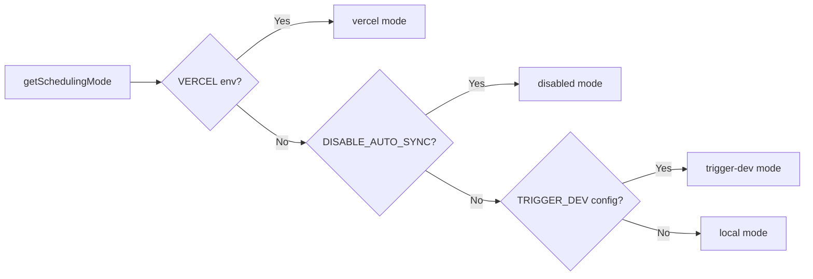

# Cron Job-systeem

## Overzicht

De Ever Works-sjabloon implementeert een flexibel achtergrondtaaksysteem dat drie planningsmodi ondersteunt: **Vercel Cron**, **Trigger.dev** en een **lokale planner**. Cron-eindpunten zijn standaard Next.js API-routes die worden geverifieerd via `CRON_SECRET`, en het systeem bevat een singleton-initialisatiemodule die ervoor zorgt dat taken precies één keer per proces worden ingesteld.

## Architectuur

```mermaid
flowchart TD
    A[Scheduling Mode Detection] --> B{getSchedulingMode}

    B -->|vercel| C[Vercel Cron]
    B -->|trigger-dev| D[Trigger.dev]
    B -->|local| E[Local Scheduler]
    B -->|disabled| F[No Jobs]

    C --> G[vercel.json crons]
    G --> G1[/api/cron/sync]
    G --> G2[/api/cron/subscription-reminders]
    G --> G3[/api/cron/subscription-expiration]

    G1 --> H[CRON_SECRET Verification]
    G2 --> H
    G3 --> H

    H -->|Valid| I[Execute Job]
    H -->|Invalid| J[401 Unauthorized]

    I --> I1[triggerManualSync]
    I --> I2[subscriptionRenewalReminderJob]
    I --> I3[processExpiredSubscriptions]

    D --> K[Trigger.dev SDK]
    E --> L[Internal setInterval]

    K --> I
    L --> I
```

## Bronbestanden

|Bestand|Doel|
|------|---------|
|`template/vercel.json`|Definities van Vercel cron-schema's|
|`template/app/api/cron/sync/route.ts`|Cron-eindpunt voor inhoudsynchronisatie|
|`template/app/api/cron/subscription-reminders/route.ts`|Herinneringsmails voor verlenging|
|`template/app/api/cron/subscription-expiration/route.ts`|Verlopen abonnementsverwerking|
|`template/app/api/cron/jobs/background-jobs-init.ts`|Initialisatie van Singleton-taak|

## Configuratie van Cron-schema

### vercel.json

```json
{
    "crons": [
        {
            "path": "/api/cron/sync",
            "schedule": "0 3 * * *"
        },
        {
            "path": "/api/cron/subscription-reminders",
            "schedule": "0 9 * * *"
        },
        {
            "path": "/api/cron/subscription-expiration",
            "schedule": "0 0 * * *"
        }
    ]
}
```

|Baan|Schema|Tijd|Beschrijving|
|-----|----------|------|-------------|
|Inhoud synchroniseren| `0 3 * * *` |Dagelijks 03:00 UTC|Synchroniseert inhoud van op Git gebaseerd CMS|
|Herinneringen voor abonnementen| `0 9 * * *` |Dagelijks 09:00 UTC|Verstuurt herinneringsmails voor verlenging|
|Vervaldatum abonnement| `0 0 * * *` |Dagelijks middernacht UTC|Verwerkt verlopen abonnementen|

## Authenticatie

### Timing-veilige geheime verificatie

Alle cron-eindpunten verifiëren de `CRON_SECRET` met behulp van timing-safe vergelijking om timing-aanvallen te voorkomen:

```typescript
import crypto from 'crypto';

function verifyCronSecret(request: NextRequest): boolean {
    const authHeader = request.headers.get('authorization');
    const cronSecret = process.env.CRON_SECRET;

    // Development bypass
    if (!cronSecret && process.env.NODE_ENV === 'development') {
        console.log('[Cron] Bypassing cron auth in development');
        return true;
    }

    if (!cronSecret || !authHeader) return false;

    const expectedValue = `Bearer ${cronSecret}`;

    // Length check before timing-safe comparison
    if (authHeader.length !== expectedValue.length) return false;

    return crypto.timingSafeEqual(
        Buffer.from(authHeader, 'utf8'),
        Buffer.from(expectedValue, 'utf8')
    );
}
```

Belangrijkste beveiligingsfuncties:
- **Timing-safe vergelijking** via `crypto.timingSafeEqual` - voorkomt dat aanvallers responstijdverschillen meten om het geheim te raden
- **Lengte vooraf controleren** -- `timingSafeEqual` vereist buffers van gelijke lengte
- **Ontwikkelingsbypass** -- alleen wanneer `CRON_SECRET` niet is geconfigureerd en `NODE_ENV=development`

### Vercel automatische authenticatie

Bij implementatie op Vercel bevat het platform automatisch de `Authorization: Bearer <CRON_SECRET>` header voor geconfigureerde cron-taken. U hoeft alleen de omgevingsvariabele `CRON_SECRET` in het Vercel-dashboard in te stellen.

## Taakimplementaties

### Inhoud synchronisatietaak

```typescript
export async function GET(request: Request): Promise<NextResponse> {
    const startTime = Date.now();

    // Verify authorization
    if (!isAuthorized) {
        return NextResponse.json({ success: false, message: "Unauthorized" }, { status: 401 });
    }

    try {
        const result = await triggerManualSync();
        const duration = Date.now() - startTime;

        return NextResponse.json({
            success: result.success,
            timestamp: new Date().toISOString(),
            duration,
            message: result.message,
        }, {
            headers: { "Cache-Control": "no-cache, no-store, must-revalidate" },
        });
    } catch (error) {
        return NextResponse.json({
            success: false,
            message: "Cron sync failed",
            details: safeErrorMessage(error, "Unknown error"),
        }, { status: 500 });
    }
}
```

Antwoordformaat:
```json
{
    "success": true,
    "timestamp": "2025-01-15T03:00:05.123Z",
    "duration": 5123,
    "message": "Sync completed successfully"
}
```

### Taak voor het verlopen van abonnementen

Deze taak verwerkt verlopen abonnementen en verzendt meldings-e-mails:

```typescript
export async function GET(request: NextRequest) {
    if (!verifyCronSecret(request)) {
        return NextResponse.json({ success: false, message: 'Unauthorized' }, { status: 401 });
    }

    // 1. Find and update expired subscriptions
    const result = await subscriptionService.processExpiredSubscriptions();

    // 2. Send notification emails
    const { service: emailService } = await createEmailService();
    if (emailService.isServiceAvailable()) {
        for (const subscription of result.subscriptions) {
            const user = await getUserById(subscription.userId);
            const emailTemplate = getSubscriptionExpiredTemplate({ /* ... */ });
            await sendEmailSafely(emailService, emailConfig, emailTemplate, user.email);
        }
    }

    // 3. Return results
    return NextResponse.json({
        success: true,
        data: {
            processed: result.processed,
            affectedUsers,
            errors: result.errors,
            timestamp: new Date().toISOString()
        }
    });
}
```

Belangrijkste gedragingen:
- E-mailfouten leiden er niet toe dat de taak mislukt
- De methode `POST` wordt ook geëxporteerd als een alias voor handmatige triggers
- Retourneert `207 Multi-Status` voor gedeeltelijke successen

### Abonnementsherinneringen Taak

```typescript
export async function GET(request: NextRequest) {
    if (!verifyCronSecret(request)) {
        return NextResponse.json({ error: 'Unauthorized' }, { status: 401 });
    }

    const result = await subscriptionRenewalReminderJob();

    if (!result.success) {
        return NextResponse.json(
            { error: 'Job completed with errors', ...result },
            { status: 207 }  // Multi-Status for partial success
        );
    }

    return NextResponse.json({
        message: 'Subscription reminder job completed',
        ...result
    });
}

// Support POST for Vercel Cron
export async function POST(request: NextRequest) {
    return GET(request);
}
```

## Initialisatie van achtergrondtaken

### Singleton-patroon

De initialisatiemodule gebruikt `globalThis` om ervoor te zorgen dat taken precies één keer worden ingesteld, zelfs bij serverloze functie-aanroepen:

```typescript
const GLOBAL_KEY = '__BACKGROUND_JOBS_INIT__' as const;

interface BackgroundJobsGlobalState {
    initializationState: 'pending' | 'initializing' | 'completed';
    initializationPromise: Promise<void> | null;
    loggedMode: SchedulingMode | null;
}

export async function ensureBackgroundJobsInitialized(): Promise<void> {
    // Skip during tests and builds
    if (process.env.NODE_ENV === 'test') return;
    if (process.env.NEXT_PHASE === 'phase-production-build') return;

    const state = getGlobalState();

    // Fast path: already completed
    if (state.initializationState === 'completed') return;

    // Wait for in-progress initialization
    if (state.initializationState === 'initializing') {
        return state.initializationPromise;
    }

    // Start initialization
    state.initializationState = 'initializing';
    state.initializationPromise = doInitialize();

    try {
        await state.initializationPromise;
        state.initializationState = 'completed';
    } catch (error) {
        state.initializationState = 'pending'; // Allow retry
        throw error;
    }
}
```

### Planningsmodi



|Modus|Gedrag|
|------|----------|
|`vercel`|Taken afgehandeld door Vercel Cron via HTTP-eindpunten|
|`trigger-dev`|Taken beheerd door Trigger.dev cloudplanner|
|`local`|Interne `setInterval`-gebaseerde planner voor ontwikkeling|
|`disabled`|Geen automatische planning (`DISABLE_AUTO_SYNC=true`)|

## Omgevingsvariabelen

|Variabel|Vereist|Beschrijving|
|----------|----------|-------------|
|`CRON_SECRET`|Alleen productie|Bearer-token voor cron-authenticatie|
|`DISABLE_AUTO_SYNC`|Nee|Stel in op `true` om alle achtergrondtaken uit te schakelen|
|`VERCEL`|Automatisch ingesteld|Automatisch ingesteld door het Vercel-platform|

## Beste praktijken

1. **Gebruik altijd timing-veilige vergelijking** voor cron-geheimen - voorkomt timingaanvallen
2. **Exporteer zowel GET als POST** -- Vercel Cron kan beide methoden gebruiken
3. **Stel `Cache-Control: no-cache`** in voor reacties - voorkom het cachen van taakresultaten
4. **Taakduur loggen**: helpt bij het identificeren van prestatieregressies
5. **Ga netjes om met e-mailfouten**: zorg ervoor dat foutmeldingen de taak niet laten crashen
6. **Gebruik `207 Multi-Status`** voor gedeeltelijk succes -- onderscheidt zich van volledig succes/mislukking
