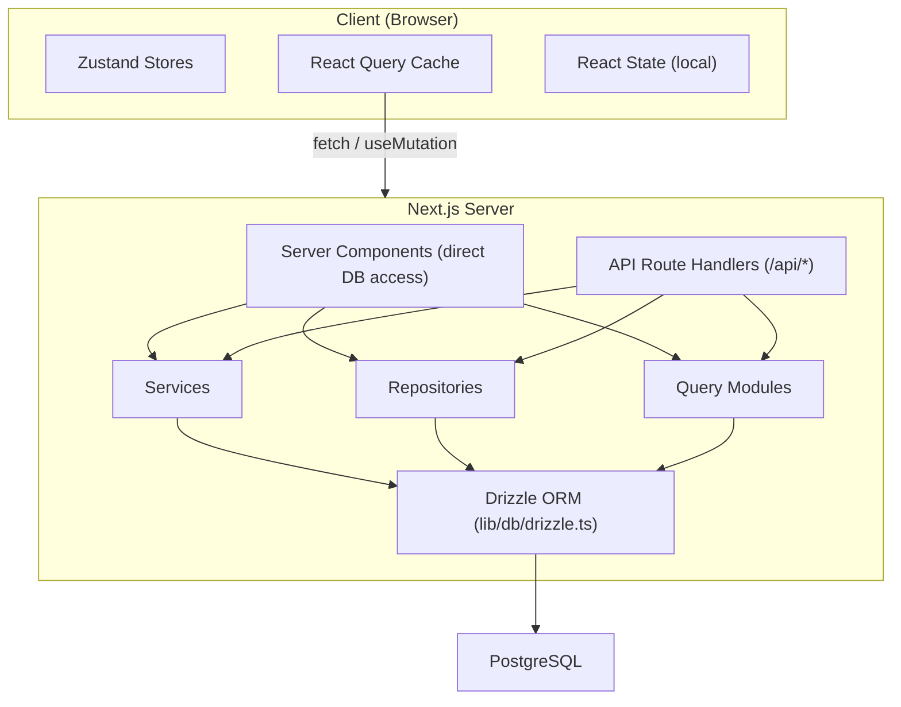

# Gegevensstroom en statusbeheer

Dit document beschrijft hoe gegevens door de Ever Works-sjabloon stromen, van de database naar de gebruikersinterface, met betrekking tot servercomponenten, API-routes, React Query, Zustand-winkels en het repositorypatroon.

## Architectuuroverzicht

De sjabloon maakt gebruik van een meerlaagse data-architectuur:



## Gegevens ophalen aan de serverzijde

### Servercomponenten (directe databasetoegang)

Servercomponenten in de map `app/` kunnen databasequeryfuncties of repositorymethoden rechtstreeks importeren en aanroepen. Dit is het meest efficiënte pad omdat onnodige HTTP-retouren worden vermeden.

```typescript
// app/[locale]/admin/items/page.tsx (simplified)
import { getItems } from '@/lib/db/queries';

export default async function AdminItemsPage() {
  const items = await getItems();
  return <ItemsList items={items} />;
}
```

### API-routehandlers

API-routes in `app/api/` dienen als brug tussen clientcomponenten en logica aan de serverzijde. Ze volgen een thin-handler-patroon: valideren van invoer, bellen de juiste service of repository en retourneren een HTTP-antwoord.

```typescript
// Typical API route pattern
export async function GET(request: NextRequest) {
  const session = await auth();
  if (!session?.user) {
    return NextResponse.json({ error: 'Unauthorized' }, { status: 401 });
  }

  const data = await someRepository.findAll();
  return NextResponse.json({ success: true, data });
}
```

## Staatsbeheer aan de cliëntzijde

### TanStack-query (Reageerquery 5)

React Query is het belangrijkste hulpmiddel voor serverstatusbeheer aan de clientzijde. De sjabloon maakt er uitgebreid gebruik van via aangepaste hooks in de map `hooks/`.

**Algemene configuratie** (`lib/react-query-config.ts`):
- Standaard verouderingstijd: 5 minuten
- Ophaaltijd afval: 10 minuten
- Automatisch opnieuw proberen met exponentiële uitstel (maximaal 3 nieuwe pogingen)
- Herstel de vensterfocus en maak opnieuw verbinding
- Geen nieuwe poging bij 4xx-clientfouten

**Haakpatroon**: elk functiegebied heeft speciale haken die React Query omwikkelen:

```typescript
// hooks/use-admin-items.ts (simplified pattern)
import { useQuery, useMutation, useQueryClient } from '@tanstack/react-query';

export function useAdminItems(params) {
  return useQuery({
    queryKey: ['admin', 'items', params],
    queryFn: () => fetch('/api/admin/items').then(r => r.json()),
    staleTime: 5 * 60 * 1000,
  });
}

export function useCreateItem() {
  const queryClient = useQueryClient();
  return useMutation({
    mutationFn: (data) => fetch('/api/admin/items', {
      method: 'POST',
      body: JSON.stringify(data),
    }).then(r => r.json()),
    onSuccess: () => {
      queryClient.invalidateQueries({ queryKey: ['admin', 'items'] });
    },
  });
}
```

### Zustand-winkels

Zustand wordt gebruikt voor een client-only UI-status waarvoor geen serversynchronisatie nodig is. Voorbeelden zijn onder meer:

- **Themastatus**: Voorkeur voor licht/donker-modus
- **Filterstatus**: actieve filterselecties
- **Modale status**: Open/gesloten status voor modals en overlays
- **Indelingsvoorkeuren**: raster- versus lijstweergave, zijbalkstatus

### Reageercontext

Reageercontextproviders in `components/context/` en `components/providers/` leveren een gedeelde status aan componentsubstructuren. De rootproviders-wrapper (`app/[locale]/providers.tsx`) bestaat uit:

- React Query-provider (met query-client)
- Thema-aanbieder
- Provider van authenticatiesessie
- Provider van toastmeldingen

## Gegevenstoegangslagen

### Bewaarpatroon

Opslagplaatsen in `lib/repositories/` bieden een zuivere abstractie van databasebewerkingen. Elke repository bevat query's voor een specifieke domeinentiteit.

```
lib/repositories/
├── admin-analytics-optimized.repository.ts
├── admin-stats.repository.ts
├── category.repository.ts
├── client-dashboard.repository.ts
├── client-item.repository.ts
├── collection.repository.ts
├── integration-mapping.repository.ts
├── item.repository.ts
├── role.repository.ts
├── sponsor-ad.repository.ts
├── tag.repository.ts
├── twenty-crm-config.repository.ts
└── user.repository.ts
```

### Querymodules

De map `lib/db/queries/` bevat meer dan 23 querymodules, georganiseerd per domein. Deze bieden onbewerkte Drizzle ORM-queryfuncties die opslagplaatsen en services gebruiken.

### Dienstenlaag

De map `lib/services/` bevat meer dan 30 servicebestanden die bedrijfslogica implementeren. Services orkestreren meerdere opslagplaatsen, externe API-aanroepen en bijwerkingen (e-mail, meldingen, webhooks).

## API-clientarchitectuur

### Server-side API-client

`lib/api/server-api-client.ts` biedt een gecentraliseerde HTTP-client voor oproepen aan de serverzijde met:
- Automatische nieuwe poging met exponentiële uitstel
- Configureerbare time-outs (standaard 30 seconden)
- Gestructureerd inloggen in ontwikkeling
- Normalisatie van fouten

### Browser-side API-client

`lib/api/api-client.ts` en `lib/api/api-client-class.ts` bieden de API-abstractie aan de clientzijde die wordt gebruikt door React Query-hooks om API-routes aan te roepen.

## Inhoudsgegevens (op Git gebaseerd CMS)

Iteminhoud (directorylijsten) wordt opgeslagen in een Git-repository en beheerd via `lib/content.ts` en `lib/repository.ts`. Deze inhoud wordt tijdens de build naar `.content/` gekloond en periodiek gesynchroniseerd. Het inhoudssysteem gebruikt `isomorphic-git` voor Git-bewerkingen rechtstreeks vanuit Node.js.

## Cache-strategie

De sjabloon implementeert een caching-aanpak op meerdere niveaus:

1. **React Query-cache**: clientzijde met configureerbare verouderde/GC-tijden per query
2. **Next.js cache**: rendering aan de serverzijde en gegevenscache via `lib/cache-config.ts`
3. **Cache-invalidatie**: gerichte ongeldigverklaring via `lib/cache-invalidation.ts` met behulp van hervalidatietags
4. **pooling van databaseverbindingen**: geconfigureerd in `lib/db/drizzle.ts` met poolgroottes tussen 1-50 verbindingen
