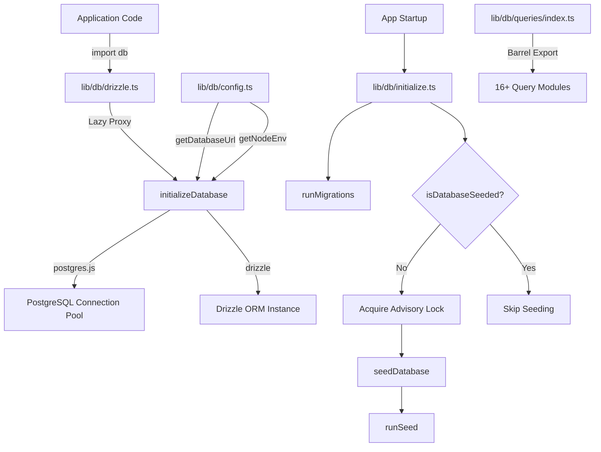
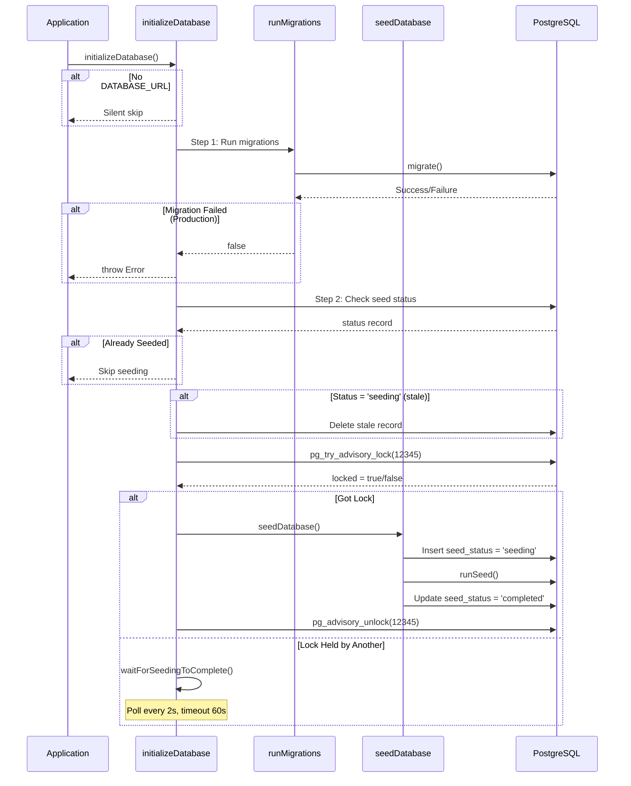

# Module Databasehulpprogramma's

De module voor databasehulpprogramma's (`template/lib/db/`) beheert het poolen van PostgreSQL-verbindingen via `postgres.js`, Drizzle ORM-initialisatie, geautomatiseerde migraties en databasezaaien met gelijktijdigheidsveilige vergrendeling. Het is ontworpen om te werken in serverloze omgevingen (Vercel) waar meerdere koude starts kunnen racen om de database te initialiseren.

## Architectuuroverzicht



## Bronbestanden

|Bestand|Beschrijving|
|------|-------------|
|`lib/db/config.ts`|Scriptveilige databaseconfiguratie (geen `server-only`)|
|`lib/db/drizzle.ts`|Verbindingspool en Drizzle-instantie met luie proxy|
|`lib/db/initialize.ts`|Automatische migratie en zaaiorkestratie|
|`lib/db/migrate.ts`|Migratie loper|
|`lib/db/queries/index.ts`|Vatexport voor alle querymodules|

## Databaseconfiguratie (`config.ts`)

Scriptveilige functies die **niet** `server-only` importeren, waardoor gebruik in migratie- en zaadscripts mogelijk is:

```typescript
function getDatabaseUrl(): string | undefined;
function getNodeEnv(): 'development' | 'production' | 'test';
function isProduction(): boolean;
```

## Verbinding en ORM (`drizzle.ts`)

### Lui proxy-patroon

De `db`-export gebruikt JavaScript `Proxy` om de initialisatie van de verbinding uit te stellen tot het eerste gebruik. Dit voorkomt verbindingsfouten tijdens het bouwen, wanneer `DATABASE_URL` mogelijk niet beschikbaar is.

```typescript
// Proxy intercepts all property access and initializes on demand
export const db = new Proxy({} as ReturnType<typeof drizzle>, {
  get(target, prop) {
    const database = initializeDatabase();
    return database[prop as keyof typeof database];
  },
});
```

### Configuratie van verbindingspool

```typescript
function getPoolSize(): number;
// - Reads DB_POOL_SIZE env var (clamped to 1-50)
// - Defaults: 20 (production), 10 (development)
```

Zwembadinstellingen:
- `idle_timeout`: 20 seconden
- `connect_timeout`: 30 seconden
- `prepare`: false (vereist voor sommige serverloze omgevingen)

### Singleton via `globalThis`

De verbinding wordt in de cache opgeslagen op `globalThis` om het opnieuw laden van de Hot-module van Next.js tijdens de ontwikkeling te overleven:

```typescript
const globalForDb = globalThis as unknown as {
  conn: postgres.Sql | undefined;
  db: ReturnType<typeof drizzle> | undefined;
};
```

### Directe toegang tot instanties

Voor gevallen waarbij de daadwerkelijke Drizzle-instantie vereist is (bijvoorbeeld de NextAuth.js Drizzle-adapter):

```typescript
import { getDrizzleInstance } from '@/lib/db/drizzle';

const adapter = DrizzleAdapter(getDrizzleInstance(), { ... });
```

## Migratie Runner (`migrate.ts`)

### `runMigrations(): Promise<boolean>`

Voert Drizzle-migraties uit vanuit de map `./lib/db/migrations`. Je kunt bij elke startup veilig een beroep doen, omdat `migrate()` van Drizzle idempotent is: het volgt toegepaste migraties in een `__drizzle_migrations`-tabel.

```typescript
import { runMigrations } from '@/lib/db/migrate';

const success = await runMigrations();
if (!success) {
  console.error('Migrations failed -- run pnpm db:migrate manually');
}
```

**Gedrag:**
- Registreert de recente migratiegeschiedenis voor en na de uitvoering
- Retourneert `true` bij succes, `false` bij mislukking
- Gooit niet: fouten worden geregistreerd en geretourneerd als Boolean

## Database-initialisatie (`initialize.ts`)

### `initializeDatabase(): Promise<void>`

De belangrijkste initialisatiefunctie wordt aangeroepen bij het opstarten van de applicatie. Behandelt de volledige levenscyclus:



### Gelijktijdigheid veiligheid

Meerdere serverloze instanties kunnen tegelijkertijd starten. De module voorkomt dubbele plaatsing met behulp van:

1. **PostgreSQL-adviesvergrendeling** (`pg_try_advisory_lock(12345)`) -- niet-blokkerend
2. **Zaadstatustabel** tracking `seeding`, `completed`, `failed` staten
3. **Verouderde detectie** -- Drempel van 5 minuten voor vastzittende `seeding`-status
4. **Wait-and-poll**: instanties die de vergrendelingspeiling niet elke 2 seconden kunnen verkrijgen

### Helperfuncties

```typescript
// Check if database has been successfully seeded
async function isDatabaseSeeded(): Promise<boolean>;

// Wait for another instance to finish seeding (60s timeout, 2s intervals)
async function waitForSeedingToComplete(): Promise<boolean>;
```

## Querymodules

De map `lib/db/queries/` bevat domeinspecifieke querymodules, allemaal opnieuw geëxporteerd via `index.ts`:

|Module|Domein|
|--------|--------|
|`activity.queries.ts`|Activiteitenregistratie|
|`auth.queries.ts`|Authenticatie (gebruikers opzoeken, wachtwoordverificatie)|
|`client.queries.ts`|Klantprofielen|
|`comment.queries.ts`|Opmerkingen|
|`company.queries.ts`|Bedrijfsprofielen|
|`dashboard.queries.ts`|Dashboardstatistieken|
|`engagement.queries.ts`|Weergaven, stemmen, aggregatie van favorieten|
|`item.queries.ts`|Artikel CRUD|
|`location-index.queries.ts`|Locatiegebaseerde indexering|
|`newsletter.queries.ts`|Nieuwsbriefabonnementen|
|`payment.queries.ts`|Betalingsgegevens|
|`report.queries.ts`|Rapporten|
|`subscription.queries.ts`|Abonnementen|
|`survey.queries.ts`|Enquêtes en reacties|
|`user.queries.ts`|Gebruikersbeheer|
|`vote.queries.ts`|Stemsysteem|

### Patroon importeren

```typescript
import {
  getUserByEmail,
  getClientProfileByUserId,
  logActivity,
  isUserAdmin,
} from '@/lib/db/queries';
```

## Omgevingsvariabelen

|Variabel|Vereist|Beschrijving|
|----------|----------|-------------|
|`DATABASE_URL`|Nee (optioneel DB)|PostgreSQL-verbindingsreeks|
|`DB_POOL_SIZE`|Nee|Grootte van verbindingspool (standaard: 10/20)|
|`NODE_ENV`|Nee|Bepaalt de standaardwaarden voor de poolgrootte en logboekregistratie|
