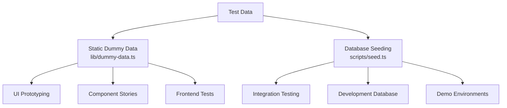
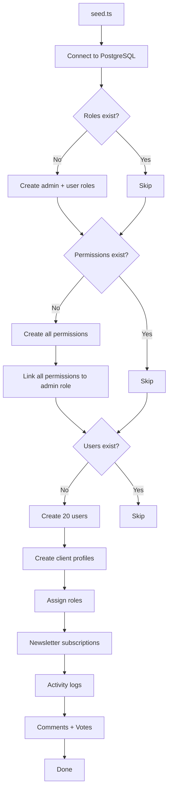
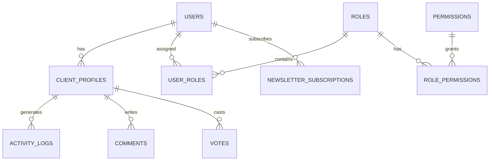

# Dummy-gegevenssysteem

De sjabloon biedt twee benaderingen voor het testen van gegevens: statische dummygegevens voor UI-ontwikkeling en prototyping, en een database-zaaisysteem voor het genereren van realistische records in PostgreSQL. Samen bestrijken ze de volledige ontwikkelingslevenscyclus, van mockups tot integratietests.

## Overzicht



## Statische dummygegevens

De module `lib/dummy-data.ts` exporteert getypte voorbeeldgegevens voor gebruik in componenten tijdens de ontwikkeling.

### Indieningsinterface

```typescript
export interface Submission {
  id: string;
  title: string;
  description: string;
  status: "approved" | "pending" | "rejected";
  submittedAt: string | null;
  approvedAt?: string;
  rejectedAt?: string;
  rejectionReason?: string;
  category: string;
  tags: string[];
  views: number;
  likes: number;
}
```

### dummyInzendingen

Zes voorbeeldinzendingen die alle statusstatussen bestrijken:

|Identiteitskaart|Titel|Status|Categorie|Bekeken|Vind ik leuk|
|---|---|---|---|---|---|
| 1 |Modern e-commerceplatform|goedgekeurd|Webontwikkeling| 1250 | 89 |
| 2 |Taakbeheer-app|in afwachting|Mobiele ontwikkeling| 567 | 23 |
| 3 |Weerdashboard|afgewezen|Webontwikkeling| 890 | 45 |
| 4 |AI-chatassistent|goedgekeurd|AI/ML| 2100 | 156 |
| 5 |Fitness-tracking-app|in afwachting|Mobiele ontwikkeling| 432 | 18 |
| 6 |Blogplatform|in afwachting|Webontwikkeling| 0 | 0 |

Gebruik in componenten:

```typescript
import { dummySubmissions } from '@/lib/dummy-data';

export function SubmissionList() {
  return (
    <div>
      {dummySubmissions.map((submission) => (
        <SubmissionCard key={submission.id} submission={submission} />
      ))}
    </div>
  );
}
```

### dummyPortfolio

Drie voorbeeldportfolio-items voor het presenteren van projectkaarten:

|Identiteitskaart|Titel|Uitgelicht|Labels|
|---|---|---|---|
| 1 |E-commerceplatform|Ja|Next.js, Stripe, E-commerce|
| 2 |Taakbeheer-app|Ja|Reageer, Firebase, realtime|
| 3 |Weerdashboard|Nee|Vue.js, Weer-API, Dashboard|

Elk portfolio-item omvat:

```typescript
{
  id: string;
  title: string;
  description: string;
  imageUrl: string;      // Unsplash placeholder image
  externalUrl: string;   // Demo link
  tags: string[];
  isFeatured: boolean;
}
```

## Databasezaaien

Het `scripts/seed.ts`-script genereert realistische gegevens rechtstreeks in PostgreSQL met behulp van Drizzle ORM.

### Zaaiende architectuur



### Gegevensrelaties



### Gegenereerde gebruikersprofielen

De seeder creëert profielen met deterministische variatie:

```typescript
// Plan distribution
plan: i % 5 === 0 ? 'premium'    // 20% premium
    : i % 3 === 0 ? 'standard'   // ~13% standard
    : 'free';                     // ~67% free

// Job titles alternate
jobTitle: i % 2 === 0 ? 'Developer' : 'Designer';

// Companies alternate
company: i % 2 === 0 ? 'Acme Inc.' : 'Globex';

// Bios for every 3rd user
bio: i % 3 === 0 ? 'Power user' : null;
```

### Patronen van activiteitenlogboeken

Activiteitenlogboeken doorlopen vier actietypen:

|Indexpatroon|Actie|Beschrijving|
|---|---|---|
|`i % 4 === 0`|`SIGN_UP`|Account aanmaken|
|`i % 4 === 1`|`SIGN_IN`|Inloggen evenement|
|`i % 4 === 2`|`COMMENT`|Reactie geplaatst|
|`i % 4 === 3`|`VOTE`|Stem uitgebracht|

Tijdstempels zijn willekeurig binnen de afgelopen 7 dagen.

### Stemverdeling

Stemmen gebruiken een 75/25-verdeling ten gunste van upvotes:

```typescript
voteType: i % 4 === 0 ? VoteType.DOWNVOTE : VoteType.UPVOTE
```

### Verbindingsconfiguratie

De seeder gebruikt conservatieve verbindingsinstellingen die geschikt zijn voor scripts:

```typescript
const conn = postgres(databaseUrl, {
  max: 1,              // Single connection (no pool needed)
  idle_timeout: 20,    // Close idle connections after 20s
  connect_timeout: 10, // 10-second connection timeout
  prepare: false,      // Disable prepared statements
});
```

## Streepproduct zaaien

Het `scripts/seed-stripe-products.ts`-script maakt de factureringscatalogus in Stripe. Zie de documentatie bij [Database Scripts](../development/database-scripts.md) voor de volledige productlijst.

## Idempotentie

Beide zaaibenaderingen zijn ontworpen om veilig te zijn voor herhaalde uitvoering:

|Gegevenstype|Bewakingsconditie|Gedrag bij opnieuw uitvoeren|
|---|---|---|
|Rollen|`SELECT * FROM roles LIMIT 1`|Sla over als deze bestaat|
|Machtigingen|`SELECT * FROM permissions LIMIT 1`|Sla over als deze bestaat|
|Gebruikers|`SELECT count(*) FROM users`|Overslaan als aantal > 0|
|Nieuwsbrief|Opgenomen in het blok voor het aanmaken van gebruikers|Overgeslagen met gebruikers|

## Dummygegevens gebruiken bij ontwikkeling

### Patroon 1: Prototyping van componenten

Gebruik statische dummygegevens om UI-componenten te bouwen voordat de backend gereed is:

```typescript
import { dummySubmissions, type Submission } from '@/lib/dummy-data';

interface SubmissionCardProps {
  submission: Submission;
}

export function SubmissionCard({ submission }: SubmissionCardProps) {
  const statusColors = {
    approved: 'bg-green-100 text-green-800',
    pending: 'bg-yellow-100 text-yellow-800',
    rejected: 'bg-red-100 text-red-800',
  };

  return (
    <div className="p-4 border rounded-lg">
      <h3>{submission.title}</h3>
      <span className={statusColors[submission.status]}>
        {submission.status}
      </span>
      <p>{submission.description}</p>
      <div className="flex gap-2">
        {submission.tags.map(tag => (
          <span key={tag} className="badge">{tag}</span>
        ))}
      </div>
    </div>
  );
}
```

### Patroon 2: Dashboardmodellen

```typescript
import { dummySubmissions } from '@/lib/dummy-data';

// Derive stats from dummy data
const stats = {
  total: dummySubmissions.length,
  approved: dummySubmissions.filter(s => s.status === 'approved').length,
  pending: dummySubmissions.filter(s => s.status === 'pending').length,
  rejected: dummySubmissions.filter(s => s.status === 'rejected').length,
  totalViews: dummySubmissions.reduce((sum, s) => sum + s.views, 0),
};
```

### Patroon 3: Vervang door echte gegevens

Wanneer de backend-integratie gereed is, wisselt u de import:

```typescript
// Before (dummy data)
import { dummySubmissions } from '@/lib/dummy-data';
const submissions = dummySubmissions;

// After (real data)
const submissions = await getSubmissions();
```

## Nieuwe dummygegevens toevoegen

Wanneer u nieuwe functies toevoegt, breidt u `lib/dummy-data.ts` uit met getypte voorbeeldgegevens:

1. Definieer de TypeScript-interface voor de gegevensvorm
2. Exporteer het voor gebruik in componenten
3. Maak voorbeeldinvoer voor randgevallen (lege velden, tekenreeksen met maximale lengte, alle statuswaarden)
4. Gebruik realistische waarden (eigennamen, geldige URL's, redelijke cijfers)
5. Voeg indien van toepassing zowel aanbevolen als niet-uitgelichte items toe

```typescript
// Example: adding dummy reviews
export interface DummyReview {
  id: string;
  authorName: string;
  rating: number;
  comment: string;
  createdAt: string;
}

export const dummyReviews: DummyReview[] = [
  {
    id: "1",
    authorName: "Jane Developer",
    rating: 5,
    comment: "Excellent tool for rapid prototyping",
    createdAt: "2024-02-01T10:00:00Z"
  },
  // ... more entries covering 1-star, no comment, etc.
];
```
