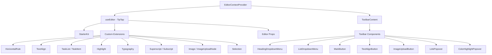

# Editor-systeem

De sjabloon bevat een rich-text-editor gebouwd op TipTap (ProseMirror) met een modulaire architectuur van extensies, werkbalkcomponenten, hooks en hulpprogramma's. De editor ondersteunt koppen, lijsten, takenlijsten, afbeeldingen, codeblokken, tekstopmaak en meer.

## Architectuuroverzicht



## Bronbestanden

|Directory|Inhoud|
|-----------|----------|
|`lib/editor/extensions/`|TipTap-extensie wordt opnieuw geëxporteerd en geconfigureerd|
|`lib/editor/components/`|UI-componenten (werkbalkknoppen, popovers, pictogrammen)|
|`lib/editor/hooks/`|Reageer hooks voor statusbeheer van de editor|
|`lib/editor/providers/`|Editor-contextprovider met extensie-instellingen|
|`lib/editor/contents/`|Werkbalkindeling en inhoudscomponenten van de editor|
|`lib/editor/utils/`|Utility-functies (snelkoppelingen, validatie, uploaden)|

## Extensieconfiguratie

Extensies worden geregistreerd in de `EditorContextProvider`. De `StarterKit` biedt basisfunctionaliteit, met daarbovenop nog extra uitbreidingen:

```typescript
const extensions = useMemo(() => [
  StarterKit.configure({
    horizontalRule: false,
    link: { openOnClick: false, enableClickSelection: true },
  }),
  HorizontalRule,
  TextAlign.configure({ types: ['heading', 'paragraph'] }),
  ImageUploadNode.configure({
    accept: 'image/*',
    maxSize: MAX_FILE_SIZE, // 5MB
    limit: 3,
    upload: handleImageUpload,
    onError: (error) => console.error('Upload failed:', error),
  }),
  TaskList,
  TaskItem.configure({ nested: true }),
  Highlight.configure({ multicolor: true }),
  Image,
  Typography,
  Superscript,
  Subscript,
  Selection,
], []);
```

### Samenvatting van de extensie

|Verlenging|Bron|Doel|
|-----------|--------|---------|
|`StarterKit`|`@tiptap/starter-kit`|Alinea's, vet, cursief, lijsten, code, blockquote|
|`HorizontalRule`|`@tiptap/extension-horizontal-rule`|Horizontale verdelers|
|`TextAlign`|`@tiptap/extension-text-align`|Links, midden, rechts, uitlijning uitvullen|
|`TaskList` / `TaskItem`|`@tiptap/extension-list`|Interactieve selectievakjeslijsten|
|`Highlight`|`@tiptap/extension-highlight`|Meerkleurige tekstmarkering|
|`Typography`|`@tiptap/extension-typography`|Slimme aanhalingstekens, streepjes, weglatingstekens|
|`Superscript`|`@tiptap/extension-superscript`|Superscript-tekst|
|`Subscript`|`@tiptap/extension-subscript`|Subscripttekst|
|`Selection`|`@tiptap/extensions`|Verbeterde selectieverwerking|
|`Image`|`@tiptap/extension-image`|Statische beeldweergave|
|`ImageUploadNode`|Aangepast|Uploaden van afbeeldingen via slepen en neerzetten met voortgang|

## Editor-contextprovider

De editor wordt geleverd via React Context voor boombrede toegang:

```typescript
export const EditorContext = createContext<Editor | null>(null);

export function EditorContextProvider({ children }: { children: React.ReactNode }) {
  const editor = useEditor({
    immediatelyRender: false,
    shouldRerenderOnTransaction: false,
    editorProps: {
      attributes: {
        autocomplete: 'on',
        autocorrect: 'on',
        autocapitalize: 'off',
        'aria-label': 'Main content area, start typing to enter text.',
        class: cn('min-h-96'),
      },
    },
    extensions,
  });

  return <EditorContext.Provider value={editor}>{children}</EditorContext.Provider>;
}
```

Belangrijkste configuratiekeuzes:
- `immediatelyRender: false` voorkomt SSR-hydratatie-mismatches
- `shouldRerenderOnTransaction: false` optimaliseert de prestaties door onnodige herweergave te voorkomen

## Werkbalkconfiguratie

De component `ToolbarContent` definieert de volledige lay-out van de werkbalk, georganiseerd in groepen:

|Groep|Componenten|
|-------|------------|
|Geschiedenis|Ongedaan maken, opnieuw uitvoeren|
|Bloktypen|Dropdownmenu voor kop (H1-H4), vervolgkeuzelijst Lijst (opsommingsteken, geordend, taak), Blockquote, Codeblok|
|Inline-markeringen|Vet, cursief, doorhalen, code, onderstrepen, kleurmarkering, link|
|Script|Superscript, subscript|
|Uitlijning|Links, Midden, Rechts, Uitvullen|
|Media|Afbeelding uploaden|

Groepen worden gescheiden door `ToolbarSeparator` componenten met `Spacer` elementen voor positionering.

## Redacteur Haken

### `useTiptapEditor`

Biedt flexibele toegang tot de editorinstantie, hetzij vanuit rekwisieten of context:

```typescript
export function useTiptapEditor(providedEditor?: Editor | null): {
  editor: Editor | null;
  editorState?: Editor["state"];
  canCommand?: Editor["can"];
}
```

Deze hook voegt een direct geleverde editor samen met de contexteditor, waardoor componenten zowel zelfstandig als binnen de providerboom kunnen werken.

### Extra haken

|Haak|Doel|
|------|---------|
|`use-editor.ts`|Kernredacteur staatsbeheer|
|`use-editor-sync.ts`|Synchronisatie tussen editorinstanties|
|`use-cursor-visibility.ts`|Cursorpositie en zichtbaarheid volgen|
|`use-element-rect.ts`|Elementbegrenzende rechthoek volgen|
|`use-scrolling.ts`|Scrollpositie en gedrag|
|`use-throttled-callback.ts`|Beperkte callback-uitvoering|
|`use-window-size.ts`|Responsieve tracking van venstergrootte|
|`use-unmount.ts`|Opschonen bij het ontkoppelen van componenten|

## Nuttige functies

### Opmaak van sneltoetsen

Het systeem verwerkt platformspecifieke sneltoetsen:

```typescript
export const MAC_SYMBOLS: Record<string, string> = {
  mod: "Command", command: "Command", meta: "Command",
  ctrl: "Ctrl", alt: "Option", shift: "Shift",
  // ... additional mappings
};

export const formatShortcutKey = (key: string, isMac: boolean, capitalize?: boolean) => {
  // Returns Mac symbols or formatted key names
};

export const parseShortcutKeys = (props: {
  shortcutKeys: string | undefined;
  delimiter?: string;
  capitalize?: boolean;
}) => string[];
```

### Schemavalidatie

```typescript
// Check if a mark type exists in the editor schema
export const isMarkInSchema = (markName: string, editor: Editor | null): boolean;

// Check if a node type exists in the editor schema
export const isNodeInSchema = (nodeName: string, editor: Editor | null): boolean;

// Check if extensions are registered
export function isExtensionAvailable(editor: Editor | null, extensionNames: string | string[]): boolean;
```

### Knooppuntnavigatie

```typescript
// Find a node at a specific document position
export function findNodeAtPosition(editor: Editor, position: number): TiptapNode | null;

// Find a node by reference or position
export function findNodePosition(props: {
  editor: Editor | null;
  node?: TiptapNode | null;
  nodePos?: number | null;
}): { pos: number; node: TiptapNode } | null;

// Move focus to the next node
export function focusNextNode(editor: Editor): boolean;
```

### Afbeelding uploaden

```typescript
export const MAX_FILE_SIZE = 5 * 1024 * 1024; // 5MB

export const handleImageUpload = async (
  file: File,
  onProgress?: (event: { progress: number }) => void,
  abortSignal?: AbortSignal
): Promise<string>;
```

De uploadhandler valideert de bestandsgrootte, ondersteunt het bijhouden van de voortgang en verwerkt de annulering via `AbortSignal`.

### URL-opschoning

```typescript
export function isAllowedUri(uri: string | undefined, protocols?: ProtocolConfig): boolean;
export function sanitizeUrl(inputUrl: string, baseUrl: string, protocols?: ProtocolConfig): string;
```

Zorgt ervoor dat alleen veilige protocollen (`http`, `https`, `ftp`, `mailto`, enz.) zijn toegestaan in links. Onveilige URL's worden vervangen door `"#"`.
