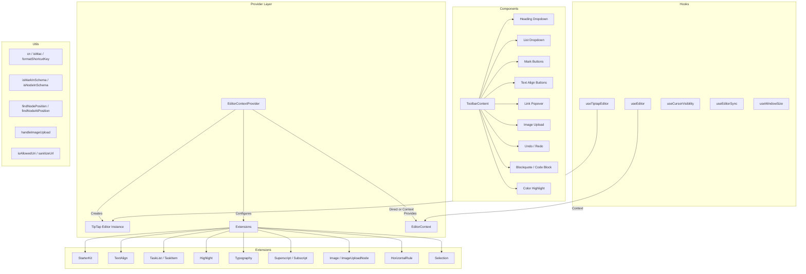

# Module Editor-hulpprogramma's

De module voor editorhulpprogramma's (`template/lib/editor/`) biedt een complete oplossing voor het bewerken van rijke tekst, gebouwd op **TipTap** (ProseMirror). Het bevat een vooraf geconfigureerde editorprovider, TipTap-extensies, een volledige bibliotheek met werkbalkcomponenten, hulpprogrammafuncties voor DOM-manipulatie en aangepaste React-hooks voor het beheer van de editorstatus.

## Architectuuroverzicht



## Bronbestanden

|Directory|Beschrijving|
|-----------|-------------|
|`lib/editor/index.ts`|Vatexport voor alle submodules|
|`lib/editor/providers/`|`EditorContextProvider` en `EditorContext`|
|`lib/editor/extensions/`|TipTap-extensie wordt opnieuw geëxporteerd|
|`lib/editor/hooks/`|Aangepaste React-haken|
|`lib/editor/utils/`|Nuttige functies|
|`lib/editor/contents/`|`ToolbarContent` en `EditorContent` componenten|
|`lib/editor/components/`|UI-primitieven, werkbalkknoppen, pictogrammen, knooppunten|
|`lib/editor/styles/`|CSS-stijlen van de editor|

## Redacteur-aanbieder

### `EditorContextProvider`

Verpakt kinderen met een vooraf geconfigureerde TipTap-editorinstantie:

```tsx
import { EditorContextProvider } from '@/lib/editor';

function MyEditor() {
  return (
    <EditorContextProvider>
      <ToolbarContent editor={null} />
      <EditorContent />
    </EditorContextProvider>
  );
}
```

### Configuratie

De provider configureert TipTap met deze instellingen:

```typescript
const editor = useEditor({
  immediatelyRender: false,
  shouldRerenderOnTransaction: false,
  editorProps: {
    attributes: {
      autocomplete: 'on',
      autocorrect: 'on',
      autocapitalize: 'off',
      'aria-label': 'Main content area, start typing to enter text.',
      class: 'min-h-96',
    },
  },
  extensions: [/* ... */],
});
```

### Vooraf geconfigureerde extensies

|Verlenging|Configuratie|
|-----------|--------------|
|`StarterKit`|`horizontalRule: false`, `link.openOnClick: false`|
|`HorizontalRule`|Standaard|
|`TextAlign`|Geldt voor `heading` en `paragraph` knooppunten|
|`ImageUploadNode`|Accepteren: `image/*`, max. 5 MB, limiet 3 afbeeldingen|
|`TaskList` / `TaskItem`|Geneste taken ingeschakeld|
|`Highlight`|Meerkleurig ingeschakeld|
|`Image`|Standaard|
|`Typography`|Slimme aanhalingstekens en streepjes|
|`Superscript` / `Subscript`|Standaard|
|`Selection`|Standaard|

## Haken

### `useEditor(): Editor`

Haalt de editorinstantie op uit de `EditorContext`. Moet worden gebruikt binnen een `EditorContextProvider`.

```typescript
import { useEditor } from '@/lib/editor';

function MyComponent() {
  const editor = useEditor();
  // editor is the TipTap Editor instance
}
```

### `useTiptapEditor(providedEditor?): { editor, editorState?, canCommand? }`

Flexibele hook die een optionele editorinstantie accepteert of terugvalt op de TipTap-context:

```typescript
import { useTiptapEditor } from '@/lib/editor/hooks';

function ToolbarButton({ editor: externalEditor }) {
  const { editor, editorState, canCommand } = useTiptapEditor(externalEditor);

  const isBold = editorState ? editor?.isActive('bold') : false;
  const canBold = canCommand ? canCommand().toggleBold() : false;
}
```

### Andere haken

|Haak|Doel|
|------|---------|
|`useCursorVisibility`|Houdt de zichtbaarheid van de cursorpositie in het kijkvenster bij|
|`useEditorSync`|Synchroniseert editorinhoud met externe status|
|`useElementRect`|Volgt de grensrechthoek van het element|
|`useScrolling`|Detecteert de scrollstatus|
|`useThrottledCallback`|Beperkt een callback-functie|
|`useUnmount`|Voert een opschoning uit bij het ontkoppelen van componenten|
|`useWindowSize`|Houdt raamafmetingen bij|

## Nuttige functies

### Helper voor klassenaam

```typescript
function cn(...classes: (string | boolean | undefined | null)[]): string;
// Filters falsy values and joins with space
cn('min-h-96', isActive && 'bg-blue-500', undefined); // 'min-h-96 bg-blue-500'
```

### Platformdetectie

```typescript
function isMac(): boolean;
// Returns true if navigator.platform includes 'mac'
```

### Opmaak van sneltoetsen

```typescript
function formatShortcutKey(key: string, isMac: boolean, capitalize?: boolean): string;
// Mac: 'ctrl' -> '???', 'alt' -> '???', 'shift' -> '???', 'meta' -> '???'
// Windows: 'ctrl' -> 'Ctrl'

function parseShortcutKeys(props: {
  shortcutKeys: string | undefined;
  delimiter?: string;    // default: '+'
  capitalize?: boolean;  // default: true
}): string[];
// 'ctrl+shift+b' -> ['???', '???', 'B'] (Mac) or ['Ctrl', 'Shift', 'B'] (Windows)
```

### Schema-inspectie

```typescript
function isMarkInSchema(markName: string, editor: Editor | null): boolean;
// Checks if a mark type exists in the editor schema

function isNodeInSchema(nodeName: string, editor: Editor | null): boolean;
// Checks if a node type exists in the editor schema

function isExtensionAvailable(editor: Editor | null, extensionNames: string | string[]): boolean;
// Checks if one or more extensions are registered
// Logs a warning if none found
```

### Knooppuntbewerkingen

```typescript
function findNodeAtPosition(editor: Editor, position: number): TiptapNode | null;
// Returns the node at the given document position

function findNodePosition(props: {
  editor: Editor | null;
  node?: TiptapNode | null;
  nodePos?: number | null;
}): { pos: number; node: TiptapNode } | null;
// Finds position by node reference or position number

function focusNextNode(editor: Editor): boolean;
// Moves cursor to the next node, creating a paragraph if at end

function isNodeTypeSelected(editor: Editor | null, types: string[]): boolean;
// Checks if current selection is a NodeSelection matching any type

function isValidPosition(pos: number | null | undefined): pos is number;
// Type guard for valid document positions (>= 0)
```

### Afbeelding uploaden

```typescript
const MAX_FILE_SIZE = 5 * 1024 * 1024; // 5MB

async function handleImageUpload(
  file: File,
  onProgress?: (event: { progress: number }) => void,
  abortSignal?: AbortSignal,
): Promise<string>;
// Returns the URL of the uploaded image
// Default implementation is a demo stub -- replace with actual upload logic
```

### URL-validatie

```typescript
function isAllowedUri(uri: string | undefined, protocols?: ProtocolConfig): boolean;
// Checks URI against allowed protocols:
// http, https, ftp, ftps, mailto, tel, callto, sms, cid, xmpp
// Plus any custom protocols passed in

function sanitizeUrl(inputUrl: string, baseUrl: string, protocols?: ProtocolConfig): string;
// Returns sanitized URL or '#' if not allowed
```

## Werkbalkinhoud

De component `ToolbarContent` biedt een complete, vooraf geconfigureerde werkbalk:

```tsx
import { ToolbarContent } from '@/lib/editor/contents';

<ToolbarContent editor={editor} />
```

### Werkbalkgroepen

|Groep|Componenten|
|-------|-----------|
|Ongedaan maken/opnieuw|`UndoRedoButton` (ongedaan maken, opnieuw uitvoeren)|
|Blokopmaak|`HeadingDropdownMenu` (H1-H4), `ListDropdownMenu` (opsommingsteken, besteld, taak), `BlockquoteButton`, `CodeBlockButton`|
|Inline-opmaak|`MarkButton` (vet, cursief, doorgehaald, coderen, onderstrepen), `ColorHighlightPopover`, `LinkPopover`|
|Superscript|`MarkButton` (superscript, subscript)|
|Tekstuitlijning|`TextAlignButton` (links, midden, rechts, uitvullen)|
|Media|`ImageUploadButton`|

## Componentenbibliotheek

### Primitieve componenten

Basis-UI-componenten gebruikt door werkbalkknoppen:

- `Badge`, `Button`, `Card`, `DropdownMenu`, `Input`, `Popover`, `Separator`, `Spacer`, `Toolbar`, `Tooltip`

### Knooppuntcomponenten

Aangepaste TipTap-knooppuntweergaven:

- `HorizontalRuleNode` -- aangepaste horizontale regelextensie
- `ImageUploadNode` -- knooppunt voor het uploaden van bestanden met slepen en neerzetten

### Pictogramcomponenten

SVG-pictogrammen voor alle werkbalkacties (vet, cursief, kopniveaus, lijsten, uitlijning, enz.).
