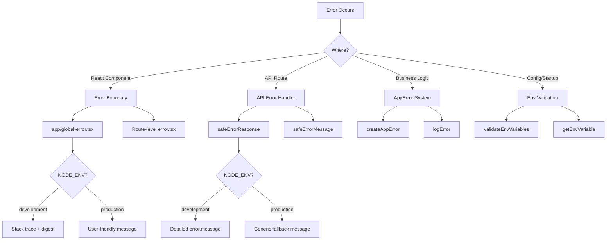

# Foutafhandelingspatronen

## Overzicht

De Ever Works-sjabloon implementeert een meerlaagse foutafhandelingsstrategie die React-foutgrenzen, API-routefoutreacties, getypte applicatiefouten en validatie van omgevingsvariabelen omvat. Het ontwerp geeft prioriteit aan beveiliging (geen informatielekken tijdens de productie), terwijl ontwikkelaarsvriendelijke foutopsporing tijdens de ontwikkeling behouden blijft.

## Architectuur



## Bronbestanden

|Bestand|Doel|
|------|---------|
|`template/app/global-error.tsx`|Reageerfoutgrens op rootniveau|
|`template/app/not-found.tsx`|404 Niet gevonden-pagina|
|`template/lib/utils/api-error.ts`|Hulpprogramma's voor API-routefouten|
|`template/lib/utils/error-handler.ts`|Typen toepassingsfouten en logboekregistratie|
|`template/lib/auth/error-handler.ts`|Auth-specifieke foutafhandeling|

## Reageer op foutgrenzen

### Globale foutengrens

Het bestand `global-error.tsx` vangt onverwerkte fouten op in de hoofdmap van de applicatie:

```typescript
'use client';

export default function GlobalError({
    error,
    reset,
}: {
    error: Error & { digest?: string };
    reset: () => void;
}) {
    useEffect(() => {
        console.error(error);
    }, [error]);

    return (
        <html lang="en">
            <body>
                <h1>Something went wrong!</h1>
                {process.env.NODE_ENV !== 'production' && (
                    <div>
                        <p className="text-red-600">{error.message}</p>
                        {error.stack && <pre>{error.stack}</pre>}
                        {error.digest && <p>Error ID: {error.digest}</p>}
                    </div>
                )}
                <Button onPress={() => reset()}>Refresh</Button>
                <Link href="/">Go Home</Link>
            </body>
        </html>
    );
}
```

Belangrijkste gedragingen:
- **Ontwikkeling**: toont foutmelding, stacktracering en foutenoverzicht
- **Productie**: toont alleen een algemeen bericht
- **Foutoverzicht**: een unieke ID gegenereerd door Next.js voor foutcorrelatie aan de serverzijde
- **Resetfunctie**: Geeft de foutgrenssubboom opnieuw weer
- **Op zichzelf staande HTML**: bevat zijn eigen tags `<html>` en `<body>`, aangezien deze de hele pagina vervangt

### Niet gevonden pagina

```typescript
'use client';

export default function NotFound() {
    const router = useRouter();
    return (
        <div>
            <h1>404</h1>
            <h2>Page Not Found</h2>
            <Button onClick={() => router.back()}>Go Back</Button>
            <Button onClick={() => router.push('/')}>Back to Home</Button>
        </div>
    );
}
```

## API-foutafhandeling

### safeErrorResponse

Het primaire hulpprogramma voor foutreacties op API-routes:

```typescript
export function safeErrorResponse(
    error: unknown,
    fallbackMessage: string,
    status: number = 500
): NextResponse {
    const detail = error instanceof Error ? error.message : String(error);

    // Always log full details server-side
    console.error(`[API Error] ${fallbackMessage}:`, detail);

    const message = process.env.NODE_ENV === "development" ? detail : fallbackMessage;

    return NextResponse.json({ success: false, error: message }, { status });
}
```

Gebruik in API-routes:

```typescript
export async function GET(request: NextRequest) {
    try {
        const result = await someOperation();
        return NextResponse.json(result);
    } catch (error) {
        return safeErrorResponse(error, 'Failed to process request');
    }
}
```

### safeErrorbericht

Voor gevallen waarin u de foutreeks nodig hebt zonder een antwoord te maken:

```typescript
export function safeErrorMessage(error: unknown, fallbackMessage: string): string {
    if (process.env.NODE_ENV === "development") {
        return error instanceof Error ? error.message : String(error);
    }
    return fallbackMessage;
}
```

## Applicatiefoutsysteem

### Fouttypen

```typescript
export enum ErrorType {
    AUTH = 'auth',
    CONFIG = 'config',
    DATABASE = 'database',
    NETWORK = 'network',
    VALIDATION = 'validation',
    UNKNOWN = 'unknown'
}

export interface AppError {
    message: string;
    type: ErrorType;
    code?: string;
    originalError?: unknown;
}
```

### Typefouten maken

```typescript
import { createAppError, ErrorType } from '@/lib/utils/error-handler';

const error = createAppError(
    'Failed to configure OAuth providers',
    ErrorType.CONFIG,
    'OAUTH_CONFIG_FAILED',
    originalError
);
```

### Gestructureerde foutregistratie

```typescript
import { logError } from '@/lib/utils/error-handler';

// Logs: [CONFIG] [Auth Config]: Failed to configure OAuth providers
// Logs: Error code: OAUTH_CONFIG_FAILED
// Logs: Original error: <original error details>
logError(error, 'Auth Config');
```

De functie `logError` verwerkt drie foutvormen:
1. **AppError**: gestructureerd logboek met type, code en oorspronkelijke fout
2. **Fout** - standaardlogboek met bericht en stacktrace
3. **Onbekend** -- reservelogboek met stringdwang

### Validatie van omgevingsvariabelen

```typescript
import { validateEnvVariables, getEnvVariable } from '@/lib/utils/error-handler';

// Validate multiple variables at once
const validationError = validateEnvVariables([
    'DATABASE_URL', 'AUTH_SECRET', 'CRON_SECRET'
]);
if (validationError) {
    logError(validationError, 'Startup');
}

// Get a single required variable (throws if missing)
const dbUrl = getEnvVariable('DATABASE_URL');

// Get an optional variable
const optional = getEnvVariable('OPTIONAL_VAR', false);
```

## Foutafhandeling bij verificatie

De auth-configuratie maakt gebruik van sierlijke degradatie:

```typescript
const configureProviders = () => {
    try {
        const oauthProviders = configureOAuthProviders();
        return createNextAuthProviders({ /* full config */ });
    } catch (error) {
        const appError = createAppError(
            'Failed to configure OAuth providers. Falling back to credentials only.',
            ErrorType.CONFIG,
            'OAUTH_CONFIG_FAILED',
            error
        );
        logError(appError, 'Auth Config');

        // Fallback to credentials only
        return createNextAuthProviders({
            credentials: { enabled: true },
            google: { enabled: false },
            github: { enabled: false },
            facebook: { enabled: false },
            twitter: { enabled: false },
        });
    }
};
```

Als de configuratie van de OAuth-provider mislukt, valt het systeem terug op authenticatie met alleen inloggegevens in plaats van te crashen.

## Foutafhandeling stroom per laag

|Laag|Strategie|Productiegedrag|
|-------|----------|-------------------|
|Reageer componenten|Foutgrens (`global-error.tsx`)|Algemeen bericht, geen stacktrace|
|API-routes|`safeErrorResponse()`|Generiek noodbericht|
|Serveracties|`validatedAction()` onderschept Zod-fouten|Eerste validatiefoutmelding|
|Verificatieconfiguratie|Probeer/vang met `createAppError()`|Sierlijke degradatie tot geloofsbrieven|
|Cron-banen|Try/catch + gestructureerd loggen|Fout geregistreerd, antwoord geretourneerd|
|Webhaken|Probeer/vang + 400 reacties|Generieke storingsmelding naar provider|

## Beste praktijken

1. **Leg interne onderdelen nooit bloot in productie** -- gebruik altijd `safeErrorResponse` voor API-routes
2. **Alles aan de serverzijde loggen** - volledige foutdetails gaan naar console/loggen, ongeacht de omgeving
3. **Gebruik getypte fouten** -- `createAppError` met `ErrorType` voor consistente categorisering
4. **Gracieuze degradatie**: val terug op verminderde functionaliteit in plaats van te crashen
5. **Foutoverzichten voor correlatie**: gebruik het veld `digest` uit Next.js-fouten om problemen aan de serverzijde op te sporen
6. **Valideren bij grenzen** - controleer de omgevingsvariabelen bij het opstarten, valideer invoer bij API-grenzen
