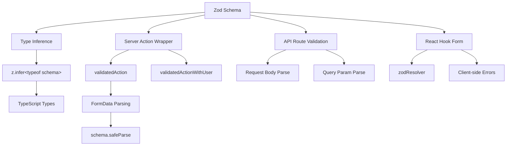

# Formuliervalidatiepatronen

## Overzicht

De Ever Works-sjabloon gebruikt **Zod** als de enige bron van waarheid voor gegevensvalidatie over zowel client- als servergrenzen heen. Validatieschema's zijn georganiseerd in `lib/validations/` en worden gebruikt door:

- **Serveracties** via `validatedAction()` en `validatedActionWithUser()` wrappers
- **API-routehandlers** voor validatie van aanvraagtekst/queryparameters
- **React Hook Form**-integratie voor formuliervalidatie aan de clientzijde
- **Type-inferentie** via `z.infer<>` voor end-to-end typeveiligheid

## Architectuur



## Bronbestanden

|Bestand|Doel|
|------|---------|
|`template/lib/validations/auth.ts`|Wachtwoordvalidatieschema|
|`template/lib/validations/company.ts`|Bedrijfs CRUD-schema's|
|`template/lib/validations/client-item.ts`|Schema's voor indiening/update van clientitems|
|`template/lib/validations/client-dashboard.ts`|Dashboardqueryschema's|
|`template/lib/validations/sponsor-ad.ts`|Sponsor levenscyclusschema's van advertenties|
|`template/lib/validations/item.ts`|Locatiegegevensschema|
|`template/lib/validations/user-location.ts`|Schema voor gebruikerslocatie-instellingen|
|`template/lib/auth/middleware.ts`|`validatedAction` / `validatedActionWithUser` hulpprogramma's|

## Validatieschemapatronen

### Patroon 1: Wachtwoordvalidatie met gekoppelde regels

```typescript
import { z } from "zod";

export const passwordSchema = z
    .string()
    .min(8, "Password must be at least 8 characters")
    .regex(/[A-Z]/, "Password must contain at least one uppercase letter")
    .regex(/[a-z]/, "Password must contain at least one lowercase letter")
    .regex(/[0-9]/, "Password must contain at least one number")
    .regex(/[^A-Za-z0-9]/, "Password must contain at least one special character");
```

Dit schema dwingt sterke wachtwoordvereisten af via geketende verfijningen. Elke `.regex()` biedt een specifiek foutbericht dat de gebruikersinterface inline kan weergeven.

### Patroon 2: Schemaparen maken/bijwerken

De bedrijfsvalidatie demonstreert het patroon voor maken/bijwerken:

```typescript
export const createCompanySchema = z.object({
    name: z.string().min(1, "Company name is required").max(255),
    website: z.string().url("Invalid URL format").optional().or(z.literal("")),
    domain: z.string().max(255).optional()
        .transform((val) => val?.toLowerCase().trim() || undefined),
    slug: z.string().max(255).optional()
        .transform((val) => val?.toLowerCase().trim() || undefined)
        .refine(
            (val) => !val || /^[a-z0-9-]+$/.test(val),
            { message: "Slug must contain only lowercase letters, numbers, and hyphens" }
        ),
    status: z.enum(companyStatus).default("active"),
});

export const updateCompanySchema = z.object({
    id: z.string().uuid(),
    name: z.string().min(1).max(255).optional(),  // Optional for updates
    // ... other fields also optional
    status: z.enum(companyStatus).optional(),
});
```

Belangrijkste verschillen:
- **Schema's maken** hebben verplichte velden met standaardwaarden
- **Updateschema's** vereisen een `id` en maken alle andere velden optioneel
- Beide delen `.transform()` logica voor normalisatie (bijvoorbeeld kleine letters)

### Patroon 3: Op enum gebaseerde statusvelden

```typescript
export const companyStatus = ["active", "inactive"] as const;
export const itemStatus = ['pending', 'approved', 'rejected'] as const;
export const sponsorAdStatuses = [
    "pending_payment", "pending", "rejected",
    "active", "expired", "cancelled",
] as const;

// Usage in schemas
status: z.enum(companyStatus).default("active"),
status: z.enum(sponsorAdStatuses).optional(),
```

Het gebruik van `as const` arrays met `z.enum()` biedt zowel runtime-validatie als veiligheid tijdens het compileren.

### Patroon 4: Queryparameterschema's met transformaties

```typescript
export const clientItemsListQuerySchema = z.object({
    page: z.string().optional()
        .transform(val => (val ? parseInt(val, 10) : 1))
        .refine(val => !Number.isNaN(val), { message: 'Page must be a valid number' })
        .refine(val => val >= 1, { message: 'Page must be at least 1' }),
    limit: z.string().optional()
        .transform(val => (val ? parseInt(val, 10) : 10))
        .refine(val => val >= 1 && val <= 100, { message: 'Limit must be between 1 and 100' }),
    status: z.enum(clientStatusFilter).optional().default('all'),
    search: z.string().max(100, 'Search query is too long').optional(),
    sortBy: z.enum(['name', 'updated_at', 'status', 'submitted_at']).optional().default('updated_at'),
    sortOrder: z.enum(['asc', 'desc']).optional().default('desc'),
    deleted: z.string().optional().transform(val => val === 'true'),
});
```

Queryparameters arriveren als tekenreeksen. Het schema gebruikt `.transform()` om ze naar de juiste typen (getallen, booleans) te converteren, terwijl validatie en standaardwaarden worden toegepast.

### Patroon 5: Geneste objectschema's met veldoverschrijdende validatie

```typescript
export const updateLocationSchema = z
    .object({
        defaultLatitude: z.number().min(-90).max(90).nullable().optional(),
        defaultLongitude: z.number().min(-180).max(180).nullable().optional(),
        defaultCity: z.string().max(200).nullable().optional(),
        defaultCountry: z.string().max(100).nullable().optional(),
        locationPrivacy: locationPrivacySchema.optional(),
    })
    .refine(
        (data) => {
            const hasLat = data.defaultLatitude != null;
            const hasLng = data.defaultLongitude != null;
            return hasLat === hasLng;  // Both or neither
        },
        { message: 'Both latitude and longitude must be provided together' }
    );
```

De `.refine()` op objectniveau valideert veldoverschrijdende afhankelijkheden: breedte- en lengtegraad moeten beide aanwezig zijn of beide afwezig zijn.

### Patroon 6: Union-typen voor flexibele ingangen

```typescript
category: z.union([
    z.string().min(1, 'Category is required'),
    z.array(z.string().min(1)).min(1, 'At least one category is required'),
]).optional().nullable(),
```

Dit accepteert zowel een enkele tekenreeks als een reeks tekenreeksen voor het categorieveld, waarbij verschillende formulierinvoertypen mogelijk zijn.

## Validatie aan de serverzijde

### gevalideerdeAction Wrapper

```typescript
export function validatedAction<S extends z.ZodType<any, any>, T>(
    schema: S,
    action: ValidatedActionFunction<S, T>
) {
    return async (prevState: ActionState, formData: FormData): Promise<T> => {
        const result = schema.safeParse(Object.fromEntries(formData));
        if (!result.success) {
            return { error: result.error.issues[0].message } as T;
        }
        return action(result.data, formData);
    };
}
```

Deze functie van hogere orde:
1. Converteert `FormData` naar een gewoon object
2. Valideert tegen het Zod-schema met `safeParse()`
3. Retourneert de eerste validatiefout als deze ongeldig is
4. Roept de actiefunctie aan met geparseerde, getypte gegevens, indien geldig

### gevalideerdeActionWithUser Wrapper

```typescript
export function validatedActionWithUser<S extends z.ZodType<any, any>, T>(
    schema: S,
    action: ValidatedActionWithUserFunction<S, T>
) {
    return async (prevState: ActionState, formData: FormData): Promise<T> => {
        const session = await auth();
        if (!session?.user) {
            throw new Error("User is not authenticated");
        }
        const result = schema.safeParse(Object.fromEntries(formData));
        if (!result.success) {
            return { error: result.error.issues[0].message } as T;
        }
        return action(result.data, formData, session.user);
    };
}
```

Dit voegt een authenticatiecontrole toe vóór validatie, waarbij het geverifieerde `user`-object wordt doorgegeven aan de actiefunctie.

## Typ gevolgtrekking

Elk schema exporteert afgeleide TypeScript-typen:

```typescript
export type CreateCompanyInput = z.infer<typeof createCompanySchema>;
export type UpdateCompanyInput = z.infer<typeof updateCompanySchema>;
export type ClientUpdateItemInput = z.infer<typeof clientUpdateItemSchema>;
export type ClientCreateItemInput = z.infer<typeof clientCreateItemSchema>;
```

Deze typen worden gebruikt in de servicelaag en API-routes, waardoor de gevalideerde gegevensvorm overeenkomt met wat de bedrijfslogica verwacht.

## Beste praktijken

1. **Eén schema, meerdere consumenten** -- definieer één keer in `lib/validations/`, gebruik overal
2. **Transformeer op de grens** -- gebruik `.transform()` om tekenreeksen naar de juiste typen te converteren
3. **Aangepaste foutmeldingen**: elke validatieregel bevat een gebruiksvriendelijk bericht
4. **Gedeelde subschema's** - hergebruik schema's zoals `locationSchema` en `passwordSchema` in verschillende formulieren
5. **Typen afleiden uit schema's**: definieer nooit handmatig typen die schemadefinities dupliceren
6. **Cross-field validatie** -- gebruik `.refine()` op objectniveau voor regels met meerdere velden
7. **Verstandige standaardwaarden** -- gebruik `.default()` voor optionele velden met standaardwaarden
