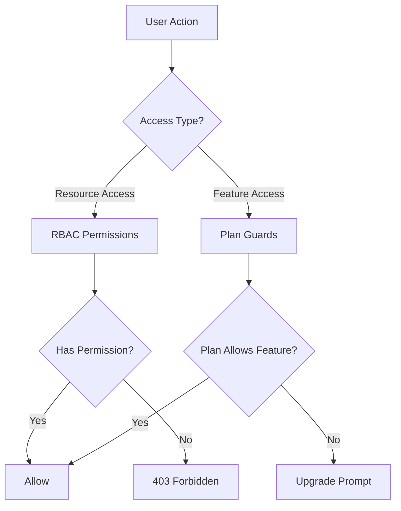
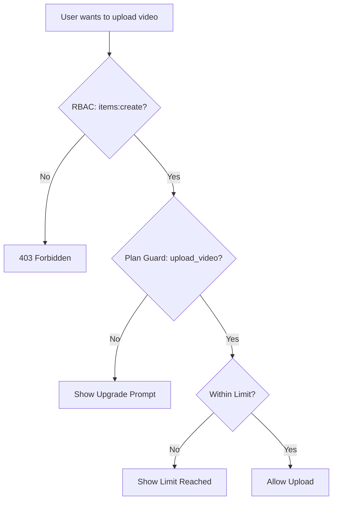

# Bewakers en toestemmingssysteem

De Ever Works-sjabloon implementeert een tweelaags toegangscontrolesysteem: **RBAC-machtigingen** voor op rollen gebaseerde toegang tot bronnen en **planwachters** voor op abonnementen gebaseerde functiepoorten. Samen bepalen deze systemen wat gebruikers kunnen doen en tot welke functies ze toegang hebben.

## Systeemarchitectuur



## RBAC-machtigingssysteem

### Toestemmingsdefinities

Alle rechten worden gedefinieerd in `lib/permissions/definitions.ts` met behulp van een `resource:action` formaat:

```typescript
const PERMISSIONS = {
  items: {
    read: 'items:read',
    create: 'items:create',
    update: 'items:update',
    delete: 'items:delete',
    review: 'items:review',
    approve: 'items:approve',
    reject: 'items:reject',
  },
  categories: { read, create, update, delete },
  tags: { read, create, update, delete },
  roles: { read, create, update, delete },
  users: { read, create, update, delete, assignRoles },
  analytics: { read, export },
  system: { settings },
} as const;
```

### Toestemmingstype

Het type `Permission` is afgeleid van het `PERMISSIONS` const-object, waardoor de typeveiligheid wordt gegarandeerd:

```typescript
type Permission = 'items:read' | 'items:create' | ... | 'system:settings';
```

### Standaardrollen

Er zijn twee standaardrollen vooraf geconfigureerd:

|Rol|Identiteitskaart|Machtigingen|
|---|---|---|
|Superbeheerder|`super-admin`|Alle systeemrechten|
|Inhoudsbeheerder|`content-manager`|Items + Categorieën + Tags (volledige CRUD + recensie)|

### Toestemmingsgroepen

Machtigingen zijn georganiseerd in UI-vriendelijke groepen in `lib/permissions/groups.ts`:

|Groep|Icoon|Inbegrepen bronnen|
|---|---|---|
|Inhoudsbeheer|`FileText`|Artikelen, categorieën, tags|
|Gebruikersbeheer|`Users`|Gebruikers, rollen|
|Systeem en analyse|`Settings`|Analyse, systeem|

### Nuttige functies

De `lib/permissions/utils.ts` module biedt hulpprogramma's voor statusbeheer voor de machtigingen-UI:

```typescript
// Create a permission state map for checkboxes
const state = createPermissionState(currentPermissions);
// { 'items:read': true, 'items:create': true, ... }

// Get selected permissions from state
const selected = getSelectedPermissions(state);

// Calculate changes between old and new permissions
const changes = calculatePermissionChanges(original, updated);
// { added: ['items:delete'], removed: ['tags:create'] }

// Compare two permission sets
const equal = arePermissionsEqual(perms1, perms2);

// Filter permissions by search term
const filtered = filterPermissions(allPerms, 'items');
```

## Plan Guards-systeem

Planbewakers controleren de toegang tot functies op basis van het abonnement van de gebruiker. Het systeem is gedefinieerd in `lib/guards/plan-features.guard.ts`.

### Planhiërarchie

```typescript
const PLAN_LEVELS: Record<string, number> = {
  free: 1,
  standard: 2,
  premium: 3,
};
```

### Functiedefinities

Alle gated features worden opgesomd in `FEATURES`:

|Categorie|Kenmerken|
|---|---|
|Indiening|`submit_product`, `extended_description`, `unlimited_description`, `upload_images`, `upload_video`|
|Insignes|`verified_badge`, `sponsored_badge`|
|Beoordeling|`priority_review`, `instant_review`|
|Zichtbaarheid|`search_visibility`, `category_placement`, `sponsored_position`, `homepage_featured`, `newsletter_mention`|
|Analyse|`view_statistics`, `advanced_analytics`|
|Ondersteuning|`email_support`, `priority_email_support`, `phone_support`|
|Sociaal|`social_sharing`, `learn_more_button`|
|Anders|`free_modifications`, `unlimited_submissions`|

### Functietoegangsmatrix

Elke functie is toegewezen aan een toegangsregel:

|Toegangstype|Syntaxis|Voorbeeld|
|---|---|---|
|Alle plannen|`'all'`|`submit_product`, `upload_images`|
|Enkel plan|`PaymentPlan.PREMIUM`|`upload_video`, `instant_review`|
|Minimaal plan|`{ minPlan: PaymentPlan.STANDARD }`|`verified_badge`, `priority_review`|
|Specifieke plannen|`[PaymentPlan.STANDARD, PaymentPlan.PREMIUM]`|(aangepaste functies)|

### Planlimieten

Numerieke limieten variëren per abonnement:

|Limiet|Gratis|Standaard|Premie|
|---|---|---|---|
|`max_images`| 1 | 5 |Onbeperkt|
|`max_description_words`| 200 | 500 |Onbeperkt|
|`max_submissions`| 1 | 10 |Onbeperkt|
|`review_days`| 7 | 3 | 1 |
|`free_modification_days`| 0 | 30 | 365 |

### Gebruik van server-side guard

```typescript
import { canAccessFeature, createPlanGuard, FEATURES } from '@/lib/guards';

// Simple check
const allowed = canAccessFeature(FEATURES.UPLOAD_VIDEO, userPlan);

// Guard factory for multiple checks
const guard = createPlanGuard(userPlan);
guard.canAccess(FEATURES.VERIFIED_BADGE);       // boolean
guard.requireFeature(FEATURES.UPLOAD_VIDEO);     // throws PlanGuardError
guard.getLimit('max_images');                    // number | null
guard.isWithinLimit('max_submissions', count);   // boolean
guard.getAccessibleFeatures();                   // Feature[]
```

### PlanGuardFout

Wanneer `requireFeature` mislukt, wordt er een getypte fout gegenereerd:

```typescript
class PlanGuardError extends Error {
  feature: Feature;      // e.g., 'upload_video'
  userPlan: string;      // e.g., 'free'
  requiredPlan: PaymentPlan; // e.g., 'premium'
}
```

### Beschermhaak aan cliëntzijde

De `usePlanGuard` haak in `hooks/use-plan-guard.ts` omhult het beveiligingssysteem voor React-componenten:

```typescript
import { usePlanGuard, FEATURES } from '@/hooks/use-plan-guard';

function VideoUploadButton() {
  const { canAccess, requireUpgrade, isLoading } = usePlanGuard();

  if (isLoading) return <Spinner />;

  const upgradePlan = requireUpgrade(FEATURES.UPLOAD_VIDEO);
  if (upgradePlan) {
    return <UpgradePrompt plan={upgradePlan} />;
  }

  return <Button>Upload Video</Button>;
}
```

### Gespecialiseerde haken

#### `useFeatureAccess`

Toegang tot één functie controleren:

```typescript
const { hasAccess, requiredPlan, isLoading } = useFeatureAccess(FEATURES.VERIFIED_BADGE);
```

#### `useFeatureLimit`

Controleer numerieke limieten met resterende telling:

```typescript
const { limit, isUnlimited, remaining, isWithinLimit } = useFeatureLimit('max_images', currentCount);

if (!isUnlimited && remaining <= 0) {
  return <LimitReached />;
}
```

## Bewakers samenstellen

Bewakers zijn op natuurlijke wijze samengesteld voor complexe toegangscontrolescenario's:

```typescript
// Server: Combine RBAC + plan check
function canCreateItem(userPermissions: UserPermissions, userPlan: string): boolean {
  const hasRBACAccess = hasPermission(userPermissions, 'items:create');
  const hasPlanAccess = canAccessFeature(FEATURES.SUBMIT_PRODUCT, userPlan);
  return hasRBACAccess && hasPlanAccess;
}

// Client: Combine hooks
function CreateItemButton() {
  const { canAccess } = usePlanGuard();
  const { permissions } = useRolePermissions();

  const canCreate =
    hasPermission(permissions, 'items:create') &&
    canAccess(FEATURES.SUBMIT_PRODUCT);

  if (!canCreate) return null;
  return <Button>Create Item</Button>;
}
```

## Bewakingsstroomdiagram



## Nieuwe bewakers toevoegen

### Een nieuwe machtiging toevoegen

1. Toevoegen aan `PERMISSIONS` in `lib/permissions/definitions.ts`:

```typescript
billing: {
  read: 'billing:read',
  manage: 'billing:manage',
},
```

2. Toevoegen aan een machtigingsgroep in `lib/permissions/groups.ts`
3. Wijs toe aan de juiste standaardrollen

### Een nieuwe abonnementsfunctie toevoegen

1. Voeg de functieconstante toe aan `FEATURES` in `lib/guards/plan-features.guard.ts`
2. Definieer de toegangsregel in `FEATURE_ACCESS`
3. Voeg optioneel numerieke limieten toe aan `PLAN_LIMITS`

## Beste praktijken

1. **Geef de voorkeur aan bewakers voor feature-gating** en RBAC voor toegangscontrole van bronnen - combineer ze niet.
2. **Controleer altijd op de server**, zelfs als de client UI-elementen verbergt. Controles aan de clientzijde gelden alleen voor UX.
3. **Gebruik `createPlanGuard`** voor meerdere controles in dezelfde aanvraag om herhaaldelijk zoeken naar plannen te voorkomen.
4. **Behandel laadstatussen** in hooks: plangegevens kunnen asynchroon worden geladen vanuit de abonnementsservice.
5. **Houd functienamen beschrijvend** -- gebruik `upload_video` en niet `feature_3` voor duidelijkheid in logs en foutmeldingen.
