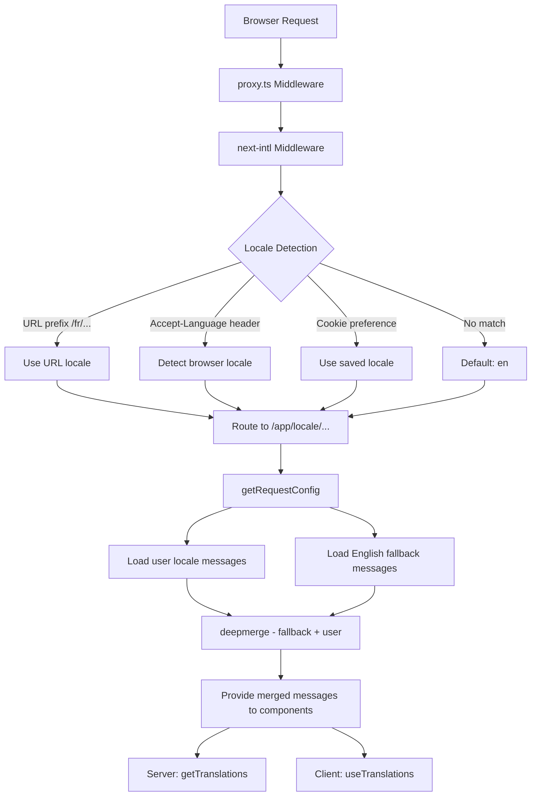

# i18n-implementatie

## Overzicht

De Ever Works-sjabloon implementeert internationalisering met behulp van **next-intl** met ondersteuning voor meer dan 20 landinstellingen, RTL-tekstrichting (van rechts naar links), terugval van berichten met diepgaande samenvoeging en locatiebewuste navigatie. Het systeem is opgebouwd rond drie lagen: routeringsconfiguratie, het laden van berichten met fallback en locatiebewuste navigatiehulpmiddelen.

## Architectuur



## Bronbestanden

|Bestand|Doel|
|------|---------|
|`template/i18n/routing.ts`|Configuratie van lokale routering|
|`template/i18n/request.ts`|Op verzoek gericht bericht laden|
|`template/i18n/navigation.ts`|Exporteert landbewuste navigatie|
|`template/lib/constants.ts`|Locale- en RTL-definities|
|`template/messages/*.json`|Vertaling berichtbestanden|
|`template/proxy.ts`|Middleware met resolutie van het locale voorvoegsel|

## Ondersteunde landinstellingen

```typescript
// lib/constants.ts
export const DEFAULT_LOCALE = 'en';
export const LOCALES = [
    'en', 'fr', 'es', 'de', 'zh', 'ar', 'he',
    'ru', 'uk', 'pt', 'it', 'ja', 'ko', 'nl',
    'pl', 'tr', 'vi', 'th', 'hi', 'id', 'bg'
] as const;

export type Locale = (typeof LOCALES)[number];

/** Locales that use right-to-left text direction */
export const RTL_LOCALES: readonly Locale[] = ['ar', 'he'] as const;
```

De sjabloon ondersteunt 20 landinstellingen, waaronder twee RTL-landinstellingen (Arabisch en Hebreeuws).

## Routeringsconfiguratie

```typescript
// i18n/routing.ts
import { defineRouting } from "next-intl/routing";
import { DEFAULT_LOCALE, LOCALES } from "@/lib/constants";

export const routing = defineRouting({
    locales: LOCALES,
    defaultLocale: DEFAULT_LOCALE,
    localeDetection: true,
    localePrefix: "as-needed",
});
```

|Instelling|Waarde|Effect|
|---------|-------|--------|
|`locales`|20 landcodes|Ondersteunde taalset|
|`defaultLocale`|`'en'`|Terugval wanneer geen landinstelling overeenkomt|
|`localeDetection`|`true`|Automatische detectie van `Accept-Language` header|
|`localePrefix`|`"as-needed"`|Standaardlandinstelling heeft geen voorvoegsel; anderen doen dat|

Met `localePrefix: "as-needed"`:
- Engels (standaard): `https://example.com/about`
- Frans: `https://example.com/fr/about`
- Arabisch: `https://example.com/ar/about`

## Bericht wordt geladen met terugval

```typescript
// i18n/request.ts
import deepmerge from "deepmerge";
import { getRequestConfig } from "next-intl/server";

export default getRequestConfig(async ({ requestLocale }) => {
    let locale = await requestLocale;

    if (!locale || !routing.locales.includes(locale as any)) {
        locale = routing.defaultLocale;
    }

    const userMessages = (await import(`../messages/${locale}.json`)).default;
    const defaultMessages = (await import(`../messages/en.json`)).default;
    const messages = deepmerge(defaultMessages, userMessages) as any;

    return { locale, messages };
});
```

De deep merge-strategie zorgt ervoor dat:
1. Engelse berichten dienen als de complete fallback-set
2. Landspecifieke berichten overschrijven het Engels als er vertalingen bestaan
3. Ontbrekende vertalingen vallen sierlijk terug naar het Engels in plaats van dat er sleutels worden weergegeven

### Berichtbestandsstructuur

```
messages/
  en.json        # Complete English messages (base)
  fr.json        # French translations
  es.json        # Spanish translations
  de.json        # German translations
  ar.json        # Arabic translations
  he.json        # Hebrew translations
  zh.json        # Chinese translations
  ...            # 13+ more locales
```

### Datum-/nummerformaten

```typescript
// i18n/request.ts
export const formats = {
    dateTime: {
        short: {
            day: "numeric",
            month: "short",
            year: "numeric",
        },
    },
    number: {
        precise: {
            maximumFractionDigits: 5,
        },
    },
    list: {
        enumeration: {
            style: "long",
            type: "conjunction",
        },
    },
} satisfies Formats;
```

## Navigatiehelpers

```typescript
// i18n/navigation.ts
import { createNavigation } from "next-intl/navigation";
import { routing } from "./routing";

export const { Link, redirect, usePathname, useRouter, getPathname } =
    createNavigation(routing);
```

Deze exports vervangen de standaard Next.js-navigatiehulpprogramma's door locale-bewuste versies:

|Exporteren|Standaard Next.js|Lokaalbewust gedrag|
|--------|-----------------|----------------------|
|`Link`|`next/link`|Voegt landinstellingsvoorvoegsel toe aan `href`|
|`redirect`|`next/navigation`|Behoudt de huidige landinstelling in de omleiding|
|`usePathname`|`next/navigation`|Retourneert het pad zonder landinstellingsvoorvoegsel|
|`useRouter`|`next/navigation`|`push()` / `replace()` landvoorvoegsel toevoegen|
|`getPathname`| -- |Pad aan serverzijde met landinstelling|

### Gebruik in servercomponenten

```typescript
import { getTranslations } from 'next-intl/server';

export default async function Page({ params }: { params: Promise<{ locale: string }> }) {
    const { locale } = await params;
    const t = await getTranslations({ locale, namespace: 'common' });

    return <h1>{t('WELCOME')}</h1>;
}
```

### Gebruik in clientcomponenten

```typescript
'use client';
import { useTranslations } from 'next-intl';
import { Link } from '@/i18n/navigation';

export function NavLink() {
    const t = useTranslations('navigation');
    return <Link href="/about">{t('ABOUT')}</Link>;
}
```

## Locale resolutie van middleware

De middleware in `proxy.ts` lost landinformatie op voor auth guard-beslissingen:

```typescript
function resolveLocalePrefix(pathname: string): {
    prefix: string;           // "/fr" or ""
    hasLocale: boolean;
    locale?: string;
    pathWithoutLocale: string; // "/admin/items"
} {
    const segments = pathname.split('/').filter(Boolean);
    const maybeLocale = segments[0];
    const hasLocale = routing.locales.includes(maybeLocale as any);
    const pathWithoutLocale = hasLocale
        ? `/${segments.slice(1).join('/')}`
        : pathname;
    return {
        prefix: hasLocale ? `/${maybeLocale}` : '',
        hasLocale,
        locale: hasLocale ? maybeLocale : undefined,
        pathWithoutLocale
    };
}
```

Dit wordt gebruikt om locale-bewuste omleidings-URL's in auth guards samen te stellen:

```typescript
url.pathname = `${localePrefix}/auth/signin`;
```

## RTL-ondersteuning

RTL-landinstellingen worden gedefinieerd in `lib/constants.ts`:

```typescript
export const RTL_LOCALES: readonly Locale[] = ['ar', 'he'] as const;
```

De hoofdindelingscomponent moet het kenmerk `dir` toepassen op basis van de huidige landinstelling:

```typescript
// app/[locale]/layout.tsx
const isRTL = RTL_LOCALES.includes(locale as Locale);

return (
    <html lang={locale} dir={isRTL ? 'rtl' : 'ltr'}>
        {/* ... */}
    </html>
);
```

## SEO: Hreflang-alternatieven

Het hulpprogramma `lib/seo/hreflang.ts` genereert links in alternatieve talen voor SEO:

```typescript
import { generateHreflangAlternates } from '@/lib/seo/hreflang';

export async function generateMetadata(): Promise<Metadata> {
    return {
        alternates: {
            languages: generateHreflangAlternates('/about')
        }
    };
}
```

Dit genereert `<link rel="alternate" hreflang="fr" href="...">`-tags voor alle ondersteunde landinstellingen, plus een `x-default`-item dat verwijst naar de Engelse versie.

## Integratie van Next.js-plug-in

```typescript
// next.config.ts
import createNextIntlPlugin from "next-intl/plugin";

const withNextIntl = createNextIntlPlugin('./i18n/request.ts');
const configWithIntl = withNextIntl(nextConfig);
```

De plug-in `next-intl` wordt toegepast op de Next.js-configuratie met een expliciet pad naar het aanvraagconfiguratiebestand.

## Beste praktijken

1. **Gebruik altijd `getTranslations` in servercomponenten** -- laadt vertalingen zonder clientbundelkosten
2. **Importeer navigatie vanuit `@/i18n/navigation`** -- zorgt voor locale-bewuste koppelingen
3. **Houd het Engels compleet**: het dient als reserve voor alle andere talen
4. **Gebruik naamruimtevertalingen** - ordenen op functie (`common`, `footer`, `pages`, etc.)
5. **Controleer RTL met `RTL_LOCALES`** -- pas `dir="rtl"` toe op lay-outniveau
6. **Genereer hreflang-tags** -- gebruik `generateHreflangAlternates()` in metadatafuncties
