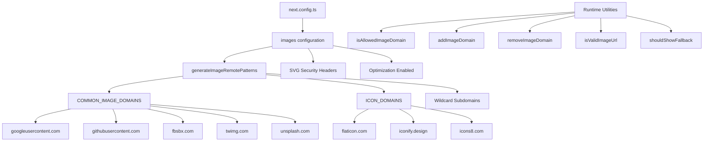

# Beeldoptimalisatie

## Overzicht

De Ever Works-sjabloon configureert Next.js Image Optimization met dynamische externe patronen, SVG-ondersteuning en een hulpprogrammalaag voor domeinbeheer. Het systeem verwerkt afbeeldingen van OAuth-providers (Google, GitHub, Facebook, Twitter), stockfotoservices (Unsplash) en pictogrambibliotheken, terwijl beveiligingsheaders voor SVG-inhoud worden afgedwongen.

## Architectuur



## Bronbestanden

|Bestand|Doel|
|------|---------|
|`template/next.config.ts`|Next.js-afbeeldingsconfiguratie|
|`template/lib/utils/image-domains.ts`|Hulpprogramma's voor domeinbeheer|

## Configuratie

### Next.js afbeeldingsinstellingen

```typescript
// next.config.ts
images: {
    remotePatterns: generateImageRemotePatterns(),
    dangerouslyAllowSVG: true,
    contentDispositionType: 'attachment',
    contentSecurityPolicy: "default-src 'self'; script-src 'none'; sandbox;",
    unoptimized: false,
},
```

|Instelling|Waarde|Doel|
|---------|-------|---------|
|`remotePatterns`|Dynamisch via `generateImageRemotePatterns()`|Zet externe afbeeldingsdomeinen op de witte lijst|
|`dangerouslyAllowSVG`|`true`|Sta SVG-afbeeldingen toe via de optimalisatie|
|`contentDispositionType`|`'attachment'`|Forceer download in plaats van inline rendering voor onbewerkte toegang|
|`contentSecurityPolicy`|Strikte zandbak|Voorkom op SVG gebaseerde XSS-aanvallen|
|`unoptimized`|`false`|Houd beeldoptimalisatie ingeschakeld|

### SVG-beveiliging

SVG-bestanden kunnen ingesloten JavaScript bevatten. De sjabloon verzacht dit met:
- **Inhoudsbeveiligingsbeleid**: `script-src 'none'; sandbox;` voorkomt uitvoering van scripts in SVG's
- **Inhoudsdispositie**: `attachment` zorgt ervoor dat SVG's worden gedownload en niet worden uitgevoerd wanneer ze rechtstreeks worden geopend

## Patroongeneratie op afstand

De functie `generateImageRemotePatterns()` bouwt de toelatingslijst dynamisch op:

```typescript
export function generateImageRemotePatterns() {
    const patterns = [
        {
            protocol: 'https' as const,
            hostname: 'lh3.googleusercontent.com',
            pathname: '/a/**'
        },
        {
            protocol: 'https' as const,
            hostname: 'avatars.githubusercontent.com',
            pathname: '/u/**'
        },
        {
            protocol: 'https' as const,
            hostname: 'platform-lookaside.fbsbx.com',
            pathname: '/platform/**'
        },
        // ... more specific patterns
    ];

    // Add wildcard subdomain patterns
    [...COMMON_IMAGE_DOMAINS, ...ICON_DOMAINS].forEach((domain) => {
        patterns.push({
            protocol: 'https' as const,
            hostname: `*.${domain}`,
            pathname: '/**'
        });
    });

    return patterns;
}
```

### Toegestane domeinen

**Gemeenschappelijke afbeeldingsdomeinen** (OAuth-avatars, stockfoto's):

|Domein|Bron|
|--------|--------|
|`lh3.googleusercontent.com`|Google OAuth-avatars|
|`avatars.githubusercontent.com`|GitHub OAuth-avatars|
|`platform-lookaside.fbsbx.com`|Facebook OAuth-avatars|
|`pbs.twimg.com`|Twitter/X-avatars|
|`images.unsplash.com`|Unsplash-stockfoto's|

**Icoondomeinen** (itempictogrammen):

|Domein|Bron|
|--------|--------|
|`flaticon.com`|Flaticon-pictogrammen|
|`iconify.design`|Iconiseer pictogrammen|
|`icons8.com`|Pictogrammen8 pictogrammen|
|`feathericons.com`|Veer iconen|
|`heroicons.com`|Held iconen|
|`tabler-icons.io`|Tabler-pictogrammen|

## Runtime-domeinbeheer

### Toegestane domeinen controleren

```typescript
import { isAllowedImageDomain } from '@/lib/utils/image-domains';

// Returns true for whitelisted domains
isAllowedImageDomain('https://lh3.googleusercontent.com/a/photo.jpg'); // true
isAllowedImageDomain('https://cdn.flaticon.com/icons/svg/123.svg');    // true
isAllowedImageDomain('https://evil-site.com/image.jpg');               // false

// Relative URLs are always allowed
isAllowedImageDomain('/images/logo.png'); // true
```

### Dynamische domeintoevoeging

```typescript
import { addImageDomain, removeImageDomain } from '@/lib/utils/image-domains';

// Add a new domain at runtime
addImageDomain('cdn.example.com');

// Add as an icon domain
addImageDomain('my-icons.com', true);

// Remove a domain
removeImageDomain('old-cdn.com');
```

Opmerking: Runtime-toevoegingen hebben invloed op de hulpprogrammafuncties, maar wijzigen niet de externe patronen van Next.js `next.config.ts` (die moeten opnieuw worden opgebouwd).

### URL-validatie

```typescript
import { isValidImageUrl, isProblematicUrl, shouldShowFallback } from '@/lib/utils/image-domains';

// Check URL format validity
isValidImageUrl('https://example.com/photo.jpg'); // true
isValidImageUrl('/images/local.png');              // true (relative)
isValidImageUrl('not-a-url');                      // false

// Check for problematic URLs (non-image pages, redirect URLs)
isProblematicUrl('https://flaticon.com/icone-gratuite/search'); // true (not a direct image)
isProblematicUrl('https://cdn.flaticon.com/icon.svg');          // false (has image extension)

// Determine if fallback icon should be shown
shouldShowFallback('');                                          // true (empty)
shouldShowFallback('https://flaticon.com/icone-gratuite/123');   // true (problematic)
shouldShowFallback('https://cdn.flaticon.com/icon.svg');         // false
```

## Beveiligingskoppen

De `next.config.ts` past beveiligingsheaders toe op alle routes:

```typescript
async headers() {
    return [{
        source: "/(.*)",
        headers: [
            { key: "X-Content-Type-Options", value: "nosniff" },
            { key: "X-Frame-Options", value: "DENY" },
            { key: "Referrer-Policy", value: "strict-origin-when-cross-origin" },
            { key: "X-DNS-Prefetch-Control", value: "on" },
            { key: "Strict-Transport-Security", value: "max-age=63072000; includeSubDomains; preload" },
            {
                key: "Content-Security-Policy",
                value: "default-src 'self'; script-src 'self' 'unsafe-inline' https://assets.lemonsqueezy.com; style-src 'self' 'unsafe-inline'; img-src 'self' data: https:; font-src 'self'; connect-src 'self' https:; frame-ancestors 'none';"
            },
        ],
    }];
},
```

De `img-src 'self' data: https:` richtlijn staat afbeeldingen toe van dezelfde oorsprong, gegevens-URI's en elke HTTPS-bron. Dit is opzettelijk toegestaan ​​voor `img-src` omdat de Next.js Image-component de domeinvalidatie op applicatieniveau afhandelt.

## Beste praktijken

1. **Gebruik `next/image`** voor alle externe afbeeldingen - het zorgt voor optimalisatie, lazyloading en formaatconversie
2. **Voeg nieuwe domeinen toe aan `image-domains.ts`** -- niet inline in `next.config.ts`
3. **Controleer `shouldShowFallback()`** voordat u deze weergeeft: toon een standaardpictogram voor ongeldige/ontbrekende URL's
4. **Behoud SVG-beveiligingsheaders** - verwijder nooit de instellingen `contentSecurityPolicy` of `contentDispositionType`
5. **Geef de voorkeur aan beperkingen voor de padnaam** -- gebruik indien mogelijk specifieke `pathname`-patronen (bijvoorbeeld `/a/**`) in plaats van brede jokertekens
