# Overzicht Lib-hulpprogramma's

De map `template/lib/` is de kernlaag van het hulpprogramma en de bedrijfslogica van de Ever Works-sjabloon. Het bevat gedeelde modules voor analyse, API-communicatie, authenticatie, achtergrondtaken, caching, configuratie, databasetoegang, betalingen, editortools, bewakers en meer. Alle niet-component, niet-routelogica leeft hier volgens het principe om componenten presentatief te houden en zware logica te delegeren aan `lib/`.

## Modulekaart

```mermaid
graph TD
    subgraph Core Infrastructure
        A[config/] --> B[config.ts / config-manager.ts]
        C[db/] --> D[drizzle.ts / queries/ / migrate.ts]
        E[cache-config.ts] --> F[cache-invalidation.ts]
    end

    subgraph Auth & Security
        G[auth/] --> H[NextAuth / Supabase / Guards / Caching]
        I[guards/] --> J[Plan Feature Access Control]
        K[permissions/] --> L[Role-Based Permissions]
    end

    subgraph API Layer
        M[api/] --> N[ApiClient / ServerClient / Error Handling]
    end

    subgraph Analytics & Tracking
        O[analytics/] --> P[PostHog + Sentry Singleton]
    end

    subgraph Background Processing
        Q[background-jobs/] --> R[Trigger.dev / Local / NoOp]
    end

    subgraph Content & Editor
        S[content.ts] --> T[Git CMS Content Loader]
        U[editor/] --> V[TipTap Rich Text Editor]
        W[lib.ts] --> X[Content Path / File Utilities]
    end

    subgraph Business Logic
        Y[services/] --> Z[20+ Domain Services]
        AA[repositories/] --> AB[Data Access Layer]
        AC[payment/] --> AD[Stripe / LemonSqueezy / Polar]
    end

    subgraph Shared Utilities
        AE[constants.ts + constants/]
        AF[utils.ts + utils/]
        AG[types.ts + types/]
        AH[validations/]
        AI[helpers.ts]
    end
```



## Directorystructuur

|Directory / Bestand|Beschrijving|
|-----------------|-------------|
|`lib/analytics/`|PostHog + Sentry-analyse singleton ([docs](./analytics-module))|
|`lib/api/`|HTTP-clients voor browser en server ([docs](./api-client-module))|
|`lib/auth/`|Authenticatie met NextAuth.js + Supabase ([docs](./auth-utilities-module))|
|`lib/background-jobs/`|Taakplanning met Trigger.dev / local / no-op ([docs](./background-jobs-module))|
|`lib/cache-config.ts`|Cache-TTL en tagdefinities ([docs](./cache-invalidation-module))|
|`lib/cache-invalidation.ts`|Cache-invalidatiefuncties ([docs](./cache-invalidation-module))|
|`lib/config/`|Gecentraliseerde configuratieservice met Zod-schema's|
|`lib/config.ts`|Siteconfiguratie (`siteConfig`)|
|`lib/config-manager.ts`|Runtime-configuratiemanager|
|`lib/constants.ts`|Toepassingsconstanten vat ([docs](./constants-reference-module))|
|`lib/constants/`|Domeinspecifieke constanten (betaling, analyse)|
|`lib/content.ts`|Git-gebaseerd CMS-inhoud laden en caching|
|`lib/db/`|Databaseverbinding, migraties, seeden, queries ([docs](./db-utilities-module))|
|`lib/editor/`|Componenten en hulpprogramma's voor de Rich Text Editor van TipTap ([docs](./editor-utilities-module))|
|`lib/guards/`|Plangebaseerde functietoegangscontrole ([docs](./guards-module))|
|`lib/helpers.ts`|Taalcode naar landcode mapping|
|`lib/lib.ts`|Resolutie van inhoudspaden, hulpprogramma's voor bestandssysteem|
|`lib/logger.ts`|Gestructureerd logboekprogramma|
|`lib/mail/`|E-mail verzenden met sjabloonondersteuning|
|`lib/mappers/`|Mappers voor gegevenstransformatie|
|`lib/maps/`|Integraties van kaartproviders (Google Maps, Mapbox)|
|`lib/middleware/`|Next.js middleware-hulpprogramma's|
|`lib/newsletter/`|Aanbieders van nieuwsbriefabonnementen|
|`lib/paginate.ts`|Hulpfunctie voor paginering|
|`lib/payment/`|Betalingsverwerking (Stripe, LemonSqueezy, Solidgate, Polar)|
|`lib/permissions/`|Op rollen gebaseerde machtigingsdefinities|
|`lib/query-client.ts`|Reageer Query-clientconfiguratie|
|`lib/react-query-config.ts`|Standaardopties voor React Query|
|`lib/repositories/`|Gegevenstoegangslaag (repositorypatroon)|
|`lib/repository.ts`|Git-repositorybewerkingen (kloon, pull, synchronisatie)|
|`lib/seo/`|SEO-metagegevens en gestructureerde gegevensgeneratoren|
|`lib/services/`|Bedrijfslogicadiensten (20+ domeindiensten)|
|`lib/stripe-helpers.ts`|Stripe-specifieke hulpprogramma's|
|`lib/swagger/`|Swagger/OpenAPI-annotaties|
|`lib/theme-color-manager.ts`|Dynamisch themakleurbeheer|
|`lib/theme-utils.ts`|Thema hulpprogramma's|
|`lib/themes.tsx`|Themadefinities|
|`lib/types.ts`|Gedeelde typedefinities|
|`lib/types/`|Domeinspecifieke typedefinities|
|`lib/utils.ts`|Algemene nutsfuncties|
|`lib/utils/`|Domeinspecifieke hulpprogramma's (15+ modules)|
|`lib/validations/`|Zod-validatieschema's|

## Belangrijke zelfstandige modules

### `lib/helpers.ts` -- Toewijzing taal/landcode

```typescript
type LanguageCode = 'en' | 'fr' | 'es' | 'zh' | 'de' | 'ar' | ... ;

const LANGUAGE_COUNTRY_CODES: Record<LanguageCode, string>;
// { en: 'US', fr: 'FR', es: 'ES', zh: 'CN', ... }

const appLocales: string[];
// All supported locale codes

function getCountryCode(languageCode?: LanguageCode): string;
// 'en' -> 'US', 'fr' -> 'FR'
```

### `lib/lib.ts` -- Inhoudspad en bestandssysteem

Hulpprogramma's voor alleen de server voor het beheer van inhoudsdirectory's:

```typescript
function getContentPath(): string;
// Returns '.content' path (local) or '/tmp/.content' (Vercel runtime)

async function ensureContentAvailable(): Promise<string>;
// Ensures content is available, triggering Git clone if needed

async function fsExists(filepath: string): Promise<boolean>;
async function dirExists(dirpath: string): Promise<boolean>;
```

### `lib/paginate.ts` -- Helper voor paginering

```typescript
function paginate<T>(items: T[], page: number, limit: number): T[];
```

### `lib/logger.ts` -- Gestructureerde logboekregistratie

```typescript
const logger = {
  info(message: string, context?: Record<string, any>): void;
  warn(message: string, context?: Record<string, any>): void;
  error(message: string, context?: Record<string, any>): void;
  debug(message: string, context?: Record<string, any>): void;
};
```

### `lib/color-generator.ts` -- Deterministische kleurgeneratie

Genereert consistente kleuren uit tekenreeksen (gebruikt voor avatars, tags, enz.).

### `lib/theme-color-manager.ts` -- Dynamische themakleuren

Beheert updates van aangepaste CSS-eigenschappen voor het wisselen van thema.

## Dienstenlaag (`lib/services/`)

De servicesdirectory bevat bedrijfslogische services, geordend per domein:

|Dienst|Verantwoordelijkheid|
|---------|---------------|
|`analytics-background-processor.ts`|Achtergrondanalyseverwerking|
|`analytics-export.service.ts`|Analytics-gegevens exporteren|
|`analytics-scheduled-reports.service.ts`|Geplande analyserapporten|
|`category-file.service.ts`|Categoriebestandsbewerkingen|
|`category-git.service.ts`|Categorie Git-bewerkingen|
|`collection-git.service.ts`|Verzameling Git-bewerkingen|
|`company.service.ts`|Beheer van bedrijfsprofielen|
|`currency-detection.service.ts`|Detectie van gebruikersvaluta|
|`currency.service.ts`|Valutaconversie|
|`email-notification.service.ts`|E-mailmeldingen|
|`engagement.service.ts`|Bekijk/stem/favoriete tracking|
|`file.service.ts`|Bestanden uploaden/beheer|
|`geocoding/`|Geocodering met Google/Mapbox-providers|
|`item-audit.service.ts`|Item-audittraject|
|`item-git.service.ts`|Item Git-bewerkingen|
|`location/`|Locatie-indexering en -beheer|
|`moderation.service.ts`|Content moderatie|
|`notification.service.ts`|Pushmeldingen|
|`posthog-api.service.ts`|PostHog-API op de server|
|`role-db.service.ts`|Rolbeheer|
|`settings.service.ts`|Applicatie-instellingen|
|`sponsor-ad.service.ts`|Beheer van sponsoradvertenties|
|`stripe-products.service.ts`|Stripe-productsynchronisatie|
|`subscription-jobs.ts`|Achtergrondbanen voor abonnementen|
|`subscription.service.ts`|Levenscyclus van abonnement|
|`survey.service.ts`|Enquêtebeheer|
|`sync-service.ts`|Synchronisatie van Git-repository|
|`tag-git.service.ts`|Tag Git-bewerkingen|
|`twenty-crm-*.ts`|Twenty CRM-integratie (5 bestanden)|
|`user-db.service.ts`|Bewerkingen van gebruikersdatabases|
|`webhook-subscription.service.ts`|Webhook-beheer|

## Gebruikslaag (`lib/utils/`)

Hulpprogrammamodules voor specifieke problemen:

|Module|Doel|
|--------|---------|
|`api-error.ts`|API-foutklasse|
|`bot-detection.ts`|Detectie van bot-gebruikersagenten|
|`checkout-utils.ts`|Betaalhulpjes bij het afrekenen|
|`client-auth.ts`|Verificatiehulpprogramma's aan de clientzijde|
|`currency-format.ts`|Valuta-opmaak|
|`custom-navigation.ts`|Aangepaste routernavigatie|
|`database-check.ts`|Databasestatuscontrole|
|`email-validation.ts`|Validatie van e-mailformaat|
|`error-handler.ts`|Globale foutafhandelaar|
|`featured-items.ts`|Uitgelichte itemselectie|
|`footer-utils.ts`|Hulpprogramma's voor voettekstlinks|
|`image-domains.ts`|Toegestane afbeeldingsdomeinen|
|`pagination-validation.ts`|Pagineringsparametervalidatie|
|`payment-provider.ts`|Detectie van betalingsproviders|
|`plan-expiration.utils.ts`|Planvervalberekeningen|
|`rate-limit.ts`|Beperking van de API-snelheid|
|`request-body.ts`|Lichaamsparing aanvragen|
|`server-url.ts`|Resolutie van server-URL|
|`settings.ts`|Hulpfuncties voor instellingen|
|`slug.ts`|Generatie van URL-slug|
|`url-cleaner.ts`|URL-opschoning|
|`url-filter-sync.ts`|Synchronisatie van URL-filterstatus|

## Ontwerpprincipes

1. **Scheiding van zorgen** -- Bedrijfslogica in `services/`, gegevenstoegang in `repositories/` en `db/queries/`, presentatie in `components/`.

2. **Scriptveiligheid** -- Modules die worden gebruikt door migratie-/seed-scripts (zoals `constants/payment.ts` en `db/config.ts`) vermijden het importeren van Next.js-specifieke code.

3. **Luie initialisatie** -- Databaseverbindingen, API-clients en taakbeheerders gebruiken singleton-patronen met luie initialisatie om fouten tijdens de bouwtijd te voorkomen.

4. **Dynamische import** - Node.js-specifieke modules gebruiken dynamische import in achtergrondtaken en auth om problemen met webpackbundeling te voorkomen.

5. **Server/Client grens** -- Server-only modules gebruiken het `server-only` pakket. Clientveilige modules voorkomen serverimporten. De `'use client'` richtlijn wordt spaarzaam gebruikt.
