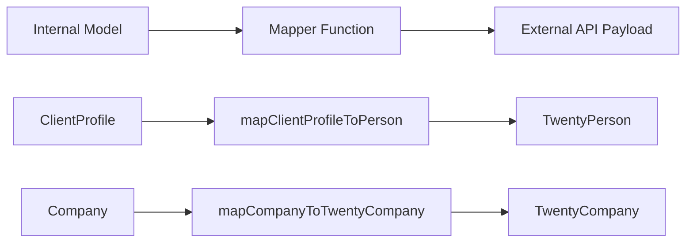

# Mapper-patronen

De sjabloon maakt gebruik van pure mapper-functies om gegevens tussen interne modellen en externe API-payloads te transformeren. Mappers zijn vrij van bijwerkingen, null-safe en valideren vereiste velden vóór transformatie.

## Architectuuroverzicht



## Bronbestanden

|Bestand|Doel|
|------|---------|
|`lib/mappers/twenty-crm.mapper.ts`|Wijst lokale entiteiten toe aan Twenty CRM API-payloads|

## Ontwerpprincipes

De mapper-module volgt strikte functionele programmeerconventies:

1. **Pure functies** - geen bijwerkingen, geen mutaties, geen databaseoproepen
2. **Null-safe** -- alle optionele velden gebruiken expliciete null/ongedefinieerde controles
3. **Validatie vóór toewijzing** -- verplichte velden worden gevalideerd met beschrijvende fouten
4. **Externe ID-handhaving**: elke toegewezen entiteit moet een geldige `external_id` hebben

## Externe ID-validatie

Elke entiteit die aan een extern systeem is toegewezen, heeft een geldige identificatie nodig:

```typescript
export function ensureExternalId(id: string | undefined | null, entityType: string): string {
  if (!id || id.trim() === '') {
    throw new Error(`${entityType} ID is required for external_id mapping`);
  }
  return id.trim();
}
```

Deze functie wordt aangeroepen aan het begin van elke mapper om te garanderen dat het veld `external_id` nooit leeg is.

## Locatie-extractie

Een hulpprogrammafunctie ontleedt stadsnamen uit locatiereeksen met vrije tekst:

```typescript
export function extractCityFromLocation(location: string | undefined | null): string | null {
  if (!location || location.trim() === '') return null;
  const parts = location.split(',');
  const city = parts[0]?.trim();
  return city || null;
}
```

Verwerkt formaten zoals `"San Francisco"`, `"San Francisco, CA"` en `"San Francisco, CA, USA"`.

## Klantprofiel tot twintig CRM-personen

Wijst interne `ClientProfile`-records toe aan de Twenty CRM `TwentyPerson`-payload:

```typescript
export function mapClientProfileToPerson(clientProfile: ClientProfile): TwentyPerson {
  const external_id = ensureExternalId(clientProfile.id, 'ClientProfile');

  const person: TwentyPerson = {
    external_id,
    name: clientProfile.name,
    email: clientProfile.email,
  };

  // Optional field mapping (null-safe)
  if (clientProfile.phone)     person.phone = clientProfile.phone;
  if (clientProfile.jobTitle)  person.job_title = clientProfile.jobTitle;
  if (clientProfile.company)   person.company_name = clientProfile.company;
  if (clientProfile.website)   person.website = clientProfile.website;

  const city = extractCityFromLocation(clientProfile.location);
  if (city) person.city = city;

  // Custom fields
  if (clientProfile.accountType) person.account_type = clientProfile.accountType;
  if (clientProfile.plan)        person.plan = clientProfile.plan;
  if (clientProfile.totalSubmissions !== null && clientProfile.totalSubmissions !== undefined) {
    person.total_submissions = clientProfile.totalSubmissions;
  }

  return person;
}
```

### Veldtoewijzingstabel

|Klantprofielveld|TwentyPerson-veld|Vereist|Opmerkingen|
|--------------------|--------------------|----------|-------|
|`id`|`external_id`|Ja|Gevalideerd en bijgesneden|
|`name`|`name`|Ja|Directe mapping|
|`email`|`email`|Ja|Directe mapping|
|`phone`|`phone`|Nee|Alleen indien aanwezig|
|`jobTitle`|`job_title`|Nee|camelCase naar snake_case|
|`company`|`company_name`|Nee|Hernoemd veld|
|`website`|`website`|Nee|Directe mapping|
|`location`|`city`|Nee|Geëxtraheerd via `extractCityFromLocation`|
|`accountType`|`account_type`|Nee|Aangepast veld|
|`plan`|`plan`|Nee|Aangepast veld|
|`totalSubmissions`|`total_submissions`|Nee|Expliciete nulcontrole vereist|

## Bedrijf tot Twenty CRM-bedrijf

Wijst interne `Company` entiteiten toe aan de Twenty CRM `TwentyCompany` payload:

```typescript
export function mapCompanyToTwentyCompany(company: Company): TwentyCompany {
  const external_id = ensureExternalId(company.id, 'Company');

  const twentyCompany: TwentyCompany = {
    external_id,
    name: company.name,
  };

  if (company.domain)  twentyCompany.domain_name = company.domain;
  if (company.website) twentyCompany.website = company.website;
  if (company.status)  twentyCompany.status = company.status;

  return twentyCompany;
}
```

### Veldtoewijzingstabel

|Bedrijfsveld|Twintig bedrijvenveld|Vereist|Opmerkingen|
|--------------|---------------------|----------|-------|
|`id`|`external_id`|Ja|Gevalideerd en bijgesneden|
|`name`|`name`|Ja|Directe mapping|
|`domain`|`domain_name`|Nee|Hernoemd veld|
|`website`|`website`|Nee|Directe mapping|
|`status`|`status`|Nee|`'active'` of `'inactive'`|

## Nieuwe kaartmakers toevoegen

Volg bij het maken van mappers voor nieuwe integraties de vastgestelde patronen:

```typescript
// 1. Always validate external_id first
const external_id = ensureExternalId(entity.id, 'EntityName');

// 2. Build the required fields object
const payload: ExternalType = {
  external_id,
  // ... required fields
};

// 3. Conditionally add optional fields (null-safe)
if (entity.optionalField) {
  payload.optional_field = entity.optionalField;
}

// 4. Return the payload -- never mutate the input
return payload;
```

## Overwegingen bij het testen

Omdat mappers pure functies zijn, zijn ze eenvoudig te testen:

- Test met alle optionele velden ingevuld
- Test met alle optionele velden als `null` of `undefined`
- Test of ontbrekende vereiste ID's beschrijvende fouten veroorzaken
- Testlocatie-extractie met verschillende stringformaten
- Controleer of het invoerobject nooit is gemuteerd
