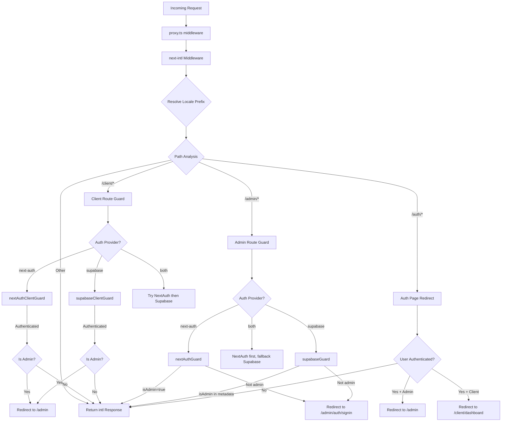

# Middlewareketen- en aanvraagverwerking

## Overzicht

De Ever Works-sjabloon maakt gebruik van een **unified middleware**-architectuur die is gedefinieerd in `proxy.ts` in de hoofdmap van het project. Deze middleware orkestreert drie kritieke problemen voor elk binnenkomend verzoek:

1. **Internationalisering** -- localedetectie, invoeging van voorvoegsels en routering via `next-intl`
2. **Authenticatiebewakers** - beschermen `/admin/*` en `/client/*` routes met behulp van NextAuth, Supabase of beide
3. **Op rollen gebaseerde omleiding** - stuurt geverifieerde gebruikers weg van openbare verificatiepagina's en stuurt beheerders/clients door naar hun respectievelijke dashboards

Het ontwerp ondersteunt een **pluggable auth provider** model: de middleware leest de huidige `AuthProviderType` (`'next-auth'`, `'supabase'`, of `'both'`) uit de gecentraliseerde auth-configuratie en selecteert overeenkomstig de juiste bewakingsfuncties.

## Architectuurdiagram



## Bronbestanden

|Bestand|Doel|
|------|---------|
|`template/proxy.ts`|Belangrijkste middleware-ingangspunt|
|`template/lib/auth/config.ts`|Configuratie van auth-provider (`getAuthConfig()`)|
|`template/lib/auth/supabase/middleware.ts`|Helper voor het vernieuwen van Supabase-sessies|
|`template/lib/auth/validate-callback-url.ts`|Veilige callback-URL-constructie|
|`template/i18n/routing.ts`|Configuratie van lokale routering|

## Verzoek om verwerkingsopdracht

### Stap 1: Internationalisering

Elk verzoek passeert eerst de `next-intl` middleware gemaakt met `createIntlMiddleware(routing)`:

```typescript
import createIntlMiddleware from 'next-intl/middleware';
import { routing } from './i18n/routing';

const intl = createIntlMiddleware(routing);
```

Hiermee wordt de localedetectie afgehandeld via de `Accept-Language` header, cookievoorkeuren en URL-voorvoegsel. De routeringsconfiguratie gebruikt `localePrefix: "as-needed"`, wat betekent dat de standaardlandinstelling (`en`) geen URL-voorvoegsel vereist.

### Stap 2: Lokale resolutie

De `resolveLocalePrefix` helper haalt landinformatie uit de padnaam:

```typescript
function resolveLocalePrefix(pathname: string): {
    prefix: string;       // e.g., "/fr" or ""
    hasLocale: boolean;
    locale?: string;
    pathWithoutLocale: string;  // e.g., "/admin/items"
}
```

Dit is van cruciaal belang omdat alle daaropvolgende padovereenkomsten (bijvoorbeeld het controleren op `/admin` of `/client`) moeten werken op het pad **zonder** het landinstellingsvoorvoegsel.

### Stap 3: Op route gebaseerde bewakerselectie

De middleware evalueert de `pathWithoutLocale` om te bepalen welke beveiligingsketen moet worden toegepast:

|Padpatroon|Beveiliging toegepast|Doel|
|-------------|--------------|---------|
|`/client` of `/client/*`|Klantauthenticatiebewaker|Vereist authenticatie; stuurt beheerders door naar `/admin`|
|`/admin/*` (behalve `/admin/auth/signin`)|Beheerder autorisatiebewaker|Vereist authenticatie + `isAdmin` vlag|
|`/auth/*`|Omleiding van authenticatiepagina|Leidt geverifieerde gebruikers weg van inloggen/registreren|
|Al het andere|Geen bewaker|Gaat door met i18n-reactie|

### Stap 4: Authenticatieverificatie

#### NextAuth Guard (op JWT gebaseerd)

```typescript
const token = await getToken({ req, secret: process.env.AUTH_SECRET });
if (token?.isAdmin === true) {
    return baseRes; // Admin access granted
}
```

NextAuth-bewakers gebruiken `getToken()` van `next-auth/jwt` om het JWT-token uit cookies te lezen. Dit is Edge Runtime-compatibel en vereist geen database-zoekopdracht.

#### Supabase-wacht

```typescript
const supRes = await supabaseUpdate(req);
// Merge cookies...
const { data: { user } } = await supabase.auth.getUser();
const isAdmin = user?.user_metadata?.isAdmin === true
    || user?.user_metadata?.role === 'admin';
```

De Supabase-bewaker vernieuwt eerst de sessie met `updateSession()` en controleert vervolgens de metagegevens van de gebruiker op beheerdersvlaggen.

### Stap 5: Cookieverspreiding

Een cruciaal implementatiedetail: wanneer een bewaker een omleidingsreactie produceert, moeten alle cookies van de `intlResponse` worden doorgegeven:

```typescript
const redirectRes = NextResponse.redirect(url);
baseRes.cookies.getAll().forEach((c) => redirectRes.cookies.set(c));
return redirectRes;
```

Dit zorgt ervoor dat landinstellingen en authenticatiesessiecookies omleidingen overleven.

## Configuratie

### Selectie van authenticatieprovider

De auth-provider wordt bepaald door `getAuthConfig()` in `lib/auth/config.ts`:

```typescript
export type AuthProviderType = 'supabase' | 'next-auth' | 'both';

export function getAuthConfig(): AuthConfig {
    // Priority 1: Global override via configureAuth()
    // Priority 2: Environment-based (detects Supabase env vars)
    // Priority 3: Default ('next-auth')
}
```

### Middleware-matcher

```typescript
export const config = {
    matcher: ['/((?!api|trpc|_next|_vercel|.*\\..*).*)']
};
```

Deze regex sluit het volgende uit:
- `/api/*` routes (verwerkt door Next.js API-laag)
- `/trpc/*`-routes
- `/_next/*` (Next.js interne onderdelen)
- `/_vercel/*` (Vercel internals)
- Elk pad met een bestandsextensie (statische elementen)

### Terugbel-URL-beveiliging

De middleware gebruikt `createSafeCallbackUrl()` om open redirect-aanvallen te voorkomen:

```typescript
export function createSafeCallbackUrl(pathname: string, search?: string): string {
    // Limits URL length to 2048 characters
    // Validates relative-only paths
}

export function isValidCallbackUrl(url: string | null): boolean {
    return url?.startsWith('/') && !url.startsWith('//');
}
```

## Dual-Provider-modus ("beide")

Wanneer `provider === 'both'` implementeert de middleware een fallback-keten:

1. **Clientroutes**: Probeer eerst NextAuth; als u niet bent geverifieerd, probeer dan Supabase
2. **Beheerroutes**: Probeer eerst NextAuth; als het een omleiding oplevert (geweigerd), probeer dan Supabase
3. **Auth-pagina's**: controleer eerst het NextAuth-token en controleer vervolgens de Supabase-sessie

Hierdoor kunnen organisaties tussen auth-providers migreren zonder bestaande gebruikers te verstoren.

## Belangrijke implementatiedetails

### Edge Runtime-compatibiliteit

De middleware wordt uitgevoerd in de Next.js Edge Runtime. Alle authenticatiecontroles maken gebruik van Edge-compatibele API's:
- NextAuth: `getToken()` (JWT-gebaseerd, geen DB nodig)
- Supabase: `createServerClient()` met op cookies gebaseerde sessie

### Ontwikkeling versus productieregistratie

Het loggen van foutopsporing vindt plaats achter `NODE_ENV === 'development'`:

```typescript
if (process.env.NODE_ENV === 'development') {
    console.log('[Middleware] Admin access granted via token');
}
```

### Supabase-sessie vernieuwen

De Supabase middleware-helper (`updateSession`) wordt vóór elke verificatiecontrole aangeroepen om ervoor te zorgen dat de tokens worden vernieuwd:

```typescript
export async function updateSession(request: NextRequest) {
    const supabase = createServerClient(url, anonKey, {
        cookies: { getAll, setAll }
    });
    // IMPORTANT: DO NOT REMOVE auth.getUser()
    await supabase.auth.getUser();
    return supabaseResponse;
}
```

Het commentaar in de broncode benadrukt dat `auth.getUser()` niet mag worden verwijderd; het activeert de tokenverversingscyclus die willekeurige afmeldingen voorkomt.
