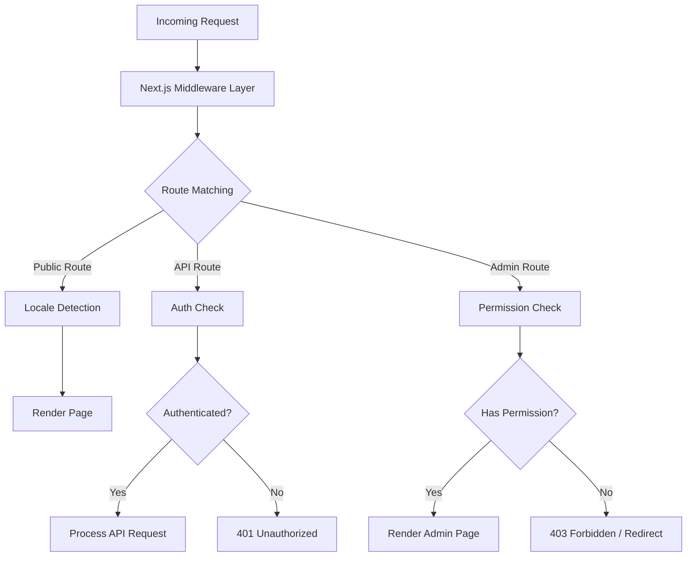
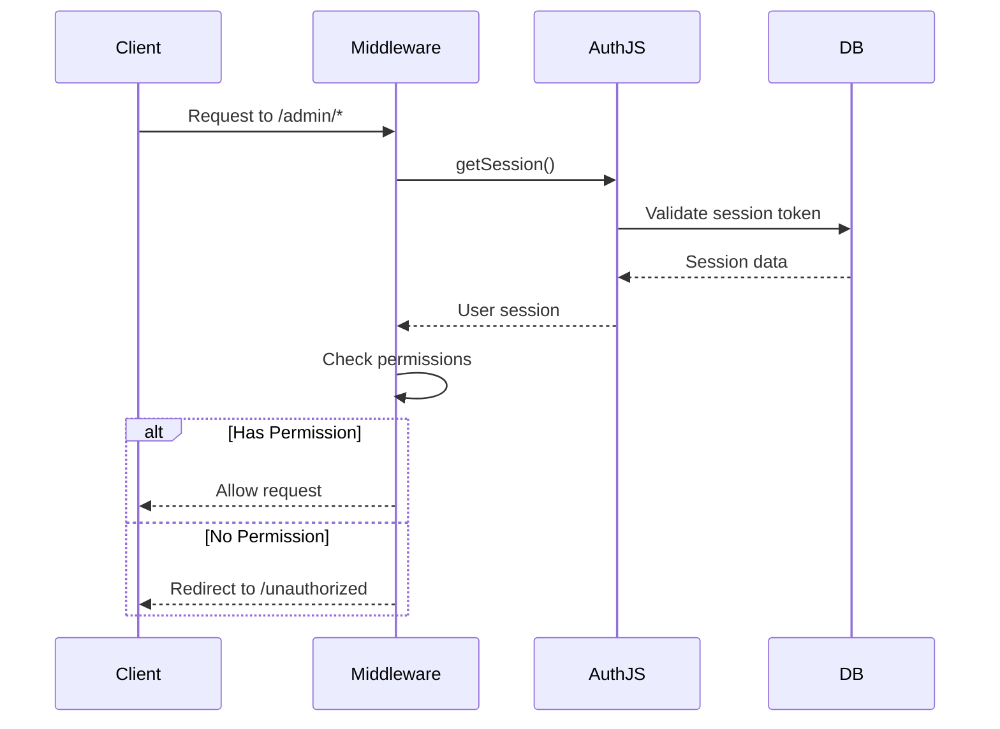
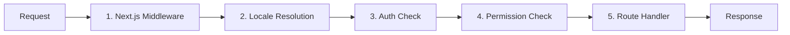

# Middleware-diepe duik

De Ever Works-sjabloon maakt gebruik van een gelaagde middleware-architectuur die is gebouwd op Next.js App Router-conventies en aangepaste logica voor het controleren van rechten. Dit document behandelt de volledige aanvraagverwerkingspijplijn, toestemmingscontroles, authenticatie-middleware, landinstellingen en het bestellen van middleware.

## Architectuuroverzicht



## Toestemmingscontrole middleware

Het toestemmingscontrolesysteem bevindt zich in `lib/middleware/permission-check.ts` en biedt gedetailleerde toegangscontrole voor API-routes en beheerderspagina's.

### Kerninterface

```typescript
interface UserPermissions {
  userId: string;
  roles: string[];
  permissions: Permission[];
}
```

### Toestemmingscontrolefuncties

|Functie|Doel|Retouren|
|---|---|---|
|`hasPermission(user, permission)`|Controleer enkele toestemming|`boolean`|
|`hasAnyPermission(user, permissions)`|Controleer of de gebruiker er minstens één heeft|`boolean`|
|`hasAllPermissions(user, permissions)`|Controleer of de gebruiker alles heeft vermeld|`boolean`|
|`hasResourcePermission(user, resource, action)`|Controleer het `resource:action`-formaat|`boolean`|
|`getResourcePermissions(user, resource)`|Haal alle machtigingen voor een resource op|`Permission[]`|
|`canManageResource(user, resource)`|Controleer de toegang tot maken/bijwerken/verwijderen|`boolean`|
|`isSuperAdmin(user)`|Controleer de rol van superbeheerder of alle machtigingen|`boolean`|

### Gebruik in API-routes

```typescript
import { hasPermission, hasAnyPermission } from '@/lib/middleware/permission-check';

export async function GET(request: Request) {
  const userPermissions = await getUserPermissions(session);

  // Single permission check
  if (!hasPermission(userPermissions, 'items:read')) {
    return new Response('Forbidden', { status: 403 });
  }

  // Multiple permission check (any)
  if (!hasAnyPermission(userPermissions, ['items:review', 'items:approve'])) {
    return new Response('Forbidden', { status: 403 });
  }
}
```

### Controles op resourceniveau

```typescript
// Check specific resource and action
const canEdit = hasResourcePermission(userPermissions, 'items', 'update');

// Get all permissions for a resource
const itemPerms = getResourcePermissions(userPermissions, 'items');
// Returns: ['items:read', 'items:create', 'items:update']

// Check management capability (create, update, or delete)
const canManage = canManageResource(userPermissions, 'categories');
```

### Gespecialiseerde toestemmingshelpers

De middleware biedt domeinspecifieke helpers die meerdere toestemmingscontroles combineren:

```typescript
// Can the user review, approve, or reject items?
const canReview = canReviewItems(userPermissions);

// Can the user manage users (read, create, update, delete, assignRoles)?
const canAdmin = canManageUsers(userPermissions);

// Can the user view analytics data?
const canView = canViewAnalytics(userPermissions);

// Is the user a super admin?
const isAdmin = isSuperAdmin(userPermissions);
```

### Detectie van superbeheerders

De functie `isSuperAdmin` maakt gebruik van een aanpak op twee niveaus:

1. **Rolcontrole** (primair): Controleert of de gebruiker de rol `super-admin` heeft
2. **Toestemmingscontrole** (fallback): Controleert of de gebruiker alle systeemrechten heeft

```typescript
function isSuperAdmin(userPermissions: UserPermissions): boolean {
  // Fast path: check role
  if (userPermissions.roles.includes('super-admin')) {
    return true;
  }
  // Exhaustive check: verify all permissions
  return hasAllPermissions(userPermissions, allSystemPermissions);
}
```

## Authenticatie-middleware

Authenticatie wordt afgehandeld via NextAuth.js (Auth.js v5) geconfigureerd in `auth.config.ts`. De middleware draait op elk verzoek naar beschermde routes.

### Providerconfiguratie

De auth-configuratie configureert OAuth-providers dynamisch met een elegante terugval:

|Aanbieder|Configuratiebron|
|---|---|
|Googlen|`authConfig.google.clientId/clientSecret`|
|GitHub|`authConfig.github.clientId/clientSecret`|
|Facebook|`authConfig.facebook.clientId/clientSecret`|
|Twitter/X|`authConfig.twitter.clientId/clientSecret`|
|Referenties|Altijd ingeschakeld|

Als de OAuth-configuratie mislukt, valt het systeem terug op authenticatie met alleen inloggegevens.

### Verificatiesessiestroom



## Lokale middleware

De sjabloon ondersteunt meer dan 20 landinstellingen via `next-intl` middleware-integratie. De detectie van de landinstelling volgt het voorvoegselpatroon 'indien nodig':

- Standaardlandinstelling (`en`): Geen URL-voorvoegsel -- `/items/my-app`
- Andere landinstellingen: Landinstellingsvoorvoegsel -- `/fr/items/my-app`

### Ondersteunde landinstellingen

|Lokaal|Taal|Lokaal|Taal|
|---|---|---|---|
|`en`|Engels (standaard)|`ja`|Japans|
|`fr`|Frans|`ko`|Koreaans|
|`es`|Spaans|`nl`|Nederlands|
|`de`|Duits|`pl`|Pools|
|`zh`|Chinees|`tr`|Turks|
|`ar`|Arabisch|`vi`|Vietnamees|
|`he`|Hebreeuws|`th`|Thais|
|`ru`|Russisch|`hi`|Hindi|
|`uk`|Oekraïens|`id`|Indonesisch|
|`pt`|Portugees|`bg`|Bulgaars|
|`it`|Italiaans| | |

## Verzoekverwerkingspijplijn

De volledige aanvraagverwerkingspijplijn volgt deze volgorde:



### Pijpleiding stappen

1. **Next.js Middleware** (`middleware.ts`): Wordt uitgevoerd op elk verzoek dat overeenkomt met de geconfigureerde matchers. Verwerkt omleidingen, herschrijvingen en header-injectie.

2. **Lokale resolutie**: detecteert de voorkeurslandinstelling van de gebruiker op basis van het URL-pad, de `Accept-Language`-header of de cookie. Stelt de landinstelling voor de aanvraagcontext in.

3. **Authenticatie**: Voor beschermde routes (`/admin/*`, `/dashboard/*`, `/api/admin/*`), valideert het sessietoken van de gebruiker.

4. **Toestemmingscontrole**: Controleert na authenticatie of de gebruiker over de vereiste machtigingen beschikt voor de specifieke bron en actie.

5. **Routehandler**: de daadwerkelijke paginacomponent of API-routehandler verwerkt het verzoek.

### Garanties voor het bestellen van middleware

Het systeem dwingt een strikte volgorde af:

- Landinstellingsdetectie wordt altijd als eerste uitgevoerd (nodig voor foutpagina's)
- Authenticatiecontroles worden uitgevoerd vóór toestemmingscontroles (een gebruiker moet de rechten controleren)
- Toestemmingscontroles zijn de laatste poort vóór route-afhandelaars
- API-routes gebruiken toestemmingscontroles op functieniveau (niet op middleware-niveau)

## Hulpprogramma's voor toestemmingsvalidatie

De middleware bevat validatiehulpmiddelen voor het werken met toestemmingsreeksen:

```typescript
// Validate a permission string
validatePermission('items:read');     // true
validatePermission('invalid:perm');   // false

// Parse a permission into parts
parsePermission('items:update');
// Returns: { resource: 'items', action: 'update' }

// Get summary grouped by resource
getPermissionSummary(userPermissions);
// Returns: { items: ['read', 'create'], categories: ['read'] }
```

## Foutafhandeling

Het middlewaresysteem verwerkt fouten op elke laag:

|Laag|Fout|Reactie|
|---|---|---|
|Lokaal|Ongeldige landinstelling|Omleiden naar standaardlandinstelling|
|Aut|Geen sessie|401 of omleiden naar inloggen|
|Aut|Verlopen sessie|401 met vernieuwingshint|
|Toestemming|Ontbrekende toestemming|403 Verboden|
|Toestemming|Ongeldige toestemmingsreeks|Waarschuwing geregistreerd, toegang geweigerd|

## Beste praktijken

1. **Gebruik de meest specifieke controle** -- geef de voorkeur aan `hasPermission` met één enkele toestemming boven `isSuperAdmin` voor reguliere feature-gating.

2. **Controleer de rechten in API-routes** -- vertrouw niet uitsluitend op middleware; valideer altijd in de route-handler voor diepgaande verdediging.

3. **Gebruik dynamische import** in middleware om te voorkomen dat alleen servermodules in de edge-runtime worden gebundeld.

4. **Houd de toestemmingscontroles snel**: het opzoeken van de `O(1)`-machtigingenset zorgt voor minimale overhead per verzoek.

5. **Mislukken van logrechten** - gebruik gestructureerde logboekregistratie met de gebruikers-ID en poging tot toestemming voor beveiligingscontroles.
