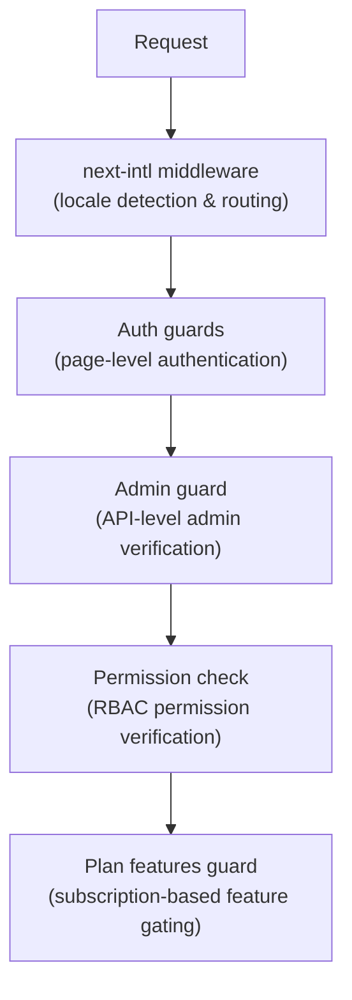

# Middleware en bewakers

De Ever Works-sjabloon maakt gebruik van een gelaagd beveiligingssysteem dat bestaat uit Next.js-middleware voor routering, authenticatiewachters voor pagina- en API-bescherming, toestemmingscontroles voor RBAC en plangebaseerde functiewachters voor abonnementscontrole.

## Middleware-lagen



## Lokale middleware (next-intl)

De root-middleware verzorgt de internationaliseringsroutering via `next-intl`. Het wordt geconfigureerd via `i18n/routing.ts` en `i18n/request.ts`.

Verantwoordelijkheden:
- Detecteer de gebruikerslandinstelling op basis van het URL-pad, cookies of `Accept-Language` header
- Leid verzoeken zonder een landinstellingsvoorvoegsel om naar de juiste landinstelling
- Standaard ingesteld op Engels (`en`) als er geen voorkeur wordt gedetecteerd
- Ondersteuning van 6 talen: `en`, `fr`, `es`, `de`, `ar`, `zh`

## Authenticatie bewakers

### Bewakers op paginaniveau (`lib/auth/guards.ts`)

De bewakersmodule biedt authenticatiecontroles aan de serverzijde voor pagina's. Deze worden bovenaan de servercomponenten aangeroepen om de paginatoegang te beschermen.

**`requireAuth()`** -- Vereist dat de gebruiker wordt geverifieerd:

```typescript
import { requireAuth } from '@/lib/auth/guards';

export default async function ProtectedPage() {
  const session = await requireAuth();
  // session.user is guaranteed to exist here
  return <div>Welcome {session.user.email}</div>;
}
```

Als de gebruiker niet is geverifieerd, wordt deze doorgestuurd naar `/auth/signin`.

**`requireAdmin()`** -- Vereist dat de gebruiker is geverifieerd EN een beheerdersrol heeft:

```typescript
import { requireAdmin } from '@/lib/auth/guards';

export default async function AdminPage() {
  const session = await requireAdmin();
  return <div>Admin: {session.user.email}</div>;
}
```

Als de gebruiker niet is geverifieerd, wordt deze doorgestuurd naar `/admin/auth/signin`. Als ze wel zijn geverifieerd, maar niet de beheerder, worden ze doorgestuurd naar `/unauthorized`.

**`getSession()`** -- Krijgt sessie zonder omleiding:

```typescript
const session = await getSession();
if (session) {
  // Authenticated
} else {
  // Guest
}
```

**`checkIsAdmin()`** -- Controleert de beheerdersstatus zonder omleiden:

```typescript
const isAdmin = await checkIsAdmin();
// Returns true or false
```

### Gevalideerde acties (`lib/auth/guards.ts`)

De bewakersmodule biedt ook gevalideerde actieverpakkingen voor Next.js-serveracties:

**`validatedAction(schema, action)`** -- Valideert formuliergegevens op basis van een Zod-schema:

```typescript
export const myAction = validatedAction(mySchema, async (data, formData) => {
  // data is validated and typed
});
```

**`validatedActionWithUser(schema, action)`** -- Valideert en vereist authenticatie:

```typescript
export const myAction = validatedActionWithUser(mySchema, async (data, formData, user) => {
  // data is validated, user is authenticated
});
```

## Beheerder (`lib/auth/admin-guard.ts`)

De admin guard biedt API-routebescherming specifiek voor beheerderseindpunten.

**`checkAdminAuth()`** -- Middleware-functie voor API-routes:

```typescript
import { checkAdminAuth } from '@/lib/auth/admin-guard';

export async function GET(request: NextRequest) {
  const authError = await checkAdminAuth();
  if (authError) return authError;

  // User is verified admin, proceed with handler
}
```

Retourneert `null` indien geautoriseerd, of een `NextResponse` met de juiste foutstatus (401 of 403).

**`withAdminAuth(handler)`** -- Functie-wrapper van hogere orde:

```typescript
import { withAdminAuth } from '@/lib/auth/admin-guard';

export const GET = withAdminAuth(async (request) => {
  // Already verified as admin
  return NextResponse.json({ data: 'admin only' });
});
```

De admin guard verifieert zowel authenticatie (sessie bestaat) als autorisatie (gebruiker heeft beheerdersrol in de database via `isAdmin()` check).

## Toestemmingscontrolesysteem (`lib/middleware/permission-check.ts`)

Het machtigingssysteem implementeert op rollen gebaseerde toegangscontrole (RBAC) met gedetailleerde machtigingen.

### Toestemmingsstructuur

Machtigingen volgen de indeling `resource:action`:

```typescript
// Examples of permission keys
'items:read'
'items:create'
'items:update'
'items:delete'
'items:review'
'items:approve'
'items:reject'
'categories:read'
'categories:create'
'users:assignRoles'
'analytics:read'
'system:settings'
```

### Toestemmingscontrolefuncties

```typescript
import {
  hasPermission,
  hasAnyPermission,
  hasAllPermissions,
  hasResourcePermission,
  canManageResource,
  canReviewItems,
  canManageUsers,
  canManageRoles,
  canViewAnalytics,
  isSuperAdmin,
} from '@/lib/middleware/permission-check';

// Single permission check
hasPermission(userPermissions, 'items:create');

// Any of multiple permissions
hasAnyPermission(userPermissions, ['items:create', 'items:update']);

// All permissions required
hasAllPermissions(userPermissions, ['items:read', 'items:update']);

// Resource-level check
hasResourcePermission(userPermissions, 'items', 'create');

// Domain-specific helpers
canManageResource(userPermissions, 'categories'); // create, update, or delete
canReviewItems(userPermissions);                  // review, approve, or reject
canManageUsers(userPermissions);                  // user CRUD + assignRoles
isSuperAdmin(userPermissions);                    // all system permissions
```

### Detectie van superbeheerders

De functie `isSuperAdmin()` controleert twee voorwaarden:
1. Of de gebruiker de rol `super-admin` heeft (bij voorkeur)
2. Als reserve: of de gebruiker ALLE systeemrechten heeft

### Toestemmingsvalidatie

```typescript
// Validate a permission string is defined in the system
validatePermission('items:create'); // true
validatePermission('invalid:perm'); // false

// Parse permission into resource and action
parsePermission('items:create'); // { resource: 'items', action: 'create' }
```

## Planfuncties Bewaker (`lib/guards/plan-features.guard.ts`)

Het plan biedt bewakingscontroles en toegang op basis van abonnementsplannen (gratis, standaard, premium).

### Planhiërarchie

```typescript
const PLAN_LEVELS = {
  free: 1,
  standard: 2,
  premium: 3,
};
```

### Functietoegangsmatrix

Elke functie is toegewezen aan de abonnementen die er toegang toe hebben:

|Functie|Gratis|Standaard|Premie|
|---------|------|----------|---------|
|Product indienen|Ja|Ja|Ja|
|Afbeeldingen uploaden|Ja|Ja|Ja|
|E-mailondersteuning|Ja|Ja|Ja|
|Uitgebreide beschrijving| - |Ja|Ja|
|Geverifieerde badge| - |Ja|Ja|
|Prioritaire beoordeling| - |Ja|Ja|
|Statistieken bekijken| - |Ja|Ja|
|Video uploaden| - | - |Ja|
|Gesponsorde badge| - | - |Ja|
|Homepagina Uitgelicht| - | - |Ja|
|Geavanceerde analyses| - | - |Ja|
|Onbeperkte inzendingen| - | - |Ja|

### Planlimieten

Elk plan heeft numerieke limieten voor bepaalde functies:

|Limiet|Gratis|Standaard|Premie|
|-------|------|----------|---------|
|Maximaal aantal afbeeldingen| 1 | 5 |Onbeperkt|
|Maximale beschrijvingswoorden| 200 | 500 |Onbeperkt|
|Maximale inzendingen| 1 | 10 |Onbeperkt|
|Reviewdagen| 7 | 3 | 1 |
|Gratis wijzigingsdagen| 0 | 30 | 365 |

### Het gebruik van de Plan Guard

**Directe functieaanroepen:**

```typescript
import { canAccessFeature, getFeatureLimit, isWithinLimit } from '@/lib/guards';

canAccessFeature('upload_video', 'free');    // false
canAccessFeature('upload_video', 'premium'); // true
getFeatureLimit('max_images', 'standard');   // 5
isWithinLimit('max_submissions', 3, 'free'); // false (limit is 1)
```

**Bewakingsfabriek (voor meerdere controles):**

```typescript
import { createPlanGuard } from '@/lib/guards';

const guard = createPlanGuard('standard');
guard.canAccess('verified_badge');     // true
guard.canAccess('upload_video');       // false
guard.getLimit('max_images');          // 5
guard.requireFeature('upload_video');  // throws PlanGuardError
```

**React hook-integratie:**

```typescript
import { createPlanGuardResult } from '@/lib/guards';

// In a hook or component
const guardResult = createPlanGuardResult(userPlan);
guardResult.canAccess('verified_badge');
guardResult.accessibleFeatures; // array of all accessible features
```

De `PlanGuardError` die door `requireFeature()` wordt gegenereerd, bevat de functienaam, het huidige abonnement van de gebruiker en het vereiste abonnement, waardoor informatieve upgradeprompts in de gebruikersinterface mogelijk zijn.
