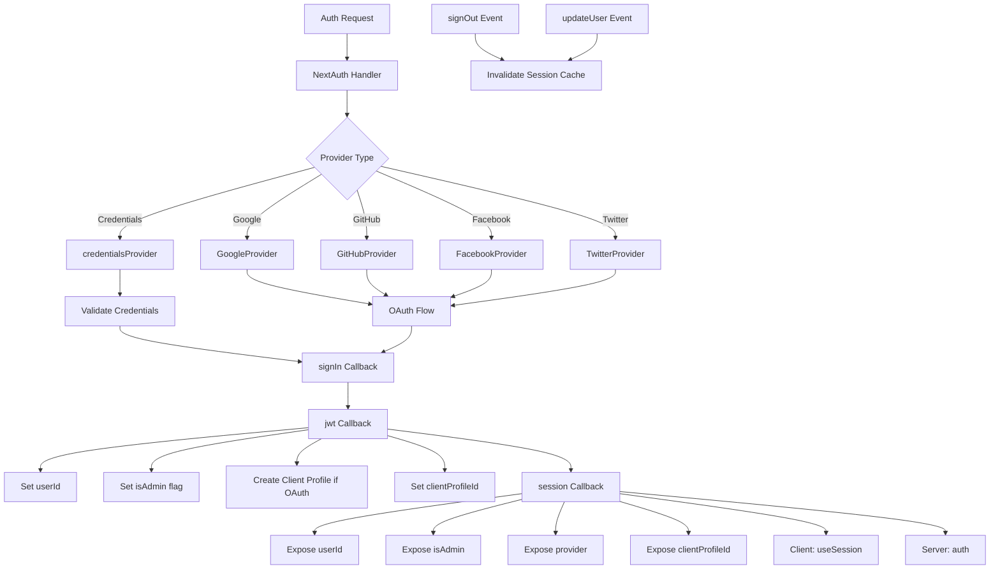

# VolgendeAuth-configuratie

## Overzicht

De Ever Works-sjabloon configureert NextAuth.js (Auth.js v5) met op JWT gebaseerde sessies, een Drizzle ORM-adapter, meerdere OAuth-providers (Google, GitHub, Facebook, Twitter), op inloggegevens gebaseerde authenticatie en aangepaste callbacks voor beheerders-/clientrolbeheer. Het systeem ondersteunt het automatisch aanmaken van clientprofielen voor OAuth-gebruikers en sessiecaching met cache-invalidatie.

## Architectuur



## Bronbestanden

|Bestand|Doel|
|------|---------|
|`template/lib/auth/index.ts`|Belangrijkste NextAuth-configuratie en -exports|
|`template/auth.config.ts`|Providerconfiguratie (Edge-compatibel)|
|`template/lib/auth/config.ts`|Selectie van het type verificatieprovider|
|`template/lib/auth/providers.ts`|Fabrieksfuncties van OAuth-provider|
|`template/lib/auth/credentials.ts`|Implementatie van legitimatieprovider|
|`template/lib/auth/guards.ts`|Hulpprogramma's voor verificatiebewaking aan de serverzijde|
|`template/lib/auth/middleware.ts`|Gevalideerde actiewrappers|
|`template/lib/auth/setup.ts`|Hulp bij authenticatie-initialisatie|
|`template/lib/auth/cached-session.ts`|Beheer van sessiecache|
|`template/lib/auth/session-cache.ts`|Implementatie van sessiecache|
|`template/lib/auth/admin-guard.ts`|Beheerderspecifieke bewakingslogica|

## VolgendeAuth-initialisatie

```typescript
// lib/auth/index.ts
export const { handlers, auth, signIn, signOut, unstable_update } = NextAuth({
    adapter: drizzle,
    session: {
        strategy: 'jwt',
        maxAge: 30 * 24 * 60 * 60,    // 30 days
        updateAge: 24 * 60 * 60        // Refresh every 24 hours
    },
    jwt: {
        maxAge: 30 * 24 * 60 * 60      // 30 days
    },
    callbacks: { authorized, redirect, signIn, jwt, session },
    events: { signOut, updateUser },
    pages: {
        signIn: '/auth/signin',
        signOut: '/auth/signout',
        error: '/auth/error',
        verifyRequest: '/auth/verify-request',
        newUser: '/auth/register'
    },
    ...authConfig  // Merges providers from auth.config.ts
});
```

### Sessie Strategie

De sjabloon gebruikt **JWT-sessies** (`strategy: 'jwt'`), geen databasesessies. Dit betekent:
- Sessies worden opgeslagen in gecodeerde cookies, niet in de database
- Er is geen databasequery nodig om een sessie te valideren
- Compatibel met Edge Runtime (middleware)
- Sessiegegevens zijn beperkt tot wat in een JWT-token past

## Database-adapter

```typescript
const isDatabaseAvailable = !!coreConfig.DATABASE_URL && typeof db !== 'undefined';

const drizzle = isDatabaseAvailable
    ? DrizzleAdapter(getDrizzleInstance(), {
        usersTable: users,
        accountsTable: accounts,
        sessionsTable: sessions,
        verificationTokensTable: verificationTokens
    })
    : undefined;
```

De adapter wordt voorwaardelijk gemaakt op basis van de beschikbaarheid van de database. Hierdoor kan de sjabloon zelfs zonder database starten (bijvoorbeeld tijdens de eerste installatie), hoewel de authenticatie beperkt zal zijn.

## Providerconfiguratie

### auth.config.ts (Edge-compatibel)

```typescript
// auth.config.ts
const configureProviders = () => {
    try {
        const oauthProviders = configureOAuthProviders();
        return createNextAuthProviders({
            google: oauthProviders.find((p) => p.id === 'google')
                ? { enabled: true, clientId: '...', clientSecret: '...' }
                : { enabled: false },
            github: { /* ... */ },
            facebook: { /* ... */ },
            twitter: { /* ... */ },
            credentials: { enabled: true },
        });
    } catch (error) {
        // Fallback to credentials only
        return createNextAuthProviders({
            credentials: { enabled: true },
            google: { enabled: false },
            github: { enabled: false },
            facebook: { enabled: false },
            twitter: { enabled: false },
        });
    }
};

export default {
    trustHost: true,
    providers: configureProviders(),
} satisfies NextAuthConfig;
```

### Leverancier Fabriek

```typescript
// lib/auth/providers.ts
export function createNextAuthProviders(config: OAuthProvidersConfig) {
    const providers = [];

    if (config.google?.enabled && config.google.clientId && config.google.clientSecret) {
        providers.push(GoogleProvider({
            clientId: config.google.clientId,
            clientSecret: config.google.clientSecret,
            ...config.google.options,
        }));
    }
    // GitHub, Facebook, Twitter follow the same pattern...

    if (config.credentials?.enabled) {
        providers.push(credentialsProvider);
    }

    return providers;
}
```

Providers worden alleen toegevoegd als ze over geldige inloggegevens beschikken, waardoor configuratiefouten bij het opstarten worden voorkomen.

## Terugbelgesprekken

### Aanmelden Terugbellen

```typescript
signIn: async ({ user, account, profile }) => {
    const isCredentials = account?.provider === 'credentials';

    if (!user?.email) {
        return !isCredentials; // Allow OAuth without email
    }

    if (!isDatabaseAvailable) {
        return !isCredentials; // Skip DB validation if no DB
    }

    // For OAuth providers, allow account linking
    if (!isCredentials && account?.provider) {
        return true;
    }

    return true;
}
```

### jwt Terugbellen

De JWT-callback vormt de kern van de authenticatiepijplijn. Het draait op elk verzoek en beheert:

```typescript
jwt: async ({ token, user, account }) => {
    // 1. Set userId from user object or token.sub
    if (user?.id) token.userId = user.id;
    if (!token.userId && token.sub) token.userId = token.sub;

    // 2. Set clientProfileId
    if (user?.clientProfileId) token.clientProfileId = user.clientProfileId;

    // 3. Record provider
    if (account?.provider) token.provider = account.provider;

    // 4. Auto-create client profile for OAuth users
    if (isOAuthProvider && !token.clientProfileId && token.userId) {
        let clientProfile = await getClientProfileByUserId(token.userId);
        if (!clientProfile) {
            clientProfile = await createClientProfile({
                userId: token.userId,
                email: token.email,
                name: token.name || token.email?.split('@')[0],
            });
        }
        token.clientProfileId = clientProfile?.id;
    }

    // 5. Set isAdmin flag
    if (user?.isClient !== undefined) {
        token.isAdmin = !user.isClient;
    } else if (user?.isAdmin !== undefined) {
        token.isAdmin = user.isAdmin;
    } else if (token.isAdmin === undefined) {
        token.isAdmin = false; // Default: non-admin
    }

    return token;
}
```

### sessie Terugbellen

Wijst JWT-tokenvelden toe aan het sessieobject dat wordt blootgesteld aan clientcomponenten:

```typescript
session: async ({ session, token }) => {
    if (token && session.user) {
        session.user.id = token.userId;
        session.user.clientProfileId = token.clientProfileId;
        session.user.provider = token.provider || 'credentials';
        session.user.isAdmin = token.isAdmin;
    }
    return session;
}
```

## Evenementen

### Sessiecache ongeldig verklaard

```typescript
events: {
    signOut: async (event) => {
        const token = 'token' in event ? event.token : undefined;
        if (token?.userId) {
            await invalidateSessionCache(undefined, token.userId);
        }
    },
    updateUser: async ({ user }) => {
        if (user?.id) {
            await invalidateSessionCache(undefined, user.id);
        }
    }
}
```

Zowel de gebeurtenissen `signOut` als `updateUser` activeren de ongeldigheid van de sessiecache, waardoor wordt verzekerd dat verouderde sessiegegevens niet worden weergegeven nadat de auth-status is gewijzigd.

## Bewakers aan de serverzijde

### vereisenAuth

```typescript
export async function requireAuth() {
    const session = await auth();
    if (!session?.user) {
        redirect('/auth/signin');
    }
    return session;
}
```

### vereisenAdmin

```typescript
export async function requireAdmin() {
    const session = await auth();
    if (!session?.user) {
        redirect('/admin/auth/signin');
    }
    if (!session.user.isAdmin) {
        redirect('/unauthorized');
    }
    return session;
}
```

### Nutsbewakers

```typescript
// Check without redirecting
export async function getSession() {
    return await auth();
}

export async function checkIsAdmin() {
    const session = await auth();
    return session?.user?.isAdmin === true;
}
```

## Aangepaste pagina's

|Pagina|Pad|Doel|
|------|------|---------|
|Inloggen|`/auth/signin`|Login formulier|
|Uitloggen|`/auth/signout`|Bevestiging van uitloggen|
|Fout|`/auth/error`|Weergave van verificatiefout|
|Verifieer het verzoek|`/auth/verify-request`|E-mailverificatieprompt|
|Registreren|`/auth/register`|Nieuwe gebruikersregistratie|

## Omgevingsvariabelen

|Variabel|Vereist|Doel|
|----------|----------|---------|
|`AUTH_SECRET`|Ja|JWT-coderingsgeheim|
|`AUTH_GOOGLE_ID`|Nee|Google OAuth-client-ID|
|`AUTH_GOOGLE_SECRET`|Nee|Google OAuth-clientgeheim|
|`AUTH_GITHUB_ID`|Nee|GitHub OAuth-client-ID|
|`AUTH_GITHUB_SECRET`|Nee|GitHub OAuth-clientgeheim|
|`AUTH_FACEBOOK_ID`|Nee|Facebook OAuth-client-ID|
|`AUTH_FACEBOOK_SECRET`|Nee|Facebook OAuth-clientgeheim|
|`AUTH_TWITTER_ID`|Nee|Twitter/X OAuth-client-ID|
|`AUTH_TWITTER_SECRET`|Nee|Twitter/X OAuth-clientgeheim|
|`DATABASE_URL`|Voor adapter|Databaseverbindingsreeks|

## Beste praktijken

1. **Gebruik JWT-strategie** voor Edge Runtime-compatibiliteit in middleware
2. **Maak automatisch klantprofielen** voor OAuth-gebruikers in de JWT-callback
3. **Gracieuze degradatie**: als de OAuth-configuratie mislukt, kunt u alleen terugvallen op de inloggegevens
4. **Cache ongeldig maken bij auth-gebeurtenissen**: afmelden en gebruiker updaten beide sessies in de cache
5. **Voorwaardelijke adapter** -- staat opstarten zonder database toe voor initiële configuratie
6. **Bewakingsfuncties** -- gebruik `requireAuth()` / `requireAdmin()` in servercomponenten, geen handmatige sessiecontroles
7. **Aangepaste pagina's**: overschrijf de standaard NextAuth-pagina's voor een consistente gebruikersinterface met het sjabloonontwerp
